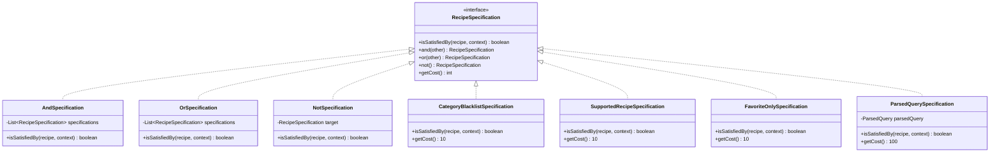

# ADR-028: 합성 가능한 레시피 검색 쿼리 명세 패턴
# (Composable Recipe Search Specification Pattern)

- **문서 번호**: ADR-028
- **대상 버전**: `v2.2.0-alpha.3`
- **상태**: `IMPLEMENTED`
- **결정/완료일**: 2026-09-06
- **주관 계층**: Client GUI Search Layer (`client.gui.search.spec`, `client.gui.search`)

---

## 1. 개요 및 배경 (Motivation)

기존 `GregTechCalculatorBoard`의 레시피 검색 서브시스템([`RecipeSearchQueryEngine.java`](file:///d:/dev-ssd/modding/minecraft/GregTechCalculatorBoard/src/main/java/com/gtceu/calcboard/client/gui/search/RecipeSearchQueryEngine.java))은 사용자의 텍스트 검색어, 카테고리 블랙리스트, 즐겨찾기 필터, 미지원 레시피 토글 등이 거대한 절차적 if-else 분기문으로 하드코딩되어 있었습니다.

이로 인해 다음과 같은 기술적 부채가 발생했습니다:
1. **개방-폐쇄 원칙(OCP) 위배**: 새로운 필터 조건 추가 시 핵심 검색 루프를 매번 직접 수정해야 함.
2. **단위 테스트 격리 불가**: 각 필터 규칙을 독립적으로 TDD 검증하기 어렵고 전체 검색 엔진 파이프라인을 기동해야 함.
3. **단락 평가(Short-Circuit) 비최적화**: 비용이 저렴한 $O(1)$ 정수/해시 비교와 비용이 큰 $O(M \times N)$ 문자열 정규식 탐색이 무작위 순서로 평가되어 대규모 레시피 검색 시 불필요한 CPU 사이클이 소모됨.

---

## 2. 세부 설계 및 결정 사항 (Architecture Decision)

### 2.1 Specification Pattern (명세 패턴) 전면 도입
모든 필터 조건을 단일 책임 원칙(SRP)을 따르는 독립된 `RecipeSpecification` 인터페이스 구현체로 분리하고, 논리 연산자(`and`, `or`, `not`)를 통해 선언적으로 합성할 수 있는 복합 명세 아키텍처를 구축했습니다:



### 2.2 비용 기반 단락 평가 (Cost-Aware Short-Circuit Evaluation)
`RecipeQuerySpecificationBuilder`에서 등록된 명세들을 연산 비용(`getCost()`) 오름차순으로 안정 정렬(`Comparator.comparingInt(RecipeSpecification::getCost)`)합니다:
* **Cost 10 ($O(1)$)**: 카테고리 블랙리스트(`CategoryBlacklistSpecification`), 미지원 레시피 배제(`SupportedRecipeSpecification`), 즐겨찾기 북마크(`FavoriteOnlySpecification`).
* **Cost 100 ($O(M \times N)$)**: 사용자 쿼리 AST 토큰 매칭(`ParsedQuerySpecification`).

제외 카테고리나 즐겨찾기 미등록 레시피는 **비용 10의 $O(1)$ 단계에서 즉시 기각(Short-Circuit)**되어 무거운 텍스트 파싱을 조기에 차단합니다.

### 2.3 `RecipeSearchQueryEngine` 이벤트 파이프라인 평탄화
기존의 다중 중첩 if 분기문이 `searchSpecification.isSatisfiedBy(sr, searchContext)` 단일 호출로 완전히 평탄화되었습니다:

```java
SearchExecutionContext searchContext = new SearchExecutionContext(
        contextualWireTarget,
        showFavoritesOnly,
        allFavoriteIds,
        filterConfig,
        isTutorial
);
RecipeSpecification searchSpecification = RecipeQuerySpecificationBuilder.buildDefault(parsedQuery, searchContext);

List<ScoredRecipe> candidateList = sourceList.parallelStream()
        .filter(sr -> searchSpecification.isSatisfiedBy(sr, searchContext))
        .map(sr -> { ... });
```

---

## 3. 결과 및 파급 효과 (Consequences)

### 3.1 긍정적 효과
* **완벽한 단위 테스트 격리**: `RecipeSpecificationTest`를 통해 카테고리 블랙리스트, 미지원 레시피, 즐겨찾기 필터, And/Or/Not 논리곱/합/부정, 단락 평가 여부 및 비용 기반 정렬을 100% 헤드리스 환경에서 검증 완료.
* **유지보수성 및 확장성 극대화**: 새로운 필터 조건(예: 향후 기계 전력 필터, 유체 입출력 필터 등) 추가 시 기존 엔진 수정 없이 신규 `RecipeSpecification` 클래스 1개만 정의하여 빌더에 등록 가능.
* **대규모 검색 성능 향상**: $O(1)$ 사전 필터링을 통해 탈락 대상 레시피의 텍스트 정규식 파싱 부하를 원천 차단.

### 3.2 단위 테스트 검증 결과
* **신규 명세 테스트**: `RecipeSpecificationTest` (8개 테스트 케이스 전원 통과, `BUILD SUCCESSFUL`)
* **기존 검색 엔진 회귀 테스트**: `RecipeSearchEngineTest` (전체 회귀 테스트 전원 통과, `BUILD SUCCESSFUL`)
* **정적 규칙 린터**: `python tools/lint_agent_rules.py --diff` (0 Violations)
* **다국어 무결성**: `python tools/check_i18n.py` (4개 국어 1099키 100% 일치)
