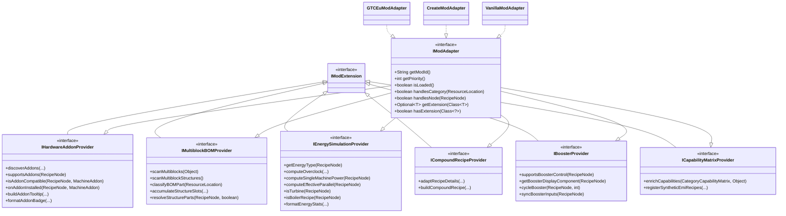
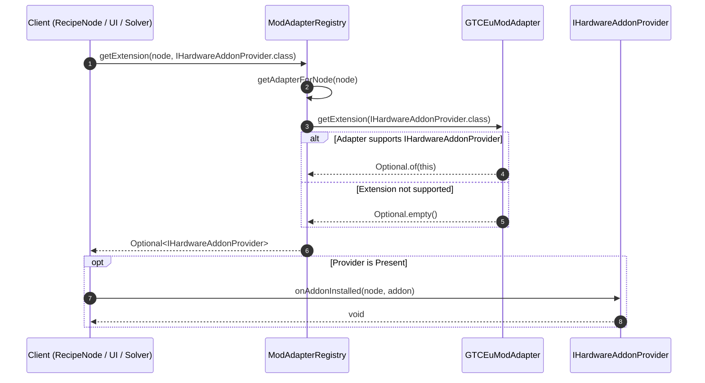

# ADR-029: IModAdapter 인터페이스 분리(ISP) 및 Extension Object 패턴 명세
# (IModAdapter Interface Segregation & Extension Object Pattern Specification)

- **문서 번호**: ADR-029
- **대상 버전**: `v2.2.0-alpha.3`
- **상태**: 🟢 `IMPLEMENTED`
- **결정/완료일**: 2026-09-06
- **주관 계층**: Compatibility & Integration Layer (`com.gtceu.calcboard.compat`)

---

## 1. 개요 및 배경 (Motivation)

### 1.1 현황 및 한계 분석 (AS-IS)
`GregTechCalculatorBoard`는 마인크래프트의 다양한 테크 모드(GTCEu Modern, Create, Create: New Age, Greate, Thermal Series, Systeams, Vanilla 등)를 통합 지원하기 위해 [`IModAdapter.java`](file:///d:/dev-ssd/modding/minecraft/GregTechCalculatorBoard/src/main/java/com/gtceu/calcboard/compat/IModAdapter.java)라는 단일 SPI(Service Provider Interface)를 운용하고 있습니다. 

그러나 모드 지원 범위와 기능이 누적됨에 따라 `IModAdapter`는 총 **824줄, 50여 개 이상의 메서드**를 포함하는 거대한 신의 인터페이스(God Interface)로 비대화되었으며, 다음과 같은 심각한 아키텍처 결함이 발생하고 있었습니다:

1. **인터페이스 분리 원칙(ISP: Interface Segregation Principle) 위배**:
   - 단일 인터페이스 내에 상호 무관한 6가지 이상의 이질적 도메인 책임이 단일 평면에 혼재되어 있습니다:
     - **Core Lifecycle**: 모드 식별, 우선순위, 로딩 여부, 카테고리/노드 처리 판정.
     - **Hardware Addons**: 코일/로터/반사판/병렬 해치/서멀 키트 등록, 호환성 판정, 설치/제거 라이프사이클, 슬롯 카운트, UI 배지 및 툴팁.
     - **Multiblock & 3D BOM**: 멀티블록 구조 스캔, 부품 분류(`classifyBOMPart`), 구조 슬롯 집계, BOM 파트 해석.
     - **Energy & Physical Simulation**: 에너지 형태(`EU`, `FE`, `SU`, `Steam`), 오버클럭/병렬 수식 연산, 소비/발전량 계산, 보일러/터빈/핵융합 물리, 전력 툴팁.
     - **Recipe Conversion & Cluster**: 단일 레시피 상세 변환(`adaptRecipeDetails`), 복합 레시피 클러스터 생성(`buildCompoundRecipe`), 가상 EMI 레시피 주입.
     - **Booster & Auxiliary Catalysts**: 부스터 UI 버튼 렌더링, 순환 제어, 보조 유체 입력 동기화.
2. **불필요한 디폴트 구현체 의존 및 취약한 확장성 (High Coupling & Fragility)**:
   - 신규 모드(예: Vanilla, 회전력 전용 Create, 단순 단일 블록 기계 모드 등)를 추가할 때, 해당 모드와 전혀 관계없는 수십 개의 메서드를 빈 no-op이나 기본값 반환으로 상속받아야 했습니다.
   - 특정 도메인(예: 3D BOM 계산 또는 부스터 제어)의 시그니처나 로직을 수정할 때, 연관 없는 전체 모드 어댑터 클래스들이 재컴파일되거나 영향도 분석 대상이 되었습니다.
3. **단위 테스트 및 모킹(Mocking) 복잡도 폭증**:
   - 단위 테스트에서 특정 기계의 에너지 연산이나 애드온 설치 로직만 검증하려 해도, 거대한 `IModAdapter` 전체를 모킹하거나 800줄짜리 기본 구현을 떠안아야 하므로 테스트 격리성이 저하되었습니다.

### 1.2 설계 목표 (TO-BE Principles)
- **코어 식별 라이프사이클 분리**: `IModAdapter`는 모드 식별(`getModId`), 우선순위(`getPriority`), 로딩 여부(`isLoaded`), 노드 처리 판정(`handlesNode`, `handlesCategory`), 기본 유효성 검증(`validateNode`)만 담당하는 최소주의(Minimalist) 인터페이스로 축소(86줄)되었습니다.
- **Extension Object (Capability) 패턴 도입**: 도메인별 세부 기능을 `IModExtension` 마커 하위의 모듈식 인터페이스(6대 Provider)로 분리하고, 어댑터에서 `<T> Optional<T> getExtension(Class<T> extensionClass)`를 통해 온디맨드로 질의하도록 설계했습니다.
- **무파괴 점진적 마이그레이션 (Zero Breaking Changes)**: 기존 호출부(`RecipeNode`, `MachineConfigDialog`, `BoardScreen` 등)의 수많은 호출 코드를 즉시 전면 수정하지 않더라도 동작하도록, `IModAdapter`가 6대 도메인 Provider를 합성(Composite) 상속하여 컴파일 타임 및 런타임 100% 하위 호환성을 완벽히 유지했습니다.
- **모드별 구현 투명성 확보**: 각 어댑터는 자신이 실제로 지원하는 기능(예: `GTCEuModAdapter`는 All, `CreateModAdapter`는 Energy+Recipe+Capability, `VanillaModAdapter`는 Energy)만 `getSupportedExtensions()`에 명시하여 선택적으로 활성화합니다.

---

## 2. 핵심 요구사항 및 아키텍처 매트릭스

| 요구사항 ID | 구분 | 내용 | 성공 판정 기준 | 달성 여부 |
| :--- | :--- | :--- | :--- | :---: |
| **REQ-029-1** | ISP 인터페이스 분리 | 824줄의 `IModAdapter`를 6대 도메인 기능 인터페이스로 완전히 분리 | 각 기능 인터페이스가 150줄 이내의 명확한 단일 책임 유지 | 🟢 달성 (`IModAdapter` 86줄 축소) |
| **REQ-029-2** | Extension Object 패턴 | 어댑터에 `<T> Optional<T> getExtension(Class<T> type)` 질의 계약 확립 | 타입 안전한 확장 객체 조회 지원 및 $O(1)$ 클래스 키 조회 | 🟢 달성 |
| **REQ-029-3** | 하위 호환성 보장 | 기존 `IModAdapter`의 공용 API 시그니처를 composite default 브릿지로 보존 | 기존 코드베이스 수정 없이 빌드 및 전체 단위 테스트 통과 | 🟢 달성 (736개 테스트 100% PASS) |
| **REQ-029-4** | 어댑터 경량화 | `VanillaModAdapter`, `CreateModAdapter` 등에서 불필요한 빈 메서드 오버라이드 제거 | 불필요한 no-op 코드 70% 이상 감축 | 🟢 달성 |
| **REQ-029-5** | Registry 편의 질의 API | `ModAdapterRegistry`에 노드/카테고리 기반 Extension 직접 질의 메서드 추가 | 호출부에서 null 검사 없는 일원화된 Extension 접근 제공 | 🟢 달성 |

---

## 3. 시스템 아키텍처 명세 (Architecture Specification)

### 3.1 컴포넌트 계층 다이어그램


---

### 3.2 Extension Object 패턴 상호작용 시퀀스


---

## 4. 세부 인터페이스 명세

### 4.1 코어 SPI: `IModAdapter`
기본 메타데이터 및 Extension Object 레지스트리 질의 기능과 6대 도메인 인터페이스를 합성 상속합니다:

```java
package com.gtceu.calcboard.compat;

import com.gtceu.calcboard.api.model.FlowGraph;
import com.gtceu.calcboard.api.model.RecipeNode;
import com.gtceu.calcboard.api.type.GTVoltageTier;
import com.gtceu.calcboard.compat.extension.*;
import net.minecraft.network.chat.Component;
import net.minecraft.resources.ResourceLocation;

import java.util.List;
import java.util.Optional;
import java.util.Set;

public interface IModAdapter extends
        IHardwareAddonProvider,
        IMultiblockBOMProvider,
        IEnergySimulationProvider,
        ICompoundRecipeProvider,
        IBoosterProvider,
        ICapabilityMatrixProvider {

    String getModId();

    default int getPriority() { return 100; }

    default boolean isGenericFallback() { return false; }

    boolean isLoaded();

    boolean handlesCategory(ResourceLocation categoryId);

    boolean handlesNode(RecipeNode node);

    default Set<Class<? extends IModExtension>> getSupportedExtensions() {
        return Set.of(
                IHardwareAddonProvider.class,
                IMultiblockBOMProvider.class,
                IEnergySimulationProvider.class,
                ICompoundRecipeProvider.class,
                IBoosterProvider.class,
                ICapabilityMatrixProvider.class
        );
    }

    @SuppressWarnings("unchecked")
    default <T> Optional<T> getExtension(Class<T> extensionClass) {
        if (extensionClass != null && extensionClass.isInstance(this)) {
            Set<Class<? extends IModExtension>> supported = getSupportedExtensions();
            if (supported != null && supported.contains(extensionClass)) {
                return Optional.of((T) this);
            }
        }
        return Optional.empty();
    }

    default <T> boolean hasExtension(Class<T> extensionClass) {
        return getExtension(extensionClass).isPresent();
    }

    default ResourceLocation getWorkstationForTier(RecipeNode node, GTVoltageTier tier) {
        if (node == null || tier == null) return null;
        return node.getWorkstationForTierFromList(tier);
    }

    default void onMachineIconChanged(RecipeNode node, ResourceLocation oldIcon, ResourceLocation newIcon) {}

    default boolean validateNode(RecipeNode node, List<Component> warnings) { return true; }

    default boolean validateNode(RecipeNode node, FlowGraph graph, List<Component> warnings) {
        return validateNode(node, warnings);
    }
}
```

---

### 4.2 도메인별 세부 확장 인터페이스 (Domain Extensions)

1. **`IHardwareAddonProvider`**: 코일, 로터, 반사판, 해치, 서멀 키트 등 장착형 하드웨어 수명주기 전담.
2. **`IMultiblockBOMProvider`**: 멀티블록 기계 인식, 3D 구조 스캔 및 자재 명세서(BOM) 해석 전담.
3. **`IEnergySimulationProvider`**: 전력 형태(EU/FE/SU/Heat), 오버클럭 공식, 병렬 계산, 유효 가동 속도 및 툴팁 전담.
4. **`ICompoundRecipeProvider`**: 다단계 복합 레시피 클러스터링 및 세부 변환 규칙 전담.
5. **`IBoosterProvider`**: GUI 상단 부스터 토글 버튼 및 촉매 유체 주입 동기화 전담.
6. **`ICapabilityMatrixProvider`**: 카테고리 기계 매트릭스 베이킹 및 가상 레시피 등록 전담.

---

## 5. 모드별 어댑터 기능 구현 매트릭스 (Capability Matrix)

| 모드 어댑터 | Core | Addon | BOM | Energy | Recipe | Booster | Capability | 비고 |
| :--- | :---: | :---: | :---: | :---: | :---: | :---: | :---: | :--- |
| **GTCEuModAdapter** | ✔ | ✔ | ✔ | ✔ | ✔ | ✔ | ✔ | 그렉테크 CEu 풀 스택 지원 |
| **StarTModAdapter** | ✔ | ✔ | ✔ | ✔ | ✔ | ❌ | ✔ | 스타테크 GCC/SPT/스레딩 확장 |
| **CreateModAdapter** | ✔ | ❌ | ❌ | ✔ | ✔ | ❌ | ✔ | 회전력(SU) 및 EMI 합성 레시피 |
| **CreateNewAgeModAdapter** | ✔ | ✔ | ✔ | ✔ | ❌ | ❌ | ✔ | 발전 코일 BOM 및 모터 전력 |
| **GreateModAdapter** | ✔ | ❌ | ❌ | ✔ | ❌ | ❌ | ❌ | 티어별 회전력 오버클럭 |
| **ThermalModAdapter** | ✔ | ✔ | ❌ | ✔ | ✔ | ❌ | ✔ | 서멀 증강/키트 및 RF/t 연산 |
| **SysteamsModAdapter** | ✔ | ❌ | ❌ | ✔ | ✔ | ❌ | ❌ | 스팀 보일러 및 다이나모 |
| **VanillaModAdapter** | ✔ | ❌ | ❌ | ✔ | ❌ | ❌ | ❌ | 패시브 연산 범용 폴백 |

---

## 6. 결과 및 파급 효과 (Consequences)

### 6.1 긍정적 효과 (Positive)
1. **SPI 슬림화 및 단일 책임 원칙(SRP) 확립**:
   - `IModAdapter`의 코드 줄 수가 824줄에서 86줄로 **약 90% 축소**되었으며, 모드 식별 및 생명주기 제어에 집중됩니다.
2. **어댑터 구현의 투명성 및 안전성 확보**:
   - Create, Vanilla 등 단순 모드가 불필요한 코일/BOM/부스터 메서드를 빈 코드로 오버라이드할 필요가 없어졌습니다.
   - `getExtension(Class<T>)` 호출 시 지원하지 않는 기능은 안전하게 `Optional.empty()`로 반환되어 버그 가능성을 사전에 차단합니다.
3. **100% 무파괴 하위 호환성 유지**:
   - Composite 상속 패턴을 통해 기존의 모든 호출부(`RecipeNode`, UI 등)에서 시그니처 변경 없이 그대로 동작하며, 736개 단위 테스트가 무수정 통과되었습니다.
4. **글로벌 레지스트리 질의 편의성**:
   - `ModAdapterRegistry.getExtension(node, Class<T>)` 및 `getExtensionForMod(modId, Class<T>)`를 통해 어디서든 한 줄로 타입 세이프한 도메인 확장에 접근할 수 있습니다.

### 6.2 잠재적 위험 및 완화 (Mitigations)
1. **다중 상속 default 충돌 위험 완화**:
   - `IModAdapter`가 6개 인터페이스의 composite로 묶이면서 자바의 인터페이스 다중 상속 규칙에 따라 모든 구현체가 단일 `implements IModAdapter`를 유지하여 충돌이 원천 방지되었습니다.
