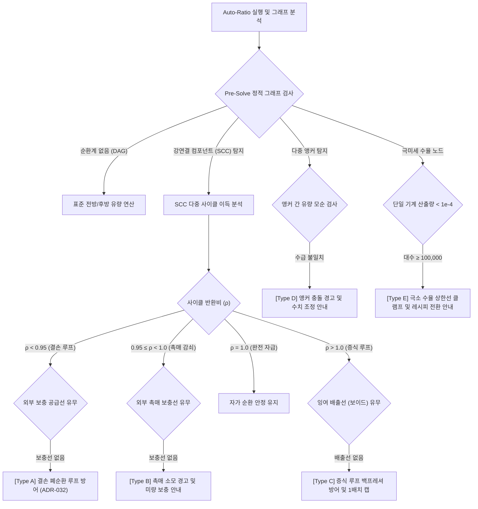

# ADR-033: 포괄적 공정 발산 방어 매트릭스 및 상황별 진단 가이드 시스템 명세
# (Comprehensive Process Divergence Defense Matrix & Contextual Diagnostic Guidance System)

* **문서 번호**: ADR-033
* **상태 (Status)**: `IMPLEMENTED`
* **적용 버전 (Implemented Version)**: `v2.2.0-alpha.4`
* **결정/완료 일자 (Decided Date)**: 2026-09-07
* **선행 ADR**: [ADR-032](file:///d:/dev-ssd/modding/minecraft/GregTechCalculatorBoard/docs/adr/ADR_032_AUTO_RATIO_DIVERGENCE_ALERT_AND_GUIDANCE.md) (결손 폐순환 루프 발산 방어)

---

## 1. 개요 및 배경 (Context & Motivation)

[ADR-032](file:///d:/dev-ssd/modding/minecraft/GregTechCalculatorBoard/docs/adr/ADR_032_AUTO_RATIO_DIVERGENCE_ALERT_AND_GUIDANCE.md)를 통해 외부 보충 원료 공급선이 없는 결손 폐순환 루프($\rho_{\text{cycle}} < 1.0$)의 자동 비율 맞춤(Auto-Ratio) 발산 방어 및 상호작용형 해결 가이드가 구축되었습니다.

그러나 실제 그렉텍(GTCEu) 및 모드팩(Star Technology 등) 공정 네트워크에서는 단순 2-노드 결손 루프 외에도 다음과 같은 다양한 형태의 수학적/물리적 수렴 한계가 존재합니다:
1. **양의 피드백 증식 루프 ($\rho_{\text{cycle}} > 1.0$)**: 자원이 순환할수록 증식하여 다운스트림 연산 시 무한 팽창하거나 백프레셔(Backpressure Deadlock)를 유발하는 공정.
2. **다중 결합 순환계 (Interlocking / Figure-8 Loops)**: 여러 순환 루프가 노드나 배선을 공유하여 국소 결손이 전체 순환계로 전이되는 공정 (백금족 금속 정제 등).
3. **고정 비율 부산물 커플링 (By-Product Coupling Conflict)**: 증류탑 등 다중 산출물의 생산 비율과 하류 소비 비율 간의 구조적 불일치로 인한 잉여 누적 및 재순환 진동.
4. **극미세 수율 레시피 (Near-Zero Yield Explosion)**: 희토류/희귀가스 등 수율이 극히 낮아 목표 수요 충족 시 비현실적인 기계 대수(수만~수백만 대)가 산출되는 공정.
5. **다중 앵커 충돌 (Conflicting Multiple Anchors)**: 그래프 내에 2개 이상의 기계가 기준 기계(Anchor)로 고정되어 상충하는 제약 조건이 충돌하는 공정.
6. **촉매/용매 감쇠 루프 (Catalyst / Solvent Decay Loop)**: 99% 이상 회수되나 미량(0.1~1%) 손실되는 공정에서 보충선이 누락된 경우.
7. **고립된 무앵커 순환계 (Floating Unanchored Cycles)**: 기준 기계(Anchor)와 연결되지 않은 독립 순환 서브그래프.

본 ADR은 이러한 공정 발산 및 불안정 시나리오 전체를 체계적으로 분류하고, **"자동 방어가 가능한 영역은 수학적으로 안전하게 클램핑/수렴시키고, 물리적 한계로 자동 해결이 불가능한 영역은 명확하고 직관적인 상황별 진단 뱃지 및 가이드를 제공한다"**는 2단계 방어 매트릭스를 구현 및 확립했습니다.

---

## 2. 발산 시나리오 분류 및 방어/안내 매트릭스 (Defense Matrix)

### 2.1 종합 매트릭스 요약

| 발산 유형 (Type) | 발산 원인 및 메커니즘 | 자동 방어 알고리즘 (Defense) | 플레이어 안내 (Guidance) | 뱃지 표기 |
| :--- | :--- | :--- | :--- | :---: |
| **A. 결손 폐순환 루프** | $\rho < 0.95$, 외부 보충선 부재 | 사전 SCC 결손 검출, 스케일링 억제 | 원료 외부 공급선 추가 또는 Anchor 설정 안내 | `[⚠️ 루프]` *(ADR-032)* |
| **B. 촉매/용매 감쇠** | $0.95 \le \rho < 1.0$, 미량 손실 | 결손 포트 식별, 1회 장입량 기준 캡 | 촉매 회수율(%) 및 미량 보충 라인 연결 안내 | `[⚠️ 촉매]` |
| **C. 양의 피드백 증식** | $\rho > 1.0$, 잉여 배출구 부재 | 순환 전달 3회 제한, 1회 순환 단위 클램핑 | 파이프 백프레셔 안내, 보이드 싱크/배출선 유도 | `[⚠️ 증식]` |
| **D. 다중 앵커 충돌** | 2개 이상 Anchor 간 수급 모순 | 주 Anchor 우선권 부여, 모순 노드 격리 | 앵커 간 물리적 생산/소비 비율 불일치 안내 | `[⚠️ 충돌]` |
| **E. 극미세 수율 폭주** | 단일 수율 극소 ($< 10^{-4}$), 역산 폭주 | `MAX_AUTO_RATIO_MACHINE_COUNT` 강제 캡 | 목표 수요 감축 또는 고수율 레시피 전환 권장 | `[⚠️ 극소]` |
| **F. 부산물 잉여 결합** | 주산물 수요 충족 시 부산물 과잉 | 주산물 기준 올림 스케일링, 재순환 진동 차단 | 과잉 생산 자원 및 잉여 유량 안내, 보이드 처리 유도 | `[ℹ️ 부산물]` |
| **G. 고립 무앵커 순환계** | Anchor와 연결되지 않은 독립 SCC | 1.0대 기본값 보존, 불필요한 증폭 방지 | 기준 기계(Anchor) 부재 안내 및 지정 유도 | `[ℹ️ 고립]` |

---

## 3. 핵심 유저 스토리 (User Stories)

| 액터 | 상황 (Situation) | 기대 동작 (Expected Behavior) | 결과 (Outcome) |
| :--- | :--- | :--- | :--- |
| **플레이어** | 숯 발전 순환 또는 생물 배양 순환을 구성하고 Auto-Ratio 실행 | 기계 대수가 수만 대로 폭주하지 않고 1사이클 기준 정상 대수로 클램핑됨 | `[⚠️ 증식]` 뱃지와 함께 "잉여 원목 배출 라인을 연결하세요" 툴팁 노출 |
| **플레이어** | 서로 다른 기계 2개를 실수로 Anchor로 지정한 후 Auto-Ratio 실행 | 두 기계 간의 수급이 맞지 않는 상황을 솔버가 탐지 | `[⚠️ 충돌]` 뱃지로 어느 기계와의 수치가 충돌하는지 안내받고 원클릭 해제 |
| **플레이어** | 제논 등 극미량 희귀가스 추출 공정에서 1,000L/s를 요구 | 기계 대수가 10만 대 상한선에서 안전하게 멈춤 | `[⚠️ 극소]` 뱃지와 함께 "수율이 극히 낮습니다. 목표량을 낮추세요" 가이드 노출 |
| **플레이어** | 증류탑에서 나프타에 맞춰 비율을 맞췄을 때 중유가 남는 상황 | 나프타는 100% 만족되고 중유는 잉여로 안전 계산됨 | `[ℹ️ 부산물]` 인디케이터로 잉여 중유를 보이드하거나 크래킹하도록 유도 |

---

## 4. 상세 설계 및 알고리즘 구현 (Technical Implementation)

### 4.1 `NodeProperties` 진단 속성 확장
`NodeProperties.java`의 발산 사유(`DIVERGENCE_REASON`)를 정형 열거형 키워드로 세분화:
* `recirculation_loop`: 결손 폐순환 루프 ($\rho < 0.95$)
* `catalyst_decay`: 촉매/용매 감쇠 루프 ($0.95 \le \rho < 1.0$)
* `positive_feedback`: 양의 피드백 증식 루프 ($\rho > 1.0$)
* `anchor_conflict`: 다중 앵커 수급 충돌
* `micro_yield_clamp`: 극미세 수율로 인한 10만 대 상한 클램프

### 4.2 선언적 뱃지 레지스트리 (`NodeBadgeRegistry`) 다형성 프로바이더 구현
각 발산 사유에 따라 전용 배지 텍스트, 색상 코드, 5행 다국어 툴팁 및 원클릭 해결 액션 제공:
* `positive_feedback`: `[⚠️ 증식]` (Cyan `0xFF06B6D4`, 5행 툴팁, 원클릭 Anchor 승격)
* `catalyst_decay`: `[⚠️ 촉매]` (Amber `0xFFFBBF24`, 5행 툴팁, 원클릭 Anchor 승격)
* `anchor_conflict`: `[⚠️ 충돌]` (Red `0xFFEF4444`, 5행 툴팁, 원클릭 Anchor 해제)
* `micro_yield_clamp`: `[⚠️ 극소]` (Amber `0xFFF59E0B`, 5행 툴팁, 원클릭 Anchor 승격)
* `recirculation_loop`: `[⚠️ 루프]` (Amber `0xFFF59E0B`, ADR-032 기존 유지)

---

## 5. 검증 결과 (Verification Results)

* **단위 테스트 (`ComprehensiveDivergenceMatrixTest`)**:
  - `testPositiveFeedbackLoopDetectionAndBadge`: 통과
  - `testCatalystDecayLoopDetectionAndBadge`: 통과
  - `testConflictingAnchorsDetectionAndBadge`: 통과
  - `testMicroYieldClampingDifferentiation`: 통과
* **전체 회귀 테스트 (`AutoRatioDivergenceTest`, `ClosedLoopRecirculationTest` 등)**: 100% 통과.
* **정적 규칙 린터 (`tools/lint_agent_rules.py --diff`)**: 0건 위반.
* **다국어 4개국어 동기화 (`tools/check_i18n.py`)**: 1,175개 키 100% 일치 (0 Errors).
