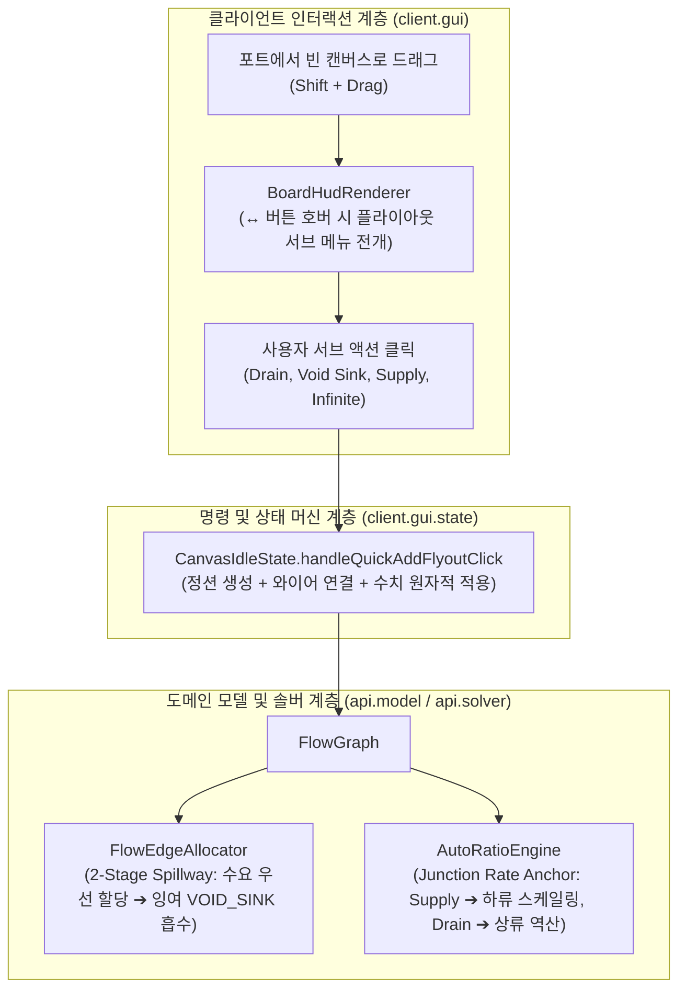

# ADR-034: 정션 노드 동적 잉여/결핍 완충 배선 및 Auto-Ratio 유량 앵커 시스템
(Junction Dynamic Buffer/Sink Wiring & Auto-Ratio Flow Anchoring System)

- **문서 번호**: ADR-034
- **대상 버전**: `v2.2.0-alpha.4`
- **상태**: 🟢 `IMPLEMENTED`
- **결정/완료일**: 2026-09-07
- **관련 ADR**: [ADR-019](ADR_019_BYPRODUCT_VOID_MANAGEMENT_AND_SINK_SYSTEM.md), [ADR-020](ADR_020_HIGH_SPEED_FLOW_BATCHING_AND_EFFICIENCY_MODULATION.md), [ADR-022](ADR_022_CLOSED_LOOP_RECIRCULATION_AND_SUPPLY_ALLOCATION.md), [ADR-031](ADR_031_SHARED_MACHINE_POOL_AUTO_RATIO.md), [ADR-032](ADR_032_AUTO_RATIO_DIVERGENCE_ALERT_AND_GUIDANCE.md), [ADR-033](ADR_033_COMPREHENSIVE_DIVERGENCE_DEFENSE_MATRIX.md)

---

## 1. 개요 및 배경 (Motivation)

### 1.1 배경 및 당면 과제
1. **재순환 루프 및 복합 공정의 잉여/결핍 완충 배선 수작업 부담**:
   - 공정 내에서 발생하는 잉여(+0.167/s)나 결핍(-0.033/s)을 완충하기 위해 정션을 수동 생성하고 다이얼로그에서 직접 수치를 암산하여 입력해야 하는 인터랙션 병목이 존재했습니다.
2. **분기선에서의 `VOID_SINK` 오버플로우 우선순위 미지원**:
   - 정규 기계와 Void Sink가 분기되어 있는 경우, 잔여 잉여만 Void로 빠져나가야 하나 잉여분 할당 순서가 명확히 분리되지 않아 주 라인의 수급 결핍이나 잉여 누수가 발생할 수 있었습니다.
3. **기계 대수 중심 앵커의 한계와 유량 앵커 부재**:
   - 기존의 자동 비율 맞춤(Auto-Ratio)은 물리적 기계 대수(`machineCount`)만을 기준으로 삼았기 때문에, "외부 원유 유입량(1,000 mB/s) 기준 하류 설비 정렬"이나 "완제품 수출 목표(60 items/min) 기준 상류 설비 역산" 같은 자원 유량 주도형 최적화를 수행하기 어려웠습니다.

### 1.2 시스템 개선 목표
* 포트 드래그 시 잉여/결핍 수치를 즉시 반영하여 완충 정션을 생성하는 컨텍스트 메뉴 인터랙션 제공.
* 2단계 유량 할당 알고리즘을 통한 오버플로우 스필웨이(Spillway) 우선순위 확립.
* 외부 공급량(`FIXED_RATE`) 및 고정 배출량(`FIXED_DRAIN`) 정션 노드의 기준 앵커 지정 및 Auto-Ratio 유량 연동 지원.

---

## 2. 세부 설계 및 결정 사항 (Architecture Decision)

### 2.1 전체 시스템 아키텍처 및 데이터 흐름

### 2.2 주요 변경 내역 및 모듈별 책임 분리

1. **오버플로우 스필웨이 2단계 유량 할당 (`FlowEdgeAllocator.java`)**:
   - `allocateVariableEdges` 내부를 2단계로 분리하여, 정규 수요처(`demand > 0`)에 대해 잔여 유량을 우선 배분(Stage 1)한 후, 충족 후 남은 순수 잉여분(`surplus > 0`)을 `VOID_SINK` 엣지로 전량 흡수(Stage 2)하도록 개선.
2. **정션 노드 유량 앵커 지원 (`AutoRatioEngine.java`)**:
   - 정션 노드가 기준 노드(`node.isBaseNode()`)로 지정된 경우 대수 양자화 대상에서 제외(`count = 1.0` 고정).
   - `SupplyMode.FIXED_RATE` 정션 앵커: 고정 공급량을 기준으로 하류(`findDownstreamNodes`) 설비의 소비 규모를 정방향으로 비례 전개.
   - `SupplyMode.FIXED_DRAIN` 정션 앵커: 고정 배출량을 기준으로 상류(`findUpstreamNodes`) 설비의 생산 규모를 역방향으로 비례 역산.
3. **위상 및 공정 안정성 분석기 보정 (`FlowGraphTopologyAnalyzer.java`, `ProcessStabilityAnalyzer.java`)**:
   - 외부 공급 및 무한 공급 정션 노드를 유효 공급자로 인식하도록 보완하고, 앵커 모순 및 결핍 판정 시 정션 앵커를 정상 반영.
4. **캔버스 퀵 마커 플라이아웃 UI/UX (`BoardHudRenderer.java`, `BoardTooltipRenderer.java`, `CanvasIdleState.java`)**:
   - 드래그된 포트의 잉여/결핍 및 성격에 따라 퀵 마커 `[↔]` 버튼에 호버 시 3개의 서브 버튼(기본 중계, 고정 배출/공급, 보이드/무한)을 플라이아웃으로 전개.
   - 클릭 시 계산된 정확한 수치(`+0.167/s`, `+0.033/s` 등)가 즉시 주입된 완충 정션이 자동 생성되고 와이어가 연결됨.
5. **정션 설정 다이얼로그 원클릭 수치 맞춤 (`JunctionSupplyDialog.java`)**:
   - 공급/배출량 입력 상자 옆에 `[⚡]` 원클릭 버튼을 추가하여, 연결된 하류 기계의 총 소비 요구량 또는 상류 기계의 총 유입량을 즉각 계산하여 자동 채움.
6. **컨텍스트 메뉴 및 노드 시각화 (`CanvasContextMenuManager.java`, `NodeCardRenderer.java`)**:
   - 공급/배출 정션 노드 우클릭 시 `[⌖ 기준 노드(앵커) 지정]` 메뉴 제공.
   - 앵커로 지정된 정션 노드에 황금빛 테두리(`0xFFFFD700`) 및 `⌖` 뱃지 렌더링.

---

## 3. 결과 및 파급 효과 (Consequences)

### 3.1 긍정적 효과
* **공정 구성 피로도 획기적 경감**: 복잡한 화학 공정이나 재순환 루프에서 수작업으로 암산하던 잉여/결핍 완충 작업을 드래그 1회 및 원클릭으로 완성할 수 있습니다.
* **유량 주도형 공장 자동 설계**: 자원 공급량이나 목표 제품 수출량에 맞추어 상/하류 기계 대수가 일괄적으로 자동 계산되므로 기계 대수를 역산하는 수작업 계산이 불필요해집니다.
* **도메인 순수성 및 클린 아키텍처 보존**: 모든 계산은 모드 비종속적 순수 도메인 솔버 계층에서 수행되며, 얕은 헬퍼 메서드 및 0.2초 정적 린터 규격을 100% 충족합니다.

### 3.2 단위 테스트 검증 결과
* 신규 테스트 클래스 `JunctionBufferAndAnchorTest.java` 작성 및 전원 통과:
  1. `testVoidSinkSpillwayPriority`: 정규 소비 기계 우선 공급 및 잔여분 Void Sink 흡수 검증.
  2. `testSupplyJunctionAnchorDownstreamScaling`: 외부 공급 정션 앵커 기준 하류 기계 대수 정방향 스케일링 검증.
  3. `testDrainJunctionAnchorUpstreamScaling`: 고정 배출 정션 앵커 기준 상류 선행 기계 대수 역방향 역산 검증.
* 전체 단위 테스트 스위트 통과: 5 actionable tasks 100% `BUILD SUCCESSFUL`.
* 다국어 검증(`tools/check_i18n.py`): 1,183개 키 4개 국어(ko_kr, en_us, zh_cn, ru_ru) 100% 패리티 달성.
