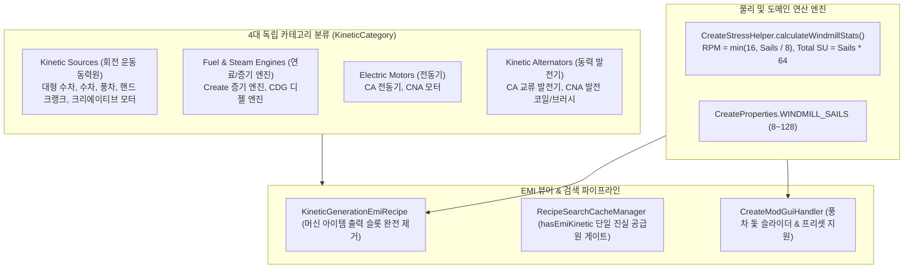

# ADR-036: 회전 운동 동력원 및 에너지 상호 변환기 분류 체계, 가변 RPM 동적 산출 및 뷰어 UI 개편 명세
# (Kinetic Sources & Energy Converter Taxonomy, Dynamic RPM Calculation & Viewer UI Specification)

- **문서 번호**: ADR-036
- **대상 버전**: `v2.2.0`
- **상태**: `IMPLEMENTED`
- **결정/완료일**: 2026-09-08
- **주관 계층**: Mod Adapter SPI Layer (`compat.create`, `compat.createnewage`, `compat.createdieselgenerators`), Pure Domain Layer (`api.model`, `api.property`), Recipe Viewer Integration Layer (`integration.emi`, `integration.spi`), Client GUI Layer (`client.gui.search`, `client.gui.compat.create`)

---

## 1. 개요 및 배경 (Motivation)

기존 Create 생태계(Create, Create Crafts & Additions, Create New Age, Create Diesel Generators) 연동 시 다음과 같은 5대 핵심 결함이 존재했습니다:
1. **단일 카테고리 몰아넣기**: 자연력 동력원(수차, 풍차), 엔진(증기, 디젤), 전동기(FE 소비 ➔ SU 생산), 발전기(SU 소비 ➔ FE 발전)가 모조리 `gtcalcboard:kinetic_generation` 카테고리 하나에 뒤섞여 노출됨.
2. **풍차 베어링(Windmill Bearing) 가변 RPM/SU 계산 부재**: 돛 개수($8\sim 128$)에 따라 $1\sim 16\text{ RPM}$, $512\sim 8,192\text{ SU}$로 가변되는 Create 모드 물리 공식이 누락되고 $512\text{ SU} @ 16\text{ RPM}$ 단일 수치로 강제 하드코딩됨.
3. **기계 자가 복제 슬롯 렌더링 버그**: EMI 합성 레시피에서 기계 블록 아이템이 출력 슬롯에 포함되어 `[Large Water Wheel] ➔ [Large Water Wheel]`처럼 아이템이 자가 복제되는 연금술 레시피로 오인되던 심각한 UI 결함.
4. **검색 캐시 이중 등록**: EMI 수집본과 대수판 가상 검색본이 동시에 적재되어 대형 수차 등이 2개씩 중복 노출되던 결함.
5. **노드 속성 유실**: EMI 레시피 변환 시 Create 전용 속성(`nodeSupplier`)이 누락되어 불완전한 노드가 생성되던 문제.

---

## 2. 세부 설계 및 결정 사항 (Architecture Decision)

### 2.1 4대 카테고리 체계 확립 (`KineticCategory`)
- `gtcalcboard:kinetic_source` (회전 운동 동력원: 입력 없음 ➔ 회전력 출력)
- `gtcalcboard:fuel_kinetic_engine` (연료 및 증기 엔진: 유체/증기 입력 ➔ 회전력 출력)
- `gtcalcboard:electric_motor` (전동기: FE 전력 입력 ➔ 회전력 출력)
- `gtcalcboard:kinetic_alternator` (동력 발전기: 회전력 입력 ➔ FE 전력 출력)

### 2.2 풍차 베어링(Windmill Bearing) 가변 RPM 동적 연산 도입
- 공식 Create 수식: $\text{RPM} = \min(16, \lfloor S / 8 \rfloor)$, $\text{Total SU} = S \times 64.0$ ($8 \le S \le 128$)
- `CreateProperties.WINDMILL_SAILS` 및 `applyWindmillSails()` 헬퍼 구현.
- `CreateModGuiHandler` 머신 설정 창에 `8`, `16`, `32`, `64`, `128` 돛 프리셋 및 `-8`/`+8` 조절 버튼 탑재.

### 2.3 EMI 위젯 전면 재설계
- 기계 블록 아이템이 출력 슬롯에 들어가던 안티패턴을 완전히 폐지하고 순수 출력 에너지(`IngredientStack.stressUnit` 등)만 바인딩.
- 상단 머신 아이콘 헤더 + 중앙 에너지 변환 흐름 화살표 + 하단 스펙 텍스트로 시각적 무결성 확립.
- `nodeSupplier`를 필수로 바인딩하여 보드에 추가 시 완전한 Create 속성이 유지된 노드 인스턴스 생성.

### 2.4 단일 진실 공급원(SSOT) 검색 인덱싱 일원화
- `RecipeSearchCacheManager`에 `hasEmiKinetic` 게이트를 적용하여, EMI가 활성화된 환경에서는 가상 레시피 중복 주입을 차단함으로써 검색창 2중 노출 버그를 원천 해결.

---

## 3. 결과 및 파급 효과 (Consequences)

- **플레이어 체감**:
  - 검색창에서 대형 수차 검색 시 중복 없는 단 1개의 정확한 카드가 노출됩니다.
  - 풍차 베어링 배치 후 머신 설정에서 돛 개수를 조절하여 실제 인게임 풍차 규모에 맞는 정밀한 RPM과 발전량을 계산할 수 있습니다.
  - EMI 레시피 창에서 "아이템을 넣어 아이템을 꺼내는" 기괴한 자가 복제 슬롯이 사라지고, 깔끔한 에너지 흐름 UI를 확인하게 됩니다.
- **검증 결과**:
  - `KineticTaxonomyAndWindmillTest` (4대 카테고리, 풍차 수식, EMI 출력 무결성 전수 검증 통과)
  - `CreateKineticTest`, `CreateNewAgeTest`, `CreateDieselGeneratorsAdapterTest` 100% `BUILD SUCCESSFUL`
  - 4개 국어(`en_us`, `ko_kr`, `zh_cn`, `ru_ru`) 1,223개 키 패리티 100% 일치.
