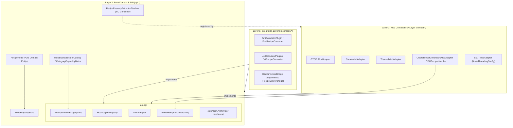

# ADR-037: 도메인 순수성 회복, 역방향 의존성 격리 및 결정론적 스펙 연역 무결성 개편
*(Domain Purity Restoration, Reverse Dependency Isolation & Deterministic Spec Deduction Refactoring)*

- **문서 번호**: ADR-037
- **대상 버전**: `v2.2.0-beta.2`
- **상태**: 🟢 `IMPLEMENTED`
- **결정/완료일**: 2026-09-09
- **책임 영역**: Pure Domain & API Layer (`com.gtceu.calcboard.api`), Mod Compatibility Layer (`com.gtceu.calcboard.compat`), Integration Layer (`com.gtceu.calcboard.integration`)

---

## 1. 개요 및 배경 (Motivation)

### 1.1 기술적 배경 및 문제점
`GregTech Calculator Board`는 GTCEu Modern, Create, Thermal Series, AE2, Star Technology 등 다수의 모드를 통합하는 대규모 그래프 계산 플랫폼입니다. 프로젝트의 4계층 아키텍처 원칙에 따라 설계되어 왔으나, 모드 확장 과정에서 다음과 같은 계층 역전(Layer Inversion) 및 추상화 누수가 발생하였습니다:

1. **SPI 인터페이스의 물리적 패키징 결함 (API ➔ Compat 역방향 참조)**:
   - 핵심 SPI인 `IModAdapter`, `ModAdapterRegistry` 및 확장 인터페이스들이 `com.gtceu.calcboard.compat` 패키지에 위치하여 순수 도메인 계층(`RecipeNode`, `MultiblockBOMCalculator` 등)이 하위 호환 계층을 역방향으로 참조.
2. **Core Domain(`api`)의 외부 레시피 뷰어(EMI/JEI) 역방향 결합**:
   - `MultiblockStructureCatalog`, `CategoryCapabilityMatrix` 등 핵심 카탈로그가 Layer 5 외부 라이브러리인 `dev.emi.emi.api.*` 및 `mezz.jei.api.*`를 직접 임포트하여 헤드리스 격리 저해.
3. **호환 계층의 특정 뷰어 구체 클래스 종속**:
   - `CreateModAdapter`, `GTCEuModAdapter`, `ThermalModAdapter` 등이 `EmiRecipeConverter`를 직접 참조하여 뷰어 중립성 훼손.
4. **헤드리스 클라이언트 접근 코드 잔존**:
   - `CDGRecipeHandler` 내 `Class.forName("net.minecraft.client.Minecraft")` 호출이 잔존하여 서버 환경 안정성 저해.
5. **순수 도메인 내 모드 특화 필드 및 파이프라인 하드코딩**:
   - `RecipePropertyExtractorPipeline` 정적 블록 내 GTCEu/Create 규칙 하드코딩.
   - `RecipeNode` 내 `threadingConfig`, `steamMode` 인스턴스 필드 및 `NodeThreadingConfig`의 도메인 위치 오류.
6. **최후 폴백 경로 내 비결정론적 `contains(...)` 휴리스틱 및 린터 사각지대**:
   - 터빈, 코일 등 식별 시 문자열 부분 매칭 잔존.

---

## 2. 세부 설계 및 결정 사항 (Architecture Decision)

### 2.1 클린 아키텍처 계층 정합성 및 의존성 흐름

### 2.2 핵심 구현 상세

1. **`api.spi` 패키지 분리 및 역방향 의존성 0건 달성**:
   - `IModAdapter`, `ModAdapterRegistry`, `extension.*`을 `com.gtceu.calcboard.api.spi`로 패키지 이전.
   - `com.gtceu.calcboard.compat`의 기존 클래스는 하위 호환성을 위해 `@Deprecated` 위임 래퍼로 보존.
   - `api/` 패키지 내 `import com.gtceu.calcboard.compat.*` 완전 근절.
2. **레시피 뷰어 브릿지 SPI (`IRecipeViewerBridge`) 도입**:
   - `com.gtceu.calcboard.api.spi.viewer.IRecipeViewerBridge` 및 `RecipeDetails`, `RecipeConversionHelper` 도입.
   - `api` 및 `compat` 계층에서 `dev.emi.emi` 및 `mezz.jei` 직접 임포트 전면 제거.
   - `integration` 계층의 `EmiRecipeViewerBridge` 및 `JeiRecipeViewerBridge`가 인터페이스 구현.
3. **`RecipePropertyExtractorPipeline` IoC 전환**:
   - `api.property.RecipePropertyExtractorPipeline` 내 정적 블록 하드코딩 제거.
   - 각 모드 어댑터가 `initialize()` 라이프사이클에서 전용 프로퍼티 추출기를 등록하도록 제어 역전.
4. **`RecipeNode` 도메인 순수화 및 `NodeThreadingConfig` 이전**:
   - `threadingConfig`, `steamMode` 인스턴스 필드를 `NodePropertyStore`(`NodeProperties`)로 이전.
   - `NodeThreadingConfig`를 `com.gtceu.calcboard.compat.start.model`로 재배치.
5. **헤드리스 안전성 확보**:
   - `CDGRecipeHandler` 내 `Class.forName("net.minecraft.client.Minecraft")` 완전 삭제, `ILevelRecipeProvider` 단일화.
6. **결정론적 Exact Match 테이블화**:
   - `TurbineCatalog` 등 문자열 `contains` 휴리스틱을 `Set<ResourceLocation>` 기반 정확 일치로 전면 개편.
7. **정적 린터(`tools/lint_agent_rules.py`) 강화**:
   - 다단계 변수 할당 후 `contains(...)` 및 클라이언트 클래스 동적 로딩 탐지 정규식 보강.

---

## 3. 결과 및 검증 (Consequences & Verification)

### 3.1 긍정적 효과
- **완전한 계층 분리**: `api` 계층이 `compat` 및 외부 뷰어 라이브러리로부터 격리되어 순수 도메인 모델 성립.
- **헤드리스 및 서버 무결성**: 클라이언트 리플렉션 완전 제거 및 SPI 추상화로 전용 서버 환경에서의 LinkageError 방지.
- **확장성 및 OCP 준수**: 신규 모드 및 레시피 뷰어 추가 시 코어 도메인 수정 없이 독립 어댑터/브릿지 구현만으로 연동 가능.

### 3.2 검증 결과
- **정적 린터 검증**: `python tools/lint_agent_rules.py --diff` 실행 결과 145개 파일 0건 위반 (100% 규격 준수).
- **다국어 패리티 검증**: `python tools/check_i18n.py` 실행 결과 4개 국어(en_us, ko_kr, ru_ru, zh_cn) 1,260개 키 100% 일치.
- **단위 테스트 전수 통과**: Gradle 전체 테스트 실행 결과 **933개 테스트 전수 통과 (0 failures, 0 errors, 0 skipped)**.
