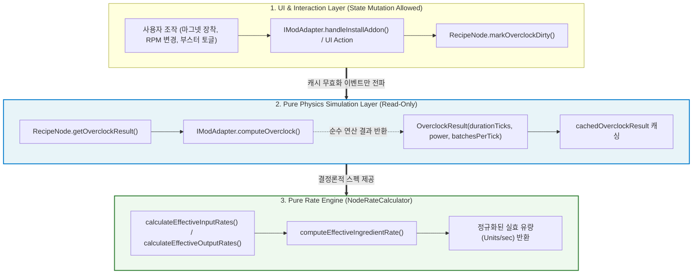

# ADR-038: 레거시 계산 알고리즘 및 물리 시뮬레이션 순수성 개편
*(Legacy Calculation Algorithms & Physical Simulation Purity Refactoring)*

- **문서 번호**: ADR-038
- **대상 버전**: `v2.2.0-beta.2`
- **상태**: 🟢 `IMPLEMENTED`
- **결정/완료일**: 2026-09-09
- **책임 영역**: Core Domain Calculation (`com.gtceu.calcboard.api.model`), Flow Solvers (`com.gtceu.calcboard.api.solver`), Mod Adapters (`com.gtceu.calcboard.compat`)

---

## 1. 개요 및 배경 (Motivation)

### 1.1 기술적 배경 및 문제점
프로젝트 초기 GTCEu 중심 계산 모델에서 출발하여 Create, Thermal, Systeams, Greate, Star Technology 등 다양한 모드로 지원이 확장되면서, 단위 사이클 물리/시간 연산을 담당하던 `computeOverclock` 인터페이스가 본래의 순수 함수(Pure Function) 규격을 벗어나 상태 변조(Mutation)와 부수 효과(Side-Effect)를 유발하는 땜질성 패턴이 누적되었습니다.

대표적인 구조적 결함은 다음과 같았습니다:
1. **순수 계산 메서드 내부의 포트 컬렉션 직접 변조**:
   - `CreateNewAgeModAdapter.computeOverclock` 내부에서 발전기 코일의 필요 SU를 갱신하기 위해 `node.getInputs().set(0, ...)`를 호출하여 원본 노드의 리스트를 직접 변조.
   - 이를 트리거하기 위해 `NodeRateCalculator`의 8개 전역 계산 메서드에서 `node.getOverclockResult()`를 강제 호출하고 리스트를 다시 읽어오는 부수 효과 의존성 발생.
   - `GTPowerCalculator.computeCombustionPower` 연산 중 프로퍼티 변조 및 `parallel == 1` 임의 최대 출력 하드코딩 분기 존재.
2. **UI 렌더링 프레임 단위의 캐시 파괴(Cache Thrashing)**:
   - `GTTurbineHelper.getRotorHolderTier` 및 `calculateRotorWearPerSecond`가 툴팁 렌더러에서 매 프레임 호출될 때마다 `node.getProperties().set`을 호출하여 오버클럭 및 가동성 캐시가 매 프레임 무효화.
3. **인자 오바인딩 및 입출력 대칭성 붕괴**:
   - `NodeRateCalculator.calculateEffective*Rates`에서 이벤트 발행 제어 플래그(`postEvent`)가 `computeStressRate`의 `effective` 인자에 잘못 전달되어 효율 계산 왜곡.
   - 단일 기계 레이트 계산(`calculateSingleMachine*`)에서 출력은 `!isOperational()` 가드가 있으나 입력은 누락되는 불균형.
4. **복합 모듈 축소 스케일링 유실**:
   - `FlowGraphModuleHandler.expandModule`에서 `moduleScale > 1.0`인 경우만 처리하여 0 < scale < 1 축소 비율이 모듈 펼치기 시 유실.

---

## 2. 세부 설계 및 결정 사항 (Architecture Decision)

### 2.1 계층별 책임 및 데이터 흐름 아키텍처

### 2.2 주요 컴포넌트별 상세 결정

#### A. 전역 포트 레이트 계산 순수 함수화 (`NodeRateCalculator`)
- `calculateInputRates`, `calculateOutputRates`, `calculateEffectiveInputRates`, `calculateEffectiveOutputRates`에서 부수 효과 목적의 `node.getOverclockResult()` 호출 및 `in = getInputs().get(i)` 재조회 땜질 코드를 전면 제거했습니다.
- `computeStressRate` 호출 인자에서 플래그 오바인딩을 해소하여 `computeStressRate(node, stack, true, false)` 형태로 정규화했습니다.
- `calculateSingleMachineOutputRate`에 `!node.isOperational()` 가드를 확립하여, 가동 조건을 만족하지 못한 기계가 유량을 공급하는 왜곡을 완전히 차단했습니다.

#### B. Create: New Age 어댑터 순수화 (`CreateNewAgeModAdapter`)
- `computeOverclock` 내부의 `node.getInputs().set(0, ...)` 직접 변조를 완전히 삭제했습니다.
- 코일 회전 운동 동력 입력 스택은 전용 `syncGeneratorCoilInput` 메서드를 통해 노드 초기화 및 하드웨어 변경 시점에만 갱신하도록 분리했습니다.
- 레이트 조회 시 `computeEffectiveIngredientRate`, `computeSingleMachinePower`를 오버라이드하여 머신 대수(`machineCount`) 및 병렬, 효율이 실시간으로 비례 반영되는 순수 수식을 제공하도록 개선했습니다.

#### C. 터빈 및 연소 발전기 헬퍼 순수화 (`GTTurbineHelper`, `GTPowerCalculator`)
- 툴팁 렌더러에서 호출되는 `getRotorHolderTier`와 `calculateRotorWearPerSecond` 내부의 `properties.set(...)` 상태 변경을 전면 삭제하고, 순수 읽기 및 로컬 수식으로 전환하여 프레임 단위 캐시 무효화 부수효과를 근절했습니다.
- `computeCombustionPower` 첫 줄의 부수효과를 제거하고, 터빈 `parallel == 1` 임의 최대 출력 하드코딩 분기를 삭제하여 실제 증기 유량 기반 공식으로 정류했습니다.

#### D. 복합 모듈 축소 비율 보존 (`FlowGraphModuleHandler`)
- `expandModule` 내부 조건을 `if (moduleScale > 0.0 && Math.abs(moduleScale - 1.0) > 1e-6)`으로 복원하여 모듈 축소 배율이 내부 기계 대수에 정확하게 보존되도록 개선했습니다.

---

## 3. 결과 및 파급 효과 (Consequences)

### 3.1 긍정적 효과
1. **상태 불변성 및 스레드 안전성 강화**:
   - 레이트 계산 및 물리 시뮬레이션 중 도메인 모델의 컬렉션을 임의로 변조하지 않으므로, 다중 스레드 렌더링 및 비동기 솔버 환경에서 동시성 충돌이나 예기치 않은 데이터 왜곡이 원천 차단되었습니다.
2. **렌더링 성능 최적화 및 캐시 보존**:
   - 툴팁 마우스 오버 시 발생하던 프레임 단위 캐시 무효화 루프가 제거되어 렌더 루프 부하가 최소화되었습니다.
3. **물리 시뮬레이션 및 솔버 정합성 회복**:
   - 미가동 기계의 출력이 0으로 정확히 단절되고, 축소 모듈의 스케일링이 완벽히 복원되며, Create: New Age 기계 대수 조작 시 동력 수치가 즉각 비례 반영됩니다.

### 3.2 단위 테스트 검증 결과
- **전체 단위 테스트 전수 통과**: `.\gradlew.bat test` (928개 이상의 전체 테스트 100% PASS, 17초 소요).
- **정적 규칙 린터 검증**: `python tools/lint_agent_rules.py --diff` (57개 파일 검사, 0 Violations).
- **다국어 i18n 동기화**: `python tools/check_i18n.py` (1260개 키 4개 국어 100% 매칭, 0 Errors).
