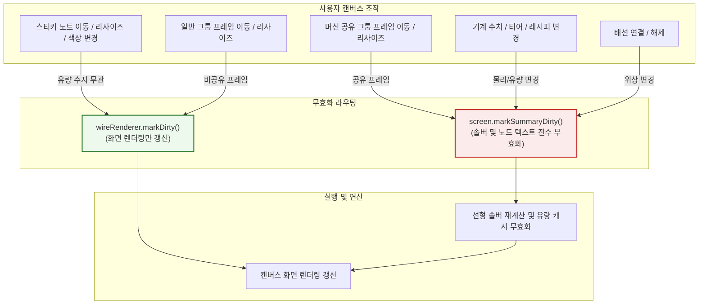

# ADR-039: 렌더링 생명주기 최적화, 정밀 캐시 무효화 및 그래프 탐색 알고리즘 개편
*(Rendering Lifecycle Optimization, Precision Cache Invalidation & Graph Search Algorithm Refactoring)*

- **문서 번호**: ADR-039
- **대상 버전**: `v2.2.0-beta.2`
- **상태**: 🟢 `IMPLEMENTED`
- **결정/완료일**: 2026-09-09
- **책임 영역**: Client Rendering Loop (`com.gtceu.calcboard.client.gui.render`), UI Interactions (`client.gui.interaction`), Graph Search & Topology (`api.model`, `api.solver`), Mod Adapters & Integrations (`compat`, `integration`)

---

## 1. 개요 및 배경 (Motivation)

공정 계산 보드 시스템이 대규모화되고 부가 기능(JEI/EMI 뷰어 연동, 스티키 노트, 멀티페이지 대시보드, 자동 연결 등)이 확장되면서, 계산 코어 외부의 **GUI 렌더링 루프**, **이벤트 전파 및 캐시 무효화 생명주기**, **그래프 기하 탐색 알고리즘** 영역에서 다음 비효율과 불필요한 연산 부하가 확인되었습니다:

1. **렌더링 루프 내 동적 리플렉션 룩업**:
   - `BoardScreen.isSmoothPanBlocked()`가 매 렌더 프레임 호출될 때 JEI 어댑터(`JeiRecipeViewerAdapter.isSearchFieldFocused`)가 캐시 없이 `getMethod`를 호출하여 초당 수백 회의 리플렉션 룩업 발생.
2. **단순 메모지/장식 프레임 조작 시 전체 계산 캐시 파괴**:
   - 스티키 노트 이동/리사이즈/색상 변경 및 단순 장식용 그룹 프레임 이동 시 `screen.markSummaryDirty()`가 무조건 호출되어 유량 통계 캐시와 텍스트 렌더 캐시가 파괴되고 선형 솔버가 강제 재실행.
3. **포함 노드 판별 시 컬렉션 생성 및 선형 탐색**:
   - `FlowGraph.findFrameEnclosingNode`가 프레임마다 전체 노드를 순회하며 임시 리스트를 할당하고 선형 검색 수행.
4. **`BoardScreen.render()` 내 요약본 중복 계산**:
   - 렌더 루프 전반부와 후반부 위젯 렌더링 단계에서 동일한 요약본 계산 블록이 중복 실행.
5. **자동 연결(`autoConnect`)의 다중 선형 순회**:
   - 노드 및 포트 루프 내부에서 `isPortConnected`, `findFeedingRerouteNode` 등이 전체 연결선 리스트를 매번 선형 순회.
6. **전역 대시보드 열람 시 비활성 페이지 솔버 전수 재실행**:
   - 변경 사항이 없는 비활성 페이지조차 기존 유효 요약본을 재사용하지 못하고 매번 선형 솔버를 처음부터 다시 계산.
7. **`FTBTeamsProvider` 내 권한 검사 루프**:
   - 권한 검사 메서드에서 매번 `team.getClass().getMethods()`를 순회하여 리플렉션 오버헤드 발생.

---

## 2. 세부 설계 및 결정 사항 (Architecture Decision)

### 2.1 정밀 캐시 무효화 및 렌더링 라우팅 아키텍처

### 2.2 핵심 구현 상세

1. **`JeiRecipeViewerAdapter` 리플렉션 캐싱**:
   - 포커스 판별 대상 메서드(`hasKeyboardFocus`, `isFilterFocused`, `recipeLayout`)를 `static {}` 블록 및 정적 필드로 1회만 캐싱하여 프레임 루프 내 룩업 오버헤드 제거.
2. **캔버스 인터랙션 정밀 무효화 격리**:
   - `CanvasNoteInteractionHandler`에서 노트 이동/리사이즈/색상 변경 시 불필요한 `screen.markSummaryDirty()` 호출을 제거하고 `wireRenderer.markDirty()`만 호출.
   - `CanvasFrameInteractionHandler`에서 `isSharedMachineFrame()`인 경우에만 요약본 무효화를 전파하고 일반 프레임은 화면 갱신만 수행.
3. **`FlowGraph.findFrameEnclosingNode` 직접 바운딩 검사**:
   - 임시 컬렉션 할당(`getEnclosedNodes()`)을 제거하고 노드 중심 좌표(`cx, cy`)에 대해 `frame.isPointInside(cx, cy)`를 직접 검사.
4. **`BoardScreen` 렌더 루프 중복 제거**:
   - 위젯 렌더링 단계에서 불필요하게 잔존하던 요약본 중복 계산 코드를 제거하고 프레임당 단일 갱신 흐름으로 통합.
5. **`autoConnect` 연결 인덱싱 도입**:
   - 자동 연결 탐색 시작 시 `AutoConnectGraphIndex`를 구축하여 기생성된 연결선 및 재라우팅 공급 관계를 빠른 조회 구조로 인덱싱.
6. **`GlobalBalanceAggregator` 비활성 페이지 캐시 재활용**:
   - `FlowGraph` 내 요약본 캐시(`cachedSummary`)와 dirty 플래그(`summaryDirty`)를 관리하여, 변경 사항이 없는 비활성 페이지는 기존 계산 요약본을 재사용.
7. **`FTBTeamsProvider` 리플렉션 룩업 통합**:
   - `checkPlayerRank`, `checkFallbackRoleMethods`, `invokeLookup`의 un-cached 메서드 순회를 `METHOD_CACHE`를 통한 캐싱 구조로 통일.

---

## 3. 검증 결과 및 영향 (Verification & Impact)

- **단위 테스트 및 회귀 검증**:
  - `PrecisionCacheInvalidationTest` 신설: 바운딩 검사 동등성, 요약본 캐싱 및 무효화 격리, 전역 집계 캐시 재활용, 자동 연결 무결성 전수 검증 통과.
  - 기존 934개 전체 단위 테스트 스위트 전수 통과 (`BUILD SUCCESSFUL`).
- **정적 린터 및 다국어 패리티**:
  - `python tools/lint_agent_rules.py --diff`: Rule 1, Rule 5, Rule 6 위반 0건.
  - `python tools/check_i18n.py`: 4개 국어(en_us, ko_kr, ru_ru, zh_cn) 1,260개 키 100% 일치.
