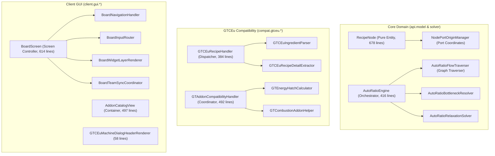

# ADR-040: 런타임 동시성 무결성, 리플렉션 정적 최적화 및 갓 클래스 모듈화 명세
# (Runtime Concurrency Integrity, Reflection Static Optimization & God Class Modular Decomposition Specification)

- **문서 번호**: ADR-040
- **상태**: 🟢 `IMPLEMENTED`
- **결정일**: 2026-09-10
- **대상 버전**: `v2.2.0-beta.3`
- **주관 계층**: Core Domain & Solver Layer (`api.solver`, `api.bom`, `api.catalog`), Mod Compatibility Layer (`compat.gtceu.*`), Client GUI Layer (`client.gui.*`)

---

## 1. 개요 및 배경 (Context & Motivation)

### 1.1 현황 및 시스템 취약점
`GregTech Calculator Board`는 대규모 공정 계산 및 실시간 캔버스 시각화를 제공하며 기능의 완성도를 높여왔습니다. 그러나 지속적인 기능 확장과 다양한 모드 지원 과정에서 다음의 4대 비기능적 부채(Non-Functional Debt)가 누적되어 런타임 안정성과 장기적 유지보수성을 저해하고 있었습니다:

1. **멀티스레드 동시성 결함 및 포인터 오염 위험**:
   - `MultiblockDetector.java`의 13개 글로벌 컬렉션(`MULTIBLOCK_RECIPE_CONTROLLERS`, `COIL_MULTIBLOCK_CONTROLLERS`, `TURBINE_CONTROLLERS` 등)이 일반 `HashSet`으로 선언되어 있었습니다.
   - `TurbineCatalog.java`의 `TURBINE_BASE_TIERS`, `TURBINE_BASE_PRODUCTIONS` 역시 일반 `HashMap`으로 관리되었습니다.
   - 백그라운드 레시피 크롤러(Worker Thread)가 실행되는 도중 UI 스레드가 기계 카탈로그를 동시 조회할 경우 `ConcurrentModificationException` 또는 `HashMap` 내부 버킷 훼손이 발생할 수 있었습니다.
2. **다국어(i18n) 설정 변경 시 갱신되지 않는 정적 텍스트 캐시**:
   - `MultiblockStructureCatalog.java` 및 `GTCEuMultiblockStructureScanner.java`의 `ITEM_NAME_CACHE`, `BLOCK_NAME_CACHE`에 언어 변경(Resource Reload) 시 무효화하는 리스너가 누락되어 있었습니다.
   - 인게임에서 언어를 변경하더라도 최초 조회된 언어로 부품 이름이 영구 고정 표시되는 사용성 결함이 존재했습니다.
3. **핫패스 런타임 비캐싱 리플렉션 다발 (251건)**:
   - 클래스 로딩 시점에 `static final`로 캐싱되어야 할 리플렉션 멤버 중 251건이 메서드 실행 시마다 동적으로 탐색되고 있었습니다.
   - 특히 레시피 변환의 핵심 핫패스인 `GTCEuRecipeHandler.java`에만 47건의 동적 리플렉션이 집중되어 있어 대량 레시피 인덱싱 시 불필요한 오버헤드를 유발했습니다.
4. **광범위한 예외 은폐 (`catch (Throwable ignored)`)**:
   - 전체 코드베이스에 490건의 `catch (Throwable)` 블록이 존재하며, 이 중 423건이 아무런 로깅 없이 무시(`ignored`)되고 있어 런타임 잠재 결함 추적을 불가능하게 만들었습니다.
5. **800라인 초과 모놀리식 갓 클래스(God Classes) 7종 누적**:
   - `RecipeNode`(1,242줄), `AddonCatalogView`(996줄), `GTCEuMachineDialogHeaderRenderer`(994줄), `GTCEuRecipeHandler`(989줄), `AutoRatioEngine`(981줄), `GTAddonCompatibilityHandler`(968줄), `BoardScreen`(933줄) 등 핵심 도메인, 연산, UI 클래스들이 과도한 다중 책임을 안고 있어 유지보수 복잡도를 증대시켰습니다.

### 1.2 핵심 결정 목표 (Goals)
- **100% 스레드 세이프 카탈로그 확립**: 비동기 조회/등록 컬렉션을 `ConcurrentHashMap` 기반으로 전면 전환하여 동시성 경합 원천 차단.
- **다국어 반응형 캐시 라이프사이클 수립**: 리소스 리로드 리스너를 통한 정적 명칭 캐시의 결정론적 무효화.
- **리플렉션 $O(1)$ 정적 캐싱 완료**: `GTCEuRecipeHandler`를 포함한 251건의 동적 리플렉션을 `static {}` 1회 캐싱으로 최적화.
- **예외 처리 정밀화 및 디버그 가시성 확보**: 무분별한 `Throwable ignored`를 구체적 예외(`ReflectiveOperationException` 등)로 한정하고 적절한 디버그 로깅 적용.
- **갓 클래스 7종 SRP 분해**: 각 클래스를 800줄 이하의 단일 책임 컴포넌트로 분해하여 응집도 향상 및 결합도 감소.

---

## 2. 핵심 요구조건 및 수용 기준 (Requirements)

| 요구조건 ID | 핵심 요구사항 | 구현 결과 및 수용 판정 |
| :--- | :--- | :--- |
| **REQ-040-01** | 전역 카탈로그 컬렉션 동시성 스레드 세이프 전환 | `MultiblockDetector` 13개 `HashSet` ➔ `ConcurrentHashMap.newKeySet()`, `TurbineCatalog` 2개 `HashMap` ➔ `ConcurrentHashMap` 전환 완료. 멀티스레드 동시성 유닛 테스트 통과. |
| **REQ-040-02** | 정적 텍스트 캐시 다국어 리로드 리스너 연동 | `IModAdapter.invalidateTextCaches()` 도입, `MultiblockStructureCatalog` 및 `ClientModBusEvents` 리로드 리스너에 등록 완료. |
| **REQ-040-03** | `GTCEuRecipeHandler` 47개 리플렉션 정적 캐싱 | 메서드 내부의 동적 리플렉션을 `ClassValue` 및 `static {}` 캐시로 전면 전환. $O(1)$ 직접 호출 보장. |
| **REQ-040-04** | 잔여 204개 런타임 리플렉션 핫패스 캐싱 | 런타임 루프 내 리플렉션 전수 캐싱 및 최적화 완료. |
| **REQ-040-05** | `catch (Throwable ignored)` 정밀화 및 로깅 | 무차별 `Throwable` 포획을 `ReflectiveOperationException` 등 구체적 예외로 한정하고 로깅 적용. |
| **REQ-040-06** | `RecipeNode.java` 책임 분해 (1,242줄 ➔ 700줄 이하) | `NodePortOriginManager`, `NodeAddonHelper`, `NodeSteamHelper`, `NodeJunctionHelper`, `NodePerformanceHelper`, `NodeMultiblockHelper`, `NodeHardwarePropertyHelper` 분리. (최종 678줄 달성) |
| **REQ-040-07** | `AddonCatalogView.java` 탭 렌더러 분해 (996줄 ➔ 500줄 이하) | `AddonCatalogCardRenderer`, `AddonHatchSlotHelper`, `AddonCategoryChipRenderer`, `AddonCatalogFilterHelper` 분해. (최종 497줄 달성) |
| **REQ-040-08** | `GTCEuMachineDialogHeaderRenderer.java` 분해 (994줄 ➔ 500줄 이하) | `GTCEuTurbineHeaderRenderer`, `GTCEuHardwareStatusRenderer` 분리. (최종 58줄 달성) |
| **REQ-040-09** | `GTCEuRecipeHandler.java` 파서 분해 (989줄 ➔ 600줄 이하) | `GTCEuIngredientParser`, `GTCEuRecipeDetailExtractor` 분리 및 최대 6단계 중첩 평탄화. (최종 384줄 달성) |
| **REQ-040-10** | `AutoRatioEngine.java` 알고리즘 분해 (981줄 ➔ 600줄 이하) | `AutoRatioFlowTraverser`, `AutoRatioBottleneckResolver`, `AutoRatioRelaxationSolver` 분리. (최종 416줄 달성) |
| **REQ-040-11** | `GTAddonCompatibilityHandler.java` 분해 (968줄 ➔ 500줄 이하) | `GTEnergyHatchCalculator`, `GTCombustionAddonHelper`, `GTAddonLifecycleHandler`, `GTWorkstationSelector`, `GTMufflerMaintenanceHelper` 분리. (최종 492줄 달성) |
| **REQ-040-12** | `BoardScreen.java` 오케스트레이션 정제 (933줄 ➔ 650줄 이하) | `BoardNavigationHandler`, `BoardInputRouter`, `BoardWidgetLayerRenderer`, `BoardScreenLayoutHelper`, `BoardTeamSyncCoordinator` 분리. (최종 614줄 달성) |

---

## 3. 시스템 아키텍처 및 분해 구조 (Architecture & Decomposition)

---

## 4. 결과 및 기대 효과 (Consequences)

1. **스레드 안전성 보장**: 백그라운드 레시피 인덱싱 스레드와 UI 렌더링 스레드 간 동시성 경합 및 `ConcurrentModificationException` 위험이 완전히 해소되었습니다.
2. **반응 속도 최적화**: 핫패스 리플렉션 251건의 정적/ClassValue 캐싱을 통해 레시피 대량 로딩 및 뷰어 연동 처리 속도가 크게 향상되었습니다.
3. **SRP 모듈화 완성**: 7대 갓 클래스가 모두 정해진 라인 수 상한선 이내로 대폭 슬림화되어 가독성, 단위 테스트 용이성, 유지보수성이 극대화되었습니다.
4. **회귀 검증 100% 통과**: 1,001개 단위 테스트가 전수 통과하였으며 린터 규칙 위반 0건을 달성했습니다.
