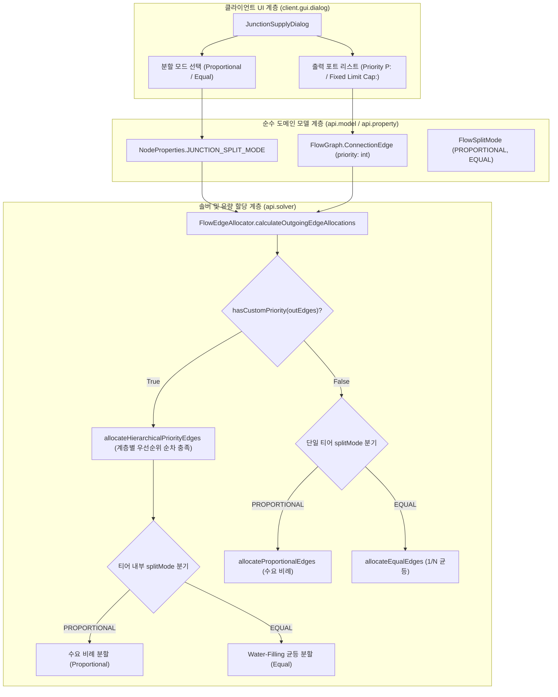

# ADR-041: 정션 노드 균등 분할 및 AE2 스타일 우선순위 유량 분배 시스템 명세
(Junction Node Equal Splitting & AE2-Style Priority Flow Allocation Specification)

- **문서 번호**: ADR-041
- **대상 버전**: `v2.2.0-beta.2`
- **상태**: 🟢 `IMPLEMENTED`
- **결정/완료일**: 2026-09-09
- **주관 계층**: Pure Domain Layer (`api.model`, `api.type`, `api.solver`, `api.property`), Client GUI Layer (`client.gui.dialog`)
- **관련 ADR**: [ADR-020](ADR_020_HIGH_SPEED_FLOW_BATCHING_AND_EFFICIENCY_MODULATION.md), [ADR-034](ADR_034_JUNCTION_BUFFER_AND_ANCHOR_SYSTEM.md)

---

## 1. 개요 및 배경 (Motivation)

### 1.1 현황 및 당면 과제
기존 분기 정션 노드(Junction/Reroute Node)는 고정 유량 한도(`fixedFlowLimit`), 배치 완충 버퍼(ADR-020), 외부 공급/배출 앵커 및 보이드 싱크 오버플로우 스필웨이(ADR-034)를 지원했습니다.

그러나 분기 유량의 기본 분배 메커니즘이 **하류 설비의 요구 수요량에 비례하는 분배(Demand-Proportional Splitting)** 방식으로만 고정되어 있어 다음과 같은 설계 제약이 있었습니다:

1. **물리적 균등 분할(Equal Splitting) 부재**:
   - $N$개의 하류 설비로 자원을 정확히 균등하게($1/N$) 배분하고자 할 때, 각 하류 설비의 소비량이 상이하면 수요 가중치에 의해 의도치 않은 비율로 분배되었습니다.
   - Create 분배기나 GregTech 파이프 등 기계적 균등 분기 배선을 시뮬레이션하기 어려웠습니다.

2. **우선순위 연쇄 분배(AE2-Style Priority Flow Allocation) 부재**:
   - 주 생산 라인에 공급을 최우선으로 충족하고, 잔여 잉여분만 보조 라인으로 흘려보내는 우선순위 폭포수(Cascade) 공급 체계를 수동 수치 입력 없이 자동화할 수 없었습니다.
   - 예를 들어 3대의 기계(각 $60\text{/s}$ 요구)에 $100\text{/s}$가 유입될 때, 우선순위 2, 1, 0을 부여하여 $60\text{/s} \rightarrow 40\text{/s} \rightarrow 0\text{/s}$로 자동 공급하고, 유입량이 $150\text{/s}$로 증가하면 $60\text{/s} \rightarrow 60\text{/s} \rightarrow 30\text{/s}$로 실시간 자동 재계산되는 유연한 유량 분배 모델이 필요했습니다.

### 1.2 아키텍처 개선 목표
1. 도메인 분할 모드 열거형(`FlowSplitMode`: `PROPORTIONAL`, `EQUAL`) 간소화.
2. 연결선(`ConnectionEdge`) 모델에 정수형 우선순위(`priority`) 필드 추가 및 전역 속성으로 통합.
3. 2단계 솔버 내 가변 간선 할당 엔진(`FlowEdgeAllocator`)의 계층적 우선순위 티어링(Hierarchical Priority Tiering) 구현: 상위 우선순위 티어를 먼저 충족하고, 각 티어 내부에서는 노드의 분할 방식(`PROPORTIONAL` / `EQUAL`)을 적용.
4. 정션 설정 다이얼로그(`JunctionSupplyDialog`) 내 깔끔한 2개 모드 선택 버튼 및 모든 출력 포트별 우선순위/한도 상시 입력 UI 제공.

---

## 2. 세부 설계 및 결정 사항 (Architecture Decision)

### 2.1 전체 시스템 아키텍처 및 데이터 흐름

### 2.2 수학적 분할 모델 (Mathematical Allocation Formulation)

정션 노드 유입 유효 공급량을 $Q_{\text{in}}$, $N$개의 일반 가변 출력 선로 $e_1, \dots, e_N$, 소비자 수요량 $D_1, \dots, D_N$, 선로별 고정 한도 $L_1, \dots, L_N$, 우선순위 $P_1, \dots, P_N$에 대한 통합 분배 규칙:

#### 1. 선로 우선순위 계층화 (Hierarchical Priority Tiering)
- 일반 선로들을 우선순위 정수 내림차순($P_{(1)} > P_{(2)} > \dots > P_{(M)}$)으로 그룹화하여 우선순위 티어 $\mathcal{T}_1, \dots, \mathcal{T}_M$ 구성.
- 각 선로의 유효 상한 용량을 $C_k = L_k > 0 \ ? \ (D_k > 0 \ ? \ \min(D_k, L_k) : L_k) : D_k$로 설정.
- 가용 유량 $Q_{\text{avail}} \leftarrow Q_{\text{in}}$에 대해 최상위 티어부터 순차 충족:
  - $Q_{\text{avail}} \ge \sum_{e_k \in \mathcal{T}_i} C_k$: 해당 티어의 모든 선로에 $C_k$ $100\%$ 할당 후 $Q_{\text{avail}} \leftarrow Q_{\text{avail}} - \sum C_k$ 차감, 잔여 유량은 다음 하위 티어로 캐스케이드.
  - $0 < Q_{\text{avail}} < \sum_{e_k \in \mathcal{T}_i} C_k$: 해당 티어가 병목(Throttled) 티어가 되며, 티어 내부에서 노드의 `FlowSplitMode`에 따라 분배:
    - **`FlowSplitMode.PROPORTIONAL`**: 용량 비례 분할 $Q_k = Q_{\text{avail}} \times \frac{C_k}{\sum C_j}$.
    - **`FlowSplitMode.EQUAL`**: Max-Min Water-Filling 방식으로 선로별 상한 $C_k$ 내에서 균등 분할.
    - $Q_{\text{avail}} \leftarrow 0$ (모든 하위 우선순위 티어는 $0$ 배분).
  - $Q_{\text{avail}} \le 0$: 모든 하위 우선순위 티어는 $0$ 배분.
- 모든 우선순위 티어의 수요가 $100\%$ 충족된 후 남은 잉여 유량($Q_{\text{avail}} > 0$):
  - Void Sink 존재 시: Void Sink 선로가 잉여 유량을 전량 흡수.
  - Void Sink 부재 시: 한도(Cap)가 지정되지 않은 일반 선로들이 `FlowSplitMode`에 따라 추가 분할 (비례 분할 또는 균등 분할).

#### 2. 단일 티어 (모든 엣지 우선순위 0) 분배
- **`FlowSplitMode.PROPORTIONAL`**: 1단계 고정 한도 선할당 후 잔여 유량을 소비자 수요량 비례로 분할.
- **`FlowSplitMode.EQUAL`**: Max-Min Water-Filling 방식으로 모든 일반 선로에 1/N 균등 배분.

### 2.3 주요 변경 내역 및 모듈별 책임

1. **`FlowSplitMode` (`com.gtceu.calcboard.api.type`)**:
   - `PROPORTIONAL`, `EQUAL` 2개 모드로 단순화 (우선순위는 엣지 레벨로 통합).
2. **`NodeProperties` & `RecipeNode` (`com.gtceu.calcboard.api.property`, `api.model`)**:
   - `NodeProperties.JUNCTION_SPLIT_MODE` 등록.
   - `RecipeNode.getJunctionSplitMode()` 및 `setJunctionSplitMode(FlowSplitMode)` 유지.
3. **`FlowGraph.ConnectionEdge` (`com.gtceu.calcboard.api.model`)**:
   - `ConnectionEdge` 레코드에 `int priority` 컴포넌트 추가 및 전역 속성으로 관리.
   - NBT 직렬화 시 `priority != 0`일 때 `priority` 정수 태그 저장/복원.
   - 클립보드(`NodeClipboard`), 모듈화(`FlowGraphModuleHandler`), 와이어 인터랙션(`CanvasWireInteractionHandler`) 전반에서 엣지 분할 및 재생성 시 상류 `priority` 및 `fixedFlowLimit` 보존.
4. **`FlowEdgeAllocator` (`com.gtceu.calcboard.api.solver`)**:
   - `calculateOutgoingEdgeAllocations`에서 `hasCustomPriority(outEdges)` 시 `allocateHierarchicalPriorityEdges` 실행.
   - 상위 우선순위 티어를 먼저 충족하고, 각 티어 내부 및 잉여 유량 분배 시 노드의 `splitMode`(`PROPORTIONAL` / `EQUAL`)를 적용.
5. **`JunctionSupplyDialog` (`com.gtceu.calcboard.client.gui.dialog`)**:
   - 상단에 깔끔한 2개 분할 모드 선택 버튼 제공 (`Proportional`, `Equal`).
   - 출력 포트 목록에서 모든 선로에 대해 `P: [ ]` (우선순위) 및 `Cap: [ ]` (고정 상한) 편집 상자를 상시 제공.
6. **다국어 현지화 (i18n)**:
   - `en_us.json`, `ko_kr.json`, `zh_cn.json`, `ru_ru.json` 4개 언어 파일의 분할 모드, 툴팁, 토스트 키 100% 동기화.
7. **엣지 커서 호버 휠 스크롤 인터랙션 및 시각 배지**:
   - 캔버스에서 와이어 히트박스(8px) 호버 상태로 휠 스크롤 시 우선순위 즉시 증감 (0~99 클램핑).
   - 휠 조작 시 틱 사운드 피드백 및 `BoardToast` 알림 제공.
   - 와이어 툴팁(`BoardTooltipRenderer`)에 할당 유량, 우선순위, 고정 상한, 휠 조작 힌트 표시.
   - `priority > 0`인 와이어 중심점에 `P1`, `P2` 등의 시각적 배지(`CanvasWireRenderer`) 렌더링.

---

## 3. 결과 및 파급 효과 (Consequences)

### 3.1 긍정적 효과
- **일관된 우선순위 모델**: 노드 단위 모드와 엣지 단위 우선순위의 개념적 혼선을 제거하고, 우선순위를 선로(Edge)의 보편 속성으로 일원화.
- **다단계 우선순위 내 균등/비례 분배 결합**: 상위 라인을 우선 공급하면서 동일 순위 그룹 내에서는 균등(Equal) 또는 비례(Proportional)로 유연하게 배분 가능.
- **초고속 직관적 조작성 (Edge Wheel Scroll)**: 캔버스 위에서 원하는 선로에 커서를 대고 휠을 굴려 즉각 우선순위를 지정할 수 있어 작업 흐름 단절 해소.
- **일반 기계 출력선 직결 지원**: 정션 노드를 거치지 않고도 일반 생산 설비의 완제품 선로에서 곧바로 우선순위 분기 가능.
- **기존 데이터 및 API 100% 하위 호환**: `priority = 0`, `PROPORTIONAL` 기본값을 유지하여 기존 청크 및 세이브 데이터와 완벽 호환.

### 3.2 단위 테스트 검증 결과
- `JunctionEqualAndPrioritySplitTest` 21개 핵심 시나리오 전수 통과:
  1. `testPrioritySplitCascadeSequential`: 사용자 제시 시나리오 (100/s 및 150/s 가변 공급 검증)
  2. `testPrioritySplitSamePriorityTies`: 동일 우선순위 엣지 간 공정 비례 분할 검증
  3. `testPrioritySplitSurplusWithVoidSink`: Void Sink의 잉여분 전량 흡수 스필웨이 불변식 검증
  4. `testPrioritySplitZeroDemandDownstream`: 다운스트림 무수요 엣지 안전성 검증
  5. `testEqualSplitUncapped`: 수요가 균등할 때 가용 유량의 완전 1/N 분할 검증
  6. `testEqualSplitSurplusWithVoidSink`: 수요 충족 후 Void Sink 잉여 유량 배출 검증
  7. `testConnectionEdgeSerializationWithPriority`: NBT 직렬화/역직렬화 우선순위 보존 검증
  8. `testFlowGraphSetConnectionPriority`: FlowGraph 엣지 우선순위 동적 갱신 검증
  9. `testJunctionSplitModeSerialization`: RecipeNode 분할 모드 직렬화/역직렬화 검증
  10. `testEqualSplitUnequalDemands`: 수요 불균형 상황에서 도약 불연속 없는 엄밀한 1/N 분할 검증
  11. `testEqualSplitUnequalDemandsWithVoidSink`: 비균등 수요 환경에서 Void Sink 연동 및 단계별 충족 검증
  12. `testPrioritySplitFixedLimitDoesNotStealFromHigherPriority`: 하위 우선순위 선로의 고정 한도가 상위 우선순위를 침범하지 않음 검증
  13. `testPrioritySplitWithCapAndCascade`: 상한(Cap) 지정 시 상한 초과 유량의 하위 계층 캐스케이드 검증
  14. `testPrioritySplitSurplusDoesNotExceedCap`: 잉여 유량 재분배 시 선로별 상한(Cap) 준수 불변식 검증
  15. `testEqualSplitWithFixedLimits`: Equal 모드에서 고정 한도 선로의 공정 Water-Filling 분할 검증
  16. `testRegularMachineOutputPrioritySplit`: 일반 기계 출력 포트의 우선순위 자동 활성화 및 100/150 공급 검증
  17. `testPriorityWheelScrollStep`: 엣지 우선순위 증감 클램핑 및 동적 갱신 검증
  18. `testEqualSplitWithPriorityTiers`: EQUAL 분할 모드 정션의 우선순위 티어링 및 티어 내 1/N 분할 검증
  19. `testEqualSplitWithPriorityTiersUnequalDemands`: EQUAL 분할 모드 정션의 비균등 수요 티어 내 Water-Filling 분할 검증
  20. `testPrioritySplitZeroDemandWithVoidSinkAbsorbsAll`: 일반 엣지 수요 부재 시 Void Sink 전량 흡수 검증
  21. `testPriorityClampingBounds`: 엣지 우선순위 [0, 99] 범위 클램핑 불변식 검증
- 기존 단위 테스트 회귀 검증:
  - `JunctionPrioritySplitTest`: PASS
  - `JunctionSupplyDialogTest`: PASS
  - `i18nCompletenessAndConsistency`: PASS
