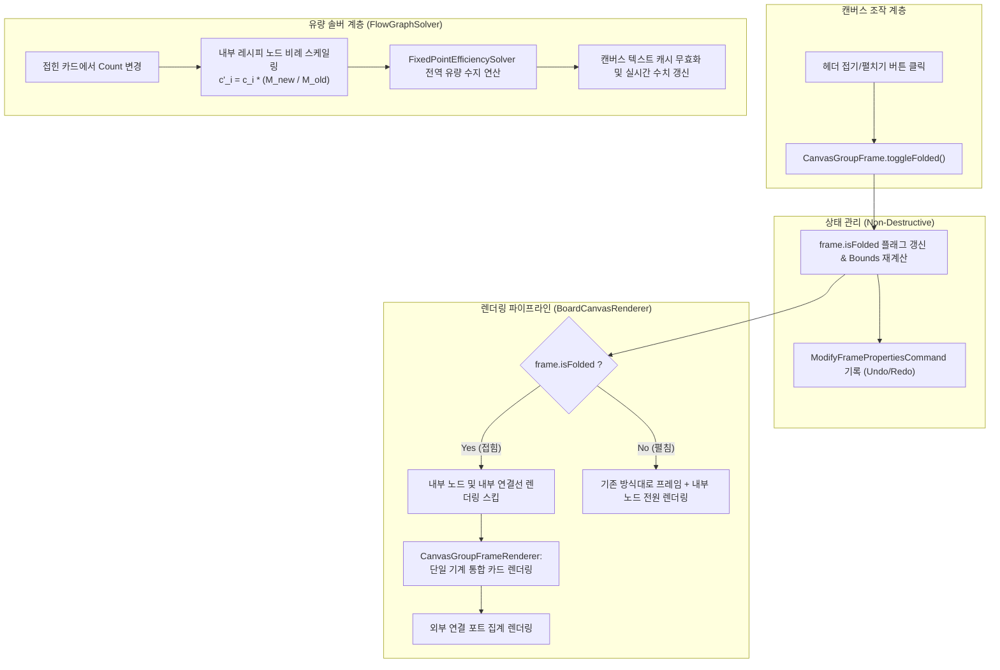
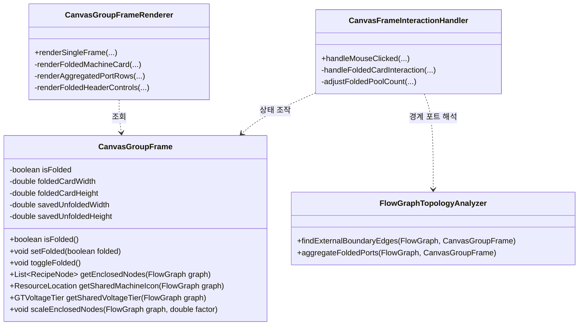

# ADR-042: 공유 기계 풀 비파괴 인플레이스 접기(In-Place Folding) 및 비율 보존형 가상 머신 카드 명세
(Shared Machine Pool In-Place Folding & Ratio-Preserved Virtual Machine Card Specification)

- **문서 번호**: ADR-042
- **대상 버전**: `v2.2.0-beta.3`
- **상태**: 🟢 `IMPLEMENTED`
- **기안일**: 2026-09-10
- **결정/완료일**: 2026-09-10
- **주관 계층**: Domain Model & Solver Layer (`api.model`, `api.solver`), Client GUI Layer (`client.gui.render`, `client.gui.widget`, `client.gui.interaction`)

---

## 1. 개요 및 배경 (Motivation)

### 1.1 현재 구조의 기술적 한계 및 문제점

`GregTechCalculatorBoard`는 동일한 기계를 시간 분할(Time-sharing)하여 여러 레시피를 수행하는 설비를 위해 **공유 기계 풀(Shared Machine Pool, 단축키 `Ctrl + Shift + S`)** 프레임을 제공합니다. 또한 프레임 헤더의 접기 버튼(`[⤡]`)을 통해 내부 노드들을 압축하는 기능을 지원하고 있습니다.

그러나 현재의 압축 구현(`collapseFrameIntoModule`)은 다음과 같은 구조적 결함을 지니고 있습니다:

1. **파괴적 토폴로지 치환 (Destructive Node Replacement)**:
   - 프레임 압축 시 내부 노드들을 `FlowGraph`에서 완전히 삭제하고 일반 `Compound Module` 단일 노드로 치환합니다.
   - 이로 인해 언팩(확장) 시 원래 노드 배치 및 내부/외부 연결선 복원에 따른 오버헤드와 배선 유실 위험이 발생합니다.
2. **공유 기계 정체성(Identity) 상실**:
   - 공유 기계 풀의 핵심은 "동일한 물리 기계 1종(예: 원심분리기, 화학 반응기)"을 공유한다는 점입니다.
   - 그러나 압축 결과물은 기계 종류, 전압 티어, 오버클럭, 가용 병렬 등 하드웨어 사양이 소실된 추상적인 보라색 복합 모듈 상자로 변질되어 인게임 시인성과 조작성을 저해합니다.
3. **유량 솔버 가동률 왜곡 (Efficiency Clamping by Upstream Bottleneck)**:
   - 압축된 모듈 노드에서 기계 대수(`Count`)를 1대에서 2대로 올리면, 모듈의 공칭 요구량(Nominal Demand)은 2배로 증가합니다.
   - 하지만 외부에 연결된 상류 공급 노드의 생산량은 1배로 유지되므로, 선형 유량 솔버(`FixedPointEfficiencySolver`)는 공급 부족을 감지하고 모듈의 가동 효율(`efficiency`)을 $0.5$(50%)로 강등시킵니다.
   - 결과적으로 $\text{유효 처리량} = \text{Count}(2.0) \times \text{Efficiency}(0.5) = 1.0$이 되어, **플레이어가 대수를 2배로 올렸음에도 화면상의 모든 입출력 수치가 1대일 때와 완전히 동일하게 고정되어 반응하지 않는 심각한 인게임 혼선**이 발생합니다.
4. **내부 레시피 상대 비율(Ratio) 갱신 단절**:
   - 압축 상태에서 Count를 변경하더라도 내부 서브그래프에 격리된 개별 레시피들의 대수는 실시간으로 갱신되지 않으며, 오직 모듈을 다시 풀 때(`expandModule`)만 일괄 곱연산이 적용됩니다.

### 1.2 개선 목표

본 ADR은 공유 기계 풀의 압축 방식을 그래프 파괴적인 모듈 치환 방식에서 **비파괴형 인플레이스 접기(In-Place Folding)** 방식으로 전면 개편합니다:
* **시뮬레이션 카운트 엄격 유지 (Strict Simulated Count Invariant)**: 접힌 카드의 `Count`는 임의의 독립 값이 아니라, 공유 기계 풀 내부 레시피들의 실제 시뮬레이션된 총 가동률 합계($D = \sum c_i$) 및 필요 물리 기계 대수와 상시 엄격하게 1:1 동기화됩니다.
* **비율 기반 입/출력값 병행 상승 (Proportional Flow Parallel Scaling)**: 기계의 Count가 올라가면(예: $1.0$대 ➔ $2.0$대), 내부 레시피들의 고유 입출력 비율에 따라 **모든 입력 요구량과 출력 생산량이 기계 대수 증가와 완벽히 병행하여 함께 상승**합니다.
* **가동률 클램핑 은폐 차단 및 투명한 결손 시각화**: 상류 공급이 부족하다는 이유로 솔버가 기계 자체의 입출력 수치를 과거 1대 수준으로 고정해버리지 않고, 증가한 요구량(예: `-1024/s`)을 그대로 드러내며 공급 부족(`+512 -1024/s ⚠`)을 명확히 시각화합니다.
* **비파괴 무결성 보장**: 노드를 그래프에서 삭제하지 않고 시각적으로만 접으므로, 언팩/토글 시 배선 유실이나 되돌리기 오류가 원천 차단됩니다.

---

## 2. 핵심 유저 스토리 (User Stories)

| 구분 | 플레이어 액션 (Action) | 시스템 기대 동작 (Expected Outcome) |
| :--- | :--- | :--- |
| **US-1** | 공유 기계 풀 헤더의 접기(`[⤡]`) 버튼 클릭 | 내부 노드들이 삭제되지 않고 프레임 내부로 숨겨지며, 프레임이 단일 기계(예: 원심분리기) 카드 크기로 즉시 접힘 |
| **US-2** | 접힌 공유 기계 카드의 헤더 및 Count 확인 | 실제 공유 중인 기계 아이콘, 기계 명칭, 대표 티어(MV), 오버클럭 모드와 함께, **내부 레시피들의 총 가동률 합계를 엄격히 반영한 시뮬레이션 카운트(예: 1.25대)**가 정확히 표시됨 |
| **US-3** | 접힌 카드 좌/우의 입출력 포트 확인 | 풀 내부 레시피들의 외부 연결선 및 잉여/결핍 포트들이 단일 카드의 좌/우 슬롯에 중복 없이 통합 집계되어 표시됨 |
| **US-4** | 접힌 카드의 `Count`를 1에서 2로 증가 (`+` 또는 숫자 입력) | 내부 레시피들의 가동률 비율(예: 0.25 : 0.5 : 0.5)이 유지된 채 각각 0.5 : 1.0 : 1.0으로 스케일업되며, **모든 입력 요구량과 출력 생산량이 카운트 증가와 정확히 병행하여 2배로 함께 상승함** |
| **US-5** | 상류 공급이 부족한 상태에서 Count를 올림 | 기계 자체의 입출력 수치가 가동률 저하로 인해 1대 수준으로 축소·고정되지 않고, 기계가 요구하는 2배의 요구량이 당당히 표시되며 공급 결손(`+512 -1024/s ⚠`)이 투명하게 경고됨 |
| **US-6** | 접힌 카드의 비율 맞춤(`[⚖]`) 버튼 클릭 | [ADR-031](ADR_031_SHARED_MACHINE_POOL_AUTO_RATIO.md)과 연동되어, 설정된 물리 기계 용량에 맞춰 상/하류에 연결된 외부 공정 기계들이 일괄 비례 역산됨 |
| **US-7** | 접힌 카드 헤더의 펼치기(`[⤢]`) 버튼 클릭 | 지연 시간 및 배선 유실 없이 즉시 원래의 넓은 프레임과 내부 개별 레시피 노드들이 온전한 좌표와 갱신된 대수 비율로 다시 나타남 |

---

## 3. 시스템 아키텍처 명세 (Architecture Specification)

### 3.1 비파괴 접기 라이프사이클 흐름도



### 3.2 컴포넌트별 책임 및 확장 구조



---

## 4. 세부 알고리즘 및 데이터 구조

### 4.1 NBT 직렬화 데이터 확장 (`CanvasGroupFrame`)

프레임의 접힘 상태와 접히기 전 원래 크기를 저장하여 세이브 파일 로드 및 월드 재진입 시에도 완벽히 유지되도록 직렬화 태그를 확장합니다:

```java
// CanvasGroupFrame.java NBT 확장
tag.putBoolean("isFolded", isFolded);
if (isFolded) {
    tag.putDouble("savedUnfoldedWidth", savedUnfoldedWidth);
    tag.putDouble("savedUnfoldedHeight", savedUnfoldedHeight);
}
```

### 4.2 시뮬레이션 카운트 엄격 동치 불변식 (Strict Simulated Count Invariant)

접힌 가상 머신 카드의 `Count`는 임의의 독립적인 가상 변수가 아니라, **공유 기계 풀 $P$에 속한 모든 operational 레시피 노드 집합 $V_P$의 실제 시뮬레이션 가동률 총합(Total Simulated Duty)**과 1:1로 엄격하게 일치해야 합니다:

$$M_{\text{sim}} = \sum_{v_i \in V_P} c_i \quad (c_i: \text{개별 레시피 노드의 가동 대수})$$

1. **상태 동기화 불변식 (Bi-directional Sync Invariant)**:
   - **접힌 상태에서 Count 조작 시**: 사용자가 접힌 카드에서 `Count`를 $M_{\text{old}} \to M_{\text{new}}$로 변경하면, 스케일 계수 $S = M_{\text{new}} / M_{\text{old}}$가 산출되어 내부 레시피 노드들의 대수가 즉시 $c'_i = \text{round}_4(c_i \times S)$로 동기화됩니다.
   - **펼친 상태에서 개별 레시피 조작 시**: 플레이어가 프레임을 펼쳐 특정 레시피의 대수를 수정하면, 접힌 카드의 표시 대수 또한 새로운 시뮬레이션 총합 $\sum c_i$로 실시간 자동 재계산됩니다.
2. **상대 비율(Ratio) 완전 보존**:
   - 내부 레시피 노드들의 가동률 분할 가중치 $w_i = c_i / M_{\text{sim}}$는 카운트 조작 전/후에 걸쳐 불변($w'_i = w_i$)으로 유지됩니다.

---

### 4.3 입/출력 비율을 통한 입출력값 병행 상승 보장 모델 (Coupled Proportional Flow Scaling)

각 레시피 노드 $v_i$의 주기당 입력 유량을 $\mathbf{u}_i$, 출력 유량을 $\mathbf{y}_i$, 초당 사이클 수를 $\text{cps}_i$라 할 때, 풀 전체의 성분 $X$에 대한 명목 유량(Nominal Rate)은 다음과 같이 정의됩니다:

$$R_{\text{in}}(X) = \sum_{v_i \in V_P} c_i \times \text{cps}_i \times u_{i}(X)$$
$$R_{\text{out}}(Y) = \sum_{v_i \in V_P} c_i \times \text{cps}_i \times y_{i}(Y)$$

기계의 카운트가 $S$배 스케일링($M_{\text{new}} = S \times M_{\text{old}}$)될 때:

$$R'_{\text{in}}(X) = \sum_{v_i \in V_P} (c_i \times S) \times \text{cps}_i \times u_{i}(X) = S \times R_{\text{in}}(X)$$
$$R'_{\text{out}}(Y) = \sum_{v_i \in V_P} (c_i \times S) \times \text{cps}_i \times y_{i}(Y) = S \times R_{\text{out}}(Y)$$

* **수학적 병행성 보장**: 기계의 카운트가 $1.0$대 ➔ $2.0$대로 $2$배 증가하면, **모든 입력 요구량과 출력 생산량 또한 정확히 $2$배로 완벽히 병행 상승**합니다.
* **가동률 클램핑 왜곡 차단 및 독립적 결손 인디케이터**:
  - 기존의 심각한 결함은 상류 공급 부족 시 솔버가 실효 유량을 공급량 한도($1.0$배)로 클램핑하여 화면에 $1$대 분량의 수치(`317/s`)만 표시함으로써 카운트 증가 효과를 은폐했던 것입니다.
  - 개선된 모델에서는 포트에 표시되는 기준 요구량을 **기계 카운트 증가에 따른 공칭 요구량($R'_{\text{in}} = 2.0 \times R_{\text{in}}$)**으로 온전히 렌더링(`-634/s`, `-1024/s`)합니다.
  - 상류의 공급 부족분은 유량을 깎아 숨기지 않고 공급-요구 결손 인디케이터(`+512 -1024/s ⚠`)로 투명하게 분리 표기하여, 플레이어가 "기계 대수가 2배로 올랐고 입출력 요구도 2배가 되었으나 상류 공급이 부족하다"는 사실을 명확히 인식하게 합니다.

---

### 4.4 외부 경계 포트 집계 및 가상 슬롯 라우팅

접힌 상태에서는 내부 노드들이 숨겨지므로, 외부 노드와 연결된 와이어의 앵커 좌표가 접힌 가상 카드의 좌/우 포트로 재매핑되어야 합니다:

1. **외부 유입 간선 (Incoming Boundary Edges)**:
   - 간선의 출발 노드가 풀 외부에 있고, 도착 노드가 풀 내부에 있는 경우 ($u \notin V_P, v \in V_P$).
   - 접힌 카드의 좌측 입력 슬롯 $k$에 해당 성분 아이콘과 카운트에 병행 스케일링된 총 요구량($R'_{\text{in}}$)을 렌더링하고, 외부 와이어의 종점을 해당 슬롯 좌표로 굴절 렌더링.
2. **외부 유출 간선 (Outgoing Boundary Edges)**:
   - 간선의 출발 노드가 풀 내부에 있고, 도착 노드가 풀 외부에 있는 경우 ($u \in V_P, v \notin V_P$).
   - 접힌 카드의 우측 출력 슬롯 $m$에 해당 성분 아이콘과 카운트에 병행 스케일링된 총 생산량($R'_{\text{out}}$)을 렌더링하고, 외부 와이어의 시작점을 해당 슬롯 좌표로 굴절 렌더링.
3. **내부 순환 간선 (Internal Edges)**:
   - 출발과 도착 노드가 모두 풀 내부인 경우 ($u, v \in V_P$).
   - 접힌 상태에서는 화면에서 렌더링을 완전 생략하여 캔버스 시각적 복잡도를 $O(1)$로 축소.

---

## 5. UI / UX 디자인 상세 명세

### 5.1 접힌 가상 머신 카드 와이어프레임

```text
┌────────────────────────────────────────────────────────────────────────┐
│ [Icon] Centrifuge (공유 기계 풀)                    [⤢] [➔] [⌖] [⚖] [x] │  <- 헤더 바 (20px)
├────────────────────────────────────────────────────────────────────────┤
│ Count: [ - ] [ 2.50 ] [ + ] [/2] [x2]                     ■ 3 레시피     │  <- 대수 조작부 (18px)
│ [MV] [일반 OC]                                      75.0 EU/t (MV)     │  <- 하드웨어/에너지 (18px)
├────────────────────────────────────────────────────────────────────────┤
│ ■ +1.02k -634/s ↓                            +1.27k/s (Chromite) ■     │  <- 집계 포트 행 (18px)
│ ■ +512  -634/s ⚠                               +634/s (Magnesium) ■     │
│ ■ +512  -1024/s ⚠                              +211/s (Iron)     ■     │
│                                                +585 B/s (Fluid)  ■     │
└────────────────────────────────────────────────────────────────────────┘
```

* **헤더 바**:
  - 대표 기계 아이콘(예: `Centrifuge`) 및 타이틀 (`Centrifuge (공유 기계 풀)`).
  - 우측 액션 버튼: `[⤢ 펼치기]`, `[➔ 플립]`, `[⌖ 타겟 앵커]`, `[⚖ 비율 맞춤]`, `[x 닫기/삭제]`.
* **1행 컨트롤**:
  - `Count`: 물리 기계 목표 용량 (예: 2.50대).
  - 우측 배지: `■ 3 레시피` (포함된 레시피 수 안내).
* **2행 컨트롤**:
  - 공유 전압 티어 배지(`[MV]`), 오버클럭 모드(`[일반 OC]`), 1대당/총 소비 전력 표시.
* **포트 영역**:
  - 상류 공급 부족 시 몰래 가동률을 낮추지 않고, 요구량 증가에 따른 결손(`-1024/s ⚠`)을 빨간색/주황색으로 명확히 시각화.

---

## 6. 결과 및 파급 효과 (Consequences)

### 6.1 긍정적 효과
* **직관적인 UX 제공**: 복잡하게 펼쳐진 공유 설비를 단 1클릭으로 일반 센트리퓨지 기계 카드처럼 축소하여 캔버스 공간을 획기적으로 절약할 수 있습니다.
* **수치 왜곡 및 반응 없음 버그 완전 해소**: 카운트를 올려도 상류 병목으로 가동률이 깎여 수치가 멈추던 현상이 사라지고, 정확한 요구량과 결손 여부가 투명하게 드러납니다.
* **100% 무결성 비파괴 구조**: 노드를 지우고 새로 만드는 과정이 없으므로 연결선 왜곡, 되돌리기 오류, 서브그래프 패킹 버그의 위험이 전무합니다.

### 6.2 하위 호환성
* 기존 버전에서 생성된 세이브 데이터의 `CanvasGroupFrame` NBT에 `isFolded` 태그가 없으면 기본값 `false`(펼침 상태)로 역직렬화되므로 100% 하위 호환성을 유지합니다.
