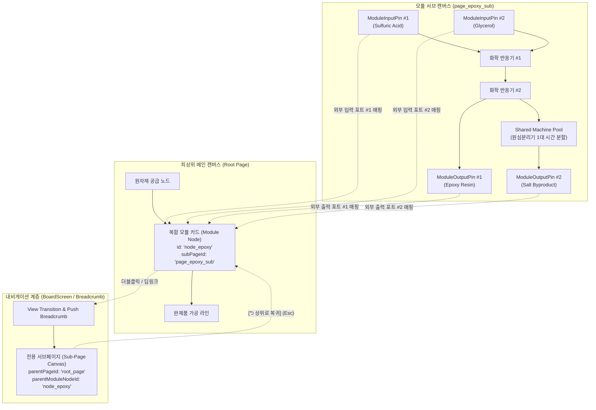
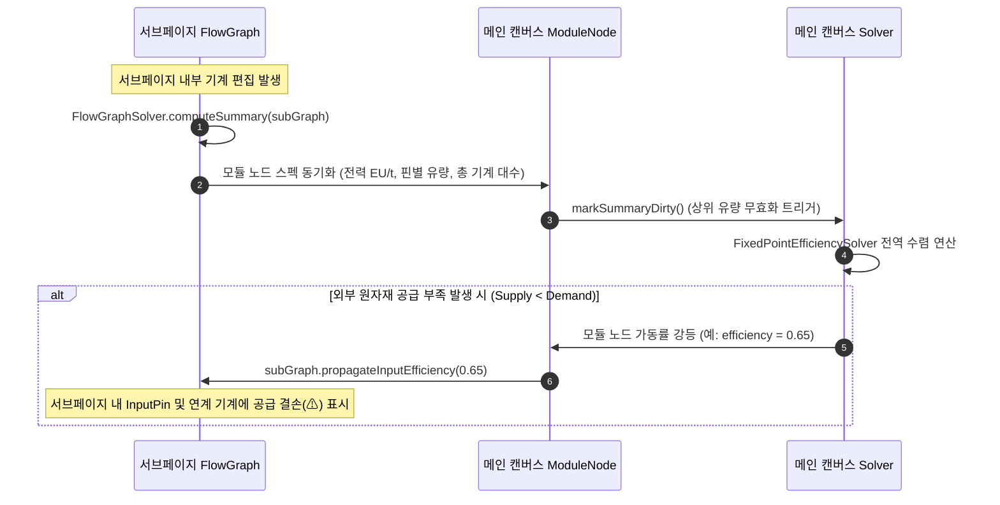

# ADR-043: 전용 서브페이지 기반 복합 공정 모듈 및 경계 I/O 핀 규격화 명세
(Dedicated Sub-Page Composite Module & Boundary I/O Pin Specification)

- **문서 번호**: ADR-043
- **대상 버전**: `v2.2.0-beta.3`
- **상태**: 🟢 `IMPLEMENTED`
- **기안일**: 2026-09-10
- **결정/완료일**: 2026-09-10
- **주관 계층**: Storage & Domain Layer (`api.storage`, `api.model`), Solver Layer (`api.solver`), Client GUI Layer (`client.gui.widget`, `client.gui.render`, `client.gui.interaction`)

---

## 1. 개요 및 배경 (Motivation)

### 1.1 현재 구조의 기술적 한계 및 문제점

`GregTechCalculatorBoard`는 대규모 복합 공정의 시각적 복잡도를 완화하기 위해 여러 개의 노드를 단일 카드로 묶는 **복합 모듈(Compound Module, 단축키 `Ctrl + Shift + G`)** 기능을 제공합니다.

그러나 기존의 구현(`FlowGraphModuleHandler.groupIntoModule`)은 다음과 같은 구조적 한계와 협업 상의 장애를 안고 있었습니다:

1. **블랙박스화로 인한 내부 가시성 부재**:
   - 모듈화가 완료되면 내부 노드들은 메인 그래프(`FlowGraph`)에서 제거되어 `RecipeNode` 내부의 단일 `subGraph` 필드로 캡슐화됩니다.
   - 메인 캔버스에서는 보라색 헤더를 가진 단일 모듈 카드만 표시되며, 모듈 내부에 어떤 기계가 몇 대 배치되어 있는지, 오버클럭 및 전압 티어는 어떻게 설정되어 있는지 즉시 확인할 방법이 없습니다.
2. **파괴적 검사 및 편집 절차 (Forced Unpack Dilemma)**:
   - 모듈 내부의 특정 기계 수치나 레시피를 수정하려면 반드시 모듈을 다시 풀어서(`expandModule`) 원래 캔버스에 쏟아내야 합니다.
   - 이 과정에서 캔버스 배치가 어질러지고, 외부 연결선이 재결선되는 과정에서 좌표 오차나 결선 유실이 발생하며, 작업 완료 후 다시 영역을 선택해 모듈로 재압축해야 하는 극심한 조작 피로가 발생합니다.
3. **멀티플레이어 협업 단절**:
   - 멀티플레이 환경에서 한 플레이어가 복잡한 공정(예: 질산, 에폭시, 백금군 정제 라인)을 모듈로 묶어둘 경우, 다른 팀원은 모듈을 해체하지 않고서는 공정의 병목을 진단하거나 설정을 튜닝하기 어렵습니다.
   - 이는 모듈을 해체했을 때 발생할 수 있는 레이아웃 붕괴와 결선 오류에 대한 두려움으로 이어져 모듈 기능 자체의 사용을 기피하게 만듭니다.
4. **동적 포트 추출의 취약성 (Dangling External Wires)**:
   - 서브그래프의 잉여 출력과 결핍 입력을 계산하여 모듈의 외부 포트를 동적으로 자동 생성하는 방식은 내부 레시피의 부산물 비율을 조금만 변경해도 외부 모듈 카드의 포트 목록과 순서가 뒤바뀌어 상/하류 캔버스의 연결선이 꼬이거나 끊어지는 문제가 상존합니다.

### 1.2 개선 목표 및 설계 원칙

본 ADR은 복합 모듈의 내부 구현을 그래프 내부에 숨겨두지 않고, **1:1 전용 독립 서브페이지(Dedicated Sub-Page)**로 승격시키고, **경계 I/O 핀 노드(Boundary Pin Node)**를 통해 외부 인터페이스를 엄격히 규격화합니다.

* **비파괴 검사 및 인플레이스 내비게이션**: 언팩할 필요 없이 모듈 카드를 더블클릭하여 전용 서브페이지 탭으로 즉시 전환해 내부 구성을 자유롭게 점검하고 수정합니다.
* **명시적 인터페이스 계약 (Explicit I/O Contract)**: 서브페이지 내의 입력/출력 핀 노드를 통해 외부에 노출될 포트를 결정론적으로 정의하여, 내부 배선 변경이 외부 연결선에 영향을 주지 않도록 보호합니다.
* **Shared Machine Pool ([ADR-042](ADR_042_SHARED_MACHINE_POOL_IN_PLACE_FOLDING_AND_RATIO_PRESERVATION.md))과의 상호보완적 직교 분리**:
  - ADR-042는 "동일 기계 1종의 시간 분할 인플레이스 접기"를 담당합니다.
  - ADR-043은 "서로 다른 기계들로 이루어진 거대 파이프라인의 서브페이지 계층화"를 담당하며, 서브페이지 내부에서도 Shared Machine Pool 프레임을 완벽히 사용할 수 있도록 지원합니다.

---

## 2. 핵심 유저 스토리 (User Stories)

| 구분 | 플레이어 액션 (Action) | 시스템 기대 동작 (Expected Outcome) |
| :--- | :--- | :--- |
| **US-1** | 복합 공정 노드들을 드래그 선택 후 `Ctrl + Shift + G` 입력 | 선택된 노드들이 새 전용 서브페이지로 이전되고, 메인 캔버스에는 깔끔하게 규격화된 복합 모듈 카드가 생성됨 |
| **US-2** | 메인 캔버스의 복합 모듈 카드 더블클릭 (또는 우클릭 ➔ `[모듈 캔버스 열기]`) | 캔버스가 부드럽게 전환되며 해당 모듈의 전용 서브페이지가 열리고, 상단 브레드크럼(`[Main] > [Epoxy Module]`)이 표시됨 |
| **US-3** | 서브페이지 내부에서 기계 구성 및 배선 확인/수정 | 일반 캔버스와 동일하게 기계 추가, 티어 변경, 오버클럭 조작, 내부 배선 수정 및 Shared Machine Pool 프레임 배치 가능 |
| **US-4** | 서브페이지 내의 `ModuleInputPin` 또는 `ModuleOutputPin` 노드 조작 | 해당 핀의 이름과 허용 성분이 메인 캔버스 모듈 카드의 좌/우 포트에 1:1 결정론적으로 반영됨 |
| **US-5** | 상단 내비게이션의 `[⮌ 상위 캔버스로 복귀]` 버튼 (또는 `Esc` 키) 클릭 | 메인 캔버스로 즉시 복귀하며, 서브페이지에서 수정한 변경 사항(전력 소모량, 포트 유량, 필요 총 기계 수)이 모듈 카드에 실시간 반영됨 |
| **US-6** | 좌측 페이지 탐색기(`PageBrowserDrawer`) 확인 | 모듈 전용 서브페이지들이 메인 작업 페이지 목록을 어지럽히지 않도록 `[공정 모듈]` 전용 접이식 섹션으로 안전하게 격리됨 |
| **US-7** | 모듈 카드의 `Count` 배율 증가 (+2.0x) | 서브페이지 내부의 모든 기계 대수가 2배로 비례 스케일링되며, 총 요구량 및 생산량이 실시간 연동됨 |

---

## 3. 시스템 아키텍처 명세 (Architecture Specification)

### 3.1 계층적 캔버스 및 내비게이션 구조



### 3.2 핵심 데이터 모델 확장

```mermaid
classDiagram
    class BoardPage {
        -String id
        -String name
        -PageType pageType
        -String parentPageId
        -String parentModuleNodeId
        -FlowGraph graph
        +boolean isModuleSubPage()
        +String getParentPageId()
        +String getParentModuleNodeId()
    }

    class PageType {
        <<enumeration>>
        STANDARD
        MODULE
    }

    class RecipeNode {
        -boolean isModule
        -String subPageId
        -int containedMachineCount
        -List~String~ inputPinNodeIds
        -List~String~ outputPinNodeIds
        +boolean isModule()
        +String getSubPageId()
        +BoardPage getDedicatedSubPage()
    }

    class BoundaryPinNode {
        <<abstract>>
        -PinDirection direction
        -String pinLabel
        -IngredientStack boundIngredient
        -int targetPortIndex
        +PinDirection getDirection()
        +IngredientStack getBoundIngredient()
        +void setBoundIngredient(IngredientStack)
    }

    class ModuleInputPin {
        +IngredientStack getSuppliedIngredient()
    }

    class ModuleOutputPin {
        +IngredientStack getCollectedIngredient()
    }

    BoardPage --> PageType : 분류
    BoardPage o-- FlowGraph : 소유
    RecipeNode --> BoardPage : 1:1 바인딩 (subPageId)
    FlowGraph o-- BoundaryPinNode : 포함
    BoundaryPinNode <|-- ModuleInputPin : 구현
    BoundaryPinNode <|-- ModuleOutputPin : 구현
```

---

## 4. 세부 알고리즘 및 데이터 무결성 규격

### 4.1 NBT 직렬화 및 영속화 규격

`BoardPage`와 `RecipeNode`의 NBT 구조를 확장하여 월드 저장 및 클라이언트 로드 시 서브페이지 링크가 영구히 유지되도록 합니다:

#### `BoardPage` NBT 확장
```java
// BoardPage.serializeNBT()
tag.putString("pageType", pageType.name()); // STANDARD or MODULE
if (pageType == PageType.MODULE) {
    tag.putString("parentPageId", parentPageId != null ? parentPageId : "");
    tag.putString("parentModuleNodeId", parentModuleNodeId != null ? parentModuleNodeId : "");
}
```

#### `RecipeNode` NBT 확장
```java
// RecipeNode.serializeNBT()
tag.putBoolean("isModule", isModule);
if (isModule && subPageId != null) {
    tag.putString("subPageId", subPageId);
    ListTag inPins = new ListTag();
    for (String id : inputPinNodeIds) inPins.add(StringTag.valueOf(id));
    tag.put("inputPinNodeIds", inPins);

    ListTag outPins = new ListTag();
    for (String id : outputPinNodeIds) outPins.add(StringTag.valueOf(id));
    tag.put("outputPinNodeIds", outPins);
}
```

### 4.2 경계 I/O 핀 기반 결정론적 포트 매핑 알고리즘

서브페이지 내부의 기계들이 임의로 변경되더라도, 외부 모듈 카드의 포트 목록은 **서브페이지 내부의 핀 노드 목록에 의해 결정론적으로 바인딩**됩니다:

1. **포트 순서 결정론**:
   - 서브페이지 내의 모든 `ModuleInputPin`을 캔버스 상하 Y좌표 순(동일할 경우 X좌표 순)으로 정렬하여 인덱스 $0, 1, \dots, N-1$을 부여합니다.
   - 서브페이지 내의 모든 `ModuleOutputPin` 역시 Y좌표 순으로 정렬하여 인덱스 $0, 1, \dots, M-1$을 부여합니다.
2. **모듈 노드 포트 동기화**:
   - 모듈 노드의 $k$번째 입력 슬롯은 $k$번째 `ModuleInputPin`의 성분 규격 및 서브페이지 내부 총 요구량($\sum \text{Demand}$)과 1:1 일치합니다.
   - 모듈 노드의 $m$번째 출력 슬롯은 $m$번째 `ModuleOutputPin`의 성분 규격 및 서브페이지 내부 총 생산량($\sum \text{Supply}$)과 1:1 일치합니다.
3. **댕글링 와이어 방어 (Dangling Wire Prevention)**:
   - 서브페이지 내부에서 배선을 교체하거나 레시피를 바꾸더라도, 핀 노드 자체가 삭제되지 않는 한 외부 메인 캔버스의 연결선은 절대 끊어지거나 다른 성분으로 바뀌지 않습니다.

### 4.3 반응형 유량 수지 전파 (Reactive Flow Invalidation)

서브페이지와 메인 캔버스 간의 유량 계산은 단방향 의존성 순환을 방지하기 위해 2단계로 분리 실행됩니다:



* **순환 방지 불변식 (Acyclic Invariant)**:
  - 서브페이지 내부에는 자기 자신 또는 부모 페이지를 가리키는 모듈 노드를 생성/배치할 수 없습니다.
  - 중첩 깊이 상한을 최대 3단계($\text{Depth} \le 3$)로 강제하여 무한 재귀 및 스택 오버플로우를 차단합니다.

---

## 5. UI / UX 디자인 상세 명세

### 5.1 상단 브레드크럼 및 내비게이션 바

서브페이지에 진입했을 때 플레이어가 현재 캔버스의 위치를 명확히 인지하고 즉시 상위로 복귀할 수 있도록 상단 툴바 좌측에 브레드크럼 컨트롤을 렌더링합니다:

```text
┌────────────────────────────────────────────────────────────────────────────────────────┐
│ [⮌ 상위로]  메인 석유화학 단지 > [📦 에폭시 수지 복합 라인]      [Zoom: 100%] [Grid: 16] [⚙] │
└────────────────────────────────────────────────────────────────────────────────────────┘
```

* **`[⮌ 상위로]` 버튼**: 클릭 시 (또는 `Esc` 키 입력 시) 즉시 부모 캔버스로 복귀하며, 부모 캔버스 내 해당 모듈 노드의 중심 좌표로 뷰포트가 부드럽게 포커싱됩니다.
* **브레드크럼 경로**: 부모 페이지부터 현재 서브페이지까지의 계층 트리를 텍스트로 표기하며, 상위 경로 클릭 시 해당 조상 페이지로 즉시 점프합니다.

### 5.2 캔버스 모듈 카드 와이어프레임

메인 캔버스에 배치되는 복합 모듈 카드는 일반 기계 카드보다 시각적으로 뚜렷한 **보라색/인디고 투톤 테마**와 전용 배지를 적용합니다:

```text
┌────────────────────────────────────────────────────────────────────────┐
│ [📦] 에폭시 수지 복합 라인                         [⤢ 열기] [➔] [⚖] [x] │  <- 헤더 바 (20px)
├────────────────────────────────────────────────────────────────────────┤
│ Count: [ - ] [ 1.00 ] [ + ] [/2] [x2]                ■ 8대 기계 (3단계) │  <- 공정 규모 요약
│ [EV] 복합 공정 소비                                1,920 EU/t (EV)     │  <- 전력 총량
├────────────────────────────────────────────────────────────────────────┤
│ ■ 250 mB/s (Sulfuric Acid)             +1,000 mB/s (Epoxy Resin) ■     │  <- 경계 핀 포트 행
│ ■ 500 mB/s (Glycerol)                     +125 mB/s (Water Waste) ■     │
│ ■ 1.00/s   (Chlorine)                     +2.00/s   (Salt Powder) ■     │
└────────────────────────────────────────────────────────────────────────┘
```

* **헤더 바**:
  - `[📦]` 모듈 전용 아이콘 및 사용자 정의 모듈 명칭.
  - 우측 액션: `[⤢ 열기]` (서브페이지 진입), `[➔ 플립]`, `[⚖ 비율 맞춤]`, `[x 삭제]`.
* **카드 본문 더블클릭**: 캔버스에서 해당 카드를 더블클릭하면 즉시 서브페이지로 진입.

### 5.3 서브페이지 내 경계 핀 노드 (Boundary Pin Widget) 와이어프레임

서브페이지 내부에서는 일반 기계와 명확히 구분되는 컴팩트한 슬림 핀 노드로 렌더링됩니다:

```text
[Module Input Pin]                     [Module Output Pin]
┌────────────────────────────┐         ┌────────────────────────────┐
│ 📥 IN #1: Sulfuric Acid    │         │ 📤 OUT #1: Epoxy Resin     │
├────────────────────────────┤         ├────────────────────────────┤
│ 250 mB/s (외부 공급)     ■ │         │ ■ 1,000 mB/s (외부 배출)   │
└────────────────────────────┘         └────────────────────────────┘
```

* 좌측 끝에는 주로 `ModuleInputPin` 노드들이 배치되고, 우측 끝에는 `ModuleOutputPin` 노드들이 배치되어 자연스러운 좌➔우(Left-to-Right) 데이터 파이프라인 흐름을 형성합니다.
* 핀 노드 우클릭 시 명칭 변경, 허용 성분 필터 설정, 핀 순서 위/아래 이동 메뉴가 제공됩니다.

### 5.4 페이지 탐색기 드로어 (`PageBrowserDrawer`) 격리

모듈 전용 서브페이지들이 메인 캔버스 탭 목록을 침범하지 않도록 탐색기 UI를 분리합니다:

```text
[Page Explorer]
▼ 📁 메인 공정 (Main Pages)
    ├─ 📄 원유 정제 메인 캔버스
    ├─ 📄 고전압 인프라 그리드
    └─ 📄 최종 로켓 부품 조립 라인
▶ 📦 공정 모듈 서브페이지 (Module Sub-Pages) [3]
    ├─ 📦 에폭시 수지 복합 라인
    ├─ 📦 질산 연속 반응 모듈
    └─ 📦 백금족 침전 분리 모듈
```

* `[공정 모듈 서브페이지]` 섹션은 기본적으로 **접힘(Collapsed)** 상태로 유지되며, 메인 페이지 탭 리스트와 격리되어 시각적 오염을 방지합니다.

---

## 6. 기대 효과 및 결론

1. **완벽한 비파괴 캡슐화**:
   - 모듈을 해체하지 않고도 내부 기계 구성, 배선, 병목을 온전히 검사하고 실시간으로 수정할 수 있어 대규모 공정 설계의 조작성이 개선됩니다.
2. **협업 생산성 향상**:
   - 멀티플레이어 환경에서 모듈 해체에 따른 캔버스 파괴 두려움 없이 안전하게 하위 모듈별 분업이 가능해집니다.
3. **명시적 인터페이스를 통한 안정성**:
   - 경계 핀 노드를 통한 엄격한 포트 규격화를 통해 서브페이지 내부 튜닝 시 외부 연결선이 꼬이거나 끊어지는 결선 사고를 방지합니다.
4. **아키텍처 확장성**:
   - 복사/붙여넣기를 통한 모듈 재사용과 함께, 추후 필요 시 템플릿 라이브러리 시스템으로의 자연스러운 진화가 가능해집니다.
