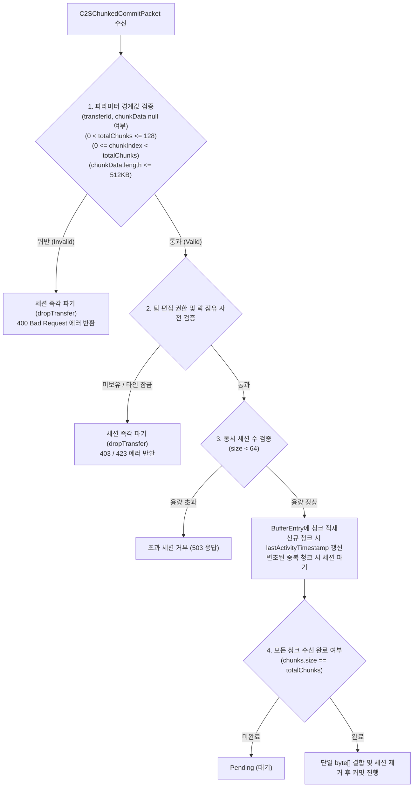

# ADR-052: 청크 페이로드 수신 상한 가드 및 서버 메모리 보호 명세
(Chunked Payload Upper Bound Guard & Server Memory DoS Defense Specification)

- **문서 번호**: ADR-052
- **대상 버전**: `v2.3.0`
- **상태**: `IMPLEMENTED`
- **결정/완료일**: 2026-09-14
- **주관 계층**:
  - Server Storage & Network Layer (`server.storage.ServerChunkedPayloadAssembler`, `server.storage.ChunkedStreamHelper`)
  - Network Packet Handler Layer (`network.packet.c2s.C2SChunkedCommitPacket`, `network.packet.s2c.S2CWorkspaceErrorPacket`)

---

## 1. 개요 및 배경 (Motivation)

### 1.1 현황 분석 및 당면 과제 (Current Context & Vulnerability)

`GregTechCalculatorBoard`는 대규모 공정 플로우 그래프(수백~수천 개 노드) 저장 시 Netty 프레임 상한선(2MB) 초과를 방지하기 위해 512KB 단위의 C2S/S2C 청크 분할 전송 시스템([ADR-003](file:///d:/dev-ssd/modding/minecraft/GregTechCalculatorBoard/docs/adr/ADR_003_MULTIPLAYER_NETWORK_INTEGRITY_AND_SYSTEM_STABILIZATION.md))을 운용하고 있습니다.

서버 측 청크 조립기인 [`ServerChunkedPayloadAssembler`](file:///d:/dev-ssd/modding/minecraft/GregTechCalculatorBoard/src/main/java/com/gtceu/calcboard/server/storage/ServerChunkedPayloadAssembler.java)는 수신된 청크들을 `CHUNK_BUFFERS` 맵에 모아 모든 청크가 도착했을 때 최종 결합합니다.

그러나 기존 구현에는 **청크 수량, 개별 청크 크기, 동시 활성 세션 수에 대한 상한선 검증(Upper Bound Guard)이 부재**하여 다음과 같은 자원 고갈 공격 표면(DoS Attack Surface)이 존재했습니다:

1. **거대 청크 수량 지정에 따른 힙 메모리 고갈 (Memory Exhaustion DoS)**: 비정상적으로 거대한 `totalChunks` 지정 시 버퍼 등록 후 힙 점유.
2. **청크 인덱스 경계값 미검증**: 음수 또는 `totalChunks` 이상의 인덱스 유입 방어 부재.
3. **단일 청크 바이트 상한 미검증**: 규격(512KB)을 크게 초과하는 바이트 배열 유입 방어 부재.
4. **동시 활성 세션 고갈 공격 (Resource Starvation)**: 무작위 `transferId` 세션 대량 생성 시 버퍼 객체 무제한 누적 위험.

### 1.2 설계 목표 (Design Goals)

- `ServerChunkedPayloadAssembler`에 4대 방어 가드(최대 청크 수, 인덱스 유효 범위, 단일 청크 최대 크기, 최대 동시 세션 수)를 신설합니다.
- 비정상 패킷 감지 시 즉시 세션을 파기(`dropTransfer`)하고, 송신자에게 거부 에러 패킷(`400 Bad Request`)을 응답합니다.
- 정상적인 대규모 공정 그래프(최대 64MB)의 저장은 100% 보장하면서 악의적인 자원 고갈 공격 표면을 차단합니다.

---

## 2. 세부 설계 및 결정 사항 (Architecture Decision)

### 2.1 대안 비교 및 채택

| 비교 항목 | 대안 A: 패킷 핸들러 수준에서만 검사 | 대안 B (채택): 조립기 코어 방어 가드 + 패킷 통보 | 대안 C: 디스크 임시 파일 스트리밍 |
| :--- | :--- | :--- | :--- |
| **구조** | `C2SChunkedCommitPacket`에서만 if문 검사 | `ServerChunkedPayloadAssembler`에 캡슐화된 가드 배치 및 핸들러 연동 | 청크를 메모리 대신 디스크 임시 파일에 기록 |
| **방어 범위** | 다른 경로로 조립기 호출 시 방어 불가 | 조립기 진입점 자체를 방어하여 다중 패킷 경로 모두 보호 | 디스크 I/O 병목 및 임시 파일 정리 누수 위험 |
| **성능 오버헤드** | 미미함 | 단순 정수 및 바이트 크기 비교로 오버헤드 미미함 | 디스크 쓰기 및 원자적 삭제로 인한 심각한 I/O 지연 |
| **평가** | 부분적 방어에 그침 | **최적안 (방어 심층성 확보)** | 실시간 보드 동기화에 부적합 |

### 2.2 조립기 유효성 검증 파이프라인

### 2.3 방어 상수 규격

| 상수 식별자 | 값 | 설계 근거 |
| :--- | :--- | :--- |
| **`MAX_ALLOWED_CHUNKS`** (`MAX_CHUNKS`) | `128` | 청크당 512KB 기준 최대 **64MB** 페이로드 지원. NBT 그래프 기준 대형 워크스페이스도 충분히 수용하는 상한. |
| **`MAX_CHUNK_PAYLOAD_SIZE`** (`MAX_CHUNK_BYTE_SIZE`) | `524,288` (`512KB`) | 클라이언트 분할 규격(512KB)과 1:1 일치하는 엄격한 단일 청크 상한선 ($128 \times 512\text{KB} = 64\text{MB}$). |
| **`MAX_ACTIVE_TRANSFERS`** | `64` | 서버 전체에서 동시에 조립 대기 가능한 활성 스트림 세션 상한선. 동시 메모리 점유 제한. |
| **`CHUNK_BUFFER_TTL_MS`** | `60,000L` | 네트워크 지연 환경을 고려한 60초 무활동 유효 시간. |
| **`MAX_SESSION_LIFETIME_MS`** | `120,000L` | 세션 생성 시점 기준 최대 2분 절대 상한. 주기적 핑을 통한 슬롯 영구 점유 공격 원천 차단. |

### 2.4 구현 내역

1. **`ServerChunkedPayloadAssembler`**:
   - `validateChunkParameters(UUID transferId, int chunkIndex, int totalChunks, byte[] chunkData)` 가드 메서드 제공.
   - `appendChunk` 내부 파라미터 경계 검증 및 위반 시 세션 즉시 파기.
   - 활성 버퍼 수가 64개에 도달했을 때 신규 세션 원자적 거부 (`computeIfAbsent`).
   - 변조된 중복 청크 유입 시 세션 파기, 동일 중복 청크는 TTL 무갱신 안전 수용.
   - `hasActiveTransfer(UUID)`를 통한 활성 세션 조회 제공.
   - 스트림 진행 도중 `totalChunks` 불일치 감지 시 즉각 세션 파기.
2. **`C2SChunkedCommitPacket`**:
   - `handle()` 진입 시 `validateChunkParameters()` 사전 검증 수행.
   - 청크 버퍼링 전 팀 편집 권한(`403`) 및 락 점유(`423`) 사전 검증으로 무권한 자원 고갈 사전 차단.
   - 버퍼 용량 초과 또는 스트림 오류 시 `503` 에러 즉시 응답.

---

## 3. 결과 및 파급 효과 (Consequences)

### 3.1 긍정적 효과 및 보안 강화

1. **JVM 힙 메모리 고갈 DoS 원천 차단**:
   - 비정상 대형 청크 수량(`> 128`), 단일 거대 페이로드(`> 512KB`), 동시 세션 폭주(`> 64`)가 모두 시스템 레벨에서 차단됩니다.
2. **정상 사용자 무영향**:
   - 512KB 단위의 일반 그래프 저장 스트림(1~8 청크)은 완전 무결하게 조립 완료됩니다.
3. **네트워크 프로토콜 100% 호환**:
   - 패킷 인코딩/디코딩 스키마를 변경하지 않고 서버 검증 가드만 강화하여 무결성을 유지합니다.

### 3.2 검증 결과 (Verification)

- `ServerChunkedPayloadAssemblerTest`:
  - `testExceedMaxChunksRejected`: 129개 청크 스트림 즉시 거부 및 버퍼 등록 차단 확인.
  - `testInvalidChunkIndexRejected`: 음수 인덱스(-1) 및 초과 인덱스(5/5) 거부 확인.
  - `testOversizedChunkRejected`: 512KB 초과 단일 청크 즉시 거부 및 512KB 경계값 통과 확인.
  - `testValidStreamingAssembly`: 5개 청크(2.5MB) 무작위 순서 도착 시 완전 조립 및 활성 상태 추적 확인.
  - `testMaxConcurrentSessionsGuarded`: 64개 세션 수용 후 65번째 세션 거부 및 완료 후 슬롯 회수 확인.
  - `testTamperedDuplicateChunkDropsSession`: 변조된 동일 인덱스 청크 수신 시 즉시 세션 파기 확인.
  - `testMismatchedTotalChunksDropsSession`: 중간 청크에서 totalChunks 변경 시 세션 파기 확인.
  - `testNullParametersHandledSafely`: null 매개변수 방어 확인.
- `C2SChunkedCommitTest`: 네트워크 패킷 직렬화 및 스트리밍 조립 전체 통과.
