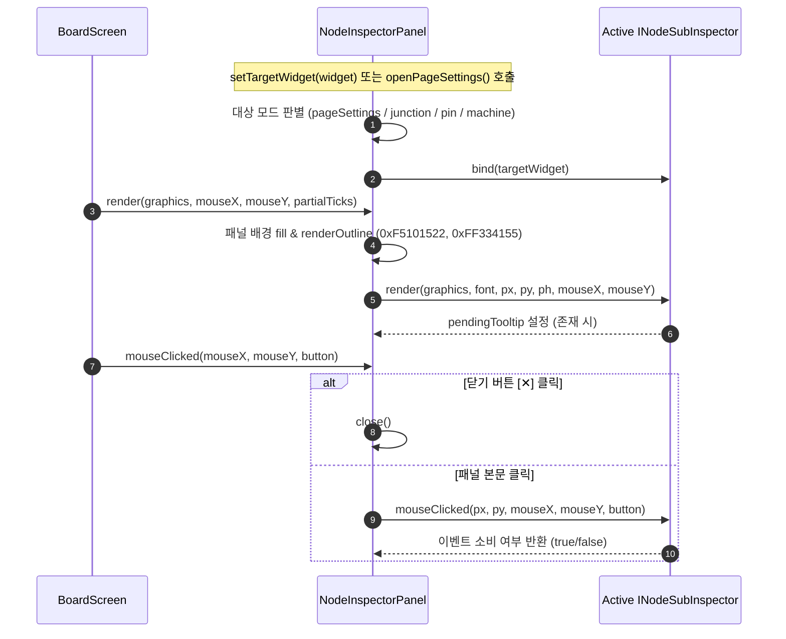

# ADR-053: NodeInspectorPanel 단일 책임 원칙(SRP) 기반 4대 서브 컴포넌트 분해 명세
(NodeInspectorPanel Single Responsibility Principle Decomposition into 4 Sub-Components)

- **문서 번호**: ADR-053
- **대상 버전**: `v2.3.0`
- **상태**: `IMPLEMENTED`
- **결정/완료일**: 2026-09-14
- **주관 계층**:
  - Client GUI Layer (`client.gui.widget.NodeInspectorPanel`, `client.gui.inspector.*`)
  - Client Rendering Layer (`client.gui.render.NodeCardRenderer`, `client.gui.render.IngredientRenderer`)

---

## 1. 개요 및 배경 (Motivation)

### 1.1 현황 분석 및 당면 과제 (Current Context & Technical Debt)

[`NodeInspectorPanel`](file:///d:/dev-ssd/modding/minecraft/GregTechCalculatorBoard/src/main/java/com/gtceu/calcboard/client/gui/widget/NodeInspectorPanel.java)은 캔버스 우측에서 활성화되는 반응형 사이드 인스펙터 패널로([ADR-025](file:///d:/dev-ssd/modding/minecraft/GregTechCalculatorBoard/docs/adr/ADR_025_UNIFIED_CANVAS_WORKSPACE_AND_CONTEXT_DRIVEN_UI.md)), 선택된 노드의 파라미터나 현재 페이지 설정을 즉각적으로 편집할 수 있는 비모달(Non-modal) 제어 인터페이스입니다.

그러나 기능이 지속 확장됨에 따라 1,199라인의 단일 갓 클래스(God Class)로 비대화되었습니다. 하나의 클래스 내부에서 서로 전혀 다른 4가지 UI 및 도메인 상호작용 책임을 혼재하여 처리하고 있었습니다:

1. **기계 노드 인스펙터 (Machine Node Mode)**: 기계 대수 조절(±, /2, x2, 앵커), 전압 티어 칩 그리드, 오버클록 모드 토글, 하드웨어 설정 다이얼로그 호출, 단일/총 전력 및 가동 시간 통계 요약.
2. **정션 노드 인스펙터 (Junction Node Mode)**: 공급 모드(무한, 고정, 드레인, 보이드), 버퍼 모드, 1회 배치 편집기, 정션 공급 다이얼로그 호출, 순 유입/유출/수지 유량 통계.
3. **경계 I/O 핀 인스펙터 (Boundary Pin Mode)**: 입력/출력 방향 뱃지, 핀 반전(⇄) 버튼, 바인딩 재료 렌더링, 수급 상태 및 유량 백분율 통계, 인라인 이름 변경 트리거.
4. **페이지 전역 설정 인스펙터 (Page Settings Mode)**: 활성 페이지 이름 및 폴더 경로, 전역 기본 전압 티어 16개 칩 그리드, 에너지 해치 자동 장착 체크박스, 기존 노드 일괄 적용 버튼.

### 1.2 설계 목표 (Design Goals)

- `NodeInspectorPanel`을 호스트 컨테이너(약 170라인)로 경량화하고, 4대 서브 인스펙터 클래스로 책임을 분해합니다.
- 공통 서브 인스펙터 계약인 `INodeSubInspector` 인터페이스를 정의하여 통일된 렌더링/클릭 생명주기를 확립합니다.
- 기존의 모든 픽셀 좌표, 테두리, 배경 색상, 사운드, 툴팁 표시 및 조작성을 100% 동일하게 유지합니다.
- 헤드리스 단위 테스트 환경(`NodeInspectorPanel(null)`)에서도 NPE 없이 동작하도록 방어합니다.

---

## 2. 아키텍처 결정 사항 (Architecture Decision)

### 2.1 컴포넌트 구조 다이어그램

```mermaid
flowchart TD
    Host["NodeInspectorPanel (Host Container / Coordinator)<br/>- 뷰포트 위치 (px, py, ph, PANEL_WIDTH=195)<br/>- 패널 배경 및 테두리 렌더링<br/>- 공통 닫기(✕) 버튼 처리<br/>- 활성 서브 인스펙터 디스패치"]

    Interface["«interface»<br/>INodeSubInspector<br/>+ bind(targetWidget: NodeWidget)<br/>+ render(graphics, font, px, py, ph, mouseX, mouseY)<br/>+ mouseClicked(px, py, mouseX, mouseY, button): boolean<br/>+ getContentHeight(): int<br/>+ getPendingTooltip(): Component"]

    Sub1["MachineNodeInspector<br/>- 기계 대수 제어 (+, -, /2, x2, ⌖)<br/>- 전압 티어 칩 그리드<br/>- 오버클록 모드 토글<br/>- 하드웨어 설정 다이얼로그 연동<br/>- 단일/총 EU/t 및 가동 시간 통계"]

    Sub2["JunctionNodeInspector<br/>- 정션 바인딩 아이콘/이름<br/>- 수급 모드 (무한/고정/드레인/보이드)<br/>- 버퍼 모드 뱃지<br/>- 1회 배치 편집기 트리거<br/>- 정션 공급 다이얼로그 호출<br/>- 유입/유출/수지 유량 통계"]

    Sub3["BoundaryPinInspector<br/>- 입력/출력 (IN/OUT) 방향 뱃지<br/>- 핀 방향 반전 (⇄ Flip) 커맨드<br/>- 바인딩 재료 렌더링<br/>- 정격/연결 유량 및 밸런스 상태<br/>- 인라인 이름 변경 에디터 트리거"]

    Sub4["PageSettingsInspector<br/>- 페이지 이름 및 폴더 경로<br/>- 전역 목표 전압 16개 칩 그리드<br/>- 에너지 해치 자동 장착 체크박스<br/>- 기존 기계 일괄 적용 버튼"]

    Host -->|소유 및 위임| Interface
    Interface <|.. Sub1
    Interface <|.. Sub2
    Interface <|.. Sub3
    Interface <|.. Sub4
```

### 2.2 디스패치 생명주기



### 2.3 클래스별 책임 분리

1. **`INodeSubInspector.java`**:
   - 서브 인스펙터 공통 인터페이스 (`bind`, `render`, `mouseClicked`, `getContentHeight`, `getPendingTooltip`).
2. **`MachineNodeInspector.java`**:
   - 기계 노드 대수 연산, 전압 티어 칩 그리드 렌더링 및 클릭 이벤트, 오버클록 순환, 하드웨어 설정 다이얼로그 호출, 에너지 및 가동 시간 요약.
3. **`JunctionNodeInspector.java`**:
   - 리루트 분기점 노드 수급 모드 및 버퍼 용량 렌더링, 1회 배치 목표 편집기 실행, 정션 공급 다이얼로그 호출, 순 유입/유출 수지 통계.
4. **`BoundaryPinInspector.java`**:
   - 서브페이지 경계 입출력 핀 방향 뱃지, 핀 반전 커맨드 실행, 바인딩 재료 렌더링, 유량 연결 및 밸런스 상태, 인라인 이름 변경 에디터 실행.
5. **`PageSettingsInspector.java`**:
   - 활성 페이지 정보 표시, 전역 기본 전압 16개 칩 그리드 제어, 에너지 해치 자동 장착 토글, 기존 기계 일괄 적용 커맨드 실행.
6. **`NodeInspectorPanel.java`**:
   - 1,199라인에서 170라인의 경량 라우터/컨테이너로 전환.
   - `getInspectorTiers` 및 `getTierControlsHeight` 위임 메서드를 유지하여 기존 테스트 및 외부 호출과의 100% 하위 호환성 보장.

---

## 3. 결과 및 파급 효과 (Consequences)

### 3.1 긍정적 효과

- **단일 책임 원칙(SRP) 완벽 준수**: 각 서브 인스펙터가 단일 도메인 UI 관심사만을 담당하여 가독성과 유지보수성이 대폭 향상되었습니다.
- **호스트 패널 경량화**: `NodeInspectorPanel`의 코드 길이가 1,199라인에서 170라인으로 약 85% 감소하였습니다.
- **단위 테스트 및 모듈 검증 용이성**: `NodeInspectorPanelSubComponentTest`를 통해 각 서브 인스펙터의 높이, 디스패치 및 생명주기를 독립적으로 검증할 수 있게 되었습니다.

### 3.2 검증 결과 (Verification Record)

- **정적 린터 검증**: `python tools/lint_agent_rules.py --diff` (0 Violations).
- **다국어 검증**: `python tools/check_i18n.py` (0 Errors).
- **타겟 단위 테스트**: `NodeInspectorPanelTierTest`, `NodeInspectorPanelSubComponentTest` 100% 통과 (`BUILD SUCCESSFUL`).
- **전체 단위 테스트 스위트**: `.\gradlew.bat test` 100% 통과 (`BUILD SUCCESSFUL`).
