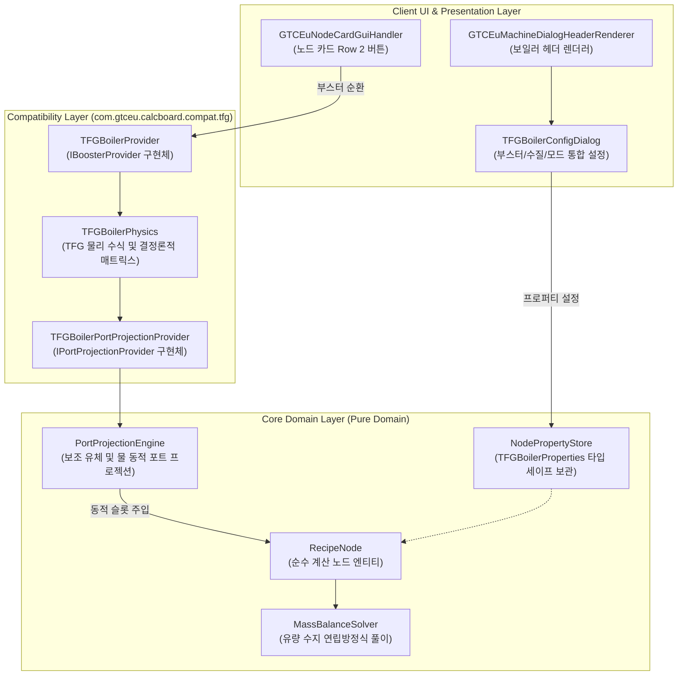

# ADR-057: TFG 대형 보일러 부스터 메커니즘 및 비선형 물리 모델 명세
(TFG Large Boiler Booster Mechanism & Non-Linear Physical Simulation Specification)

- **문서 번호**: ADR-057
- **대상 버전**: v2.3.0
- **상태**: IMPLEMENTED
- **기안일**: 2026-09-15
- **결정일**: 2026-09-15
- **핵심 주제**: TerraFirmaGreg(TFG) 대형 보일러(Large Bronze Boiler 480PU, Large Steel Boiler 1280PU)의 9종 부스터 유체, 수질 계층(표준 담수 1.0x vs 고순도 증류수 1.5x), 480PU 초과 비선형 물 소모 페널티, 480PU 초과 지수적 연료 소모율 가속(효율 감소 곡선) 및 대형 강철 보일러(LSB) 수퍼 보일러(Super Boiler, Dual Fuel) 2차 모드 지원 및 동적 포트 프로젝션 명세

---

## 1. 개요 및 배경 (Motivation)

### 1.1 현황 및 문제 진단 (AS-IS)
본 계산기 모드(`GregTechCalculatorBoard`)는 GTCEu Modern, Create, Thermal Series 등 다양한 산업 모드의 기계와 레시피를 단일 캔버스에서 통합 계산합니다.
현재 GTCEu 기반 증기 보일러 물리(`GTBoilerPhysics`, `GTBoilerTier`)는 기본 GregTech의 **단순 선형 비례 모델**에 기초하고 있습니다:
1. **단순 선형 증기-물 수지**: 온도에 비례하여 물이 선형 소모되며($1\text{ mB Water} \to 160\text{ mB Steam}$), 고온 운전에 따른 추가적인 열역학적 페널티가 존재하지 않습니다.
2. **정적 티어별 고정 파라미터**: 기본 GTCEu의 대형 청동 보일러($800\text{K}$), 대형 강철 보일러($1800\text{K}$) 등 기계 티어별 최대 온도가 고정되어 있으며 외부 촉매나 보조 유체에 의한 가변 압력/온도 시스템이 없습니다.

그러나 본 프로젝트의 2차 지원 목표인 **TerraFirmaGreg (TFG)** 환경에서는 기존 GTCEu 대형 보일러를 대체하여 TFG 독자적인 대형 보일러 멀티블록(`TFGLargeBoilerMachine`)이 도입되었습니다.
TFG 환경에서 현재 계산기를 사용할 경우 다음과 같은 공정 수지 왜곡이 발생합니다:
- **기본 사양 불일치**: TFG 대형 보일러는 기본 GTCEu의 $800\text{K} / 1800\text{K}$ 대신 대형 청동 보일러(LBB) $480\text{ PU}$, 대형 강철 보일러(LSB) $1280\text{ PU}$ 규격을 사용합니다 (1 PU = 1 mB/t 증기 출력). 기본 사양 차이로 인해 기본 증기 생산량과 물 소모량이 실제 게임과 일치하지 않습니다.
- **부스터 유체 소모 누락**: 크레오소트, 올리브유, 목재 가스 등 실제 가동에 투입되어 출력을 증폭시키는 9종 부스터 유체가 노드 카드에 투영되지 않아 공급망 계산이 불가능합니다.
- **물 소모량 과소 산출**: TFG 대형 보일러는 임계 압력($480\text{ PU}$) 초과 구간에서 물 소모량이 비선형($1.5$승 거듭제곱)으로 급증하도록 설계되어 있으나, 기존 선형 계산으로는 실제 필요 물 공급량보다 적게 계산되어 인게임 보일러 폭발을 유발할 수 있습니다.
- **연료 연소 주기 단축 및 효율 감소 미반영**: 고압 부스팅 시 연료 연소 주기가 최대 $40\%$까지 단축(연료 소모율 최대 $2.5$배 가속)되나, 기존 계산기는 정적 레시피 시간으로 연산하여 연료 투입 병목이 발생합니다.
- **수질 계층 증기 증폭 미지원**: 일반 담수 대비 정제수/증류수(`tfg:water_boiler_t2`) 사용 시 물 소모량 증가 없이 증기 출력이 $1.5$배 증폭되는 메커니즘을 반영할 수 없습니다.
- **LSB Super Boiler 2차 모드 누락**: 대형 강철 보일러 전용의 복합 연료(고체 바인더/석탄 + 액체 연료) 연소 모드(`gtceu:super_boiler`)가 지원되지 않습니다.

### 1.2 유래 및 개발 맥락 (Origin & Context)
- **과거 GT5 및 GTNH**: 고체 연료와 액체 연료를 동시 투입할 경우 물 소모량과 증기 출력이 일괄 $+25\%$ 부스팅되는 단순 정적 규칙을 가졌습니다.
- **TFG Modern의 독자 구현**:
  - 개발자: `@TomPlop` (TerraFirmaGreg 개발팀)
  - 소스코드 위치: `su.terrafirmagreg.core.common.tfgt.machine.multiblock.steam.TFGLargeBoilerMachine`, `su.terrafirmagreg.core.compat.emi.LargeBoilerBoosterRecipe`, `su.terrafirmagreg.core.common.data.tfgt.TFGMultiMachines`
  - 모드팩 릴리즈: `TerraFirmaGreg: Modern` v0.11.27 (PR #3360: "Added new large boilers that will soon replace the original gregtech boilers. These ones can accept more kinds of water and booster fluids to push your boilers further..."), v0.12.4 (올리브유 연료에서 부스터 전용 전환)
  - 단위 체계 개편: 온도 단위(K) 대신 증기 생산율과 1:1 직결되는 압력 단위인 **PU (Pressure Unit)**를 UI에 도입 ($1\text{ PU} = 1\text{ mB/t Steam}$).
  - 테라퍼마크래프트/AFC의 유체 자원(수액, 침엽수 피치, 올리브유 등)과 결합된 9종 촉매 유체 차등 배정 (최대 $+16,000\text{ PU}$).
  - 청동 보일러 정격 압력($480\text{ PU}$)을 기준으로 한 비선형 물 소모 계수 및 지수 감쇠 연료 효율 곡선 설계.
  - 대형 강철 보일러(LSB) 전용의 2차 모드인 **수퍼 보일러(Super Boiler / Advanced)** 모드 탑재.

### 1.3 설계 원칙 (TO-BE Principles)
1. **Rule 5 기능적 연역 원칙 (Deterministic Deduction)**:
   - 툴팁 문자열이나 아이템 이름 매칭을 배제하고, `TFGLargeBoilerMachine` 및 `TFGMultiMachines`에 정의된 결정론적 수치 상수를 기반으로 물리 모델을 구축합니다.
2. **Rule 6 도메인 순수성 및 SPI 준수 (Domain Purity & Modular SPI)**:
   - `RecipeNode` 코어 도메인 엔티티 내에 TFG 보일러 전용 필드나 분기를 추가하지 않습니다.
   - `NodeProperties` 타입 세이프 프로퍼티 스토어와 ADR-029의 `IBoosterProvider` 및 `IPortProjectionProvider` 확장 인터페이스를 통해 모듈식으로 구현합니다.
3. **동적 포트 프로젝션 (Dynamic Port Projections)**:
   - 부스터 활성화 여부에 따라 부스터 유체 입력 포트가 노드 카드에 실시간으로 생성/제거되며, 정확한 초당 소비량(mB/s)이 솔버 유량 방정식에 반영됩니다.
   - 수질 선택과 작동 압력에 따라 물 입력 포트 요구량과 증기 출력 포트 생성량이 동기화됩니다.

---

## 2. 핵심 유저 스토리 (User Stories)

| 사용자 구분 | 상황 (Context) | 행동 (Action) | 기대 결과 (Outcome) |
| :--- | :--- | :--- | :--- |
| **초반 ULV 유저** | 대형 청동 보일러(LBB)에 코크스 오븐 부산물인 크레오소트를 활용하려 할 때 | 보일러 노드에서 [부스터: 크레오소트] 선택 | 부스터 유체 포트에 크레오소트 $32\text{ mB/s}$ 슬롯이 추가되고, 최대 압력이 $480\text{PU} \to 780\text{PU}$로 상승하여 증기 출력이 $9,600 \to 15,600\text{ mB/s}$로 증가하며, 물 소모량($60 \to 115.2\text{ mB/s}$)과 목탄 소모 가속($87.2\%$ 효율)이 정확히 연산됨 |
| **초반 농업 유저** | 올리브유 농장을 구축하여 보일러 부스터로 투입하려 할 때 | 부스터 목록에서 [올리브유] 선택 | 초당 $1\text{ mB/s}$ 소모로 $+600\text{PU}$의 압력 보너스($1080\text{PU}$, 증기 $21,600\text{ mB/s}$)가 적용되어 소량의 농업 부산물로 초기 증기 병목을 해소하는 배선을 보드에 구성 |
| **중반 MV 유저** | 대형 강철 보일러(LSB)를 제작하고 타르 분별 공정의 원유 방향족 혼합물을 공급할 때 | LSB 전용 부스터 [원유 방향족 혼합물] 선택 | $1280\text{PU}$ 최소 조건 통과 후 $+1200\text{PU}$($2480\text{PU}$) 보너스가 부여되어 $49,600\text{ mB/s}$ 증기와 $300\text{ mB/s}$ 방향족 유체 수지가 공장 플로우에 연결됨 |
| **고급 EV 유저** | 원자로 가동 후 나오는 방사성 폐액으로 대형 발전을 구성할 때 | LSB 부스터로 [방사성 폐액] 선택 | 초당 $2\text{ mB/s}$로 $+16,000\text{PU}$($17,280\text{PU}$)의 가열이 이루어져 단 1대의 LSB에서 $345,600\text{ mB/s}$($17,280\text{ mB/t}$)의 대형 증기 터빈 발전 라인을 역산 |
| **수질 개선 유저** | 일반 담수 대신 정제수/증류수를 보일러에 공급할 때 | 노드 다이얼로그에서 [수질: 증류수(T2)] 선택 | 물 소모량 증가 없이 증기 생산량이 $1.5$배 증폭되어 표시되며, 증류수 수급 배선이 정확히 매칭됨 |
| **복합 연료 유저** | LSB에서 합성가스와 바이오차프를 함께 연소하는 2차 모드를 사용하려 할 때 | 모달 창에서 [모드: Super Boiler] 선택 | 레시피 타입이 `gtceu:super_boiler`로 전환되며 액체 연료 슬롯과 고체 바인더 슬롯이 분리 생성되어 복합 연료 수지를 산출 |

---

## 3. 시스템 아키텍처 명세 (Architecture Specification)

### 3.1 컴포넌트 구조도



---

## 4. 열역학 물리 모델 및 세부 수식 명세 (Mathematical Physics Specification)

### 4.1 기본 티어 규격 (Base Boiler Tiers in TFG)
TFG의 대형 보일러 멀티블록 정의(`TFGMultiMachines.java`)에 따른 규격입니다:

| 보일러 명칭 | 블록 ID | 기본 정격 압력 ($P_{\text{base}}$) | 가열 속도 ($\text{heatSpeed}$) | 기본 증기 생산량 ($R_{\text{steam, base}}$) | 비고 |
| :--- | :--- | :---: | :---: | :---: | :--- |
| **Large Bronze Boiler (LBB)** | `tfg:large_bronze_boiler` | $480\text{ PU}$ | $1\text{ PU/t}$ ($10\text{ PU/s}$) | $480\text{ mB/t}$ ($9,600\text{ mB/s}$) | 청동 화덕, 단일 모드 |
| **Large Steel Boiler (LSB)** | `tfg:large_steel_boiler` | $1280\text{ PU}$ | $1\text{ PU/t}$ ($10\text{ PU/s}$) | $1280\text{ mB/t}$ ($25,600\text{ mB/s}$) | 강철 화덕, 듀얼 모드(Super Boiler) |

*참고: 기본 GTCEu Modern에 존재하는 Titanium 및 Tungstensteel 대형 보일러는 TFG에서 등록되지 않으며, LBB와 LSB 2종만 운용됩니다.*

---

## 4.2 9대 부스터 유체 규격 매트릭스
TFG 소스코드(`TFGLargeBoilerMachine.java`)의 결정론적 데이터를 1:1 반영한 규격표입니다:

| 순번 | 부스터 유체 (Fluid ID) | 다국어 키 | 소모량 ($R_{\text{booster}}$) | 압력 보너스 ($\Delta P$) | 최소 보일러 압력 ($P_{\text{min}}$) | 해금 티어 | 비고 |
| :---: | :--- | :--- | :---: | :---: | :---: | :---: | :--- |
| 1 | `gtceu:creosote` | `block.gtceu.creosote` | $32\text{ mB/s}$ ($1.6\text{ mB/t}$) | $+300\text{ PU}$ | $0\text{ PU}$ | ULV | 코크스 오븐 기본 부산물 |
| 2 | `tfg:conifer_pitch` | `material.tfg.conifer_pitch` | $5\text{ mB/s}$ ($0.25\text{ mB/t}$) | $+300\text{ PU}$ | $0\text{ PU}$ | ULV | 침엽수 수지 |
| 3 | `afc:maple_sap` | `fluid.afc.maple_sap` | $5\text{ mB/s}$ ($0.25\text{ mB/t}$) | $+300\text{ PU}$ | $0\text{ PU}$ | ULV | 단풍나무 수액 |
| 4 | `afc:birch_sap` | `fluid.afc.birch_sap` | $5\text{ mB/s}$ ($0.25\text{ mB/t}$) | $+300\text{ PU}$ | $0\text{ PU}$ | ULV | 자작나무 수액 |
| 5 | `gtceu:wood_gas` | `material.gtceu.wood_gas` | $52\text{ mB/s}$ ($2.6\text{ mB/t}$) | $+600\text{ PU}$ | $0\text{ PU}$ | LV | 목재 건류 가스 |
| 6 | `tfc:olive_oil` | `fluid.tfc.olive_oil` | $1\text{ mB/s}$ ($0.05\text{ mB/t}$) | $+600\text{ PU}$ | $0\text{ PU}$ | ULV | 올리브 압착유 (초고효율) |
| 7 | `tfg:raw_aromatic_mix` | `material.tfg.raw_aromatic_mix` | $300\text{ mB/s}$ ($15\text{ mB/t}$) | $+1200\text{ PU}$ | $1280\text{ PU}$ | MV | **LSB 전용** (타르 분별) |
| 8 | `gtceu:rocket_fuel` | `material.gtceu.rocket_fuel` | $200\text{ mB/s}$ ($10\text{ mB/t}$) | $+5000\text{ PU}$ | $1280\text{ PU}$ | HV | **LSB 전용** (로켓 연료) |
| 9 | `tfg:radioactive_effluent` | `material.tfg.radioactive_effluent` | $2\text{ mB/s}$ ($0.1\text{ mB/t}$) | $+16000\text{ PU}$ | $1280\text{ PU}$ | EV | **LSB 전용** (원자로 방사성 폐액) |

*참고: 부스터의 $P_{\text{min}} = 1280\text{ PU}$ 조건은 보일러의 기본 정격 압력($P_{\text{base}}$)을 기준으로 판정됩니다. 따라서 LBB($P_{\text{base}} = 480\text{ PU} < 1280\text{ PU}$)는 7~9번 부스터를 장착할 수 없으며, LSB($P_{\text{base}} = 1280\text{ PU}$)만 장착 가능합니다.*

---

### 4.3 수질 계층 규격 매트릭스

| 수질 계층 | 대표 유체 태그 / ID | 증기 출력 승수 ($M_{\text{water}}$) | 물 소모량 영향 | 비고 |
| :---: | :--- | :---: | :---: | :--- |
| **Standard Water** | `tfg:water_boiler` (`minecraft:water`, 강물, 담수) | $1.0\times$ | 변동 없음 | 기본 물 공급 |
| **Purified / Distilled Water** | `tfg:water_boiler_t2` (`gtceu:distilled_water`, 정제수) | $1.5\times$ | 변동 없음 | 동일 물 소모량 대비 증기 생산량 $50\%$ 증폭 |

---

### 4.4 정밀 열역학 계산 공식

#### 1. 유효 작동 압력 ($P_{\text{eff}}$)
정상 상태(Steady-State) 운전 시 유효 압력은 기본 정격 압력에 부스터 보너스를 합산한 값입니다:
$$P_{\text{eff}} = P_{\text{base}} + \Delta P_{\text{booster}}$$

#### 2. 증기 생산율 ($R_{\text{steam}}$)
초당 증기 생산량은 유효 압력, 쓰로틀 비율 및 수질 승수에 비례합니다:
$$R_{\text{steam, tick}} = P_{\text{eff}} \times \left(\frac{\text{throttle}}{100}\right) \times M_{\text{water}} \quad (\text{mB/t})$$
$$R_{\text{steam, sec}} = R_{\text{steam, tick}} \times 20 = 20 \times P_{\text{eff}} \times \left(\frac{\text{throttle}}{100}\right) \times M_{\text{water}} \quad (\text{mB/s})$$

#### 3. 비선형 물 소모율 ($R_{\text{water}}$) 및 페널티 계수 ($\text{tempFactor}$)
$480\text{ PU}$를 초과하는 고압 운전 시 기화 손실 모사를 위해 비선형 페널티 계수($\text{tempFactor}$)가 적용됩니다:
$$\text{tempFactor} = \begin{cases} 1.0 & (P_{\text{eff}} \le 480\text{ PU}) \\ 1.0 + 0.035 \times \left(\frac{P_{\text{eff}} - 480}{100}\right)^{1.5} & (P_{\text{eff}} > 480\text{ PU}) \end{cases}$$

기본 물-증기 변환비는 $1\text{ mB Water} = 160\text{ mB Steam}$이며, 물 소모량은 수질 승수($M_{\text{water}}$)와 무관하게 유효 압력 및 페널티 계수에 의해 결정됩니다:
$$R_{\text{water, base}} = \frac{20 \times P_{\text{eff}} \times (\text{throttle}/100)}{160} \quad (\text{mB/s})$$
$$R_{\text{water, actual}} = R_{\text{water, base}} \times \text{tempFactor} \quad (\text{mB/s})$$

*핵심 공정 수치 대조*:
- **LBB 기본 ($P_{\text{eff}} = 480\text{ PU}$)**:
  - $\text{tempFactor} = 1.0$ (페널티 없음)
  - 증기: $480\text{ mB/t} = 9,600\text{ mB/s}$
  - 물 소모량: $3.0\text{ mB/t} = 60\text{ mB/s}$
- **LBB + 크레오소트 ($P_{\text{eff}} = 780\text{ PU}$)**:
  - $\text{tempFactor} = 1.0 + 0.035 \times (3.0)^{1.5} \approx 1.1819$ (물 $+18.2\%$ 추가 소모)
  - 증기: $780\text{ mB/t} = 15,600\text{ mB/s}$
  - 물 소모량: $5.76\text{ mB/t} \approx 115.2\text{ mB/s}$
- **LSB 기본 ($P_{\text{eff}} = 1280\text{ PU}$)**:
  - $\text{tempFactor} = 1.0 + 0.035 \times (8.0)^{1.5} \approx 1.7919$ (물 $+79.2\%$ 추가 소모)
  - 증기: $1280\text{ mB/t} = 25,600\text{ mB/s}$
  - 물 소모량: $14.34\text{ mB/t} \approx 286.7\text{ mB/s}$
- **LSB + 로켓 연료 ($P_{\text{eff}} = 6280\text{ PU}$)**:
  - $\text{tempFactor} = 1.0 + 0.035 \times (58.0)^{1.5} \approx 16.460$ (물 $16.5$배 추가 소모)
  - 증기: $6280\text{ mB/t} = 125,600\text{ mB/s}$ (증류수 시 $188,400\text{ mB/s}$)
  - 물 소모량: $645.6\text{ mB/t} \approx 12,911\text{ mB/s}$
- **LSB + 방사성 폐액 ($P_{\text{eff}} = 17280\text{ PU}$)**:
  - $\text{tempFactor} = 1.0 + 0.035 \times (168.0)^{1.5} \approx 77.211$ (물 $77.2$배 추가 소모)
  - 증기: $17280\text{ mB/t} = 345,600\text{ mB/s}$ (증류수 시 $518,400\text{ mB/s}$)
  - 물 소모량: $8338.8\text{ mB/t} \approx 166,775\text{ mB/s}$

#### 4. 비선형 연료 연소 효율 ($\text{Efficiency}$) 및 연소 주기 ($\text{Duration}$)
보일러 압력이 $480\text{ PU}$를 초과하면 지수 감쇠(Exponential Decay) 곡선에 따라 연소 주기가 단축되어 연료 소모율이 가속됩니다:
$$\text{reduction} = \begin{cases} 0.0 & (P_{\text{eff}} \le 480\text{ PU}) \\ 0.6 \times \left(1.0 - e^{-0.8 \times \frac{P_{\text{eff}} - 480}{1000}}\right) & (P_{\text{eff}} > 480\text{ PU}) \end{cases}$$
$$\mu_{\text{temp}} = 1.0 - \text{reduction}$$
$$\text{Fuel Efficiency} = \mu_{\text{temp}} \times 100\%$$

레시피 1회당 연소 소요 시간($\text{Duration}$ in ticks)은 다음과 같이 단축됩니다:
$$\text{Duration} = \text{round}\left(\frac{\text{Duration}_{\text{base}}}{\text{throttle} / 100.0} \times \mu_{\text{temp}}\right)$$
따라서 시간당 연료 소모율($\text{Burn Rate}$)은 다음과 같이 증가합니다:
$$\text{Burn Rate} = \frac{\text{Input Amount}}{\text{Duration}} \propto \frac{1}{\mu_{\text{temp}}}$$
*감축 한계*: 온도가 무한히 상승해도 $\text{reduction}$은 최대 $0.6$으로 수렴하므로, $\mu_{\text{temp}}$의 하한선은 $0.4$($40\%$ 효율)이며, 최대 연소 가속 배율은 $1 / 0.4 = 2.5\times$입니다.

---

### 4.5 LSB Super Boiler (Advanced) 복합 연소 메커니즘
- **카테고리 ID**: `gtceu:super_boiler` (`TFGTRecipeTypes.SUPER_BOILER`)
- **지원 기계**: 대형 강철 보일러(LSB) 전용 (LBB 미지원)
- **I/O 규격**: 1 Item Input, 1 Fluid Input (최대 IO: 1, 0, 1, 1)
- **레시피 구성 규격**:
  - **바이오차프 바인더 레시피**:
    `1x gtceu:bio_chaff` + `20,000 mB` 액체 연료, 기본 연소 시간 $3,000\text{ ticks}$ ($150\text{초}$)
  - **석탄/목탄 연료 레시피**:
    `1x minecraft:charcoal` 또는 `#minecraft:coals` + `80,000 mB` 액체 연료, 기본 연소 시간 $3,000\text{ ticks}$ ($150\text{초}$)
  - **사용 가능 액체 연료 4종**:
    1. 합성가스 (`tfg:syngas`)
    2. 경유 (`gtceu:light_fuel`)
    3. 중유 (`gtceu:heavy_fuel`)
    4. 나프타 (`gtceu:naphtha`)
- **물리 연동**: Super Boiler 모드에서도 $P_{\text{eff}}$, 쓰로틀 및 $\mu_{\text{temp}}$ 감쇠 공식이 동일하게 적용되어, 고압 운전 시 150초 기본 주기가 비례 단축됩니다.

---

## 5. 데이터 모델 및 SPI 확장 명세

### 5.1 타입 세이프 프로퍼티 (`TFGBoilerProperties`)

```java
package com.gtceu.calcboard.compat.tfg;

import com.gtceu.calcboard.api.property.NodeProperty;

public final class TFGBoilerProperties {
    private TFGBoilerProperties() {}

    /** 선택된 부스터 유체 인덱스 (0: None, 1~9: BOOSTERS 목록 순번) */
    public static final NodeProperty<Integer> BOOSTER_INDEX =
            NodeProperty.ofInt("tfg_booster_index", 0);

    /** 선택된 수질 계층 (0: Standard 1.0x, 1: Distilled 1.5x) */
    public static final NodeProperty<Integer> WATER_TIER =
            NodeProperty.ofInt("tfg_water_tier", 0);

    /** 보일러 작동 모드 (0: Standard, 1: Super Boiler) */
    public static final NodeProperty<Integer> BOILER_MODE =
            NodeProperty.ofInt("tfg_boiler_mode", 0);
}
```

### 5.2 IBoosterProvider 확장 인터페이스 구현

```java
public class TFGBoilerBoosterProvider implements IBoosterProvider {

    @Override
    public boolean supportsBoosterControl(RecipeNode node) {
        return TFGBoilerPhysics.isTFGLargeBoiler(node);
    }

    @Override
    public Component getBoosterDisplayComponent(RecipeNode node) {
        int idx = node.getProperties().get(TFGBoilerProperties.BOOSTER_INDEX);
        if (idx <= 0) {
            return Component.translatable("tfg.multiblock.large_boiler.booster_none");
        }
        BoosterFluid booster = TFGBoilerPhysics.getBooster(idx);
        return Component.translatable("tfg.multiblock.large_boiler.booster_active",
                Component.translatable(booster.translationKey()),
                "+" + booster.temperatureBonus() + "PU");
    }

    @Override
    public void cycleBooster(RecipeNode node, int direction) {
        TFGBoilerPhysics.cycleBooster(node, direction);
        syncBoosterInputs(node);
    }

    @Override
    public void syncBoosterInputs(RecipeNode node) {
        TFGBoilerPhysics.syncDynamicPorts(node);
    }

    @Override
    public void buildBoosterTooltip(RecipeNode node, List<Component> tooltip) {
        TFGBoilerPhysics.buildBoosterTooltip(node, tooltip);
    }
}
```

---

## 6. UI / UX 인터랙션 디자인 상세

### 6.1 노드 카드 Row 2 버튼 레이아웃
노드 카드 2번째 줄(Row 2)에 보일러 조작 버튼들이 배치됩니다:

```
+-----------------------------------------------------------------------+
| [♨ L-Bronze (480PU)] [100% Thr] [🚀 Booster: Creosote (+300PU)] [💧 Purified]|
+-----------------------------------------------------------------------+
```
- **티어 버튼 (`[♨ L-Bronze (480PU)]`)**: 클릭 시 청동($480\text{ PU}$)과 강철($1280\text{ PU}$) 간 순환.
- **쓰로틀 버튼 (`[100% Thr]`)**: 좌/우클릭 또는 휠 스크롤로 $25\%\sim100\%$ 쓰로틀 $5\%$ 단위 조절.
- **부스터 버튼 (`[🚀 Booster: ...]`)**: 
  - 클릭 시 해당 보일러 티어가 허용하는 부스터 유체 목록 순환 (LBB: None ➔ Creosote ➔ ... ➔ Olive Oil, LSB: 9종 전체).
  - 호버 시 유체 소모량($\text{mB/s}$), 압력 보너스($+\text{PU}$), 연소 가속 배율 툴팁 표시.
- **수질 버튼 (`[💧 Purified]`)**: 담수($1.0\times$)와 고순도 증류수($1.5\times$) 원클릭 토글.

### 6.2 모달 다이얼로그 (MachineConfigDialog) 상세 와이어프레임

```
+-----------------------------------------------------------------------+
| ♨ Large Steel Boiler Configuration                                    |
+-----------------------------------------------------------------------+
| Boiler Tier:  [L-Bronze (480PU)]  [★ L-Steel (1280PU)]                |
| Output Mode:  [● Standard Mode]     [○ Super Boiler (Dual Fuel)]      |
| Water Supply: [○ River Water (1.0x)] [● Distilled Water (1.5x Boost)]  |
+-----------------------------------------------------------------------+
| Throttle:  [-] [ 100% ] [+]    Presets: [25%] [50%] [75%] [100%]       |
| Active Booster Fluid:                                                 |
|   [▼ Rocket Fuel (+5,000PU) — Consumes 200 mB/s (10 mB/t)           ] |
+-----------------------------------------------------------------------+
| Thermodynamic Status Simulation:                                      |
|   • Base Pressure: 1,280PU  ➔  Effective Pressure: 6,280PU (+5,000PU) |
|   • Steam Output Rate: 188,400 mB/s (9,420 mB/t) [1.5x Water Boost]   |
|   • Water Consumption: 12,911 mB/s (645.6 mB/t) [tempFactor: 16.46x]  |
|   • Fuel Efficiency: 40.5% (Duration reduced by 59.5%, 2.47x faster)  |
|   • Booster Consumption: 200 mB/s Rocket Fuel                         |
+-----------------------------------------------------------------------+
```

---

## 7. 동적 포트 프로젝션 및 솔버 연동 명세 (Dynamic Port Projection)

보일러 노드의 물리 상태가 변경될 때마다 `PortProjectionEngine`이 다음 4대 포트를 동기화합니다:
1. **부스터 유체 입력 포트 (Auxiliary Fluid Input)**:
   - 부스터가 선택된 경우: 해당 유체(`ResourceLocation`)와 초당 소모량($R_{\text{booster}}$ in mB/s)을 가지는 입력 포트 주입.
   - 부스터가 `None`인 경우: 해당 포트를 제거.
2. **물 입력 포트 (Water Fluid Input)**:
   - 선택된 수질(`minecraft:water` 또는 `gtceu:distilled_water`)로 아이디 교체.
   - 비선형 페널티가 반영된 실제 소모량($R_{\text{water, actual}}$ in mB/s)으로 요구량 갱신.
3. **연료 입력 포트 (Fuel Item / Fluid Input)**:
   - 가속된 연소 주기($\text{Duration}$)에 맞추어 초당 연료 소비율($\text{Burn Rate}$)을 재산출하여 포트 소비량에 반영.
   - Super Boiler 모드일 경우 아이템 바인더 포트와 액체 연료 포트를 듀얼 생성.
4. **증기 출력 포트 (Steam Output Port)**:
   - 수질 승수가 적용된 총 증기 생산율($R_{\text{steam, sec}}$ in mB/s)로 생산량 갱신.

이를 통해 `MassBalanceSolver` 및 `Auto-Ratio` 기능이 보일러에 연결된 펌프, 코크스 오븐, 정제 설비, 증기 터빈 라인을 정상적으로 균형 배선합니다.

---

## 8. 검증 및 단위 테스트 계획 (Verification Test Plan)

헤드리스 JUnit 테스트 스위트(`TFGBoilerPhysicsTest`)를 구축하여 다음 항목을 검증합니다:

1. **기본 티어 정격 압력 검증**:
   - LBB: $480\text{ PU}$, 기본 증기 $9,600\text{ mB/s}$ ($480\text{ mB/t}$).
   - LSB: $1280\text{ PU}$, 기본 증기 $25,600\text{ mB/s}$ ($1280\text{ mB/t}$).
2. **부스터 물리 및 제약 검증**:
   - 9종 부스터별 압력 보너스 및 최소 압력 제약 검증 (LBB에서 $P_{\text{min}} = 1280\text{PU}$ 유체 장착 차단, LSB에서 허용).
   - 초당 부스터 소모량($32\text{ mB/s}$, $1\text{ mB/s}$, $200\text{ mB/s}$ 등) 1:1 일치 여부.
3. **비선형 물 소모 곡선 검증**:
   - $P \le 480\text{ PU}$ 구간: $\text{tempFactor} = 1.0$.
   - $P = 780\text{ PU}$ (LBB+크레오소트): $\text{tempFactor} \approx 1.1819$.
   - $P = 1280\text{ PU}$ (LSB 기본): $\text{tempFactor} \approx 1.7919$.
   - $P = 6280\text{ PU}$ (LSB+로켓): $\text{tempFactor} \approx 16.460$.
   - $P = 17280\text{ PU}$ (LSB+폐액): $\text{tempFactor} \approx 77.211$.
4. **연료 효율 및 연소 주기 검증**:
   - $P \le 480\text{ PU}$ 구간: 효율 $100\%$, 주기 단축 없음.
   - $P > 480\text{ PU}$ 구간: $\mu_{\text{temp}}$ 감쇠 및 최대 감축 한계($0.4$, $40\%$ 효율) 점근선 수렴 검증.
5. **수질 승수 검증**:
   - 일반 담수($1.0\times$) 대비 증류수($1.5\times$) 증기 생산량 $1.5$배 정밀 검증.
   - 증류수 사용 시 물 소모량 자체는 증가하지 않음을 검증.
6. **Super Boiler 모드 검증**:
   - LSB에서 모드 전환 시 `gtceu:super_boiler` 레시피 슬롯(바인더 1개 + 액체 20,000/80,000 mB) 정상 투영 검증.
   - LBB에서는 Super Boiler 모드 전환 비활성화 검증.
7. **서버 세이프티 및 헤드리스 격리 검증**:
   - 클라이언트 GUI 클래스를 참조하지 않고 데디케이티드 서버 환경에서 물리 계산이 순수하게 수행되는지 검증.

---

## 9. 상호작용 및 파급 효과 분석 (Consequences & Invariants)

### 9.1 긍정적 효과 (Positive)
- **TFG 지원 정밀도 향상**: 2차 주요 지원 모드팩인 TerraFirmaGreg의 핵심 발전 설비인 대형 보일러를 실제 게임 수치와 일치하게 계산할 수 있습니다.
- **안전한 공정 설계 지원**: 고압 운전 시 급증하는 물 소모량을 사전에 확인하여 물 부족에 의한 보일러 폭발을 예방할 수 있습니다.
- **솔버 및 Auto-Ratio와의 자연스러운 융합**: 부스터 유체와 증류수가 캔버스 배선에 정식 원료로 편입되어 자동 비율 계산 및 정션 분배가 정상 동작합니다.

### 9.2 시스템 불변식 (System Invariants)
1. `RecipeNode` 코어 클래스는 `tfg` 모드나 보일러 클래스에 대한 직접적인 컴파일 타임 종속성을 일체 갖지 않습니다 (ADR-037 준수).
2. TFG가 설치되지 않은 순수 GTCEu 환경에서는 기존의 표준 대형 보일러 물리($800\text{K}, 1800\text{K}$)가 변경 없이 유지됩니다.
3. 부스터 유체 정보는 보일러 노드 복제(`copy()`) 및 직렬화(`serializeNBT()`) 시 유실 없이 보존됩니다.
