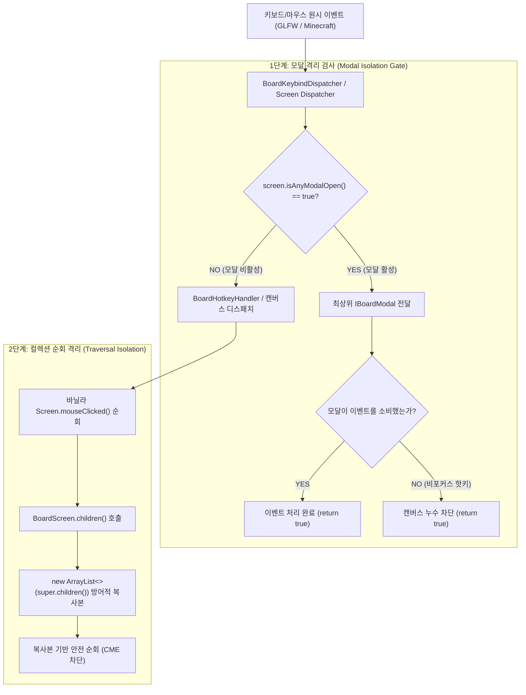

# ADR-058: 캔버스 인터랙션 생명주기 및 유량 솔버 방어적 안정성 명세
(Canvas Interaction Lifecycle & Flow Solver Defensive Stability Specification)

- **문서 번호**: ADR-058
- **대상 버전**: v2.3.0
- **상태**: 🟢 `IMPLEMENTED`
- **결정/완료일**: 2026-09-15
- **핵심 주제**: 캔버스 UI 상호작용 생명주기, 모달 다이얼로그 키보드 격리, 유량 계산 솔버의 배열 인덱스 불변식 및 도메인 NBT 역직렬화 수치 검증을 포함하는 종합 방어적 프로그래밍(Defensive Programming) 아키텍처 규격화

---

## 1. 개요 및 배경 (Motivation)

### 1.1 현황 및 배경 (AS-IS)
`GregTechCalculatorBoard`는 대규모 멀티블록 공정 설계, 수백 개 노드의 동시 배치, 복합 순환 루프 계산 및 다계층 페이지 탭을 지원하는 캔버스 GUI 기반 모드입니다.
인게임 캔버스 위젯 포커스 조작 중 발생한 동시성 예외(ConcurrentModificationException)를 분석하고, 정적 코드 분석을 통해 유사 취약점을 종합 진단한 결과, 다음과 같은 6개 영역에서 잠재적 런타임 결함 및 비정상 종료 위험이 식별되었습니다:

1. **`BoardScreen.children()` 가변 라이브 리스트 노출**:
   - 모달 다이얼로그가 비활성화된 상태에서 `BoardScreen.children()` 호출 시 마인크래프트 바닐라 `Screen.children` 라이브 리스트가 그대로 반환되었습니다.
   - 바닐라의 `Screen.mouseClicked`, `mouseReleased` 등은 `children()`이 반환한 리스트를 순회합니다. 순회 도중 특정 위젯 핸들러 내부에서 `rebuildWidgets()` 또는 위젯 추가/제거가 발생하면 순회 중인 `ArrayList$Itr`의 `modCount` 불일치로 `ConcurrentModificationException`이 발생했습니다.

2. **유량 솔버 및 단일 배선 핸들러의 음수 인덱스 검증 누락**:
   - `HarmonizedRatioOptimizer`, `TwoStageLinearFlowSolver`, `AutoRatioEngine`, `AutoRatioFlowTraverser`, `MassBalanceSolver`, `CanvasSingleWireHandler` 등 핵심 계산 및 배선 컴포넌트에서 포트 인덱스 상한선(`>= size()`)만 검사하고, 하한선(`index < 0`) 검증이 누락되어 있었습니다.
   - 포트 연결 해제, 레시피 재설정 또는 NBT 손상 등으로 인해 `-1` 값이 전달될 경우, `-1 < size()` 조건문이 참으로 평가되어 `get(-1)` 호출에 따른 `IndexOutOfBoundsException`이 발생했습니다.

3. **모달 다이얼로그 활성 시 캔버스 핫키 누수**:
   - `BoardKeybindDispatcher`는 LIFO 모달 다이얼로그(`screen.isAnyModalOpen()`)가 열려 있더라도 텍스트 입력창 포커스가 없는 경우 unconsumed 키보드 이벤트(예: `Delete`, `Backspace`, `Ctrl+Z`, `Ctrl+C`)를 백그라운드의 `BoardHotkeyHandler`로 통과시켰습니다.
   - 결과적으로 모달 내부에서 작업 중인 사용자가 인지하지 못한 상태에서 백그라운드 캔버스의 노드가 삭제되거나 복사되는 고스트 상태(Stale Reference)가 발생했습니다.

4. **페이지 탭 전환 시 캔버스 인터랙션 FSM 미초기화 및 배선 드래그 누수**:
   - 사용자가 와이어를 드래그하고 있는 상태(`CanvasWireConnectingState`)에서 상단 탭을 클릭하여 페이지를 전환할 경우, FSM 상태와 드래그 포인터가 초기화되지 않았습니다.
   - 전환된 새 페이지에서 마우스를 뗄 경우, 이전 페이지의 노드 ID를 소스(`fromNode`)로 참조하는 간선(ConnectionEdge)이 생성되어 `NullPointerException` 또는 페이지 간 불일치 노드 참조가 형성되었습니다.

5. **`MachineNodeRole` NBT 역직렬화 시 `Double.NaN` 및 음수 유입 방어 누락**:
   - `MachineNodeRole`은 런타임 세터에서 `Math.max(0.01, count)` 및 `Math.max(1, parallel)`을 강제하지만, NBT 역직렬화(`deserializeRoleNBT`) 시 태그 값을 직접 할당했습니다.
   - 파일 손상, 수동 NBT 편집, 네트워크 패킷 왜곡 등으로 인해 `0.0`, 음수 또는 `Double.NaN`이 주입될 경우, 자바의 부동소수점 비교 특성상 `NaN`은 모든 대소 비교에서 `false`를 반환하므로 이후 솔버 수식에서 $0$ 나누기 또는 무한 루프가 발생했습니다.

6. **클라이언트 전용 정적 자원 및 수명주기 객체 NPE 위험**:
   - 헤드리스 테스트 환경, 창 크기 조정(Resizing) 또는 포커스 전환 시점에 `Minecraft.getInstance().getWindow()`가 null이거나 윈도우 핸들이 초기화되지 않은 상태에서 직접 호출되는 경로가 존재했습니다.
   - 또한 클라이언트 사운드 매니저(`getSoundManager().play(...)`) 및 키보드 상태(`Screen.hasShiftDown()`)에 대한 방어적 null 검사가 누락된 지점들이 존재했습니다.

---

## 2. 세부 설계 및 결정 사항 (Architecture Decision)

### 2.1 아키텍처 흐름 및 방어 계층

### 2.2 6대 방어 결정 사항

1. **`BoardScreen.children()` 방어적 복사본 격리 (INV-GUI-01)**:
   - `children()` 호출 시 항상 `new ArrayList<>(super.children())` 형태의 방어적 복사본을 반환하여, 순회 도중 자식 위젯이 재구성되더라도 `ConcurrentModificationException`이 발생하지 않도록 격리했습니다.

2. **유량 솔버 및 단일 배선 포트 인덱스 불변식 준수 (INV-SLV-01)**:
   - `HarmonizedRatioOptimizer`, `TwoStageLinearFlowSolver`, `AutoRatioEngine`, `AutoRatioFlowTraverser`, `MassBalanceSolver`, `CanvasSingleWireHandler` 전반에 $0 \le \text{index} < \text{size}$ 양방향 경계 가드를 일괄 적용했습니다.
   - 음수 포트 인덱스가 전달될 경우 즉시 무시하거나 안전 기본값을 반환하여 `IndexOutOfBoundsException`을 예방했습니다.

3. **`BoardKeybindDispatcher` 모달 활성 시 단축키 완전 차단 (INV-MOD-01)**:
   - 모달 다이얼로그가 열려 있는 상태(`screen.isAnyModalOpen() == true`)에서는 소비되지 않은 키보드 및 문자 입력 이벤트가 백그라운드 캔버스 단축키 핸들러(`BoardHotkeyHandler`)로 침투하지 못하도록 조기 차단(`return true`)했습니다.

4. **페이지 탭 전환 시 FSM 상태 머신 복귀 및 배선 드래그 취소 (INV-PAG-01)**:
   - `BoardScreen.openPage(pageId)` 및 `PageTabBarWidget` 탭 클릭 시점에 `canvasHandler.getStateMachine().returnToIdle()` 및 `wireHandler.cancelWireDrag()`를 호출하여 다른 페이지 간 잘못된 간선 연결 및 NPE를 차단했습니다.
   - `bm.getActivePage()`가 null일 가능성에 대비한 안전 가드를 추가했습니다.

5. **`MachineNodeRole` NBT 역직렬화 수치 정규화 (INV-DOM-01)**:
   - `deserializeRoleNBT` 호출 시 `Double.isFinite(count)` 검사를 수행하여 `NaN` 및 `Infinity` 유입을 차단(기본값 1.0)하고, $0.01$ 이상의 값으로 클램핑했습니다.
   - `parallel`은 항상 $1$ 이상의 값으로 정규화하고, `customParallel`은 $0$ 이상의 값(0은 커스텀 병렬 해제/자동 연산)으로 정규화했습니다.

6. **`ClientSafetyHelper` 기반 클라이언트 안전 래퍼 일원화**:
   - `com.gtceu.calcboard.client.util.ClientSafetyHelper` 유틸리티를 신설하여 `isShiftDown()`, `isControlDown()`, `getWindowHandleSafely()`, `playSoundSafely()`를 제공했습니다.
   - 헤드리스 환경 또는 창 리사이징 시점의 NPE를 방지하도록 `BoardNavigationHandler`, `CanvasIdleState`, `CanvasSingleWireHandler` 등에 적용했습니다.

---

## 3. 결과 및 파급 효과 (Consequences)

### 3.1 긍정적 효과
- **런타임 크래시 예방**: 위젯 순회 중 `rebuildWidgets()` 호출 시 발생하던 CME 및 잘못된 포트 인덱스로 인한 IOOBE가 해소되었습니다.
- **캔버스 데이터 무결성 보장**: 모달 다이얼로그 뒤에서 백그라운드 노드가 임의로 삭제되거나 변조되는 현상이 차단되었습니다.
- **페이지 간 참조 오염 방지**: 와이어 드래그 중 탭 전환 시 미완성 배선이 즉시 정리되어 페이지 간 Stale ID 연결이 방지되었습니다.
- **수치 발산 차단**: 손상되거나 비정상적인 NBT 로드 시에도 기계 수치가 유한한 양수로 자동 교정되어 솔버 계산이 안정적으로 유지됩니다.

### 3.2 단위 테스트 검증 내역
- `BoardScreenDefensiveTest`: 방어적 복사본 격리 및 순회 중 위젯 재구성 시 CME 미발생 검증 통과.
- `SolverNegativeIndexTest`: 5대 유량 솔버 대상 음수(-1) 인덱스 주입 시 IOOBE 미발생 및 안전 반환 검증 통과.
- `ModalHotkeyIsolationTest`: 모달 활성 상태에서 `Delete`/`Ctrl+Z` 입력 시 캔버스 노드 보존 및 핫키 차단 검증 통과.
- `PageSwitchStateResetTest`: 페이지 전환 시 FSM `CanvasIdleState` 전이 및 와이어 드래그 취소 검증 통과.
- `MachineRoleNBTValidationTest`: `NaN`, `Infinity`, 음수 기계 대수 및 0 이하 병렬 수치의 정규화 검증 통과.
- `ClientSafetyHelperTest`: 헤드리스 환경에서 안전 래퍼 메서드들의 무결성 검증 통과.
