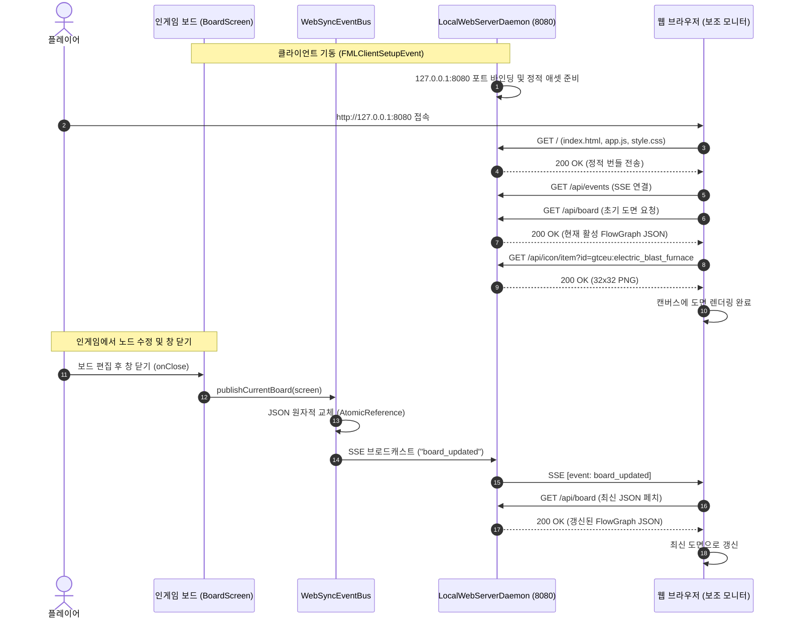

# ADR-059: 로컬 내장 웹 대시보드 및 단방향 실시간 도면 뷰어 명세
(Local Embedded Web Dashboard & Read-Only Live Board Viewer Specification)

- **문서 번호**: ADR-059
- **대상 버전**: `v2.4.0-beta.1`
- **상태**: 🟢 `IMPLEMENTED`
- **결정/완료일**: 2026-09-20
- **주관 계층**: Client Web (`client.web`), Client GUI (`client.gui.widget`, `client.gui.export`), Core Domain (`api.graph`, `model`)
- **핵심 주제**: 로컬 루프백(`127.0.0.1`) 기반 내장 경량 HTTP/SSE 서버, 비차단 원자적 스냅샷 스왑, 온디맨드 32×32 아이콘 렌더링 및 캐시 파이프라인, 보조 모니터 전용 반응형 단일 페이지 웹 대시보드(SPA) 연동 아키텍처 규격화

---

## 1. 개요 및 배경 (Motivation)

### 1.1 현황 및 배경 (AS-IS)
GregTech Calculator Board는 대규모 멀티블록 공정 및 복합 배관 라인을 인게임 캔버스 위에서 모델링하고 유량 수지를 계산하는 도구입니다. 기존 시스템은 `FlowPngExporter`를 통해 오프스크린 프레임버퍼 기반 2배 해상도 PNG 렌더링 및 클립보드 복사 기능을 제공하고 있었습니다.

### 1.2 당면 과제 및 문제점 (Pain Points)
1. **인게임 시공 시 빈번한 화면 전환(Context Switch) 피로도**:
   - 플레이어가 인게임 3D 월드에서 기계를 배치하고 배관/케이블을 연결하는 동안, 계산기 보드에 계획된 수치(오버클럭 티어, 병렬 수, 유량 비율)를 확인하기 위해 수시로 보드 GUI를 열고 닫아야 했습니다.
   - 단일 모니터 환경뿐만 아니라 듀얼 모니터를 사용하는 환경에서도 보드 화면을 외부 모니터에 독립적으로 띄워둘 수단이 없어 작업 흐름이 단절되었습니다.
2. **정적 이미지 익스포트의 상호작용 한계**:
   - 기존 PNG 익스포트는 정적 이미지 파일이므로, 마우스 오버를 통한 상세 레시피 툴팁(정확한 EUt, 단계별 소모 시간, 부산물 확률, NBT 데이터) 조회가 불가능했습니다.
   - 인게임에서 보드 설계를 변경했을 때 매번 수동으로 이미지를 다시 내보내거나 저장해야 하는 번거로움이 있었습니다.
3. **양방향 조작 웹앱의 복잡도 및 런타임 위험**:
   - 웹 브라우저에서 인게임 보드를 원격 조작(노드 생성/편집, 실시간 솔버 양방향 연동)하는 구조는 모드팩별 수만 개 아이템 모델 변환, 동시성 트랜잭션 충돌, 상태 불일치 등 런타임 불안정성을 초래할 수 있습니다.

### 1.3 설계 목표 (Goals)
- **무설정 로컬 웹 데몬 (Zero-Configuration Local Daemon)**:
  - 외부 런타임(Node.js 등)이나 추가 외부 의존성 없이, Java 표준 라이브러리(`com.sun.net.httpserver.HttpServer`) 기반 초경량 데몬을 `127.0.0.1` 로컬 루프백에 구동합니다.
- **단방향 실시간 동기화 (Read-Only Live Synchronization)**:
  - 인게임 상태 변경 위험을 차단하는 단방향 읽기 전용 구조를 채택하며, 보드 편집 완료/닫기 시점에 Server-Sent Events (SSE)로 알림을 전송하여 인게임 렌더링 프레임에 영향을 주지 않도록 설계합니다.
- **온디맨드 32×32 마이크로 아이콘 렌더링 및 영구 캐싱**:
  - 마인크래프트 내부 렌더러를 활용해 기계/아이템/유체 아이콘을 32×32 PNG로 동적 렌더링하고, 브라우저 캐시 및 디스크 캐시를 통해 네트워크 전송 비용을 최소화합니다.
- **풍부한 인터랙티브 웹 대시보드 (Rich Interactive Web Dashboard)**:
  - 모드 JAR 내부에 번들링된 경량 프론트엔드(HTML5 Canvas/CSS/JS)를 서빙하여, 보조 모니터 브라우저에서 마우스 휠 줌/팬 및 상세 HTML 툴팁 조회를 지원합니다.

---

## 2. 세부 설계 및 결정 사항 (Architecture Decision)

### 2.1 시스템 아키텍처 흐름도

```mermaid
flowchart TD
    subgraph MC_Client["마인크래프트 클라이언트 (In-Game Client)"]
        BS["BoardScreen / FlowGraph<br/>(활성 도면 도메인 데이터)"]
        FBO["MicroIconRenderer<br/>(32x32 오프스크린 아이콘 엔진)"]
        
        subgraph Web_Module["com.gtceu.calcboard.client.web"]
            Daemon["LocalWebServerDaemon<br/>(com.sun.net.httpserver)"]
            SyncBus["WebSyncEventBus<br/>(SSE 브로드캐스터 & 스냅샷)"]
            IconCache["IconDiskCache<br/>(메모리 Map + 디스크 PNG 캐시)"]
            Serializer["BoardJsonSerializer<br/>(도면 JSON 직렬화)"]
        end
        
        BS -->|창 닫기 onClose()| Serializer
        Serializer -->|불변 JSON 스냅샷 저장| SyncBus
        FBO -->|32x32 PNG 생성| IconCache
        SyncBus --> Daemon
        IconCache --> Daemon
    end

    subgraph Browser["보조 모니터 웹 브라우저 (127.0.0.1:8080)"]
        SPA["단일 페이지 웹 대시보드<br/>(assets/gtcalcboard/web/)"]
        Canvas["인터랙티브 캔버스<br/>(Pan/Zoom & 노드 그래프)"]
        Tooltip["HTML/CSS 리치 툴팁<br/>(상세 수치/EUt/레시피)"]
        
        SPA --> Canvas
        Canvas --> Tooltip
    end

    Daemon -->|GET / : 정적 애셋 서빙| SPA
    Daemon -->|GET /api/board : 도면 JSON| Canvas
    Daemon -->|GET /api/events : SSE 푸시| Canvas
    Daemon -->|GET /api/icon/* : PNG 텍스처| Canvas
```

### 2.2 데이터 및 이벤트 시퀀스



### 2.3 REST API 및 SSE 프로토콜 명세

| 메서드 | 엔드포인트 경로 | 요청 파라미터 / 페이로드 | 응답 형식 | 설명 |
|---|---|---|---|---|
| **`GET`** | `/` | 없음 | `text/html` | JAR 내장 웹 대시보드 단일 페이지 SPA 서빙 |
| **`GET`** | `/assets/*` | 정적 파일 경로 | `application/javascript`, `text/css` 등 | 프론트엔드 번들 정적 리소스 서빙 |
| **`GET`** | `/api/board` | 없음 | `application/json` | 현재 활성 페이지의 전체 노드, 연결선, 프레임, 스티키 노트 JSON |
| **`GET`** | `/api/events` | 없음 (헤더: `text/event-stream`) | `text/event-stream` | 보드 갱신 시 `event: board_updated` 알림을 전송하는 SSE 스트림 |
| **`GET`** | `/api/icon/item` | `?id={itemId}` | `image/png` | 32×32 아이템/기계 렌더링 PNG (1일 캐시 헤더 부여) |
| **`GET`** | `/api/icon/fluid` | `?id={fluidId}` | `image/png` | 32×32 유체 텍스처 PNG (1일 캐시 헤더 부여) |
| **`GET`** | `/api/status` | 없음 | `application/json` | 웹 서버 상태, 활성 월드명, 포트 메타데이터 반환 |

모든 엔드포인트는 `GET` 메서드만 허용하며, 기타 메서드(`POST`, `PUT`, `DELETE` 등) 수신 시 `405 Method Not Allowed`를 반환합니다.

### 2.4 도면 JSON 데이터 구조 규격 (Graph JSON Schema)

`/api/board` 엔드포인트는 브라우저가 화면을 그리는 데 필요한 데이터를 정형화된 JSON 형태로 반환합니다:

```json
{
  "version": 1,
  "pageId": "primary_line",
  "pageTitle": "원유 분별 증류 공정",
  "timestamp": 1774051200000,
  "nodes": [
    {
      "id": "node_ebf_01",
      "type": "MACHINE",
      "title": "전기 고기로",
      "machineId": "gtceu:electric_blast_furnace",
      "tier": "EV",
      "posX": 240.0,
      "posY": 160.0,
      "width": 140.0,
      "height": 92.0,
      "metrics": {
        "eut": -1920.0,
        "durationSec": 15.0,
        "parallel": 8,
        "efficiency": 1.0
      },
      "inputs": [
        { "portId": "in_0", "type": "ITEM", "id": "gtceu:ilmenite_dust", "amount": 8.0, "ratePerSec": 0.533 }
      ],
      "outputs": [
        { "portId": "out_0", "type": "ITEM", "id": "gtceu:titanium_carbide_ingot", "amount": 8.0, "ratePerSec": 0.533 }
      ]
    }
  ],
  "connections": [
    {
      "fromNode": "node_supply",
      "fromPort": "out_0",
      "toNode": "node_ebf_01",
      "toPort": "in_0",
      "flowRate": 0.533,
      "unit": "/s"
    }
  ],
  "frames": [],
  "stickyNotes": []
}
```

### 2.5 동시성 제어 및 스레드 안전성 (Concurrency & Thread Safety)

1. **비차단 원자적 스냅샷 스왑 (Non-Blocking Atomic Snapshot Swap)**:
   - `WebSyncEventBus`는 `AtomicReference<String>`을 통해 직렬화된 JSON 문자열 스냅샷을 보관합니다.
   - 인게임 렌더링 스레드는 화면이 닫히거나 변경될 때 스냅샷을 1회 생성하여 원자적으로 갱신합니다.
   - HTTP 워커 스레드는 `AtomicReference.get()`을 통해 락 없이 즉시 응답을 전송하므로 인게임 메인 스레드와의 경합이 발생하지 않습니다.
2. **SSE 연결 유지 및 스레드 풀 격리**:
   - `com.sun.net.httpserver.HttpServer`의 기본 동작(핸들러 반환 시 응답 자동 종료)을 고려하여, SSE 연결 핸들러는 전용 작업 스레드에서 `BlockingQueue<String>`을 폴링하며 지속적으로 스트림을 유지합니다.
   - 장기 실행 SSE 연결로 인한 스레드 고갈을 방지하기 위해 데몬 스레드 기반 캐시 풀(`Executors.newCachedThreadPool`)을 사용하여 JVM 종료를 차단하지 않습니다.
   - 클라이언트 등록 시 `ConcurrentHashMap` 키 집합에 먼저 등록한 후 초기 연결 메시지를 송신하여 경쟁 조건을 방지합니다.
   - 15초 주기의 주기적 하트비트 주석(`: ping\n\n`)을 통해 연결 끊김을 감지하고 파손된 소켓을 정리합니다.
3. **로컬 루프백 바인딩 및 포트 페일오버**:
   - 서버 소켓을 `127.0.0.1`로 바인딩하여 외부 네트워크의 접근을 차단합니다.
   - 기본 포트(`8080`)가 점유되어 있을 경우 `8081`부터 `8089`까지 순차적으로 가용 포트를 자동 탐색하여 바인딩합니다.
4. **헤드리스 환경 안전성 및 아이콘 캐싱**:
   - `IconDiskCache`는 32×32 크기의 PNG를 메모리 맵과 `.minecraft/calcboard_cache/icons/` 디스크 경로에 캐싱합니다.
   - 헤드리스 환경 또는 단위 테스트 환경에서는 Java 2D ARGB 플레이스홀더 이미지를 생성하여 클라이언트 그래픽스 의존성 없이 안전하게 동작합니다.

### 2.6 인게임 통합 및 조작 경로

1. **클라이언트 라이프사이클 통합**:
   - `ClientModBusEvents.onClientSetup`: 클라이언트 설정(`CalcBoardClientConfig.ENABLE_LOCAL_WEB_SERVER`)이 활성화된 경우 데몬을 자동 기동합니다.
   - `ClientForgeEvents.onPlayerLoggedOut`: 플레이어 로그아웃 시 `WebSyncEventBus.reset()`을 호출하여 스냅샷과 활성 클라이언트를 정리합니다.
2. **보드 화면 연동**:
   - `BoardScreen.onClose`: 보드 창이 닫힐 때 현재 활성 그래프를 `WebSyncEventBus.publishCurrentBoard()`로 전달하여 스냅샷 갱신 및 SSE 브로드캐스트를 수행합니다.
   - `BoardScreen.openWebDashboard`: 브라우저 자동 실행(`Util.getPlatform().openUri`), 클립보드 URL 복사 및 인게임 토스트 피드백을 제공합니다.
3. **사용자 인터페이스 및 커맨드**:
   - `ToolbarWidget`: 상단 공유/내보내기 메뉴에 `🌐 웹 대시보드 열기` 항목을 추가했습니다.
   - `CalcBoardClientCommands`: `/gtcalcboard web` 명령어로 웹 대시보드 URL 열기 및 클립보드 복사를 지원합니다.
4. **설정 지원 및 시스템 자원 보호**:
   - `calcboard-client.toml`에 `enableLocalWebServer`(기본값: `false`) 및 `localWebServerPort`(기본값: `8080`, 범위: `1024..65535`) 옵션을 제공합니다.
   - 플레이어 PC 사양 및 백그라운드 리소스(포트 점유, 스레드 풀) 보호를 위해 **기본값을 꺼짐(`false`)으로 설정(Opt-in)**하였으며, 보드 설정 창(`BoardSettingsDialog`의 업데이트/시스템 탭)에서 원클릭으로 켜고 끌 수 있는 인게임 토글 체크박스를 지원합니다.
   - 비활성화된 상태에서 웹 대시보드 열기를 시도할 경우, 서버를 강제 실행하지 않고 설정 창으로 안내하는 친절한 토스트/채팅 안내 메시지를 표시합니다.

---

## 3. 결과 및 파급 효과 (Consequences)

### 3.1 긍정적 효과
- **플레이어 시공 편의성 향상**: 듀얼 모니터 환경에서 인게임 화면을 가리지 않고 보조 모니터에 최신 보드 도면과 상세 툴팁을 띄워둔 채 배관 및 기계 시공 작업을 진행할 수 있습니다.
- **인게임 프레임 드랍 0**: 상태 변경 알림(SSE) 및 필요 시 단일 HTTP GET 페치 구조를 적용하여 인게임 틱 및 프레임버퍼에 추가 부하를 주지 않습니다.
- **테스트 격리 및 서버 안전성**: 웹 모듈 전체가 순수 Java 표준 라이브러리와 분리된 계층으로 구현되어, 데디케이티드 서버나 헤드리스 단위 테스트 환경에서 그래픽스 크래시가 발생하지 않습니다.

### 3.2 단위 테스트 및 검증 결과 (Verification Record)

다음 테스트 스위트를 작성하고 전수 통과를 검증했습니다:
- `com.gtceu.calcboard.client.web.BoardJsonSerializerTest`:
  - 빈 그래프 직렬화 필드 검증 (버전, 빈 배열, 뷰포트)
  - 다중 노드/포트/연결선/프레임/스티키 노트 복합 그래프 직렬화 무결성 검증
- `com.gtceu.calcboard.client.web.IconDiskCacheTest`:
  - 유효한 PNG 시그니처 바이트 생성 검증
  - 메모리 캐시 및 디스크 파일 생성/캐시 클리어 검증
- `com.gtceu.calcboard.client.web.LocalWebServerDaemonTest`:
  - 동적 포트 바인딩 및 중복 포트 시 페일오버(`8080 -> 8081`) 검증
  - 정적 웹 애셋 서빙(`GET /`, `GET /assets/style.css`, `GET /assets/app.js`)
  - 도면 API(`GET /api/board`), 상태 API(`GET /api/status`), 아이콘 API(`GET /api/icon/*`) 검증
  - 허용되지 않은 HTTP 메서드(`POST`, `DELETE`) 수신 시 `405 Method Not Allowed` 검증
  - SSE 스트림 수신(`GET /api/events`) 및 브로드캐스트 이벤트 전달 검증
- `com.gtceu.calcboard.config.CalcBoardClientConfigTest`:
  - 신규 클라이언트 설정 필드(`ENABLE_LOCAL_WEB_SERVER`, `LOCAL_WEB_SERVER_PORT`) 기본값 및 범위 검증
- 사전 비행 정적 린터(`python tools/lint_agent_rules.py --diff`) 0건 통과
- 다국어 리소스 일치성(`python tools/check_i18n.py`) 1510개 키 4개 언어 100% 일치 및 VS16 0건 통과
