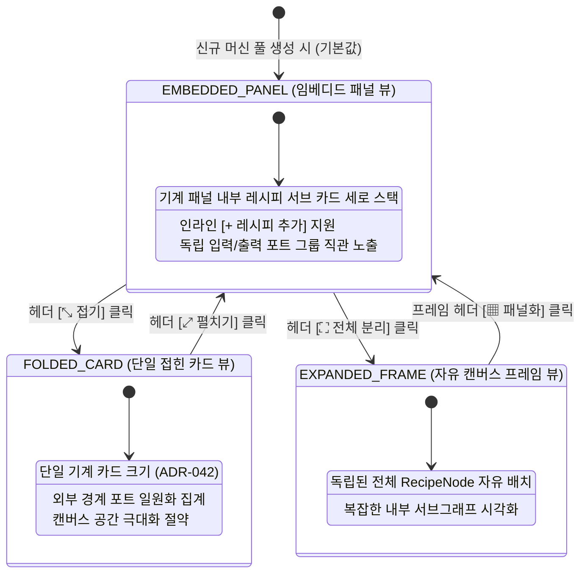
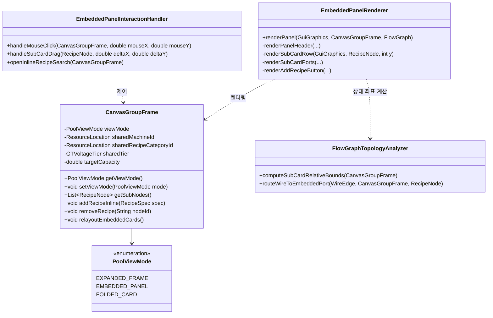
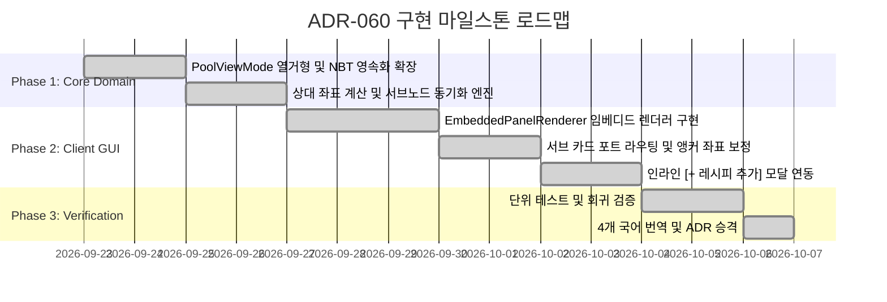

# ADR-060: 공유 기계 풀 머신 중심 워크플로우 및 임베디드 레시피 패널 리워크 명세
(Shared Machine Pool Machine-Centric Workflow & Embedded Recipe Panel Specification)

- **문서 번호**: ADR-060
- **대상 버전**: `v2.4.0`
- **상태**: 🟢 `ACTIVE`
- **결정/완료일**: 2026-09-26
- **주관 계층**: Client GUI Layer (`client.gui.widget`, `client.gui.render`), Domain Model Layer (`api.model`, `api.solver`)
- **핵심 주제**: 머신 중심 1클릭 공유 기계 풀 생성, 독립 레시피 서브 카드 세로 스택 임베디드 패널(`EMBEDDED_PANEL`), 인라인 레시피 검색·추가, 3-Tier 뷰 상태 머신(FOLDED_CARD ↔ EMBEDDED_PANEL ↔ EXPANDED_FRAME), 서브 카드 직접 배선 앵커링 및 ADR-042 하위 호환성 유지

---

## 1. 개요 및 배경 (Motivation)

### 1.1 이전 워크플로우의 한계
`GregTechCalculatorBoard`의 공유 기계 풀(Shared Machine Pool, [ADR-031](ADR_031_SHARED_MACHINE_POOL_AUTO_RATIO.md), [ADR-042](ADR_042_SHARED_MACHINE_POOL_IN_PLACE_FOLDING_AND_RATIO_PRESERVATION.md))은 여러 레시피가 물리적 기계 1대를 시간 분할(Time-sharing)하여 공유하는 공정을 지원해왔습니다.

그러나 이전의 생성 및 편집 흐름은 철저히 **레시피 우선(Recipe-First / Bottom-Up)** 방식으로 설계되어 있어 다음과 같은 사용성 불편이 존재했습니다:
1. **번거로운 사전 노드 생성 및 바인딩**:
   - 플레이어는 "원심분리기 1대를 설치하고 2~3개 레시피를 분할 가동"하고자 할 때, 캔버스 빈 공간에 독립된 대형 레시피 노드들을 각각 검색하여 생성한 뒤, 영역 드래그 선택을 거쳐 `Ctrl + Shift + S`로 프레임을 씌워야 했습니다.
2. **캔버스 공간 점유 및 시각적 산만함**:
   - 풀로 묶기 전까지 캔버스에 수많은 개별 기계 카드가 흩뿌려지며, 프레임 내부에 배치된 노드들의 좌표와 크기가 제각각이어서 정돈된 레이아웃을 유지하기 어려웠습니다.
3. **가상 입력(Virtual Inputs) 방식의 모호성 충돌**:
   - "기계를 먼저 배치하고 가상 입력 포트에 재료를 꽂아 레시피를 역산"하려는 대안 아이디어는, 공유 풀의 본질이 **1개 기계 하드웨어에 복수 레시피($N$ Recipes)**가 공존하는 구조라는 점과 충돌합니다. 입력 포트 여러 개에 재료가 연결되었을 때 이것이 1개의 복합 레시피인지 여러 개로 나뉘는 레시피인지 시스템이 자율적으로 판별할 수 없습니다.

### 1.2 핵심 해결책 및 설계 결정
본 결정(ADR-060)은 레시피 모호성을 방지하고 플레이어 조작에 부합하는 **머신 중심(Machine-Centric) 임베디드 레시피 패널**로 공유 기계 풀을 전면 리워크합니다:

* **머신 중심 생성 (Machine-First Pool Creation)**:
  - 캔버스에서 빈 공유 기계 패널(예: `Chemical Reactor MV [Shared Pool]`)을 직접 1클릭으로 생성합니다.
* **패널 내부 임베디드 레시피 서브 카드 (Embedded Recipe Sub-Cards)**:
  - 패널 내부에 각 레시피가 격리된 미니 카드(작은 프레임) 형태로 세로 스택 배치됩니다.
  - 각 서브 카드마다 고유한 입력/출력 포트 그룹이 명확히 분리되어 입력 모호성을 100% 해소합니다.
* **인라인 레시피 추가 및 즉시 배선 (`[+ 레시피 추가]`)**:
  - 패널 상단의 `[+ 레시피 추가]` 버튼 또는 서브 카드의 빈 입력 슬롯에서 드래그하여 해당 기계 전용 레시피를 인라인으로 검색 및 즉시 삽입합니다.
* **3단계 뷰 상태 머신 (Folded Card ↔ Embedded Panel ↔ Expanded Frame)**:
  - [ADR-042](ADR_042_SHARED_MACHINE_POOL_IN_PLACE_FOLDING_AND_RATIO_PRESERVATION.md)의 단일 접힌 카드 모드와 완전 펼침 모드 사이에, **"임베디드 패널 뷰"**를 기본 인터페이스로 도입합니다.

---

## 2. 핵심 유저 스토리 (User Stories)

| 구분 | 플레이어 액션 (Action) | 시스템 기대 동작 (Expected Outcome) |
| :--- | :--- | :--- |
| **US-1** | 캔버스 컨텍스트 메뉴 또는 단축키로 `신규 공유 기계 풀 생성` 선택 | 기계 종류(예: 원심분리기)와 전압 티어를 지정할 수 있는 다이얼로그가 열리고, 캔버스에 빈 임베디드 머신 패널이 즉시 스폰됨 |
| **US-2** | 패널 헤더의 `[+ 레시피 추가]` 버튼 클릭 | 해당 기계 종류로 필터링된 레시피 검색창이 열리며, 레시피 선택 시 패널 내부에 컴팩트한 레시피 서브 카드가 추가됨 |
| **US-3** | 상류 기계의 출력 포트에서 임베디드 레시피 서브 카드의 입력 포트로 드래그 | 정확한 해당 레시피의 입력 핀에 와이어가 연결되며, 다른 레시피와의 간섭이나 모호성 없이 즉시 유량 수지 계산에 반영됨 |
| **US-4** | 서브 카드의 개별 가동률(또는 대수) 슬라이더 조작 | 해당 레시피의 가동 대수가 변경되며, 패널 상단의 총 가동률($\sum c_i$) 및 필요 물리 기계 대수($\lceil \sum c_i \rceil$)가 실시간 갱신됨 |
| **US-5** | 패널 상단에서 목표 기계 대수(예: 2.0대) 수정 | 내부 모든 서브 카드들의 레시피 가동률이 기존 비율을 엄격히 유지한 채 일괄 비례 스케일링됨 ([ADR-042](ADR_042_SHARED_MACHINE_POOL_IN_PLACE_FOLDING_AND_RATIO_PRESERVATION.md) 연동) |
| **US-6** | 패널 헤더의 접기(`[⤡]`) 버튼 클릭 | 레시피 서브 카드들이 숨겨지고 외부 입출력 포트만 통합 노출되는 컴팩트 단일 기계 카드로 전환됨 |
| **US-7** | 패널 헤더의 완전 펼치기(`[⤢]`) 버튼 클릭 | 서브 카드들이 캔버스 위의 개별 자유 배치 노드로 분리되어 넓은 프레임 레이아웃으로 전환됨 |

---

## 3. 시스템 아키텍처 명세 (Architecture Specification)

### 3.1 3-Tier 뷰 상태 전이도 (View Mode State Machine)

공유 기계 풀 프레임(`CanvasGroupFrame`)은 다음 3가지 상호 전환 가능한 시각적 표현 상태를 지원합니다:



### 3.2 컴포넌트 구조 및 클래스 다이어그램



---

## 4. UI / UX 디자인 상세 명세

### 4.1 임베디드 레시피 패널 와이어프레임 (EMBEDDED_PANEL View)

```text
┌────────────────────────────────────────────────────────────────────────┐
│ [Icon] Centrifuge (MV) - 공유 기계 풀                 [+ 레시피] [⤡] [x] │  <- 마스터 헤더 (22px)
├────────────────────────────────────────────────────────────────────────┤
│ Count: [ - ] [ 1.25 ] [ + ]   총 가동률: 125% (2대 필요)      75 EU/t   │  <- 풀 집계 바 (18px)
├────────────────────────────────────────────────────────────────────────┤
│ ┌─ Recipe 1: Glowstone Processing ────────────────────── [ 0.75대 ] [x]┐ │  <- 서브 카드 1 (40px)
│ │ ■ [Glowstone] 16/s  ──>  +16/s [Redstone] ■                          │ │
│ │                          +4/s  [Gold Dust] ■                         │ │
│ └──────────────────────────────────────────────────────────────────────┘ │
│ ┌─ Recipe 2: Redstone Separation ─────────────────────── [ 0.50대 ] [x]┐ │  <- 서브 카드 2 (40px)
│ │ ■ [Redstone]  8/s   ──>  +8/s  [Pyrite]   ■                          │ │
│ │                          +2/s  [Ruby]     ■                          │ │
│ └──────────────────────────────────────────────────────────────────────┘ │
│ ┌──────────────────────────────────────────────────────────────────────┐ │
│ │               + 클릭하여 이 기계에 새 레시피 추가...                 │ │  <- 인라인 슬롯 (20px)
│ └──────────────────────────────────────────────────────────────────────┘ │
└────────────────────────────────────────────────────────────────────────┘
```

#### 레이아웃 및 조작 규칙
1. **마스터 헤더**:
   - 공유 기계 아이콘(예: Centrifuge), 대표 전압 티어(`[MV]`), 공유 풀 식별명.
   - `[+ 레시피]` 버튼: 클릭 시 해당 기계 종류로 카테고리가 자동 고정된 `RecipeSearchDialog`를 모달로 오픈.
   - `[⤡ 접기]` 버튼: 단일 접힌 가상 카드 모드로 즉시 축소.
2. **풀 집계 바**:
   - 목표 물리 기계 대수(예: 1.25대) 조작 및 총 가동률 실시간 집계.
   - 목표 대수 변경 시 하위 서브 카드들의 대수가 비례 스케일링됨.
3. **임베디드 레시피 서브 카드 (Embedded Sub-Card)**:
   - **카드 높이**: 슬림형 36~42px (포트 개수에 따라 유동적 확장).
   - **좌측(입력)**: 해당 레시피의 고유 입력 슬롯 및 소모율.
   - **우측(출력)**: 해당 레시피의 고유 출력 슬롯 및 생산율.
   - **헤더부**: 레시피 이름, 개별 기계 대수/듀티(`[ 0.75대 ]`), 삭제 버튼(`[x]`).
4. **와이어 배선 앵커 (Wire Routing)**:
   - 외부에서 들어오는 입력 와이어는 패널 외곽이 아니라 **해당 서브 카드의 좌측 입력 핀으로 직접 연결**되어 어떤 레시피로 재료가 투입되는지 직관적으로 시각화됨.

---

## 5. 세부 알고리즘 및 데이터 구조

### 5.1 NBT 직렬화 데이터 확장 (`CanvasGroupFrame`)

프레임의 영속화 태그에 신규 뷰 모드와 공유 머신 메타데이터를 저장합니다:

```java
// CanvasGroupFrame NBT 영속화 확장
tag.putString("poolViewMode", this.viewMode.name()); // FOLDED_CARD, EMBEDDED_PANEL, EXPANDED_FRAME
if (this.sharedMachineId != null) {
    tag.putString("sharedMachineId", this.sharedMachineId.toString());
}
if (this.sharedRecipeCategoryId != null) {
    tag.putString("sharedRecipeCategoryId", this.sharedRecipeCategoryId.toString());
}
tag.putDouble("targetCapacity", this.targetCapacity);
```

### 5.2 상대 좌표 기반 내부 노드 배치 알고리즘 (Relative Sub-Card Layout)

임베디드 패널 모드에서 내부 노드들은 독립적인 자유 좌표 대신, **패널 상단으로부터의 상대 오프셋($Y_{\text{rel}}$)**으로 결정론적 정렬됩니다:

$$Y_{0} = Y_{\text{panel}} + H_{\text{master\_header}} + H_{\text{summary\_bar}} + \text{PAD}$$
$$Y_{k+1} = Y_{k} + H_{\text{subcard}}(k) + \text{GAP}$$
$$H_{\text{panel}} = \sum_{k=1}^{N} H_{\text{subcard}}(k) + H_{\text{header}} + H_{\text{add\_btn}} + \text{PADDING}$$

* **드래그 이동 동기화**:
  - 플레이어가 임베디드 패널의 헤더를 잡고 드래그하면, 내부의 모든 서브 노드 좌표가 동일한 $(\Delta X, \Delta Y)$로 일괄 이동하여 캔버스 데이터 무결성을 보장합니다.
* **비파괴성 유지**:
  - `EXPANDED_FRAME`으로 전환될 때는 임베디드 상태의 상대 좌표를 유지한 채 패널 테두리만 프레임으로 넓어지므로, 노드 재배치 오류가 전혀 발생하지 않습니다.

### 5.3 인라인 레시피 추가 시 가동률 자동 할당 규칙 (Duty Provisioning)

기존에 가동 중인 공유 풀에 새로운 레시피가 추가될 때:
1. **여유 용량이 있는 경우 ($D_{\text{current}} < M_{\text{target}}$)**:
   - 남은 잔여 용량($M_{\text{target}} - D_{\text{current}}$)을 신규 레시피의 기본 대수로 자동 할당 (최대 1.0대 한도).
2. **이미 100% 포화 상태인 경우 ($D_{\text{current}} \ge M_{\text{target}}$)**:
   - 신규 레시피의 기본 대수를 최소 단위($0.1$대 또는 $1$사이클 분량)로 생성하고, 총 듀티 증가에 따른 경고 인디케이터(`⚠ 1.10 / 1.00대`)를 표시하여 유저가 비율 맞춤(`[⚖]`)을 누르도록 유도.

---

## 6. 개발 로드맵 (Phased Implementation Plan)



---

## 7. 파급 효과 및 하위 호환성 (Consequences)

### 7.1 긍정적 효과
* **플레이어 조작 흐름 개선**: "기계 1대를 두고 레시피를 추가한다"는 작업 흐름 충족.
* **입력 모호성 방지**: 서브 카드별로 포트가 분리되어, 복합 레시피 분기나 다형적 슬롯 모호성이 발생하지 않음.
* **캔버스 작업 공간 절약**: 흩뿌려지던 대형 노드들이 단일 패널 내부의 정돈된 스택으로 수납됨.

### 7.2 하위 호환성 (Backward Compatibility)
* 기존 버전의 `CanvasGroupFrame` NBT에 `poolViewMode`가 없는 세이브 데이터는 기본값 `EXPANDED_FRAME`(기존 펼침 프레임)으로 자동 폴백되어 이전 도면과의 하위 호환성을 유지합니다.
* ADR-042의 가상 단일 카드(`FOLDED_CARD`) 뷰 및 내부 노드 비례 스케일링 동작은 동일하게 호환 유지됩니다.
