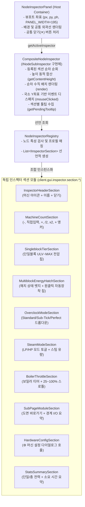
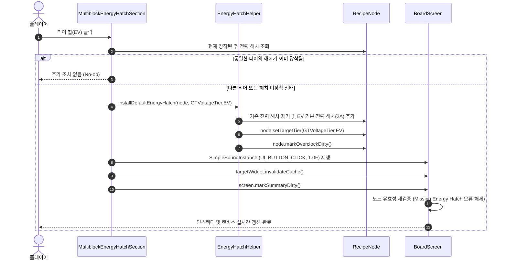

# ADR-061: 노드 유형별 선언적 인스펙터 패널 및 멀티블록 전력 해치 직접 연동 명세
(Declarative Node Inspector Composition & Multiblock Energy Hatch Integration Specification)

- **문서 번호**: ADR-061
- **대상 버전**: `v2.4.0`
- **상태**: 🟢 `ACTIVE`
- **결정/완료일**: 2026-09-26
- **주관 계층**: Client GUI Layer (`client.gui.widget`, `client.gui.inspector.*`), Core Domain (`api.model`)
- **핵심 주제**: 노드 유형별 선언적 독립 섹션 모듈 분해(`IInspectorSection`, `CompositeNodeInspector`, `NodeInspectorRegistry`), 멀티블록 전력 해치 전용 섹션(`MultiblockEnergyHatchSection`) 1클릭 자동 장착·동기화 및 `Missing Energy Hatch` 비활성 오류 해소, 스팀/보일러/서브페이지 모듈 전용 인스펙터 분리, ADR-053 잔여 모놀리식 단일 책임 원칙(SRP) 완결.

---

## 1. 개요 및 배경 (Motivation)

### 1.1 이전 인스펙터 패널의 한계 및 사용자 페인포인트

[`NodeInspectorPanel`](../../src/main/java/com/gtceu/calcboard/client/gui/widget/NodeInspectorPanel.java)은 캔버스 우측에서 활성화되는 비모달(Non-modal) 사이드 인스펙터 패널로([ADR-025](ADR_025_UNIFIED_CANVAS_WORKSPACE_AND_CONTEXT_DRIVEN_UI.md), [ADR-053](ADR_053_NODE_INSPECTOR_PANEL_SRP_DECOMPOSITION.md)), 선택된 노드의 파라미터를 즉시 편집할 수 있는 편의 인터페이스를 제공해왔습니다.

그러나 멀티블록 기계(예: 대형 화학 반응기, `Large Chemical Reactor`)를 선택했을 때 심각한 사용성 및 정합성 결함이 발생하고 있었습니다:

1. **멀티블록과 단일 블록의 전력 모델 불일치 및 가짜 티어 설정**:
   - 단일 블록 기계와 달리 그렉테크 멀티블록 기계는 고유한 '전압 티어'를 가지지 않으며, 본체에 장착된 **전력 해치(Energy Hatch)**에 의해 수용 전압과 최대 허용 전력이 결정됩니다.
   - 하지만 이전 인스펙터 패널은 멀티블록 기계에 대해서도 단일 블록과 동일한 **"Target Voltage Tier"** 칩 그리드(HV, EV, IV, LuV...)를 그대로 노출했습니다.
2. **티어 변경과 하드웨어 장착 간의 단절로 인한 비활성 오류 유발**:
   - 플레이어가 인스펙터에서 `EV` 버튼을 누르면 내부적으로 `node.setTargetTier(EV)`만 수행될 뿐, 실제 멀티블록에 필요한 EV 전력 해치는 전혀 장착되지 않았습니다.
   - 그 결과 플레이어는 전압을 EV로 설정했음에도 캔버스에서 `⚠ Machine Inactive (Requirements Not Met) - ❌ Missing Energy Hatch (multiblock requires power input)` 경고를 마주하고, 기계 소비 전력이 0 EU/t로 유지되어 극심한 혼란을 겪었습니다.
3. **해치 장착 시 티어 버튼 전면 잠금(Lock)의 모순**:
   - 반대로 멀티블록에 전력 해치를 장착하면 `isEnergyHatchLocked` 플래그로 인해 인스펙터의 모든 티어 버튼이 잠겨 클릭이 불가능해졌습니다.
   - 결국 플레이어는 인스펙터 패널에서 티어를 바꿀 수 없어, 하위의 `[⚙ Hardware & Addon Config >>]` 버튼을 눌러 모달 창을 띄운 뒤 해치 목록에서 기존 해치를 삭제하고 새 해치를 찾아 추가해야만 했습니다.

### 1.2 모놀리식 `MachineNodeInspector`의 단일 책임 원칙(SRP) 위반

[ADR-053](ADR_053_NODE_INSPECTOR_PANEL_SRP_DECOMPOSITION.md)을 통해 정션(Junction), 경계 핀(BoundaryPin), 페이지 설정(PageSettings)이 분리되었으나, 여전히 잔여 [`MachineNodeInspector`](../../src/main/java/com/gtceu/calcboard/client/gui/inspector/MachineNodeInspector.java)(584줄)가 다음의 이질적인 모든 노드를 거대한 `if-else` 분기로 혼재 처리하고 있었습니다:
- 일반 단일 블록 전기 기계 (Standard Singleblock Electric)
- 그렉테크 멀티블록 기계 (GTCEu Multiblock Electric)
- 스팀 단일 블록 및 스팀 멀티블록 기계 (Steam Processing Machines)
- 고체/액체 및 TFG 대형 보일러 (Boilers)
- 발전기 및 대형 터빈 (Generators & Turbines)
- 복합 공정 서브페이지 모듈 (`node.isModule()`)

특히 복합 서브페이지 모듈의 경우 기계가 아닌 도면 컨테이너임에도 전용 인스펙터가 없어 `MachineNodeInspector`로 잘못 라우팅되어 무의미한 단일/총 EU/t 요약이 노출되는 구조적 결함이 존재했습니다.

### 1.3 개선 목표 및 핵심 해결책

본 결정(ADR-061)은 다음 두 가지 핵심 축을 통해 인스펙터 시스템을 전면 현대화합니다:

1. **선언적 인스펙터 컴포지션 아키텍처 (Declarative Inspector Composition)**:
   - 인스펙터 UI를 독립된 책임을 가진 컴팩트한 섹션 모듈(`IInspectorSection`)들로 완전 분해합니다.
   - 각 노드 유형은 자신에게 필요한 섹션 목록을 선언적 매핑(`NodeInspectorRegistry`)으로 등록하며, 인스펙터 패널은 이 선언에 따라 필요한 섹션만을 동적으로 자동 조립·배치합니다.
2. **멀티블록 전력 해치 전용 섹션 (`MultiblockEnergyHatchSection`) 직접 연동**:
   - 멀티블록 선택 시 모호한 단일기계형 전압 티어 대신 **"⚡ 전력 해치 (Energy Hatch)"** 섹션을 명시적으로 제공합니다.
   - 현재 장착된 해치 상태(`⚡ EV 2A` 또는 `❌ 미장착`)를 실시간 뱃지로 표시합니다.
   - 티어 칩(LV, MV, HV, EV...)을 클릭하면 해당 전압의 기본 전력 해치가 **즉시 자동 장착/교체**(`EnergyHatchHelper.installDefaultEnergyHatch`)되도록 연동하여, 단 1클릭으로 `Missing Energy Hatch` 오류를 완전히 해소하고 즉각적인 가동 상태를 보장합니다.

---

## 2. 핵심 유저 스토리 (User Stories)

| 구분 | 플레이어 액션 (Action) | 시스템 기대 동작 (Expected Outcome) |
| :--- | :--- | :--- |
| **US-1** | 캔버스에서 전력 해치가 없는 신규 멀티블록(예: 대형 화학 반응기) 클릭 | 인스펙터에 "⚡ 전력 해치" 섹션이 노출되며, `❌ 전력 해치 미장착` 경고 뱃지와 함께 사용 가능한 전압 칩 그리드가 표시됨 |
| **US-2** | 멀티블록 인스펙터의 전력 해치 그리드에서 `EV` 칩 클릭 | 즉시 EV 기본 전력 해치가 장착/동기화되며, 캔버스의 `Missing Energy Hatch` 경고가 사라지고 노드가 즉시 가동(정상 EU/t 산출) 상태로 전환됨 |
| **US-3** | 이미 `HV` 해치가 장착된 멀티블록에서 인스펙터의 `EV` 칩 클릭 | 기존 HV 해치가 EV 해치로 원클릭 핫 스왑(교체)되고, 하드웨어 설정 모달을 열지 않고도 즉시 오버클록 및 소비 전력이 재계산됨 |
| **US-4** | 단일 블록 기계(예: 분쇄기) 클릭 | 단일 블록 전용 "⚡ 전압 티어" 섹션이 노출되며, 티어 클릭 시 기존과 동일하게 머신 아이콘 및 기본 전압이 전환됨 |
| **US-5** | 스팀 가공 기계(단일/멀티) 클릭 | 전압 티어/전력 해치 칩 대신 "♨ 스팀 모드" 섹션이 노출되어 `LP Steam` / `HP Steam` 토글 및 스팀 소모율(mB/t, mB/s)이 직관적으로 표시됨 |
| **US-6** | 보일러 노드 클릭 | "♨ 보일러 제어" 섹션이 노출되어 보일러 재질 티어와 스로틀 프리셋(25%, 50%, 75%, 100%)을 원클릭으로 조작할 수 있음 |
| **US-7** | 복합 서브페이지 모듈(`node.isModule()`) 노드 클릭 | 모듈 이름, 대상 서브페이지 경로, `[↗ 서브페이지 도면 열기]` 바로가기 버튼 및 내부 경계 I/O 핀 요약 정보가 전용 레이아웃으로 노출됨 |

---

## 3. 시스템 아키텍처 명세 (Architecture Specification)

### 3.1 선언적 컴포넌트 구조 다이어그램



### 3.2 섹션 인터페이스 계약 (`IInspectorSection`)

모든 인스펙터 섹션은 다음 인터페이스를 구현하며, 5~20줄 내외의 단일 책임 얕은 메서드(Shallow Methods) 원칙을 준수합니다:

```java
package com.gtceu.calcboard.client.gui.inspector.section;

import com.gtceu.calcboard.api.model.RecipeNode;
import com.gtceu.calcboard.client.gui.api.IBoardScreenContext;
import com.gtceu.calcboard.client.gui.widget.NodeWidget;
import net.minecraft.client.gui.Font;
import net.minecraft.client.gui.GuiGraphics;
import net.minecraft.network.chat.Component;

public interface IInspectorSection {
    void bind(NodeWidget widget, RecipeNode node, IBoardScreenContext screen);
    boolean isApplicable(RecipeNode node);
    int getHeight(RecipeNode node);
    void render(GuiGraphics graphics, Font font, int x, int y, int w, int mouseX, int mouseY);
    boolean mouseClicked(int x, int y, int w, double mouseX, double mouseY, int button);
    default Component getPendingTooltip() { return null; }
    default boolean isFullWidth() { return false; }
}
```

### 3.3 노드 유형별 선언적 섹션 구성 매트릭스

`NodeInspectorRegistry`는 노드의 런타임 특성을 평가하여 다음의 섹션 파이프라인을 선언적으로 바인딩합니다:

| 노드 유형 (Node Taxonomy) | 판별 조건 (Discriminator) | 선언된 섹션 파이프라인 (Section Pipeline) |
|---|---|---|
| **단일 블록 전기 기계** | `!isMultiblock() && getEnergyType() == ELECTRIC_EU && !isSteam() && !isModule()` | `Header` ➔ `Count` ➔ `SingleblockTier` ➔ `OverclockMode` ➔ `HardwareConfig` ➔ `StatsSummary` |
| **멀티블록 전기 기계** | `isMultiblock() && getEnergyType() == ELECTRIC_EU && !isSteamMultiblock() && !isModule()` | `Header` ➔ `Count` ➔ `MultiblockEnergyHatch` ➔ `OverclockMode` ➔ `HardwareConfig` ➔ `StatsSummary` |
| **스팀 기계 (단일/멀티)** | `isSteamNode(node)` | `Header` ➔ `Count` ➔ `SteamMode` ➔ `HardwareConfig` ➔ `StatsSummary` |
| **보일러 기계** | `isBoiler(node)` | `Header` ➔ `Count` ➔ `BoilerThrottle` ➔ `HardwareConfig` ➔ `StatsSummary` |
| **복합 서브페이지 모듈** | `node.isModule()` | `Header` ➔ `Count` ➔ `SubPageModule` ➔ `StatsSummary` |
| **발전기 / 대형 터빈** | `isGenerator() || isTurbine()` | `Header` ➔ `Count` ➔ `HardwareConfig` ➔ `StatsSummary` |
| **정션 노드 (Junction)** | `node.isJunction()` | `JunctionNodeInspector` (기존 서브 컴포넌트 유지) |
| **경계 핀 (Boundary Pin)**| `node.isBoundaryPin()` | `BoundaryPinInspector` (기존 서브 컴포넌트 유지) |
| **페이지 전역 설정** | `pageSettingsMode == true` | `PageSettingsInspector` (기존 서브 컴포넌트 유지) |

---

## 4. 멀티블록 전력 해치 원클릭 생명주기 명세

### 4.1 상호작용 시퀀스 다이어그램



### 4.2 전력 해치 섹션 UI 레이아웃 규격

1. **헤더 라벨**: `⚡ 전력 해치 (Energy Hatch)` (크기 9px, 색상 `0xFF94A3B8`)
2. **해치 상태 배지 (Hatch Status Banner)**:
   - 해치 장착 시: `⚡ [티어명] [전류]A (허용 전력 EU/t)` (배경 `0xFF1E3A5F`, 테두리 `0xFF2563EB`, 텍스트 `0xFF93C5FD`)
   - 해치 미장착 시: `❌ 전력 해치 미장착 (Missing)` (배경 `0xFF3B1818`, 테두리 `0xFFEF4444`, 텍스트 `0xFFFCA5A5`)
3. **티어 칩 그리드**:
   - 4열(Column) 그리드, 칩 높이 16px, 칩 간격 4px.
   - 현재 장착된 해치 티어 칩은 활성 하이라이트(배경 `0xFF0284C7`, 테두리 `0xFF38BDF8`, 텍스트 `0xFFFFFFFF`)로 강조.
   - 미장착 티어 칩 호버 시 해당 티어 전압 및 기본 전력 해치(2A) 정보 툴팁 표시.
   - 클릭 시 `EnergyHatchHelper.installDefaultEnergyHatch(node, clickedTier)` 즉시 실행.

---

## 5. UI / UX 디자인 와이어프레임

### 5.1 단일 블록 기계 vs 멀티블록 기계 인스펙터 비교

```text
┌─────────────────────────────────┐   ┌─────────────────────────────────┐
│ [Icon] Wiremill (LV)        [✕] │   │ [Icon] Large Chem Reactor   [✕] │
├─────────────────────────────────┤   ├─────────────────────────────────┤
│ Machine Count                   │   │ Machine Count                   │
│ [-] [    4.00    ] [+] [/2][x2] │   │ [-] [    1.00    ] [+] [/2][x2] │
│ Target Voltage Tier             │   │ Energy Hatch                    │
│ [ ULV ][  LV  ][  MV  ][  HV  ] │   │ ⚡ EV 2A (7,680 EU/t)           │
│ [  EV ][  IV  ][ LuV  ][ ZPM  ] │   │ [  LV  ][  MV  ][  HV  ][*EV* ] │
│ Overclock Mode                  │   │ [  IV  ][ LuV  ][ ZPM  ][  UV  ] │
│ [ Standard (4x EU / 2x Speed) ▼]│   │ Overclock Mode                  │
│ ⚙ Machine Config                │   │ [ Standard (4x EU / 2x Speed) ▼]│
│   Singleblock Machine         » │   │ ⚙ Machine Config                │
├─────────────────────────────────┤   │   Multiblock Machine          » │
│ Unit Power              30 EU/t │   ├─────────────────────────────────┤
│ Total Power            120 EU/t │   │ Unit Power           1,920 EU/t │
│ Cycle Duration           1.25 s │   │ Total Power          1,920 EU/t │
└─────────────────────────────────┘   │ Cycle Duration           0.80 s │
   <단일 블록 전기 기계 인스펙터>        └─────────────────────────────────┘
                                         <멀티블록 전기 기계 인스펙터>
```

---

## 6. 검증 및 테스트 결과 (Verification Record)

1. **선언적 섹션 조합 단위 테스트 (`NodeInspectorDeclarativeSectionTest`)**:
   - `testSectionCompositionForSingleblock`: 단일 블록 전기 기계의 6대 섹션 조합 검증.
   - `testSectionCompositionForMultiblock`: 멀티블록 전기 기계의 `MultiblockEnergyHatchSection` 포함 여부 및 `SingleblockTierSection` 제외 검증.
   - `testSectionCompositionForSteamMachine`: 스팀 기계의 `SteamModeSection` 노출 및 전기 전압 섹션 배제 검증.
   - `testSectionCompositionForBoiler`: 보일러의 `BoilerThrottleSection` 노출 검증.
   - `testSectionCompositionForModule`: 서브페이지 복합 모듈의 `SubPageModuleSection` 분기 및 전압/오버클록/하드웨어 배제 검증.
   - `testMultiblockEnergyHatchInstallationAndHotSwap`: 멀티블록 해치 미장착 ➔ EV 1A 해치 1클릭 장착 ➔ IV 1A 해치 1클릭 핫 스왑 검증.
   - `testInspectorHeightCalculation`: 섹션 누적 높이 동적 합산 일치 검증.
   - `testSectionClickConsumption`: 닫기 버튼 및 칩 클릭 이벤트 디스패치 검증.
2. **기존 인스펙터 회귀 테스트 (`NodeInspectorPanelSubComponentTest`, `NodeInspectorPanelTierTest`)**:
   - `NodeInspectorPanel`의 `MachineNodeInspector` 위임 및 티어 클릭 하위 호환성 100% 통과.
3. **규칙 및 다국어 정적 검증**:
   - `lint_agent_rules.py --diff`: Rule 1(클린 코드), Rule 2(VS16), Rule 5, Rule 6 100% 통과 (0 violations).
   - `check_i18n.py`: 1,528개 키에 대해 4개 국어(`en_us`, `ko_kr`, `zh_cn`, `ru_ru`) 100% 패리티 통과.
4. **전체 빌드 및 테스트 전수 검증**:
   - `.\gradlew.bat test`: 전수 통과 (BUILD SUCCESSFUL).
