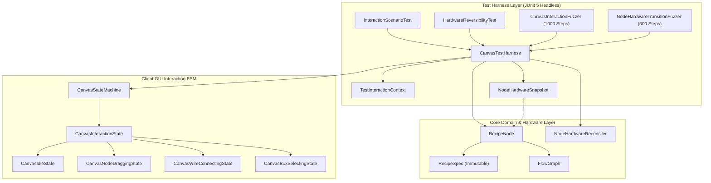

# ADR-062: 헤드리스 캔버스 인터랙션 및 노드 하드웨어 전이 가역성 테스트 하네스·퍼징 시스템 명세
(Headless Canvas Interaction and Node Hardware Transition Reversibility Test Harness & Fuzzing System Specification)

- **문서 번호**: ADR-062
- **대상 버전**: `v2.4.1`
- **상태**: `IMPLEMENTED`
- **결정/완료일**: 2026-09-26
- **주관 계층**: Client GUI Layer (`client.gui.interaction`, `client.gui.interaction.state`), Core Domain Layer (`api.model`), Test Infrastructure Layer (`src/test/java/.../client/gui/interaction`)

---

## 1. 개요 및 배경 (Motivation)

### 1.1 기술적 배경
`GregTechCalculatorBoard`는 복잡한 공정 계산과 시각적 조작성을 지원하기 위해 유한 상태 머신([`CanvasStateMachine`](file:///d:/dev-ssd/modding/minecraft/GregTechCalculatorBoard/src/main/java/com/gtceu/calcboard/client/gui/interaction/state/CanvasStateMachine.java)) 기반 캔버스 조작 계층과 [`NodeHardwareReconciler`](file:///d:/dev-ssd/modding/minecraft/GregTechCalculatorBoard/src/main/java/com/gtceu/calcboard/api/model/NodeHardwareReconciler.java) 기반 노드 하드웨어 전이 모델을 결합하여 운영합니다.

### 1.2 문제점 분석
1. **수동 인게임 테스트 비용의 과도한 발생**:
   - 인터랙션 상태 전이나 하드웨어 변경 수치를 검증하기 위해 클라이언트를 실행하고 월드에 진입하여 보드를 여는 데 매번 과도한 시간이 소모되었습니다.
   - 드래그 중 우클릭 취소, 와이어 연결 중 ESC, 박스 선택 등 다양한 조작 순열을 수동 검증만으로 전수 커버하기 불가능했습니다.
2. **기계 변경 및 부스팅 탈착 시 레시피 데이터 가역성 훼손 위험**:
   - 특정 기계로 변경 후 부스팅 애드온을 장착했다가 원복할 때, 원본 레시피 스펙([`RecipeSpec`](file:///d:/dev-ssd/modding/minecraft/GregTechCalculatorBoard/src/main/java/com/gtceu/calcboard/api/model/RecipeSpec.java))이나 내부 수치가 불변성을 유지하지 못하고 오염될 잠재적 위험이 존재했습니다.
3. **GUI 화면 및 OpenGL 렌더러 결합**:
   - [`CanvasInteractionContext`](file:///d:/dev-ssd/modding/minecraft/GregTechCalculatorBoard/src/main/java/com/gtceu/calcboard/client/gui/interaction/state/CanvasInteractionContext.java)가 GLFW 창 및 GUI 화면에 직접 결합되어 있어 헤드리스 JUnit 단위 테스트 환경에서 단독 구동하기 어려웠습니다.

### 1.3 설계 목표
- **헤드리스 테스트 하네스(`CanvasTestHarness`)**: GLFW/OpenGL 창 의존성 없이 마우스 및 키보드 조작 이벤트를 디스패치하여 0.1초 이내에 인터랙션 상태 전이를 검증하는 인프라 구축.
- **하드웨어 가역성 스냅샷 모델(`NodeHardwareSnapshot`)**: 노드의 하드웨어 속성 및 원본 레시피 스펙 불변성을 캡처하고 원복 후 $100\%$ 수치 일치를 단언하는 가역성 검증 체계 확립.
- **2대 의사 난수 퍼징 시스템 (`Fuzzing Engine`)**:
  - `CanvasInteractionFuzzer`: 1,000단계 무작위 UI 이벤트 스트림 주입을 통한 예외 발생 방어 및 안정 상태(`CanvasIdleState`) 복귀 검증.
  - `NodeHardwareTransitionFuzzer`: 500단계 무작위 하드웨어 변이 주입 및 원복을 통한 6대 불변식 유지 검증.

---

## 2. 세부 설계 및 결정 사항 (Architecture Decision)

### 2.1 계층 구조 및 데이터 흐름

### 2.2 주요 컴포넌트별 책임 분리 명세

1. **`TestInteractionContext` (`client.gui.interaction`)**:
   - `CanvasInteractionContext`를 상속하여 헤드리스 `BoardScreen`을 안전하게 주입하고 GLFW/SoundManager 호출 없이 더미 핸들러를 바인딩합니다.
   - `createHeadlessScreen`을 통해 격리된 `BoardPage`를 활성 페이지로 구성하고 1920×1080 기본 뷰포트 크기를 보장합니다.
2. **`CanvasTestHarness` (`client.gui.interaction`)**:
   - Fluent API 스타일로 `mouseDown`, `mouseDrag`, `mouseUp`, `pressKey`, `startWire`, `boxSelect`, `dragNode` 등을 연속 디스패치합니다.
   - `changeMachine`, `setVoltageTier`, `attachAddon`, `detachAddon`, `setParallel` 등 하드웨어 변이 메서드를 제공합니다.
   - `assertState`, `assertIdle`, `assertReversible`, `assertSpecUnpolluted` 단언 헬퍼를 통해 검증 가독성을 확보합니다.
3. **`NodeHardwareSnapshot` (`client.gui.interaction`)**:
   - 노드의 기계 아이콘, 타깃 전압 티어, 레시피 티어, 병렬수, 멀티블록 여부, 애드온 목록, 전력 소비량 및 원본 `RecipeSpec`을 불변 레코드 형태로 캡처합니다.
   - `restoreTo(RecipeNode)`를 통해 캡처 시점의 상태로 복원합니다.
4. **`CanvasInteractionFuzzer` (`client.gui.interaction`)**:
   - 고정 시드(`0xCAFE_BABE_0001L`) 기반 의사 난수 생성기로 마우스 클릭, 드래그, 휠, ESC 등 1,000단계의 무작위 인터랙션 이벤트를 주입합니다.
   - 퍼징 완료 후 상태 머신이 반드시 `CanvasIdleState`로 복귀하고 드래그 버퍼가 완전히 정리됨을 단언합니다.
5. **`NodeHardwareTransitionFuzzer` (`client.gui.interaction`)**:
   - 고정 시드(`0xDEAD_BEEF_0042L`) 기반 500단계 무작위 하드웨어 변이(티어 변경, 기계 교체, 애드온 장착/탈착, 병렬 변경)를 수행합니다.
   - 각 변이 단계마다 6대 불변식(EU/t 양수성, 소요 시간 양수성, 병렬 상한 클램핑, 레시피 스펙 불변성, 애드온 티어 일치성, 포트 개수 일관성)을 즉각 검증하며, 초기 상태 복구 시 오차가 $0$임을 단언합니다.

---

## 3. 결과 및 파급 효과 (Consequences)

### 3.1 긍정적 효과
1. **초고속 회귀 검증 파이프라인 확립**:
   - 인게임 수동 테스트에 소요되던 시간을 수 초 이내의 JUnit 단위 테스트 실행으로 단축하여 개발 피드백 루프를 가속화했습니다.
2. **하드웨어 가역성 및 레시피 오염 방지 보장**:
   - 복합적인 기계 교체 및 애드온 장착/탈착 시나리오에서도 원본 레시피 스펙과 계산 필드가 보존됨을 정량적으로 증명했습니다.
3. **복합 조작 엣지 케이스 자가 복구력 향상**:
   - 1,000회 UI 퍼징 및 500회 하드웨어 전이 퍼징을 통해 잠재적 NPE 및 교착 상태를 사전 차단했습니다.

### 3.2 검증 결과
- `HardwareReversibilityTest`: 4개 테스트 전수 통과 (라운드트립 기계 변경, 티어 변경, 병렬 애드온, 스냅샷 복원).
- `InteractionScenarioTest`: 7개 시나리오 전수 통과 (노드 드래그/취소, 커밋, 와이어 연결/취소, 박스 선택).
- `CanvasInteractionFuzzer`: 1,000단계 UI 퍼징 무결격 통과.
- `NodeHardwareTransitionFuzzer`: 500단계 하드웨어 변이 퍼징 및 6대 불변식 검증 무결격 통과.
