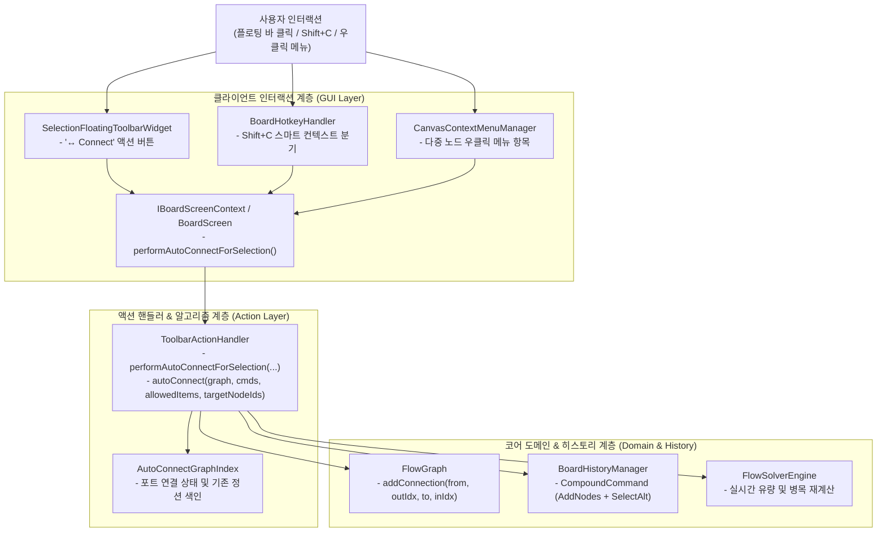

# ADR-063: 선택 노드 한정 컨텍스트 자동 연결 명세
(Selection Contextual Auto-Connect Specification)

- **문서 번호**: ADR-063
- **대상 버전**: `v2.4.0`
- **상태**: `IMPLEMENTED`
- **결정/완료일**: 2026-09-26
- **주관 계층**: Client GUI Layer (`client.gui.widget`, `client.gui.action`, `client.gui.interaction`), Action Dispatcher (`client.gui.api`)
- **핵심 주제**: 다중 선택된 노드 집합 대상 한정 자동 연결(Contextual Scoped Auto-Connect), 다중 선택 플로팅 툴바(`SelectionFloatingToolbarWidget`) 내 원클릭 연결 액션 추가, `Shift+C` 핫키 컨텍스트 스마트 분기, 컨텍스트 메뉴 확장, 단일 원자적 `CompoundCommand` 트랜잭션 롤백 보장.

---

## 1. 개요 및 배경 (Motivation)

### 1.1 현재 전체 자동 연결의 한계 및 사용자 페인포인트

기존의 자동 연결 알고리즘은 캔버스 내의 전체 노드(`graph.getNodes()`)를 탐색 범위로 삼기 때문에 다음과 같은 실사용 문제가 발생했습니다:

1. **대규모 공정 내 원치 않는 배선 오염 (Spaghetti Wiring & Cross-Contamination)**:
   - 기계가 수십 개 이상 배치된 대형 공정 후반부에서 새로운 2~3개 기계를 추가하고 자동 연결을 실행하면, 기존 다른 공정 라인에서 공급·배출되던 동일 자원(정제수, 산소, 폐산 등)이 새 기계로 무작정 연결되거나, 새 기계의 출력이 엉뚱한 먼 기계로 잘못 배선되는 문제가 있었습니다.
2. **자원 필터 다이얼로그(`AutoConnectFilterDialog`)의 한계**:
   - 자원 단위로 체크박스를 해제하여 특정 물질을 제외할 수는 있으나, "동일한 산소/정제수"를 새로운 라인 A-B 사이에서만 연결하고 기존 라인 C-D로는 보내지 않아야 하는 공간적·논리적 격리 요구를 만족할 수 없었습니다.
3. **커뮤니티 핵심 피드백 반영**:
   - "전체 노드가 아니라 선택된 노드끼리만 자동 연결하는 옵션(make auto connect between selected nodes an option, not all nodes)"에 대한 사용자 요구를 반영하여 본 결정을 수립했습니다.

### 1.2 개선 목표

- **원클릭 플로팅 툴바 UI**: 노드가 2개 이상 선택되었을 때 상단에 나타나는 다중 선택 플로팅 바에 `↔ Connect` 버튼을 배치하여 마우스 조작만으로 즉시 배선.
- **스마트 핫키 라우팅**: 캔버스에서 `Shift+C` 입력 시 선택된 노드가 2개 이상이면 자동으로 선택 노드 한정 모드로 동작하고, 선택이 없거나 1개일 때는 기존 전체 대상 다이얼로그/동작 유지.
- **우클릭 컨텍스트 메뉴 지원**: 다중 선택 상태에서 우클릭 시 컨텍스트 메뉴에 "선택 노드 자동 연결" 항목 노출.
- **원자적 실행 취소(Undo) 보장**: 생성된 모든 연결 간선 및 대체 레시피 포트 전환을 단일 `CompoundCommand`로 묶어 `Ctrl+Z` 1회로 완전 롤백.

---

## 2. 세부 설계 및 결정 사항 (Architecture Decision)

### 2.1 아키텍처 다이어그램

### 2.2 클래스별 책임 및 구현 상세

1. **`ToolbarActionHandler` 핵심 엔진 확장**:
   - `autoConnect(FlowGraph graph, List<BoardCommand> subCommands, Set<ResourceLocation> allowedItemIds, Set<String> targetNodeIds)` 오버로딩 메서드 추가.
   - 발신 노드(`from`)와 수신 노드(`to`)가 `targetNodeIds`에 속해 있는지 엄격히 검사하여 범위 외 노드로의 배선 탐색 차단.
   - 발신 노드의 외부 정션 연결 시 `isOutputFeedingReroute(graph, fromNodeId, outIdx, targetNodeIds)`로 선택 집합 외부 정션을 격리하여 선택 대상 소비자 노드로의 정상 연결을 보장하며, 내부 정션이 함께 선택된 경우 직결 바이패스 중복 간선 생성을 동적으로 억제.
   - 수신 노드 측의 기존 정션(Reroute) 우회 리다이렉션 시 `targetNodeIds` 포함 여부를 검사하여, 선택 범위 밖의 외부 정션으로 배선이 누출되는 현상을 차단.
   - `performAutoConnectForSelection(IBoardScreenContext screen, Set<String> targetNodeIds)`를 통해 최소 2개 이상 노드 선택 여부를 검증하고, 복합 명령 발행 및 전용 토스트 알림·사운드를 트리거.
2. **`ToolbarWidget` 및 `IBoardActionDispatcher`**:
   - `IBoardActionDispatcher` 인터페이스에 `default void performAutoConnectForSelection()` 메서드 추가로 하위 호환성 유지.
   - `ToolbarWidget` 및 `ToolbarActionHandler`에 인스턴스 위임 메서드 추가로 객체지향 캡슐화 완성.
   - `BoardScreen`에서 `getSelectedNodeIds().size() >= 2`를 확인 후 `toolbarWidget.performAutoConnectForSelection(...)`으로 위임.
3. **`SelectionFloatingToolbarWidget`**:
   - `ToolbarAction` 레코드에 `BooleanSupplier available` 조건을 추가하여 기본값을 유지하면서 동적 표시 제어 구현.
   - 노드가 2개 이상 선택된 경우에만 `↔ Connect` 버튼이 동적으로 계산되어 툴바 첫 번째 액션으로 표시.
   - 헤드리스 및 런타임 환경에서 `playClickSound()` null 안전성 확보.
4. **`BoardHotkeyHandler`**:
   - `Shift+C` 입력 시 선택된 노드 수가 2개 이상이면 `performAutoConnectForSelection()`, 1개 이하이면 기존 `performAutoConnect()` 다이얼로그 호출로 지능적 라우팅.
5. **`CanvasContextMenuManager`**:
   - `openForSelection` 호출 시 선택된 노드가 2개 이상이면 `gui.gtcalcboard.menu.auto_connect` 메뉴 항목을 우클릭 목록에 노출.

---

## 3. 결과 및 파급 효과 (Consequences)

### 3.1 긍정적 효과

- **정밀한 국소 배선 워크플로우**: 대규모 복합 공정 도면에서도 특정 기계군만 선택하여 안전하고 빠르게 자동 배선 가능.
- **불필요한 배선 방지**: 범위 밖의 다른 기계나 외부 정션 노드로 불필요한 와이어가 생성되지 않음.
- **외부 정션 보유 기계 배선 보장**: 발신 기계가 이미 다른 라인의 외부 정션으로 공급 중이어도, 선택된 새로운 소비자 기계로 정상 배선 수립.
- **다중 진입 경로 제공**: 플로팅 툴바 원클릭, `Shift+C` 단축키, 우클릭 컨텍스트 메뉴 모두에서 일관된 사용자 경험 제공.
- **원자적 실행 취소 안정성**: 여러 가닥의 연결선 및 대체 포트 설정이 단 1회의 `Ctrl+Z`로 복구됨.

### 3.2 단위 테스트 검증 결과

- `SelectionAutoConnectTest`:
  - 선택 집합 한정 배선 검증 (외부 노드 연결 차단 확인).
  - 전체 노드 대상 배선 회귀 검증 (`targetNodeIds = null`).
  - 외부 정션 노드 배선 누출 차단 및 내부 정션 노드 연결 수립 검증.
  - 외부 정션을 보유한 발신 노드의 선택 대상 소비자 정상 연결 검증.
  - 미연결 내부 정션 포함 다중 선택 시 직결 바이패스 중복 배선 방지 검증.
  - 선택 노드 간 대체 레시피 포트 전환 및 복합 명령 Undo/Redo 완전 롤백 검증.
  - 노드 2개 미만 선택 및 null 그래프 방어 가드 검증.
- `SelectionFloatingToolbarTest`:
  - 노드 선택 수에 따른 `↔ Connect` 버튼 동적 노출 검증.
  - 헤드리스 클릭 사운드 null-safe 안정성 검증.
- `BoardHotkeyHandlerTest`:
  - `Shift+C` 스마트 분기 및 툴바 널 가드 동작 검증.
- `CanvasContextMenuManagerTest`:
  - 다중 노드 선택 컨텍스트 메뉴 노출 검증.
- 4개 국어(한국어, 영어, 중국어, 러시아어) 다국어 키 일관성 및 무결성 100% 통과 (`check_i18n.py`).
- 정적 린터 검증 100% 준수 (`lint_agent_rules.py --diff`).
