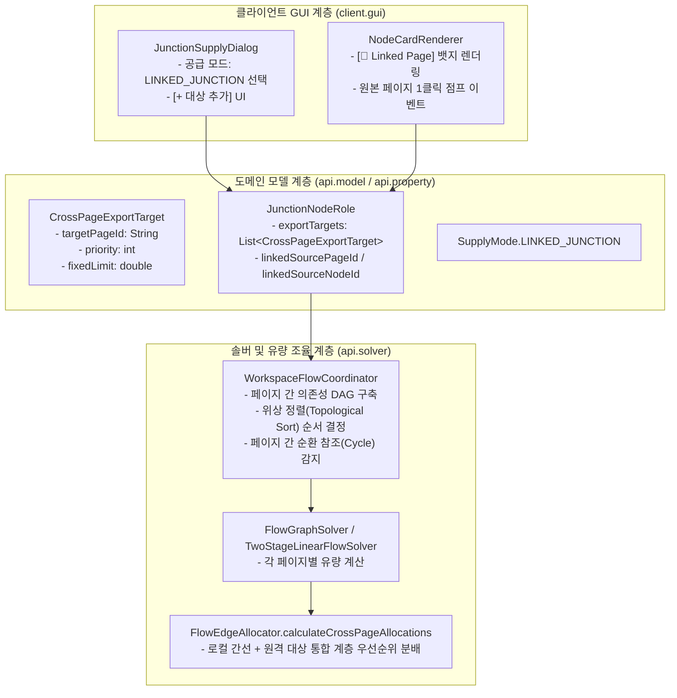
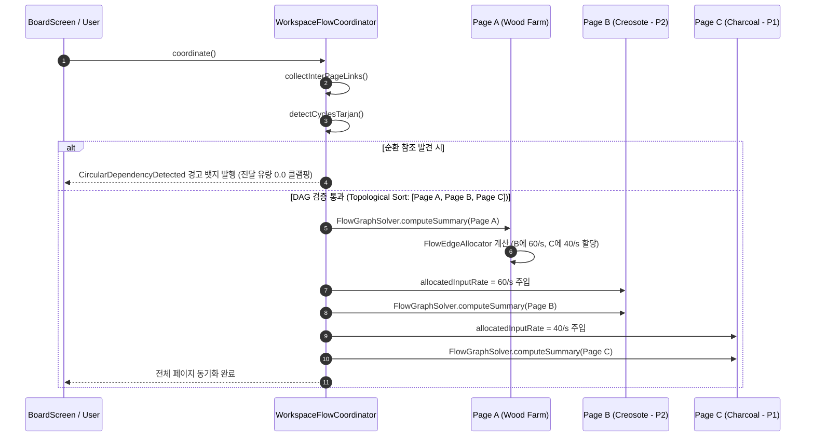

# ADR-064: 페이지 간 정션 유량 분배 및 가상 연동 시스템
(Cross-Page Junction Flow Allocation & Virtual Inter-Page Link System)

- **문서 번호**: ADR-064
- **대상 버전**: `v2.4.1`
- **상태**: 🟢 `Accepted`
- **결정일**: 2026-09-26
- **주관 계층**: Pure Domain Layer (`api.model`, `api.solver`, `api.storage`), Client GUI Layer (`client.gui.dialog`, `client.gui.render`, `client.gui.widget`)
- **관련 ADR**: [ADR-034](ADR_034_JUNCTION_BUFFER_AND_ANCHOR_SYSTEM.md), [ADR-041](ADR_041_JUNCTION_EQUAL_AND_PRIORITY_SPLITTING.md), [ADR-043](ADR_043_DEDICATED_SUBPAGE_COMPOSITE_MODULE_AND_BOUNDARY_IO.md)
- **핵심 주제**: 정션 노드의 1:N 유량 분할 엔진(`FlowEdgeAllocator`)을 활용한 페이지 간 자원 연동, 계층 우선순위(`priority`) 기반 공급자-소비자 분배, 페이지 의존성 DAG 위상 정렬 및 순환 참조 방어.

---

## 1. 개요 및 배경 (Context & Problem Statement)

### 1.1 현황 및 당면 과제

1. **메가베이스 공정 분할과 수급 데이터 단절**:
   - 복합 화학 공정, 거대 발전 단지, 대규모 모드팩 기지 구축 시 수백 개 이상의 기계를 단일 캔버스에 배치하면 시각적 선 얽힘(Spaghetti Wiring)과 렌더링 부하가 발생합니다.
   - 플레이어는 이를 방지하기 위해 공정/티어별로 페이지(`BoardPage`)를 분할하여 관리합니다.
   - 기존 시스템에서는 페이지 간 물리적/논리적 자원 연결 수단이 부재하여, 하류 페이지(예: 크레오소트 열분해 라인)에서 상류 페이지(예: 원목 생산 농장)의 부산물을 사용하려면 정션 노드에 고정 공급량(`Fixed External Supply Rate`)을 수동으로 직접 입력해야 했습니다.

2. **수동 입력의 동기화 피로도 및 인게임 휴먼 에러**:
   - 상류 공정의 기계 대수나 오버클록 티어가 변경될 때마다 하류의 모든 페이지를 일일이 찾아가서 수동으로 입력 수치를 수정해야 했습니다.
   - 수치 불일치로 인해 전체 베이스의 수급 균형이 깨지고, 플레이어는 외부 스프레드시트에 의존하게 되는 주요 원인이 되었습니다.

3. **단순 단방향 참조(`Dynamic Supply`)의 팬텀 공급(Double Dipping) 한계**:
   - 단순히 특정 페이지의 순 생산량을 읽어오는 방식은 다수의 하류 페이지(Page B, Page C)가 동일한 상류 생산량(Page A의 원목 100/s)을 동시에 참조할 때, 실제 가용량은 100/s임에도 양쪽 모두 100/s씩 총 200/s를 소비하도록 계산되는 중복 소비 결함이 발생합니다.

### 1.2 아키텍처 개선 목표

- **도메인 분할 엔진의 100% 재활용**: [ADR-041](ADR_041_JUNCTION_EQUAL_AND_PRIORITY_SPLITTING.md)에서 이미 수학적으로 검증된 계층적 우선순위 티어링(`Hierarchical Priority Tiering`) 및 균등 분할(`FlowSplitMode.EQUAL`) 알고리즘을 그대로 페이지 경계 분배 엔진으로 재활용합니다.
- **공급자-소비자 프록시 모델 (Hub-and-Spoke)**: 캔버스 간 직접적인 물리 와이어 연결 대신, 공급자 정션(Producer Junction)이 여러 소비자 페이지/정션으로 유량을 할당하고, 소비자 정션(Consumer Junction)은 할당받은 유량을 자동으로 공급받는 구조를 확립합니다.
- **결정론적 다중 페이지 솔버 조율 (DAG Orchestration)**: 페이지 간 의존성 유향 비순환 그래프(DAG)를 구성하고, 위상 정렬 순서대로 각 페이지의 `FlowGraphSolver`를 실행하여 결정론적 수렴을 보장합니다.

---

## 2. 핵심 유저 스토리 (User Stories)

| # | 역할 | 행동 (Action) | 기대 결과 (Outcome) |
| :-: | :--- | :--- | :--- |
| **US-1** | 플레이어 | 공급 페이지의 정션 노드에서 "원격 소비자 페이지 추가"를 누르고 대상 페이지와 우선순위(`P: 2`)를 지정한다. | 해당 정션의 총 유출 유량이 로컬 선로 및 원격 페이지들 간의 우선순위 규칙에 따라 정밀하게 분배된다. |
| **US-2** | 플레이어 | 소비 페이지의 정션 노드에서 공급 모드를 `LINKED_JUNCTION`으로 선택하고 원본 공급 정션을 지정한다. | 원본 공급자로부터 자신에게 배정된 실시간 유량이 공급 속도로 자동 주입되어 수동 입력 없이 하류 기계가 계산된다. |
| **US-3** | 플레이어 | 소비 페이지 정션 카드의 `[🔗 Page: Wood Farm]` 링크 뱃지를 좌클릭한다. | 해당 공급자 정션이 위치한 페이지 탭으로 즉시 뷰포트가 전환(Jump)된다. |
| **US-4** | 플레이어 | 여러 소비 페이지의 총 요구량이 공급 페이지의 생산량을 초과하는 설계를 작성한다. | 상위 우선순위 페이지에 유량이 우선 100% 배정되고, 하위 페이지는 잔여량만 배정되며 부족 상태 경고 인디케이터가 표시된다. |
| **US-5** | 플레이어 | Page A ➔ Page B ➔ Page A 형태의 페이지 간 순환 참조를 구성한다. | 시스템이 순환 의존성을 감지하고 정션 카드에 `[⚠ Circular Loop]` 경고 뱃지를 띄우며 무한 루프 계산 동결을 차단한다. |

---

## 3. 결정 사항 (Decision Outcome)

### 3.1 전체 시스템 계층 구조 및 데이터 흐름



### 3.2 도메인 모델 확장 명세

#### 1. `CrossPageExportTarget` 불변 레코드
공급자 정션이 원격 소비자 페이지로 유량을 송출할 때의 타겟 규격입니다.

```java
public record CrossPageExportTarget(
    String targetPageId,
    int priority,
    double fixedLimit
) {
    public CrossPageExportTarget {
        if (targetPageId == null || targetPageId.isBlank()) {
            throw new IllegalArgumentException("targetPageId cannot be blank");
        }
        priority = Math.max(0, Math.min(99, priority));
        fixedLimit = Double.isFinite(fixedLimit) ? Math.max(0.0, fixedLimit) : 0.0;
    }

    public boolean hasFixedLimit() {
        return fixedLimit > 0.0001;
    }

    public boolean hasLimit() {
        return hasFixedLimit();
    }
}
```

#### 2. `JunctionNodeRole` 필드 확장
기존 정션 역할 객체에 원격 송출 리스트 및 원본 링크 정보를 추가합니다.

* **공급자(Producer) 속성**:
  - `List<CrossPageExportTarget> exportTargets`: 본 정션에서 유량을 송출할 원격 페이지 목록.
* **소비자(Consumer) 속성**:
  - `SupplyMode supplyMode`: `SupplyMode.LINKED_JUNCTION` 추가.
  - `String linkedSourcePageId`: 유량을 수신받을 원본 공급 페이지의 고유 ID.
  - `String linkedSourceNodeId`: 원본 공급 페이지 내의 공급자 정션 노드 고유 ID.
  - `double allocatedInputRate`: 공급자 정션으로부터 최종 할당받은 유효 유량(수동 편집 불가, 솔버 주입 필드).

#### 3. 영속화 NBT 규격 (Backward Compatibility)
기존 저장 데이터와의 하위 호환성을 보장하기 위해 신규 NBT 태그는 조건부로 기록합니다:

```
CompoundTag ("role": "JUNCTION")
 ├── "supplyMode": "LINKED_JUNCTION" (String, 존재할 경우)
 ├── "linkedSourcePage": "page_uuid_123" (String, 존재할 경우)
 ├── "linkedSourceNode": "node_uuid_456" (String, 존재할 경우)
 └── "exportTargets": ListTag of CompoundTag
      ├── [0]: { "pageId": "page_uuid_789", "priority": 2, "limit": 60.0 }
      └── [1]: { "pageId": "page_uuid_abc", "priority": 1, "limit": 0.0 }
```

---

## 4. 계산 알고리즘 및 다중 페이지 솔버 조율 (Algorithms)

### 4.1 가상 선로 통합 및 유량 분할 알고리즘

공급자 정션 노드의 유효 출력 유량 $Q_{\text{out}}$을 분배할 때, 로컬 연결 간선(`ConnectionEdge`)과 원격 타겟(`CrossPageExportTarget`)을 하나의 공통 할당 풀로 추상화합니다.

1. **가상 간선 래핑**:
   - 각 `CrossPageExportTarget`을 가상의 선로(요구량 $D_k = \text{원격 페이지 정션의 총 수요량}$, 우선순위 $P_k$, 한도 $L_k$)로 변환.
2. **`FlowEdgeAllocator` 위임**:
   - `FlowEdgeAllocator.calculateCrossPageAllocations`를 호출하여 최상위 우선순위 티어부터 순차적으로 유량을 배분하고, 동일 티어 내에서는 노드의 `FlowSplitMode`(`PROPORTIONAL` / `EQUAL`)를 적용.
3. **할당 유량 전파**:
   - 계산 결과 산출된 원격 타겟별 유량 $q_k$를 대상 페이지의 `JunctionNodeRole.allocatedInputRate`로 즉각 기록.

### 4.2 워크스페이스 의존성 DAG 및 위상 정렬 (`WorkspaceFlowCoordinator`)



### 4.3 순환 참조(Inter-page Cycle) 감지 및 방어

* **검출 알고리즘**: 페이지 간의 참조 관계를 인접 리스트(Adjacency List)로 구성한 후, Tarjan 강결합 컴포넌트(SCC) 알고리즘을 수행하여 크기가 2 이상이거나 자기 자신을 가리키는 컴포넌트가 존재할 경우 순환 루프로 판정합니다.
* **방어 정책**:
  - 순환에 참여하는 모든 연관 정션 노드에 `[⚠ Circular Loop]` 경고 뱃지를 부착합니다.
  - 솔버의 무한 재귀 및 교착 상태를 방지하기 위해, 순환이 감지된 선로의 전달 유량을 임시로 $0.0$으로 클램핑하여 계산 루프를 안전하게 차단합니다.

---

## 5. UI / UX 디자인 상세 명세

### 5.1 `JunctionSupplyDialog` 모달 확장

* **수신 설정 (Linked Source)**: 공급 모드 `LINKED_JUNCTION` 선택 시 원본 공급 페이지 및 정션 노드 드롭다운 제공.
* **송출 설정 (Export Targets)**: 원격 소비자 페이지 목록(`[+ 대상 추가]`), 우선순위(`P: 0~99`), 유량 상한선(`Cap`) 입력 및 개별 삭제 지원.

### 5.2 캔버스 노드 카드 뱃지 및 인터랙션

1. **소비자 정션 뱃지 (`[🔗 Page: Timber Farm]` / `[P2]`)**:
   - 정션 노드 카드 상단에 원본 공급 페이지명을 뱃지로 렌더링.
   - 마우스 호버 시 툴팁 제공: `"공급원 페이지: Timber Farm", "공급원 정션: Wood Hub"`.
   - **원클릭 점프**: 뱃지를 좌클릭하면 즉시 해당 원본 페이지 탭으로 화면 전환되고 공급자 정션이 화면 중앙에 포커스됨.
2. **연결 상태 이상 인디케이터**:
   - `[⚠ Broken Link]`: 참조 대상 페이지나 정션 노드가 삭제되었을 때 붉은색 경고 표시.
   - `[⚠ Starved]`: 요구량 대비 공급량이 부족하여 병목이 발생했을 때 주황색 인디케이터 표시.
   - `[⚠ Circular Loop]`: 페이지 간 순환 참조 발생 시 자줏빛 경고 표시.

---

## 6. 승격 검증 기록 (Verification Record)

- [x] `CrossPageExportTarget` NBT 저장/로딩 및 깊은 복제 불변식 검증 테스트 통과.
- [x] 3개 이상 페이지 간 우선순위 연쇄 분배(P2 ➔ P1 ➔ P0) 유량 할당 단위 테스트 통과 (`CrossPageJunctionFlowTest`).
- [x] 페이지 간 A ➔ B ➔ A 순환 참조 감지 및 클램핑 방어 테스트 통과.
- [x] 다국어 번역 키(`en_us.json`, `ko_kr.json`, `zh_cn.json`, `ru_ru.json`) 100% 동기화 및 `tools/check_i18n.py` 통과 (0 Errors).
- [x] 정적 린터(`python tools/lint_agent_rules.py --diff`) 위반 사항 제로 (0 Violations).
