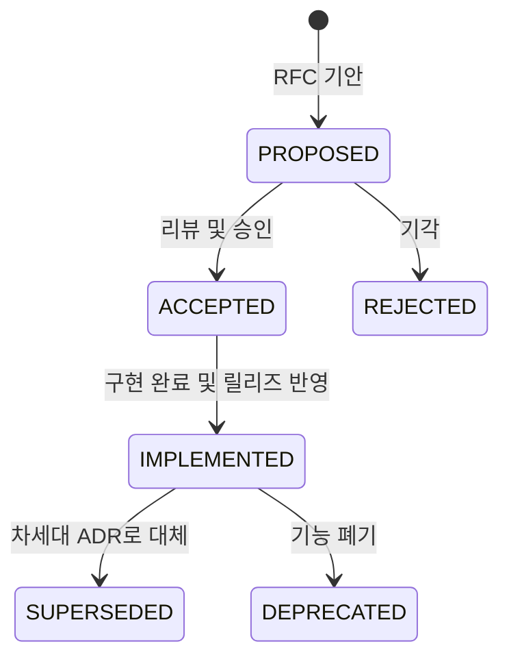

# 아키텍처 결정 기록 (Architecture Decision Records, ADRs)

본 디렉터리는 **GregTech Calculator Board (GTCalcBoard)** 프로젝트의 핵심 기술적 의사결정 맥락(Context), 채택 이유(Why), 시스템 구조(Architecture), 그리고 결과 및 파급 효과(Consequences)를 영구히 기록하고 보존하는 **공식 아키텍처 결정 기록(ADR) 보관소**입니다.

---

## 🏛️ ADR 생명주기 및 상태 (Lifecycle & Status)

| 상태 (Status) | 설명 |
| :--- | :--- |
| **`PROPOSED`** | 새로운 아키텍처 제안이 기안되어 리뷰 및 토론 중인 상태 |
| **`ACCEPTED`** | 제안이 승인되어 향후 버전 개발 목표로 확정된 상태 |
| **`IMPLEMENTED`** | 기능 구현이 완료되어 단위 테스트 통과 및 공식 사양서에 반영된 상태 |
| **`SUPERSEDED`** | 후속 ADR에 의해 설계나 기술이 대체된 상태 (`SUPERSEDED by ADR-XXX`) |
| **`DEPRECATED`** | 더 이상 사용되지 않거나 폐기된 결정 |

---

## 📋 ADR 색인 목록 (ADR Index Registry)

| 번호 | 문서 제목 (Title) | 상태 | 대상 버전 | 결정/완료일 | 핵심 요약 |
| :---: | :--- | :---: | :---: | :---: | :--- |
| **[ADR-001](ADR_001_COMPAT_GUI_HANDLER_ISOLATION_AND_SERVER_SAFETY.md)** | Dedicated Server 계층 격리 및 호환성 계층 무결성 강화 *(Dedicated Server Isolation & Compat Layer Code Integrity)* | 🟢 `IMPLEMENTED` | `v2.0.0` | 2026-08-29 | 데디케이티드 서버 NoClassDefFoundError 방지를 위한 GUI 핸들러 클라이언트 완전 이전 및 어댑터 중립화 |
| **[ADR-002](ADR_002_ARCHITECTURE_DOCS_RESTRUCTURING_AND_SPEC_MODERNIZATION.md)** | 아키텍처 및 기술 사양 문서 체계 대량 개편 및 최신화 *(Architecture Docs Restructuring & Spec Modernization)* | 🟢 `IMPLEMENTED` | `v2.0.0` | 2026-08-29 | 5계층 아키텍처, 5대 그래프 솔버, $128 \times 128$ 와이어 공간 분할 색인 사양서 전면 개편 및 영문 1:1 대칭화 |
| **[ADR-003](ADR_003_MULTIPLAYER_NETWORK_INTEGRITY_AND_SYSTEM_STABILIZATION.md)** | 멀티플레이어 네트워크 무결성, 서버 동시성 안정화 및 원자적 데이터 영속화 사양 *(Multiplayer Network Streaming Integrity & Atomic Persistence)* | 🟢 `IMPLEMENTED` | `v2.0.0` | 2026-08-29 | 512KB C2S 분할 스트리밍, `ATOMIC_MOVE` 원자적 파일 저장소, 접속 종료 시 락 즉시 해제, 프레즌스 타깃 스트리밍 |
| **[ADR-004](ADR_004_CLEAN_ARCHITECTURE_AND_DOMAIN_DECOMPOSITION.md)** | 클린 아키텍처 정립 및 잔여 갓 클래스(God Class) 책임 분해 *(Clean Architecture Realization & God Class Decomposition)* | 🟢 `IMPLEMENTED` | `v2.0.0` | 2026-08-29 | `RecipeNode` 도메인 순수성 회복, `RecipeSearchDialog`, `CanvasInteractionHandler`, `FlowGraphSolver` SRP 4대 클래스 분해 |
| **[ADR-005](ADR_005_MULTIBLOCK_SELECTOR_TUTORIAL_INTEGRATION.md)** | 기계 및 멀티블록 선택(Machine Selector) 튜토리얼 통합 사양 *(Machine & Multiblock Selector Tutorial Integration)* | 🟢 `IMPLEMENTED` | `v2.1.0-alpha.3` | 2026-09-01 | 11단계 튜토리얼 체계 확장, EBF 연습 노드 배치 및 멀티블록 선택 시 다음 스텝 자동 전이 연동 |
| **[ADR-006](ADR_006_TURBINE_AND_MACHINE_PARALLEL_ENHANCEMENT.md)** | 터빈 발전기 소모품 모델링·독립 티어 분리 및 기계 가용 병렬 산출 명세 *(Turbine Consumables, Decoupled Hatch Tiers & Dynamic Machine Parallel Estimation)* | 🟢 `IMPLEMENTED` | `v2.1.0-alpha.3` | 2026-09-01 | 로터 내구도 마모율/수명 모델링, 로터 홀더/다이나모 해치 독립 티어 분리, 윤활유 부스트 토글, $P_{\max}$ 가용 병렬 산출 |
| **[ADR-007](ADR_007_HIERARCHICAL_PAGE_EXPLORER_AND_MACHINE_TEMPLATES.md)** | 계층형 폴더블 페이지 탐색기 및 머신 하드웨어 템플릿 시스템 *(Hierarchical Foldable Page Explorer & Machine Setup Templates)* | 🟢 `IMPLEMENTED` | `v2.1.0-alpha.3` | 2026-09-02 | 다층 폴더 트리 사이드바(`PageBrowserDrawer`), 실시간 검색, `Ctrl+K` 퀵 스위처, 기계 하드웨어 스펙 보존형 원클릭 레시피 복제/교체 시스템 |
| **[ADR-008](ADR_008_AE2_AUTOCRAFTING_PLAN_AND_PRECISION_ETA_INTEGRATION.md)** | AE2 오토크래프팅 플랜 연동 및 패턴-페이지 기반 정밀 ETA 시스템 *(AE2 Autocrafting Plan Integration & Pattern-Page Precision ETA Engine)* | 🟢 `IMPLEMENTED` | `v2.1.0-alpha.3` | 2026-09-02 | RFC-007 기반 `BoardPage` ↔ AE2 가공 패턴 1:1 바인딩, `ICraftingPlan.patternTimes()` 인터셉트 및 $O(K)$ 정밀 ETA/병목 산출 및 딥링크 |
| **[ADR-009](ADR_009_HEADLESS_LAYER_ISOLATION_AND_SERVER_SAFETY.md)** | 헤드리스 계층 격리 및 데디케이티드 서버 안전성 강화 명세 *(Headless Layer Isolation & Dedicated Server Safety Enhancement)* | 🟢 `IMPLEMENTED` | `v2.1.0-alpha.3` | 2026-09-01 | API/Compat 계층의 클라이언트 직접 참조 100% 해소, `SearchableRecipe` 도메인 승격, SPI 주입 및 패킷 DistExecutor 무결성 확보 |
| **[ADR-010](ADR_010_STATIC_REFLECTION_CACHING_AND_CLEAN_EXCEPTION.md)** | 리플렉션 정적 캐싱 및 예외 처리 무결성 개편 명세 *(Static Reflection Caching & Clean Exception Handling)* | 🟢 `IMPLEMENTED` | `v2.1.0-alpha.3` | 2026-09-01 | 런타임 동적 리플렉션의 static final 1회 캐싱, $O(1)$ 직접 호출 최적화, bare catch 제거 및 Headless LinkageError 무결성 보장 |
| **[ADR-011](ADR_011_CONTROL_FLOW_FLATTENING_AND_SELF_DESCRIPTIVE_CODE.md)** | 제어 흐름 평탄화 및 자기 서술적 클린 코드 정비 명세 *(Control Flow Flattening & Self-Descriptive Code Refactoring)* | 🟢 `IMPLEMENTED` | `v2.1.0-alpha.3` | 2026-09-01 | 중첩 깊이 1~2단계 평탄화, 조기 반환 가드 전면 적용, 나열 주석 전면 제거 및 CanvasInteractionHandler 3대 서브 핸들러 분해 |
| **[ADR-012](ADR_012_BOARD_USABILITY_AND_PRECISION_FLOW_MODELING.md)** | 보드 사용성 개선 및 정밀 플로우 모델링 사양 *(Board Usability & Precision Flow Modeling Architecture)* | 🟢 `IMPLEMENTED` | `v2.1.0-alpha.4` | 2026-09-02 | 스크롤바 드래그 수정, 16px 격자 스냅, 프리셋 연동, 커스텀 병렬 정수 지정, 외부/무한 공급원 정션 노드 확장 |
| **[ADR-014](ADR_014_CANVAS_GRAPHICS_PIPELINE_AND_FLOW_SOLVER_OPTIMIZATION.md)** | 대규모 노드 캔버스 그래픽 파이프라인 및 포트 플로우 계산 최적화 명세 *(High-Density Canvas Graphics Pipeline & Port Flow Solver Optimization)* | 🟢 `IMPLEMENTED` | `v2.1.0-alpha.5` | 2026-09-03 | 노드별 glClear 제거, endBatch() 격리 유지, O(1) 포트 플로우 캐싱, 위젯 O(1) 해시 맵, 뷰포트 AABB 컬링, Medium LOD |
| **[ADR-015](ADR_015_BACKGROUND_INDEXING_STABILIZATION_AND_PIPELINE_OPTIMIZATION.md)** | 백그라운드 레시피 인덱싱 파이프라인 및 머신 매트릭스 베이킹 최적화 명세 *(Background Recipe Indexing Pipeline & Machine Capabilities Matrix Baking Optimization)* | 🟢 `IMPLEMENTED` | `v2.1.0-beta.1` | 2026-09-03 | Phase 3(75%) 클라이언트 프리징 해소, EMI 인덱싱 지연 베이킹, O(1) Set 기반 정렬 및 비동기 스레드 동기화 안정화 |
| **[ADR-016](ADR_016_BOARD_SCREEN_MODULAR_DECOMPOSITION.md)** | BoardScreen 모듈화 분해 및 단일 책임 아키텍처 명세 *(BoardScreen Modular Decomposition & Single Responsibility Architecture Specification)* | 🟢 `IMPLEMENTED` | `v2.1.0-beta.1` | 2026-09-03 | 1,920줄 모놀리식 BoardScreen을 BoardDialogManager, BoardCanvasRenderer, BoardActionHandler 4대 서브시스템으로 분해 및 65% 경량화 |
| **[ADR-017](ADR_017_RESPONSIVE_GUI_SCALE_AND_ADAPTIVE_LAYOUT.md)** | GUI 배율 독립 분리 및 멀티블록 카탈로그·툴바 반응형 레이아웃 *(Dedicated Board GUI Scale Decoupling & Multiblock Catalog Responsive Layout)* | 🟢 `IMPLEMENTED` | `v2.1.0-beta.1` | 2026-09-03 | 보드 전용 가상 뷰포트 배율 변환 엔진, 멀티블록 카탈로그 가변 행 및 원클릭 리스트 뷰, 적응형 툴바 및 `[...]` 오버플로우 메뉴 |

---

## 💡 활성 RFC 제안 목록 (Active RFC Proposals)

| 문서 번호 | RFC 제목 | 상태 (Status) | 목표 버전 | 기안일 | 핵심 제안 요약 |
| :---: | :--- | :---: | :---: | :---: | :--- |
| **[RFC-013](../RFC_013_MODULAR_COMBUSTION_COMPLEX_INTEGRATION.md)** | Star Technology 모듈러 연소 복합체(Modular Combustion Complex) 및 프레임 부스팅 발전 시스템 통합 명세 *(Star Technology Modular Combustion Complex & Frame Boosting Integration)* | 🟡 `PROPOSED` | `v2.1.0` | 2026-09-02 | MCF 허브-노드 결합형 모듈러 발전, 윤활유/산화제 2단계 부스팅, 시간당 500B 냉각수 소모 및 다중 유체 시뮬레이션 |

