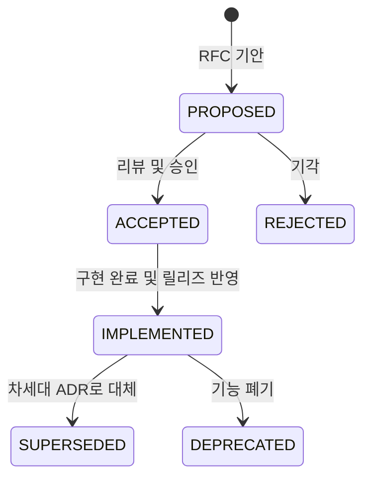

# 아키텍처 결정 기록 (Architecture Decision Records, ADRs)

본 디렉터리는 **GregTech Calculator Board (GTCalcBoard)** 프로젝트의 핵심 기술적 의사결정 맥락(Context), 채택 이유(Why), 시스템 구조(Architecture), 그리고 결과 및 파급 효과(Consequences)를 영구히 기록하고 보존하는 **공식 아키텍처 결정 기록(ADR) 보관소**입니다.

---

## 🏛️ ADR 생명주기 및 상태 (Lifecycle & Status)

| 상태 (Status) | 설명 |
| :--- | :--- |
| **`PROPOSED`** | 새로운 아키텍처 제안이 기안되어 리뷰 및 토론 중인 상태 |
| **`ACCEPTED`** | 제안이 승인되어 향후 버전 개발 목표로 확정된 상태 |
| **`IMPLEMENTED`** | 기능 구현이 완료되어 단위 테스트 통과 및 공식 사양서에 반영된 상태 |
| **`SUPERSEDED`** | 후속 ADR에 의해 설계나 기술이 대체된 상태 (`SUPERSEDED by ADR-XXX`) |
| **`DEPRECATED`** | 더 이상 사용되지 않거나 폐기된 결정 |

---

## 📋 ADR 색인 목록 (ADR Index Registry)

| 번호 | 문서 제목 (Title) | 상태 | 대상 버전 | 결정/완료일 | 핵심 요약 |
| :---: | :--- | :---: | :---: | :---: | :--- |
| **[ADR-001](ADR_001_COMPAT_GUI_HANDLER_ISOLATION_AND_SERVER_SAFETY.md)** | Dedicated Server 계층 격리 및 호환성 계층 무결성 강화 *(Dedicated Server Isolation & Compat Layer Code Integrity)* | 🟢 `IMPLEMENTED` | `v2.0.0` | 2026-08-29 | 데디케이티드 서버 NoClassDefFoundError 방지를 위한 GUI 핸들러 클라이언트 완전 이전 및 어댑터 중립화 |
| **[ADR-002](ADR_002_ARCHITECTURE_DOCS_RESTRUCTURING_AND_SPEC_MODERNIZATION.md)** | 아키텍처 및 기술 사양 문서 체계 대량 개편 및 최신화 *(Architecture Docs Restructuring & Spec Modernization)* | 🟢 `IMPLEMENTED` | `v2.0.0` | 2026-08-29 | 5계층 아키텍처, 5대 그래프 솔버, $128 \times 128$ 와이어 공간 분할 색인 사양서 전면 개편 및 영문 1:1 대칭화 |
| **[ADR-003](ADR_003_MULTIPLAYER_NETWORK_INTEGRITY_AND_SYSTEM_STABILIZATION.md)** | 멀티플레이어 네트워크 무결성, 서버 동시성 안정화 및 원자적 데이터 영속화 사양 *(Multiplayer Network Streaming Integrity & Atomic Persistence)* | 🟢 `IMPLEMENTED` | `v2.0.0` | 2026-08-29 | 512KB C2S 분할 스트리밍, `ATOMIC_MOVE` 원자적 파일 저장소, 접속 종료 시 락 즉시 해제, 프레즌스 타깃 스트리밍 |
| **[ADR-004](ADR_004_CLEAN_ARCHITECTURE_AND_DOMAIN_DECOMPOSITION.md)** | 클린 아키텍처 정립 및 잔여 갓 클래스(God Class) 책임 분해 *(Clean Architecture Realization & God Class Decomposition)* | 🟢 `IMPLEMENTED` | `v2.0.0` | 2026-08-29 | `RecipeNode` 도메인 순수성 회복, `RecipeSearchDialog`, `CanvasInteractionHandler`, `FlowGraphSolver` SRP 4대 클래스 분해 |
