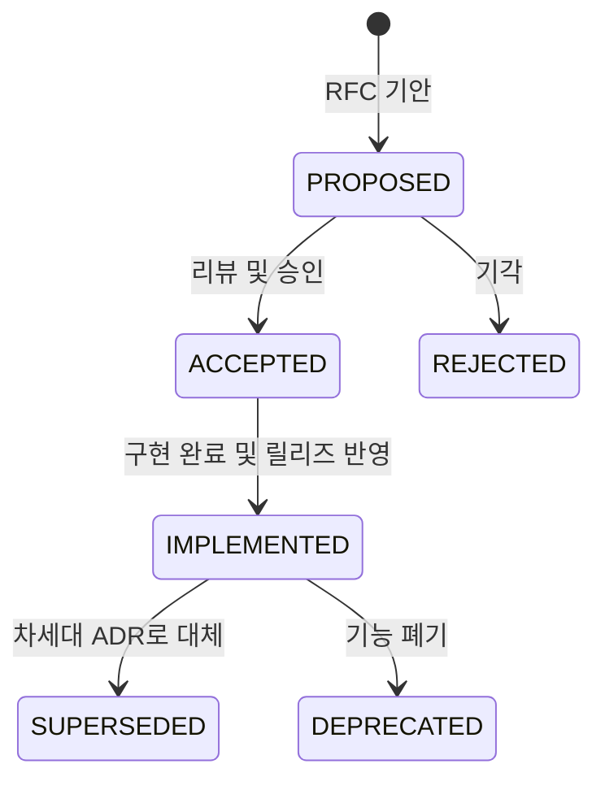

# 아키텍처 결정 기록 (Architecture Decision Records, ADRs)

본 디렉터리는 **GregTech Calculator Board (GTCalcBoard)** 프로젝트의 핵심 기술적 의사결정 맥락(Context), 채택 이유(Why), 시스템 구조(Architecture), 그리고 결과 및 파급 효과(Consequences)를 영구히 기록하고 보존하는 **공식 아키텍처 결정 기록(ADR) 보관소**입니다.

---

## 🏛️ ADR 생명주기 및 상태 (Lifecycle & Status)

| 상태 (Status) | 설명 |
| :--- | :--- |
| **`PROPOSED`** | 새로운 아키텍처 제안이 기안되어 리뷰 및 토론 중인 상태 |
| **`ACCEPTED`** | 제안이 승인되어 향후 버전 개발 목표로 확정된 상태 |
| **`IMPLEMENTED`** | 기능 구현이 완료되어 단위 테스트 통과 및 공식 사양서에 반영된 상태 |
| **`SUPERSEDED`** | 후속 ADR에 의해 설계나 기술이 대체된 상태 (`SUPERSEDED by ADR-XXX`) |
| **`DEPRECATED`** | 더 이상 사용되지 않거나 폐기된 결정 |

---

## 📋 ADR 색인 목록 (ADR Index Registry)

| 번호 | 문서 제목 (Title) | 상태 | 대상 버전 | 결정/완료일 | 핵심 요약 |
| :---: | :--- | :---: | :---: | :---: | :--- |
| **[ADR-001](ADR_001_COMPAT_GUI_HANDLER_ISOLATION_AND_SERVER_SAFETY.md)** | Dedicated Server 계층 격리 및 호환성 계층 무결성 강화 *(Dedicated Server Isolation & Compat Layer Code Integrity)* | 🟢 `IMPLEMENTED` | `v2.0.0` | 2026-08-29 | 데디케이티드 서버 NoClassDefFoundError 방지를 위한 GUI 핸들러 클라이언트 완전 이전 및 어댑터 중립화 |
| **[ADR-002](ADR_002_ARCHITECTURE_DOCS_RESTRUCTURING_AND_SPEC_MODERNIZATION.md)** | 아키텍처 및 기술 사양 문서 체계 대량 개편 및 최신화 *(Architecture Docs Restructuring & Spec Modernization)* | 🟢 `IMPLEMENTED` | `v2.0.0` | 2026-08-29 | 5계층 아키텍처, 5대 그래프 솔버, $128 \times 128$ 와이어 공간 분할 색인 사양서 전면 개편 및 영문 1:1 대칭화 |
| **[ADR-003](ADR_003_MULTIPLAYER_NETWORK_INTEGRITY_AND_SYSTEM_STABILIZATION.md)** | 멀티플레이어 네트워크 무결성, 서버 동시성 안정화 및 원자적 데이터 영속화 사양 *(Multiplayer Network Streaming Integrity & Atomic Persistence)* | 🟢 `IMPLEMENTED` | `v2.0.0` | 2026-08-29 | 512KB C2S 분할 스트리밍, `ATOMIC_MOVE` 원자적 파일 저장소, 접속 종료 시 락 즉시 해제, 프레즌스 타깃 스트리밍 |
| **[ADR-004](ADR_004_CLEAN_ARCHITECTURE_AND_DOMAIN_DECOMPOSITION.md)** | 클린 아키텍처 정립 및 잔여 갓 클래스(God Class) 책임 분해 *(Clean Architecture Realization & God Class Decomposition)* | 🟢 `IMPLEMENTED` | `v2.0.0` | 2026-08-29 | `RecipeNode` 도메인 순수성 회복, `RecipeSearchDialog`, `CanvasInteractionHandler`, `FlowGraphSolver` SRP 4대 클래스 분해 |
| **[ADR-005](ADR_005_MULTIBLOCK_SELECTOR_TUTORIAL_INTEGRATION.md)** | 기계 및 멀티블록 선택(Machine Selector) 튜토리얼 통합 사양 *(Machine & Multiblock Selector Tutorial Integration)* | 🟢 `IMPLEMENTED` | `v2.1.0-alpha.3` | 2026-09-01 | 11단계 튜토리얼 체계 확장, EBF 연습 노드 배치 및 멀티블록 선택 시 다음 스텝 자동 전이 연동 |
| **[ADR-006](ADR_006_TURBINE_AND_MACHINE_PARALLEL_ENHANCEMENT.md)** | 터빈 발전기 소모품 모델링·독립 티어 분리 및 기계 가용 병렬 산출 명세 *(Turbine Consumables, Decoupled Hatch Tiers & Dynamic Machine Parallel Estimation)* | 🟢 `IMPLEMENTED` | `v2.1.0-alpha.3` | 2026-09-01 | 로터 내구도 마모율/수명 모델링, 로터 홀더/다이나모 해치 독립 티어 분리, 윤활유 부스트 토글, $P_{\max}$ 가용 병렬 산출 |
| **[ADR-007](ADR_007_HIERARCHICAL_PAGE_EXPLORER_AND_MACHINE_TEMPLATES.md)** | 계층형 폴더블 페이지 탐색기 및 머신 하드웨어 템플릿 시스템 *(Hierarchical Foldable Page Explorer & Machine Setup Templates)* | 🟢 `IMPLEMENTED` | `v2.1.0-alpha.3` | 2026-09-02 | 다층 폴더 트리 사이드바(`PageBrowserDrawer`), 실시간 검색, `Ctrl+K` 퀵 스위처, 기계 하드웨어 스펙 보존형 원클릭 레시피 복제/교체 시스템 |
| **[ADR-008](ADR_008_AE2_AUTOCRAFTING_PLAN_AND_PRECISION_ETA_INTEGRATION.md)** | AE2 오토크래프팅 플랜 연동 및 패턴-페이지 기반 정밀 ETA 시스템 *(AE2 Autocrafting Plan Integration & Pattern-Page Precision ETA Engine)* | 🟢 `IMPLEMENTED` | `v2.1.0-alpha.3` | 2026-09-02 | RFC-007 기반 `BoardPage` ↔ AE2 가공 패턴 1:1 바인딩, `ICraftingPlan.patternTimes()` 인터셉트 및 $O(K)$ 정밀 ETA/병목 산출 및 딥링크 |
| **[ADR-009](ADR_009_HEADLESS_LAYER_ISOLATION_AND_SERVER_SAFETY.md)** | 헤드리스 계층 격리 및 데디케이티드 서버 안전성 강화 명세 *(Headless Layer Isolation & Dedicated Server Safety Enhancement)* | 🟢 `IMPLEMENTED` | `v2.1.0-alpha.3` | 2026-09-01 | API/Compat 계층의 클라이언트 직접 참조 100% 해소, `SearchableRecipe` 도메인 승격, SPI 주입 및 패킷 DistExecutor 무결성 확보 |
| **[ADR-010](ADR_010_STATIC_REFLECTION_CACHING_AND_CLEAN_EXCEPTION.md)** | 리플렉션 정적 캐싱 및 예외 처리 무결성 개편 명세 *(Static Reflection Caching & Clean Exception Handling)* | 🟢 `IMPLEMENTED` | `v2.1.0-alpha.3` | 2026-09-01 | 런타임 동적 리플렉션의 static final 1회 캐싱, $O(1)$ 직접 호출 최적화, bare catch 제거 및 Headless LinkageError 무결성 보장 |
| **[ADR-011](ADR_011_CONTROL_FLOW_FLATTENING_AND_SELF_DESCRIPTIVE_CODE.md)** | 제어 흐름 평탄화 및 자기 서술적 클린 코드 정비 명세 *(Control Flow Flattening & Self-Descriptive Code Refactoring)* | 🟢 `IMPLEMENTED` | `v2.1.0-alpha.3` | 2026-09-01 | 중첩 깊이 1~2단계 평탄화, 조기 반환 가드 전면 적용, 나열 주석 전면 제거 및 CanvasInteractionHandler 3대 서브 핸들러 분해 |
| **[ADR-012](ADR_012_BOARD_USABILITY_AND_PRECISION_FLOW_MODELING.md)** | 보드 사용성 개선 및 정밀 플로우 모델링 사양 *(Board Usability & Precision Flow Modeling Architecture)* | 🟢 `IMPLEMENTED` | `v2.1.0-alpha.4` | 2026-09-02 | 스크롤바 드래그 수정, 16px 격자 스냅, 프리셋 연동, 커스텀 병렬 정수 지정, 외부/무한 공급원 정션 노드 확장 |
| **[ADR-014](ADR_014_CANVAS_GRAPHICS_PIPELINE_AND_FLOW_SOLVER_OPTIMIZATION.md)** | 대규모 노드 캔버스 그래픽 파이프라인 및 포트 플로우 계산 최적화 명세 *(High-Density Canvas Graphics Pipeline & Port Flow Solver Optimization)* | 🟢 `IMPLEMENTED` | `v2.1.0-alpha.5` | 2026-09-03 | 노드별 glClear 제거, endBatch() 격리 유지, O(1) 포트 플로우 캐싱, 위젯 O(1) 해시 맵, 뷰포트 AABB 컬링, Medium LOD |
| **[ADR-015](ADR_015_BACKGROUND_INDEXING_STABILIZATION_AND_PIPELINE_OPTIMIZATION.md)** | 백그라운드 레시피 인덱싱 파이프라인 및 머신 매트릭스 베이킹 최적화 명세 *(Background Recipe Indexing Pipeline & Machine Capabilities Matrix Baking Optimization)* | 🟢 `IMPLEMENTED` | `v2.1.0-beta.1` | 2026-09-03 | Phase 3(75%) 클라이언트 프리징 해소, EMI 인덱싱 지연 베이킹, O(1) Set 기반 정렬 및 비동기 스레드 동기화 안정화 |
| **[ADR-016](ADR_016_BOARD_SCREEN_MODULAR_DECOMPOSITION.md)** | BoardScreen 모듈화 분해 및 단일 책임 아키텍처 명세 *(BoardScreen Modular Decomposition & Single Responsibility Architecture Specification)* | 🟢 `IMPLEMENTED` | `v2.1.0-beta.1` | 2026-09-03 | 1,920줄 모놀리식 BoardScreen을 BoardDialogManager, BoardCanvasRenderer, BoardActionHandler 4대 서브시스템으로 분해 및 65% 경량화 |
| **[ADR-017](ADR_017_RESPONSIVE_GUI_SCALE_AND_ADAPTIVE_LAYOUT.md)** | GUI 배율 독립 분리 및 멀티블록 카탈로그·툴바 반응형 레이아웃 *(Dedicated Board GUI Scale Decoupling & Multiblock Catalog Responsive Layout)* | 🟢 `IMPLEMENTED` | `v2.1.0-beta.1` | 2026-09-03 | 보드 전용 가상 뷰포트 배율 변환 엔진, 멀티블록 카탈로그 가변 행 및 원클릭 리스트 뷰, 적응형 툴바 및 `[...]` 오버플로우 메뉴 |
| **[ADR-018](ADR_018_RATE_BASED_WIRE_ANIMATION_AND_BOTTLENECK_VISUALIZATION.md)** | 처리량 포화도 기반 와이어 애니메이션 변조 및 실시간 병목 시각화 명세 *(Rate-Based Wire Flow Modulation & Canvas Bottleneck Visualization)* | 🟢 `IMPLEMENTED` | `v2.1.0-beta.2` | 2026-09-04 | Steady-State 포화율($\text{Supply}/\text{Demand}$) 기반 듀티 사이클 간헐적 정지, 3단계 RGB 보간 및 결핍 노드 경고 펄스 연동 |
| **[ADR-019](ADR_019_BYPRODUCT_VOID_MANAGEMENT_AND_SINK_SYSTEM.md)** | 잉여 부산물 폐기 처리 및 보이드 싱크 시스템 명세 *(Byproduct Void Management & Sink System Specification)* | 🟢 `IMPLEMENTED` | `v2.1.0-beta.2` | 2026-09-04 | 캔버스 정션 보이드 싱크(SupplyMode.VOID_SINK), 노드 포트/SummaryOverlay 단위 직접 보이드 마킹(Mark as Void), 유량 수지 차감 엔진 연동 |
| **[ADR-020](ADR_020_HIGH_SPEED_FLOW_BATCHING_AND_EFFICIENCY_MODULATION.md)** | 고속 레시피 애니메이션 배치, 기계 효율 연동형 출력 와이어 흐름 및 분기 노드 우선 배분/배치 버퍼 명세 *(High-Speed Recipe Animation Batching, Machine Efficiency Outgoing Wire Flow, Priority Split & Junction Batch Buffer Specification)* | 🟢 `IMPLEMENTED` | `v2.2.0` | 2026-09-05 | 1초 미만 고속 레시피 $M$배수 파티클 묶음, 결핍 입력선 경고 펄스 vs 기계 가동률($\eta$) 비례 출력선 감속 직교 분리, 정션 고정 유량 우선 배분 및 배치 누적 버퍼 |
| **[ADR-021](ADR_021_GREATE_KINETIC_TIER_ADAPTER_INTEGRATION.md)** | Greate 모드 연동을 위한 AbstractKineticModAdapter 계층 분리 및 티어드 회전 운동 기계 어댑터 명세 *(AbstractKineticModAdapter Class Hierarchy Extraction & Greate Tiered Kinetic Machine Adapter Specification)* | 🟢 `IMPLEMENTED` | `v2.2.0` | 2026-09-04 | AbstractKineticModAdapter 추상 클래스 추출, CreateModAdapter 상속 리팩토링, GreateModAdapter(Priority 95) 10단계 티어 매핑, 회로 번호, 샤프트 허용 용량 검증 |
| **[ADR-022](ADR_022_CLOSED_LOOP_RECIRCULATION_AND_SUPPLY_ALLOCATION.md)** | 폐쇄 순환 공정 자급 자원 보호 및 공급 우선 할당 알고리즘 명세 *(Closed-Loop Recirculation Self-Sustaining Protection & Supply-Filling Allocation Specification)* | 🟢 `IMPLEMENTED` | `v2.2.0-alpha.2` | 2026-09-05 | Tarjan SCC 기반 자급 순환 자원 불변식 감쇠 나선 차단, Greedy Demand-Filling 엣지 할당, 실효 소비량 결손 판정 및 상류 감속(↓) 인디케이터 |
| **[ADR-023](ADR_023_PER_CRAFT_BATCH_VIEW_AND_STOICHIOMETRIC_LOOP_VERIFICATION.md)** | 레시피 1회(배치) 기준 뷰 모드 및 화학양론적 순환 루프 검증 명세 *(Per-Craft Batch View & Stoichiometric Recirculation Loop Verification Specification)* | 🟢 `IMPLEMENTED` | `v2.2.0-alpha.2` | 2026-09-05 | 시간 단위 소거형 1회(1x) 뷰 모드(RateTimeUnit.PER_RECIPE), 모델 B 독립 1회 레시피 뷰, 화학양론적 포트 보존 및 밸런스(✔) 인디케이터 |
| **[ADR-024](ADR_024_TARGET_OUTPUT_RATE_AND_FRACTIONAL_AUTO_RATIO.md)** | 목표 생산량 기반 기계 대수 자동 역산 및 정밀 소수점 Auto-Ratio 명세 *(Target Output Rate Inverse Solver & Fractional Auto-Ratio Precision Scaling Specification)* | 🟢 `IMPLEMENTED` | `v2.2.0-alpha.2` | 2026-09-05 | 출력 포트 Ctrl+클릭 목표치(예: 1/12s, 5/min) 기계 대수 O(1) 역산, 정밀 소수점 Auto-Ratio(Alt+클릭), 앵커 소수점 보존 모드 |
| **[ADR-025](ADR_025_UNIFIED_CANVAS_WORKSPACE_AND_CONTEXT_DRIVEN_UI.md)** | 3-패널 통합 워크스페이스 및 컨텍스트 중심 UI/UX 현대화 명세 *(Unified Canvas Workspace & Context-Driven UI/UX Modernization Specification)* | 🟢 `IMPLEMENTED` | `v2.2.0-alpha.3` | 2026-09-06 | 캔버스/노드 우클릭 컨텍스트 메뉴, 스마트 커넥트 추천, 노드 카드 슬림화 및 비모달 우측 인스펙터, 3-패널 통합 워크스페이스 구축 |
| **[ADR-026](ADR_026_MODAL_DIALOG_STACK_AND_REGISTRY.md)** | 모달 다이얼로그 스택 및 레지스트리 아키텍처 *(Modal Dialog Stack & Registry Architecture)* | 🟢 `IMPLEMENTED` | `v2.2.0-alpha.3` | 2026-09-06 | IBoardModal 공통 인터페이스, LIFO 기반 ModalStack 및 BoardDialogManager 26개 if-else 분기 평탄화 O(1) 디스패치 |
| **[ADR-027](ADR_027_CANVAS_INTERACTION_FINITE_STATE_MACHINE.md)** | 캔버스 인터랙션 유한 상태 머신 명세 *(Canvas Interaction Finite State Machine Specification)* | 🟢 `IMPLEMENTED` | `v2.2.0-alpha.3` | 2026-09-06 | CanvasInteractionState FSM 전면 도입, 10여 개 불리언 플래그 제거, 결정론적 상태 전이 및 $O(1)$ 단일 활성 상태 보장 |
| **[ADR-028](ADR_028_COMPOSABLE_RECIPE_SEARCH_SPECIFICATION.md)** | 합성 가능한 레시피 검색 쿼리 명세 패턴 *(Composable Recipe Search Specification Pattern)* | 🟢 `IMPLEMENTED` | `v2.2.0-alpha.3` | 2026-09-06 | 검색 필터 로직의 Specification Pattern 모듈화, And/Or/Not 선언적 합성 및 비용 기반 단락 평가(Short-Circuit) 최적화 |
| **[ADR-029](ADR_029_MOD_ADAPTER_INTERFACE_SEGREGATION_AND_EXTENSIONS.md)** | IModAdapter 인터페이스 분리(ISP) 및 Extension Object 패턴 명세 *(IModAdapter Interface Segregation & Extension Object Pattern Specification)* | 🟢 `IMPLEMENTED` | `v2.2.0-alpha.3` | 2026-09-06 | IModAdapter 824줄에서 86줄 슬림화, 6대 도메인 Provider 분리 및 Extension Object 패턴 확립, 100% 하위 호환성 유지 |
| **[ADR-030](ADR_030_UNIFIED_NODE_LAYOUT_BOUNDS_AND_HITBOX_MODEL.md)** | 노드 카드 레이아웃 바운즈 단일 출처화 및 통합 히트박스 모델 명세 *(Unified Node Layout Bounds & Single-Source Hitbox Architecture Specification)* | 🟢 `IMPLEMENTED` | `v2.2.0-alpha.4` | 2026-09-07 | 렌더러와 이벤트 판정 코드 간의 오프셋 중복 하드코딩 제거, `NodeLayoutBounds` 기반 $O(1)$ 히트박스 일원화 및 슬림 모드 조작 간섭 해소 |
| **[ADR-031](ADR_031_SHARED_MACHINE_POOL_AUTO_RATIO.md)** | 공유 기계 풀(Shared Machine Pool) 용량 기반 자동 비율 맞춤 명세 *(Shared Machine Pool Capacity-Driven Auto-Ratio Architecture)* | 🟢 `IMPLEMENTED` | `v2.2.0-alpha.4` | 2026-09-07 | 물리 기계 대수/용량(기본 1.0대) 기준 공정 비례 스케일링, 정밀 소수점/정수 올림 분리 지원, 프레임 헤더 원클릭 비율 맞춤 |
| **[ADR-032](ADR_032_AUTO_RATIO_DIVERGENCE_ALERT_AND_GUIDANCE.md)** | 자동 비율 맞춤 폐순환 루프 발산 방어, 경고 뱃지 및 액션 가이드 툴팁 *(Auto-Ratio Recirculation Divergence Detection, Node Warning Badges & Interactive Actionable Guidance)* | 🟢 `IMPLEMENTED` | `v2.2.0-alpha.4` | 2026-09-07 | 폐순환 루프 발산 억제 노드 감지, 노드 카드 [⚠️] 경고 뱃지 렌더링, 원인 및 해결책 안내 가상 툴팁, 원클릭 앵커 지정 및 알림 토스트 |
| **[ADR-033](ADR_033_COMPREHENSIVE_DIVERGENCE_DEFENSE_MATRIX.md)** | 포괄적 공정 발산 방어 매트릭스 및 상황별 진단 가이드 시스템 명세 *(Comprehensive Process Divergence Defense Matrix & Contextual Diagnostic Guidance System)* | 🟢 `IMPLEMENTED` | `v2.2.0-alpha.4` | 2026-09-07 | 증식 루프, 복합 8자 루프, 촉매 감쇠, 앵커 모순, 극미세 수율 7대 발산 시나리오 자동 방어 및 상황별 5행 진단 뱃지/가이드 |
| **[ADR-034](ADR_034_JUNCTION_BUFFER_AND_ANCHOR_SYSTEM.md)** | 정션 노드 동적 잉여/결핍 완충 배선 및 Auto-Ratio 유량 앵커 시스템 *(Junction Dynamic Buffer/Sink Wiring & Auto-Ratio Flow Anchoring System)* | 🟢 `IMPLEMENTED` | `v2.2.0-alpha.4` | 2026-09-07 | 퀵 마커 컨텍스트 드래그(잉여 배출/결핍 공급 1클릭 생성), Void Sink 오버플로우 스필웨이 우선 배분, Fixed 정션 유량 앵커 Auto-Ratio 지원 |
| **[ADR-035](ADR_035_TWO_STAGE_LINEAR_FLOW_SOLVER.md)** | 2단계 선형 연립방정식 유량 솔버 및 정수 양자화 아키텍처 *(Two-Stage Linear Flow Balance Solver & Integer Quantization Architecture)* | 🟢 `IMPLEMENTED` | `v2.2.0-alpha.4` | 2026-09-08 | 가우스 소거법 기반 1단계 연속 유량 균형 연산 및 2단계 정수 양자화를 통한 단 1회 클릭 결정론적 수렴 보장 및 질량 보존 정합 |
| **[ADR-036](ADR_036_KINETIC_GENERATOR_AND_ENERGY_CONVERTER_TAXONOMY.md)** | 회전 운동 동력원 및 에너지 상호 변환기 분류 체계, 가변 RPM 동적 산출 및 뷰어 UI 개편 명세 *(Kinetic Sources & Energy Converter Taxonomy, Dynamic RPM Calculation & Viewer UI Specification)* | 🟢 `IMPLEMENTED` | `v2.2.0` | 2026-09-08 | 4대 카테고리 분리, Windmill Bearing 가변 돛/RPM 수식 산출 모델링, EMI 자가 복제 슬롯 해소 및 단일 소스(SSOT) 검색 인덱싱 일원화 |

---

## 💡 활성 RFC 제안 목록 (Active RFC Proposals)

| 문서 번호 | RFC 제목 | 상태 (Status) | 목표 버전 | 기안일 | 핵심 제안 요약 |
| :---: | :--- | :--- :---: | :---: | :---: | :--- |
| **[RFC-013](../RFC_013_MODULAR_COMBUSTION_COMPLEX_INTEGRATION.md)** | Star Technology 모듈러 연소 복합체(Modular Combustion Complex) 및 프레임 부스팅 발전 시스템 통합 명세 *(Star Technology Modular Combustion Complex & Frame Boosting Integration)* | 🟡 `PARTIALLY_IMPLEMENTED` | `v2.2.0` | 2026-09-02 | Trait 기반 물리/승수(5A~12A, 냉각 1.2x/1.4x) 및 머신 설정 UI 통합 완료(Phase 1), 부수 유체 입력 주입 대기(Phase 2) |
| **[RFC-037](../RFC_037_DOMAIN_PURITY_AND_DETERMINISTIC_DEDUCTION_REFACTORING.md)** | 도메인 엔티티 순수성 회복, 역방향 의존성 격리 및 결정론적 스펙 연역 무결성 개편 명세 *(Domain Purity Restoration, Reverse Dependency Isolation & Deterministic Spec Deduction Refactoring)* | 🔵 `PROPOSED` | `v2.2.0-beta.2` | 2026-09-08 | api.catalog의 compat 역방향 참조 제거(ICapabilityMatrixProvider), RecipeNode 특화 필드 NodePropertyStore 이전, 최후 폴백 path.contains 제거 및 Set Exact Match 일원화, 리플렉션 static 캐싱 |

