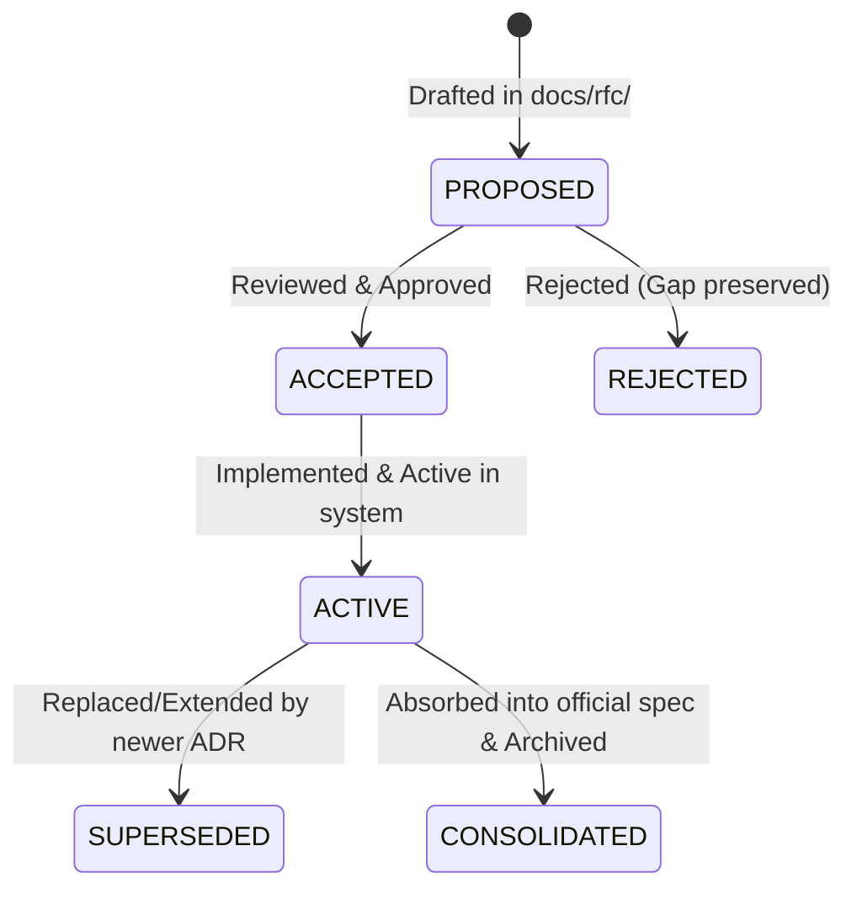
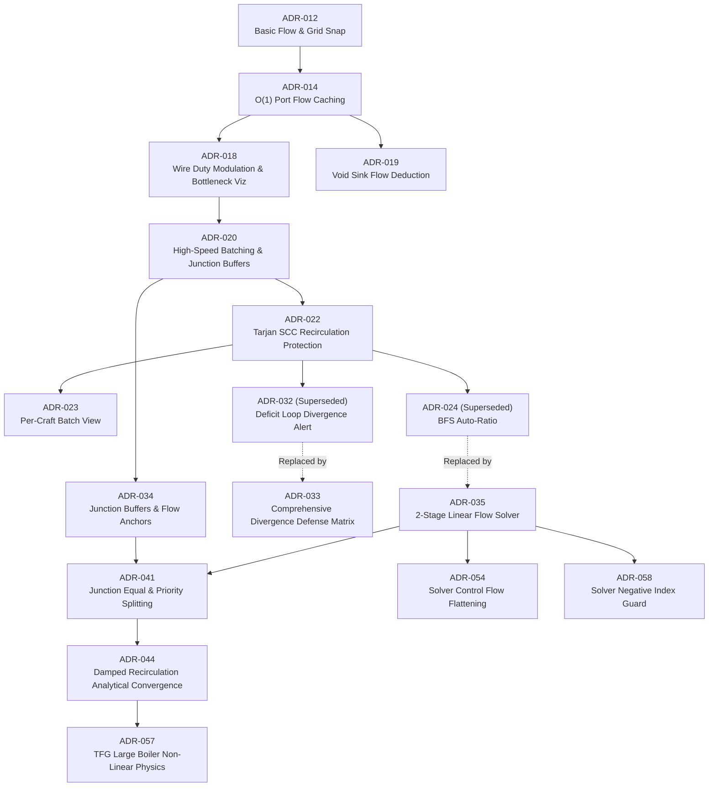
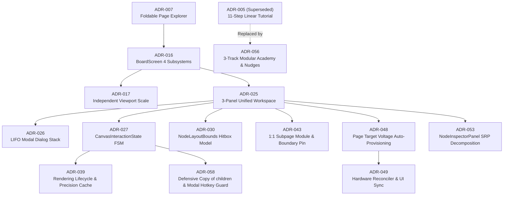
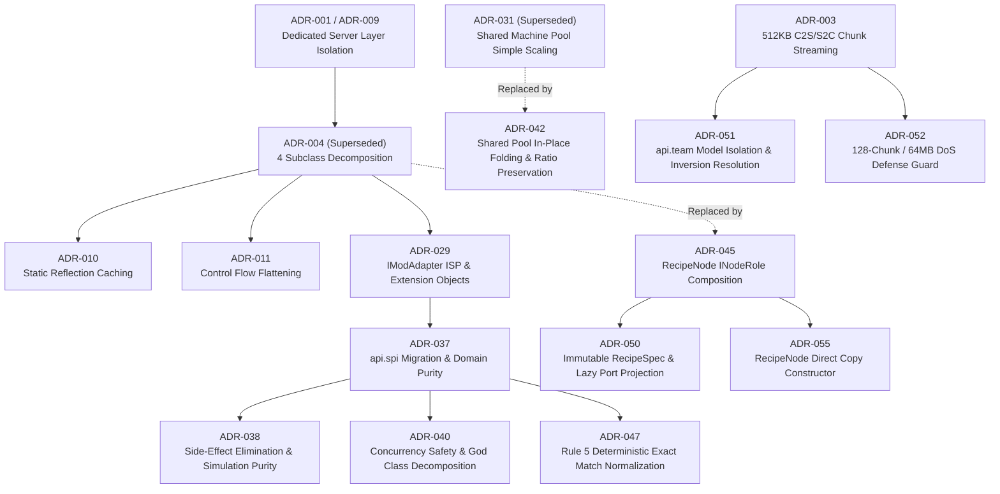

# Architecture Decision Records (ADRs)

> 🌐 **Language / 언어**: **English** | [한국어](README.md)

This directory serves as the official **Architecture Decision Records (ADR) Registry** for the **GregTech Calculator Board (GTCalcBoard)** project, permanently preserving technical context, decision rationale, system architecture, and architectural consequences.

All core architectural decisions, once implemented, are consolidated and structured into the official system specifications ([`docs/en_us/spec/`](../en_us/spec/)). This document provides a complete lifecycle map of all 58 ADRs and their integration with the specifications.

---

## 🏛 ADR Lifecycle & Status Classification

| Status | Count | Description |
| :--- | :---: | :--- |
| 🟢 **`Active`** | **21** | Active decisions directly governing current system architecture, interfaces, and invariants |
| 🔄 **`Superseded`** | **5** | Decisions replaced by subsequent ADRs due to architectural evolution or model upgrades |
| 📦 **`Retired / Consolidated`** | **31** | Decisions fully integrated and codified into the official specifications ([`docs/en_us/spec/`](../en_us/spec/)) |
| ❌ **`Rejected`** | **1** | Proposals permanently rejected during technical review and preserved as gaps (`RFC-046`) |
| **Total** | **58** | Total registered architecture decision and gap records |

---

## 🗺 Core Architecture Evolution Lineage

### 1. Flow Solver & Mathematics Evolution

### 2. Canvas GUI & Interaction Evolution

### 3. Domain Models, SPI & Networking Evolution

---

## 🟢 Active ADR Registry (21 Active Decisions)

These active decisions directly govern the core invariants, data structures, computation algorithms, and interactions of the current codebase.

| ID | Title | Target Ver. | Governing Layer | Related Specification | Core Decision Summary |
| :---: | :--- | :---: | :--- | :--- | :--- |
| **[ADR-037](ADR_037_DOMAIN_PURITY_AND_DETERMINISTIC_DEDUCTION_REFACTORING.md)** | Domain Entity Purity, Reverse Dependency Isolation, and Deterministic Deduction Specification | `v2.2.0-beta.2` | Core Domain (`api.spi`) | [01. Core Domain](../en_us/spec/01_CORE_DOMAIN_AND_MODELS.md) | Migrated `IModAdapter` to `api.spi` to eliminate API ➔ Compat reverse references; removed mod-specific fields from `RecipeNode`. |
| **[ADR-038](ADR_038_LEGACY_CALCULATION_ALGORITHM_AND_SIMULATION_PURITY_REFACTORING.md)** | Legacy Calculation Algorithm and Physical Simulation Purity Refactoring Specification | `v2.2.0-beta.2` | Solver & Physics (`api.solver`) | [02. Math & Algorithms](../en_us/spec/02_MATH_AND_ALGORITHMS.md) | Eliminated in-place port mutations during calculation; isolated cache invalidation from UI rendering loops. |
| **[ADR-039](ADR_039_RENDERING_LIFECYCLE_AND_PRECISION_CACHE_INVALIDATION.md)** | Rendering Lifecycle Optimization, Precision Cache Invalidation, and Graph Traversal Refactoring Specification | `v2.2.0-beta.2` | Client GUI (`client.gui.*`) | [03. UI & Rendering](../en_us/spec/03_UI_AND_RENDERING_PIPELINE.md) | Localized bounds updating on sticky note/frame movement; cached viewer focus reflection targets. |
| **[ADR-040](ADR_040_RUNTIME_CONCURRENCY_REFLECTION_AND_GOD_CLASS_DECOMPOSITION.md)** | Runtime Concurrency Integrity, Reflection Optimization, and God-Class Modularization Specification | `v2.2.0-beta.3` | Core & Compat (`api.*`, `compat.*`) | [01. Core Domain](../en_us/spec/01_CORE_DOMAIN_AND_MODELS.md) | Thread-safe machine catalog, text cache reload hooks, 251 static reflection fields, decomposed 7 God classes. |
| **[ADR-041](ADR_041_JUNCTION_EQUAL_AND_PRIORITY_SPLITTING.md)** | Junction Node Equal Splitting and AE2-Style Priority Flow Distribution System Specification | `v2.2.0-beta.2` | Solver & Model (`api.model`, `api.solver`) | [02. Math & Algorithms](../en_us/spec/02_MATH_AND_ALGORITHMS.md) | Implemented `1/N` equal flow splitting and cascade flow distribution based on integer connection `priority`. |
| **[ADR-042](ADR_042_SHARED_MACHINE_POOL_IN_PLACE_FOLDING_AND_RATIO_PRESERVATION.md)** | Shared Machine Pool Non-Destructive In-Place Folding and Ratio-Preserving Virtual Machine Card Specification | `v2.2.0-beta.3` | Domain & GUI (`api.model`, `client.gui`) | [01. Core Domain](../en_us/spec/01_CORE_DOMAIN_AND_MODELS.md) | Non-destructive canvas group folding, virtual machine card abstraction, and ratio-preserving recipe scaling. |
| **[ADR-043](ADR_043_DEDICATED_SUBPAGE_COMPOSITE_MODULE_AND_BOUNDARY_IO.md)** | Dedicated Subpage Composite Process Module and Boundary I/O Pin Standardization Specification | `v2.2.0-beta.3` | Domain & Storage (`api.model`, `api.storage`) | [01. Core Domain](../en_us/spec/01_CORE_DOMAIN_AND_MODELS.md) | 1:1 dedicated subpage (`PageType.MODULE`) isolation, double-click canvas navigation, and boundary pin interface contract. |
| **[ADR-044](ADR_044_DAMPED_RECIRCULATION_LOOP_SOLVER_AND_STEADY_STATE_VISUALIZATION.md)** | Closed-Form Analytical Convergence and Steady-State Visualization for Damped Recirculation Loops | `v2.2.0-beta.3` | Solver & UI (`api.solver`, `client.gui`) | [02. Math & Algorithms](../en_us/spec/02_MATH_AND_ALGORITHMS.md) | Closed-form geometric series convergence ($S = \frac{S_{\text{ext}}}{1-r}$) and steady-state operating status indicators. |
| **[ADR-045](ADR_045_RECIPE_NODE_COMPOSITION_DECOMPOSITION.md)** | RecipeNode Role Composition Decomposition and Immutable Calculation Snapshot Architecture | `v2.2.1` | Core Domain (`api.model.role`) | [01. Core Domain](../en_us/spec/01_CORE_DOMAIN_AND_MODELS.md) | Slimmed `RecipeNode`, decomposed 4 core roles (`Machine`, `Module`, `Junction`, `BoundaryPin`) via `INodeRole` composition. |
| **[ADR-047](ADR_047_COMPAT_DETERMINISTIC_EXACT_MATCH_NORMALIZATION.md)** | Mod Compatibility Layer Legacy Fallback Elimination and Rule 5 Deterministic Normalization | `v2.2.1` | Compat SPI (`compat.*`) | [05. Mod Integration](../en_us/spec/05_INTEGRATION_AND_I18N.md) | Removed all string `contains` heuristics; enforced exact-match mapping tables and strongly typed validation. |
| **[ADR-048](ADR_048_PAGE_TARGET_VOLTAGE_AND_MULTIBLOCK_ENERGY_HATCH_PROVISIONING.md)** | Per-Page Target Voltage Tier and Multiblock Energy Hatch Auto-Provisioning Specification | `v2.2.1` | UI & Domain (`client.gui`, `api.storage`) | [03. UI & Rendering](../en_us/spec/03_UI_AND_RENDERING_PIPELINE.md) | Page-level `defaultVoltageTier`; automated overclocking and multiblock energy hatch transaction provisioning on node placement. |
| **[ADR-049](ADR_049_MACHINE_RECIPE_TRANSITION_RECONCILER_AND_UI_SYNC.md)** | Hardware Reconciler and Reactive UI Synchronization on Machine/Recipe Transition Specification | `v2.2.1` | Domain & UI (`api.model`, `client.gui`) | [03. UI & Rendering](../en_us/spec/03_UI_AND_RENDERING_PIPELINE.md) | Idempotent transition repair via `NodeHardwareReconciler`, complete hardware mementos, dialog `rebindUI` synchronization. |
| **[ADR-050](ADR_050_IMMUTABLE_RECIPE_SPEC_AND_DYNAMIC_PORT_PROJECTION.md)** | Immutable Recipe Specification and Dynamic Hardware Port Projection Architecture Specification | `v2.2.1` | Core Domain (`api.model`, `api.spi`) | [01. Core Domain](../en_us/spec/01_CORE_DOMAIN_AND_MODELS.md) | Introduced immutable `RecipeSpec`; separated Core vs Auxiliary ports with lazy dynamic projection (`IPortProjectionProvider`). |
| **[ADR-051](ADR_051_CLIENT_SERVER_LAYER_INVERSION_RESOLUTION.md)** | Team Workspace Common Model Isolation and Client ➔ Server Layer Inversion Resolution Specification | `v2.3.0` | Domain & Network (`api.team`, `client.team`) | [04. Multiplayer](../en_us/spec/04_MULTIPLAYER_AND_NETWORK_PROTOCOL.md) | Relocated `TeamWorkspacePage` and `CommitLogEntry` to `api.team` to resolve layer inversions across 5 UI classes. |
| **[ADR-052](ADR_052_CHUNKED_PAYLOAD_DOS_DEFENSE_GUARD.md)** | Chunked Payload Reception Upper-Bound Guard and Server Memory Protection Specification | `v2.3.0` | Server & Storage (`server.storage`) | [04. Multiplayer](../en_us/spec/04_MULTIPLAYER_AND_NETWORK_PROTOCOL.md) | Added 128-chunk (64MB) maximum payload limit and chunk index/size guards to `ServerChunkedPayloadAssembler`. |
| **[ADR-053](ADR_053_NODE_INSPECTOR_PANEL_SRP_DECOMPOSITION.md)** | NodeInspectorPanel Single Responsibility Decomposition into 4 Sub-Components Specification | `v2.3.0` | Client UI (`client.gui.inspector`) | [03. UI & Rendering](../en_us/spec/03_UI_AND_RENDERING_PIPELINE.md) | Decomposed 1,199-line panel into `Machine`, `Junction`, `BoundaryPin`, and `PageSettings` sub-inspectors via SRP. |
| **[ADR-054](ADR_054_CONTROL_FLOW_FLATTENING_AND_RULE1_COMPLIANCE.md)** | Solver and Viewer Adapter Core Modules Control Flow Flattening and Rule 1 Compliance Specification | `v2.3.0` | Solver & Viewer (`api.solver`, `integration`) | [02. Math & Algorithms](../en_us/spec/02_MATH_AND_ALGORITHMS.md) | Flattened nested control flow and enforced guard clauses in `FlowSummaryAggregator` and `MassBalanceSolver`. |
| **[ADR-055](ADR_055_RECIPE_NODE_COPY_CONSTRUCTOR_OPTIMIZATION.md)** | RecipeNode Direct Copy Constructor and Elimination of NBT Round-Trip Overhead Specification | `v2.3.0` | Core Domain (`api.model`, `api.storage`) | [01. Core Domain](../en_us/spec/01_CORE_DOMAIN_AND_MODELS.md) | Replaced NBT clipboard serialization round-trips with direct in-memory `RecipeNode.copy()` constructors. |
| **[ADR-056](ADR_056_MODULAR_ACADEMY_AND_CONTEXTUAL_TUTORIAL_ARCHITECTURE.md)** | Modular Academy and Contextual Tutorial Architecture Overhaul Specification | `v2.3.0` | Client UI (`client.gui.tutorial`) | [03-04. Search & Tools](../en_us/spec/03_04_RECIPE_SEARCH_AND_TOOLS.md) | Introduced 3-track onboarding (45-second starter, 4 academy chapters, contextual nudges) and integrated tutorial registry. |
| **[ADR-057](ADR_057_TFG_LARGE_BOILER_BOOSTER_MECHANISM.md)** | TFG Large Boiler Booster Mechanism and Non-Linear Physics Model Specification | `v2.3.0` | Compat Physics (`compat.tfg`) | [02. Math & Algorithms](../en_us/spec/02_MATH_AND_ALGORITHMS.md) | TFG Large Boiler (LBB 480PU, LSB 1280PU) 9 booster fluids, water quality tiers (1.5x), $1.5$-power non-linear water consumption curve beyond 480PU, Super Boiler mode. |
| **[ADR-058](ADR_058_CANVAS_INTERACTION_AND_SOLVER_DEFENSIVE_STABILITY.md)** | Canvas Interaction Lifecycle and Flow Solver Defensive Stability Specification | `v2.3.0` | Client GUI & Solver (`client.gui`, `api.solver`) | [03. UI & Rendering](../en_us/spec/03_UI_AND_RENDERING_PIPELINE.md) | Defensive copy of `children()`, flow solver negative index guards, hotkey interception during active modals, `MachineNodeRole` NBT normalization. |

---

## 🔄 Superseded Decisions Registry (5 Superseded Decisions)

Historical decisions whose models or algorithms were replaced by subsequent ADRs as system requirements matured.

| ID | Title | Target Ver. | Superseding ADR | Spec Mapping | Rationale & Key Architectural Changes |
| :---: | :--- | :---: | :---: | :--- | :--- |
| **[ADR-004](ADR_004_CLEAN_ARCHITECTURE_AND_DOMAIN_DECOMPOSITION.md)** | Clean Architecture Establishment and God Class Responsibility Decomposition | `v2.0.0` | **[ADR-045](ADR_045_RECIPE_NODE_COMPOSITION_DECOMPOSITION.md)** | [01. Core Domain](../en_us/spec/01_CORE_DOMAIN_AND_MODELS.md) | Replaced 4-subclass inheritance hierarchy with `INodeRole` interface runtime composition. |
| **[ADR-005](ADR_005_MULTIBLOCK_SELECTOR_TUTORIAL_INTEGRATION.md)** | Machine and Multiblock Selection Tutorial Integration Specification | `v2.1.0-alpha.3` | **[ADR-056](ADR_056_MODULAR_ACADEMY_AND_CONTEXTUAL_TUTORIAL_ARCHITECTURE.md)** | [03-04. Search & Tools](../en_us/spec/03_04_RECIPE_SEARCH_AND_TOOLS.md) | Replaced rigid 11-step linear walkthrough with a 45-second fast-track starter, 4 academy chapters, and in-game nudges. |
| **[ADR-024](ADR_024_TARGET_OUTPUT_RATE_AND_FRACTIONAL_AUTO_RATIO.md)** | Target Output Rate-Based Machine Calculation and Fractional Auto-Ratio Specification | `v2.2.0-alpha.2` | **[ADR-035](ADR_035_TWO_STAGE_LINEAR_FLOW_SOLVER.md)** | [02. Math & Algorithms](../en_us/spec/02_MATH_AND_ALGORITHMS.md) | Replaced DAG-dependent BFS iteration with single-pass deterministic 2-stage linear system (Gauss-Jordan) solving. |
| **[ADR-031](ADR_031_SHARED_MACHINE_POOL_AUTO_RATIO.md)** | Shared Machine Pool Capacity-Based Auto-Ratio Specification | `v2.2.0-alpha.4` | **[ADR-042](ADR_042_SHARED_MACHINE_POOL_IN_PLACE_FOLDING_AND_RATIO_PRESERVATION.md)** | [01. Core Domain](../en_us/spec/01_CORE_DOMAIN_AND_MODELS.md) | Evolved simple frame scaling into non-destructive in-place folding and ratio-preserving virtual machine cards. |
| **[ADR-032](ADR_032_AUTO_RATIO_DIVERGENCE_ALERT_AND_GUIDANCE.md)** | Auto-Ratio Recirculation Divergence Guard, Warning Badges, and Action Guidance Tooltips | `v2.2.0-alpha.4` | **[ADR-033](ADR_033_COMPREHENSIVE_DIVERGENCE_DEFENSE_MATRIX.md)** | [02. Math & Algorithms](../en_us/spec/02_MATH_AND_ALGORITHMS.md) | Generalized 2-node deficit loop detection into a comprehensive defense matrix covering 7 complex divergence scenarios. |

---

## 📦 Retired / Consolidated ADRs Registry (31 Consolidated Decisions)

Decisions whose complete specifications and architectural contracts have been fully absorbed into the official system specifications ([`docs/en_us/spec/`](../en_us/spec/)).

| ID | Title | Target Ver. | Related Specification | Key Summary |
| :---: | :--- | :---: | :--- | :--- |
| **[ADR-001](ADR_001_COMPAT_GUI_HANDLER_ISOLATION_AND_SERVER_SAFETY.md)** | Dedicated Server Layer Isolation and Compatibility Integrity Enhancement | `v2.0.0` | [01. Core Domain](../en_us/spec/01_CORE_DOMAIN_AND_MODELS.md) | Relocated all GUI handlers to `client.gui.compat.*` to prevent dedicated server `NoClassDefFoundError`. |
| **[ADR-002](ADR_002_ARCHITECTURE_DOCS_RESTRUCTURING_AND_SPEC_MODERNIZATION.md)** | Architecture and Technical Documentation Restructuring and Modernization | `v2.0.0` | [00. System Overview](../en_us/spec/00_OVERVIEW.md) | Structured 5-layer architecture, 5 graph solvers, and wire spatial indexing into official specs. |
| **[ADR-003](ADR_003_MULTIPLAYER_NETWORK_INTEGRITY_AND_SYSTEM_STABILIZATION.md)** | Multiplayer Network Integrity, Server Concurrency Stabilization, and Atomic Data Persistence | `v2.0.0` | [04. Multiplayer](../en_us/spec/04_MULTIPLAYER_AND_NETWORK_PROTOCOL.md) | 512KB C2S chunked streaming, `ATOMIC_MOVE` file persistence, immediate lock release on disconnect. |
| **[ADR-006](ADR_006_TURBINE_AND_MACHINE_PARALLEL_ENHANCEMENT.md)** | Turbine Generator Consumables Modeling, Tier Separation, and Machine Parallelism Specification | `v2.1.0-alpha.3` | [02. Math & Algorithms](../en_us/spec/02_MATH_AND_ALGORITHMS.md) | Rotor durability/wear rate, separate rotor holder and dynamo tiers, lubricant boost toggle. |
| **[ADR-007](ADR_007_HIERARCHICAL_PAGE_EXPLORER_AND_MACHINE_TEMPLATES.md)** | Hierarchical Foldable Page Explorer and Machine Hardware Template System | `v2.1.0-alpha.3` | [03-04. Search & Tools](../en_us/spec/03_04_RECIPE_SEARCH_AND_TOOLS.md) | Multi-level folder sidebar, live search, Ctrl+K switcher, hardware-preserving recipe duplication. |
| **[ADR-008](ADR_008_AE2_AUTOCRAFTING_PLAN_AND_PRECISION_ETA_INTEGRATION.md)** | AE2 Autocrafting Plan Integration and Pattern-Page Precision ETA System | `v2.1.0-alpha.3` | [01. Core Domain](../en_us/spec/01_CORE_DOMAIN_AND_MODELS.md) | `BoardPage` ↔ AE2 pattern 1:1 binding, `ICraftingPlan` interception, precise ETA and bottleneck analysis. |
| **[ADR-009](ADR_009_HEADLESS_LAYER_ISOLATION_AND_SERVER_SAFETY.md)** | Headless Layer Isolation and Dedicated Server Safety Hardening Specification | `v2.1.0-alpha.3` | [01. Core Domain](../en_us/spec/01_CORE_DOMAIN_AND_MODELS.md) | Zero client-class references in API/Compat; promoted `SearchableRecipe` to pure domain entity. |
| **[ADR-010](ADR_010_STATIC_REFLECTION_CACHING_AND_CLEAN_EXCEPTION.md)** | Static Reflection Caching and Clean Exception Handling Specification | `v2.1.0-alpha.3` | [05. Mod Integration](../en_us/spec/05_INTEGRATION_AND_I18N.md) | Cached all dynamic reflections in `static final` fields; banned bare catch blocks. |
| **[ADR-011](ADR_011_CONTROL_FLOW_FLATTENING_AND_SELF_DESCRIPTIVE_CODE.md)** | Control Flow Flattening and Self-Descriptive Clean Code Overhaul Specification | `v2.1.0-alpha.3` | [03. UI & Rendering](../en_us/spec/03_UI_AND_RENDERING_PIPELINE.md) | Flattened nesting depth to 1~2 levels; enforced guard clauses and decomposed interaction handlers. |
| **[ADR-012](ADR_012_BOARD_USABILITY_AND_PRECISION_FLOW_MODELING.md)** | Board Usability Improvements and Precision Flow Modeling Specification | `v2.1.0-alpha.4` | [01. Core Domain](../en_us/spec/01_CORE_DOMAIN_AND_MODELS.md) | 16px grid snapping, custom integer parallelism, external and infinite supply junction nodes. |
| **[ADR-013](ADR_013_MODULAR_COMBUSTION_COMPLEX_INTEGRATION.md)** | Star Technology Modular Combustion Complex (MCF) and Boosting Power Integration Specification | `v2.2.1` | [05. Mod Integration](../en_us/spec/05_INTEGRATION_AND_I18N.md) | Single-node macro representation for MCF frames, unified coolant pool, up to 8 docking module slots. |
| **[ADR-014](ADR_014_CANVAS_GRAPHICS_PIPELINE_AND_FLOW_SOLVER_OPTIMIZATION.md)** | Large-Scale Canvas Graphics Pipeline and Port Flow Calculation Optimization Specification | `v2.1.0-alpha.5` | [03-01. Canvas & Nodes](../en_us/spec/03_01_CANVAS_AND_NODE_CARDS.md) | $O(1)$ port flow caching, $O(1)$ widget lookups, viewport AABB culling. |
| **[ADR-015](ADR_015_BACKGROUND_INDEXING_STABILIZATION_AND_PIPELINE_OPTIMIZATION.md)** | Background Recipe Indexing Pipeline and Machine Matrix Baking Optimization Specification | `v2.1.0-beta.1` | [05. Mod Integration](../en_us/spec/05_INTEGRATION_AND_I18N.md) | Eliminated Phase 3 client freezes; deferred EMI baking; stabilized background worker synchronization. |
| **[ADR-016](ADR_016_BOARD_SCREEN_MODULAR_DECOMPOSITION.md)** | BoardScreen Modular Decomposition and Single Responsibility Architecture Specification | `v2.1.0-beta.1` | [03. UI & Rendering](../en_us/spec/03_UI_AND_RENDERING_PIPELINE.md) | Decomposed monolithic `BoardScreen` into Renderer, Viewport, Action, and Interaction subsystems. |
| **[ADR-017](ADR_017_RESPONSIVE_GUI_SCALE_AND_ADAPTIVE_LAYOUT.md)** | GUI Scale Decoupling and Multiblock Catalog/Toolbar Responsive Layout Specification | `v2.1.0-beta.1` | [03. UI & Rendering](../en_us/spec/03_UI_AND_RENDERING_PIPELINE.md) | Board-specific virtual viewport scale engine, adaptive multi-row multiblock catalog and toolbar. |
| **[ADR-018](ADR_018_RATE_BASED_WIRE_ANIMATION_AND_BOTTLENECK_VISUALIZATION.md)** | Throughput Saturation-Based Wire Animation and Real-Time Bottleneck Visualization Specification | `v2.1.0-beta.2` | [03-01. Canvas & Nodes](../en_us/spec/03_01_CANVAS_AND_NODE_CARDS.md) | Supply/Demand saturation duty cycle modulation, 3-stage RGB interpolation, and deficit warning pulses. |
| **[ADR-019](ADR_019_BYPRODUCT_VOID_MANAGEMENT_AND_SINK_SYSTEM.md)** | Byproduct Disposal and Void Sink System Specification | `v2.1.0-beta.2` | [01. Core Domain](../en_us/spec/01_CORE_DOMAIN_AND_MODELS.md) | Canvas junction `VOID_SINK`, per-port "Mark as Void" toggle, mass balance auto-deduction. |
| **[ADR-020](ADR_020_HIGH_SPEED_FLOW_BATCHING_AND_EFFICIENCY_MODULATION.md)** | High-Speed Recipe Particle Batching and Output Wire Efficiency Modulation Specification | `v2.2.0` | [02. Math & Algorithms](../en_us/spec/02_MATH_AND_ALGORITHMS.md) | Particle batching for sub-second recipes; decoupled starvation pulses from machine efficiency ($\eta$). |
| **[ADR-021](ADR_021_GREATE_KINETIC_TIER_ADAPTER_INTEGRATION.md)** | AbstractKineticModAdapter Layer and Greate Tiered Kinetic Machine Adapter Specification | `v2.2.0` | [05. Mod Integration](../en_us/spec/05_INTEGRATION_AND_I18N.md) | Isolated kinetic machinery into `AbstractKineticModAdapter`; 10-tier mapping for Greate machines. |
| **[ADR-022](ADR_022_CLOSED_LOOP_RECIRCULATION_AND_SUPPLY_ALLOCATION.md)** | Closed-Loop Recirculation Protection and Supply Priority Allocation Algorithm Specification | `v2.2.0-alpha.2` | [02. Math & Algorithms](../en_us/spec/02_MATH_AND_ALGORITHMS.md) | Tarjan SCC invariant protection against false loop starvation; greedy demand-filling edge allocation. |
| **[ADR-023](ADR_023_PER_CRAFT_BATCH_VIEW_AND_STOICHIOMETRIC_LOOP_VERIFICATION.md)** | Per-Craft (1x) Recipe View Mode and Stoichiometric Loop Verification Specification | `v2.2.0-alpha.2` | [02. Math & Algorithms](../en_us/spec/02_MATH_AND_ALGORITHMS.md) | Time-eliminated per-craft view mode, stoichiometric port conservation, and balance indicators. |
| **[ADR-025](ADR_025_UNIFIED_CANVAS_WORKSPACE_AND_CONTEXT_DRIVEN_UI.md)** | 3-Panel Unified Workspace and Context-Driven UI/UX Modernization Specification | `v2.2.0-alpha.3` | [03. UI & Rendering](../en_us/spec/03_UI_AND_RENDERING_PIPELINE.md) | Right-click context menus, smart connect suggestions, non-modal right inspector panel. |
| **[ADR-026](ADR_026_MODAL_DIALOG_STACK_AND_REGISTRY.md)** | Modal Dialog Stack and Registry Architecture Specification | `v2.2.0-alpha.3` | [03. UI & Rendering](../en_us/spec/03_UI_AND_RENDERING_PIPELINE.md) | `IBoardModal` common interface, LIFO-ordered `ModalStack`, layered dialog management. |
| **[ADR-027](ADR_027_CANVAS_INTERACTION_FINITE_STATE_MACHINE.md)** | Canvas Interaction Finite State Machine Specification | `v2.2.0-alpha.3` | [03. UI & Rendering](../en_us/spec/03_UI_AND_RENDERING_PIPELINE.md) | Replaced boolean state flags with `CanvasInteractionState` deterministic FSM. |
| **[ADR-028](ADR_028_COMPOSABLE_RECIPE_SEARCH_SPECIFICATION.md)** | Composable Recipe Search Query Specification Pattern Specification | `v2.2.0-alpha.3` | [03-04. Search & Tools](../en_us/spec/03_04_RECIPE_SEARCH_AND_TOOLS.md) | Specification Pattern for search filters (`AndSpec`, `OrSpec`, `NotSpec`) with short-circuit evaluation. |
| **[ADR-029](ADR_029_MOD_ADAPTER_INTERFACE_SEGREGATION_AND_EXTENSIONS.md)** | IModAdapter Interface Segregation (ISP) and Extension Object Pattern Specification | `v2.2.0-alpha.3` | [05. Mod Integration](../en_us/spec/05_INTEGRATION_AND_I18N.md) | Segregated `IModAdapter` into 6 domain-specific providers via the Extension Object pattern. |
| **[ADR-030](ADR_030_UNIFIED_NODE_LAYOUT_BOUNDS_AND_HITBOX_MODEL.md)** | Node Card Layout Bounds Single Source of Truth and Unified Hitbox Model Specification | `v2.2.0-alpha.4` | [03-01. Canvas & Nodes](../en_us/spec/03_01_CANVAS_AND_NODE_CARDS.md) | Unified hitboxes via `NodeLayoutBounds`; eliminated mouse interaction conflicts in slim mode. |
| **[ADR-033](ADR_033_COMPREHENSIVE_DIVERGENCE_DEFENSE_MATRIX.md)** | Comprehensive Process Divergence Defense Matrix and Contextual Diagnosis Guide Specification | `v2.2.0-alpha.4` | [02. Math & Algorithms](../en_us/spec/02_MATH_AND_ALGORITHMS.md) | Automated defense and contextual badges for 7 divergence scenarios (multiplication, figure-8, etc.). |
| **[ADR-034](ADR_034_JUNCTION_BUFFER_AND_ANCHOR_SYSTEM.md)** | Junction Node Dynamic Surplus/Deficit Buffers and Auto-Ratio Flow Anchors Specification | `v2.2.0-alpha.4` | [01. Core Domain](../en_us/spec/01_CORE_DOMAIN_AND_MODELS.md) | Quick-marker context drag, void sink overflow spillways, and fixed junction flow anchors. |
| **[ADR-035](ADR_035_TWO_STAGE_LINEAR_FLOW_SOLVER.md)** | 2-Stage Linear Flow Solver and Integer Quantization Architecture Specification | `v2.2.0-alpha.4` | [02. Math & Algorithms](../en_us/spec/02_MATH_AND_ALGORITHMS.md) | Gauss-Jordan continuous mass-balance solver followed by deterministic integer quantization convergence. |
| **[ADR-036](ADR_036_KINETIC_GENERATOR_AND_ENERGY_CONVERTER_TAXONOMY.md)** | Kinetic Generator Taxonomy, Dynamic RPM Calculation, and Viewer UI Overhaul Specification | `v2.2.0` | [05. Mod Integration](../en_us/spec/05_INTEGRATION_AND_I18N.md) | Categorized kinetic machinery into 4 classes; dynamic windmill sail/RPM formulas. |

---

## ❌ Rejected Proposals Registry (1 Record)

Proposals permanently rejected during review due to architectural violations, stability risks, or structural flaws.

| ID | Title | Target Ver. | Date | Spec Mapping | Rejection Rationale Summary |
| :---: | :--- | :---: | :---: | :--- | :--- |
| **[RFC-046](../rfc/RFC_046_BOARD_PAGE_PROVIDER_ABSTRACTION.md)** | Multi-Workspace Unified Page Provider Abstraction Specification | `v2.3.0` | 2026-09-11 | [04. Multiplayer](../en_us/spec/04_MULTIPLAYER_AND_NETWORK_PROTOCOL.md) | Premised on false assumption that `ClientWorkspaceState` was untestable headless (already covered); introduced severe memory flaws destroying deferred remote page decompression. |

---

## 💡 Active RFC Proposals (`docs/rfc/`)

RFC proposals currently undergoing technical review and awaiting approval prior to implementation. Once approved and implemented, they are promoted to permanent ADRs.

*There are currently no active, undecided RFC proposals.*
