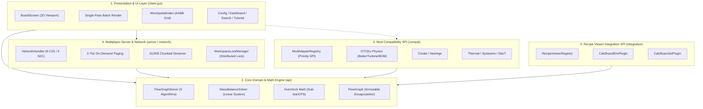

# [00] System Overview & Architecture Design Principles

> 📍 **GTCalcBoard Technical Specification Series**
> **[00] System Overview** ➔ [[01] Core Domain & Models](01_CORE_DOMAIN_AND_MODELS.md) ➔ [[02] Math & Algorithms](02_MATH_AND_ALGORITHMS.md) ➔ [[03] UI & Rendering Pipeline](03_UI_AND_RENDERING_PIPELINE.md) ➔ [[04] Multiplayer & Network](04_MULTIPLAYER_AND_NETWORK_PROTOCOL.md) ➔ [[05] External Integration & i18n](05_INTEGRATION_AND_I18N.md)

---

## 1. Project Vision & Core Values

**GregTech Calculator Board (GTCalcBoard)** is an in-game visual node-graph calculation and multiplayer collaboration platform designed for Minecraft tech modpack environments (GregTech CEu Modern, Create, Thermal Series, Star Technology, etc.) to design, balance, and scale complex multi-stage production lines directly inside the game.

### 3 Core Values
1. **Complete In-Game Self-Sufficiency**: Eliminate the friction of switching between external spreadsheets or web calculators by dragging and dropping EMI/JEI recipes directly into the canvas.
2. **Mathematical Integrity**: 100% accurate calculation of voltage tier delta, overclock acceleration, sub-tick batch promotion (<1.0 tick), hardware addon multiplier compounding, and closed-loop mass conservation linear equation systems.
3. **Frictionless Multiplayer Collaboration & High-Throughput Streaming**: Real-time team workspaces powered by 512KB chunked streaming to prevent Netty 2MB buffer overflows, 2-tier on-demand paging, and distributed lease locking.

---

## 2. 5-Tier Clean Architecture

GTCalcBoard strictly adheres to the Single Responsibility Principle (SRP) and Separation of Concerns (SoC) across 5 distinct architectural layers.



### Layer Roles & Responsibilities

| Layer | Primary Packages | Key Responsibilities |
| :--- | :--- | :--- |
| **1. Presentation & UI** | `com.gtceu.calcboard.client.gui` | 2D canvas viewport matrix transforms, input dispatching, Single-Pass Batch rendering, `WireSpatialIndex` $O(\log E)$ hit detection, modal dialogs |
| **2. Core Domain & Math** | `com.gtceu.calcboard.api` | `RecipeNode` pure domain model, `FlowGraph` immutable view encapsulation, Gauss-Jordan mass balance linear solver ($A\mathbf{x}=\mathbf{b}$), 10-pass BFS relaxation, Undo/Redo |
| **3. Mod Compatibility SPI** | `com.gtceu.calcboard.compat` | Rule 5 3-step deterministic deduction (API/Reflection, Simulation, NBT/TagKey) across 7 mod adapters, `compat.gtceu.physics` separation |
| **4. Server & Network** | `com.gtceu.calcboard.network`<br>`com.gtceu.calcboard.server` | 8 C2S / 9 S2C packet routing, 2-tier on-demand paging (`S2CSyncWorkspaceMetaPacket`), 512KB chunked streaming, `WorkspaceLockManager` distributed locking, `TeamBoardSavedData` |
| **5. Recipe Viewer SPI** | `com.gtceu.calcboard.integration` | `RecipeViewerRegistry` runtime election across EMI / JEI / Vanilla, asynchronous recipe conversion, and in-game hover preview |

---

## 3. Headless Environment Isolation & Testability

The Core Domain & Math Engine (`com.gtceu.calcboard.api`) and Common Compatibility layer (`com.gtceu.calcboard.compat`) maintain **0% dependency on Minecraft client classes (`net.minecraft.client.*`)**.

### Architectural Advantages
1. **Independent Unit Testing**: Full test suite verification under standard JVM without launching a Minecraft client environment (`./gradlew test`).
2. **Dedicated Server Safety**: Elimination of `NoClassDefFoundError` crashes on dedicated servers caused by client-only imports.
3. **Portability & Backporting**: Clean separation enables effortless backporting to legacy modding versions (e.g. 1.7.10 GTNH) with zero modifications to core math algorithms.

---

## 4. Package Directory Specification

```
src/main/java/com/gtceu/calcboard/
├── GregTechCalcBoard.java           # Mod main entrypoint
├── api/                             # [Core] Math, graph, domain engine (100% Headless Safe)
│   ├── model/                       #   - Core domain entities (RecipeNode, FlowGraph, IngredientStack)
│   ├── solver/                      #   - Solver algorithms (FlowGraphSolver, MassBalanceSolver, ETA)
│   ├── storage/                     #   - Board/page storage & codec (BoardManager, BlueprintCodec)
│   ├── catalog/                     #   - Machine addon catalog & matrix (CapabilityMatrix, MachineAddon)
│   ├── type/                        #   - Voltage tiers & physical modes (GTVoltageTier, EnergyType)
│   ├── util/                        #   - Pure headless utilities (NumberFormatUtil, ModCompatHelper)
│   ├── bom/                         #   - Multiblock BOM calculation engine (MultiblockBOMCalculator)
│   ├── event/                       #   - Lifecycle events (FlowGraphEvent, CatalogLifecycleEvent)
│   ├── history/                     #   - Undo/Redo command stack (HistoryManager, IUndoableCommand)
│   └── property/                    #   - Type-safe property registry (NodePropertyStore)
├── client/                          # [UI] Canvas and rendering pipeline
│   ├── gui/                         #   - Main viewport & screens (BoardScreen, CanvasInteractionHandler)
│   │   ├── render/                  #     - Single-pass batch renderers & WireSpatialIndex grid
│   │   ├── dialog/                  #     - Modal dialogs (MachineConfigDialog, BOMDialog, SearchDialog)
│   │   ├── widget/                  #     - HUD, tab bar, toolbar, overlays (SummaryOverlay, HotkeyHud)
│   │   ├── editor/                  #     - Inline numerical & text editors (NodeCountEditor)
│   │   ├── compat/                  #     - Client-only mod GUI handlers (@OnlyIn Dist.CLIENT)
│   │   ├── util/                    #     - UI formatting utilities (FormatUtil)
│   │   ├── search/                  #     - Asynchronous recipe search indexer and engine
│   │   └── tutorial/                #     - Interactive onboarding tutorial (TutorialManager)
│   ├── key/                         #   - Keybinding registry
│   └── team/                        #   - Client workspace state machine
├── compat/                          # [Mod Compat SPI] Mod adapters (Server & Client Common)
│   ├── gtceu/                       #   - GregTech CEu Modern adapter
│   │   ├── physics/                 #     - GTBoilerPhysics, GTTurbinePhysics, GTMultiblockBOMResolver
│   │   └── helper/                  #     - CoilHelper, ParallelHelper, ReflectorHelper, HatchHelper
│   ├── create/                      #   - Create adapter and kinetic handlers
│   ├── createnewage/                #   - Create New Age adapter and magnet addons
│   ├── thermal/                     #   - Thermal Series adapter and augments (ThermalAugmentHelper)
│   ├── systeams/                    #   - Thermal Systeams boiler and steam dynamo adapter
│   ├── start/                       #   - Star Technology plasma turbine & helix adapter
│   └── vanilla/                     #   - Vanilla passive recipe fallback
├── integration/                     # [Recipe Viewer SPI] Recipe viewer adapters
│   ├── spi/                         #   - IRecipeViewerAdapter, RecipeViewerRegistry
│   ├── emi/                         #   - EMI plugin, recipe converter, and virtual recipes
│   ├── jei/                         #   - JEI plugin and viewer adapter
│   └── vanilla/                     #   - Vanilla recipe manager fallback
├── network/                         # [Network] SimpleChannel network pipeline
│   ├── NetworkHandler.java          #   - Packet registration & 512KB chunk streaming
│   └── packet/                      #   - 8 C2S, 9 S2C packets (c2s, s2c)
└── server/                          # [Server] Server-side persistence & team systems
    ├── storage/                     #   - SavedData NBT persistence & WorkspaceLockManager
    └── team/                        #   - ITeamProvider abstraction (FTB Teams, Phoenix Guilds, Vanilla)
```

---

> ➡️ **Next Chapter**: [[01] Core Domain Models & Deterministic Capability Matrix](01_CORE_DOMAIN_AND_MODELS.md)
