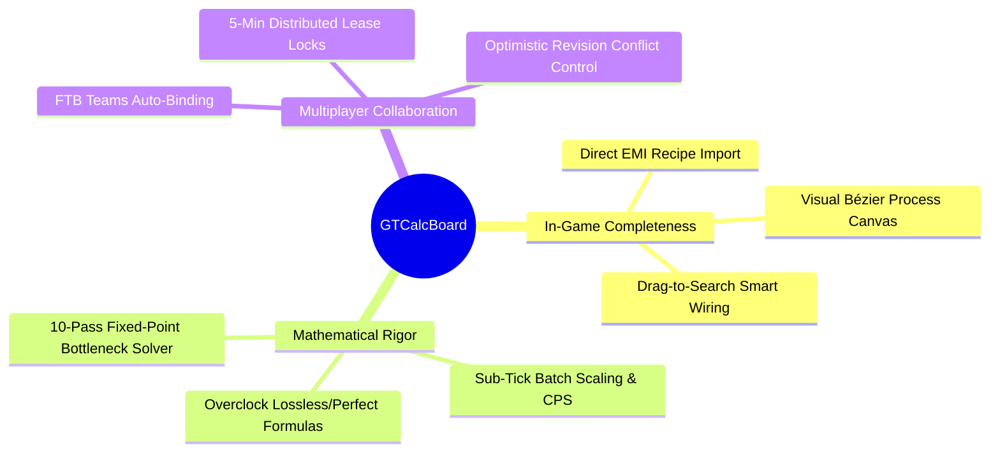
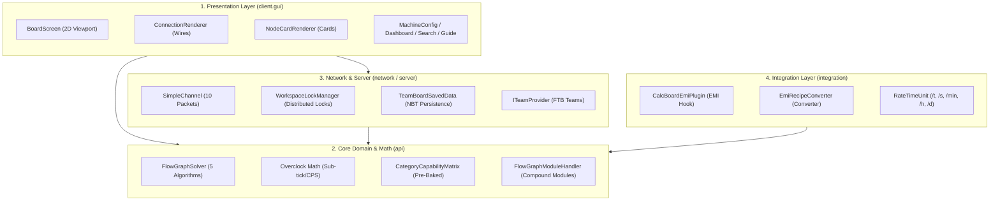

# [00] System Architecture & Design Principles (Overview)

> 📍 **GTCalcBoard Technical Specification Series**
> **[00] System Overview** ➔ [[01] Core Domain](01_CORE_DOMAIN_AND_MODELS.md) ➔ [[02] Math Engine](02_MATH_AND_ALGORITHMS.md) ➔ [[03] UI Pipeline](03_UI_AND_RENDERING_PIPELINE.md) ➔ [[04] Multiplayer](04_MULTIPLAYER_AND_NETWORK_PROTOCOL.md) ➔ [[05] External Integration](05_INTEGRATION_AND_I18N.md)

---

## 1. System Vision & Core Values

**GregTech Calculator Board (GTCalcBoard)** is an in-game factory engineering and process calculation tool mod designed for GregTech CEu Modern (1.20.1+ / 1.7.10+ backport-ready).

---

## 2. 4-Tier Layered Architecture

GTCalcBoard strictly enforces Single Responsibility Principle (SRP) and separation of concerns across 4 distinct layers:

---

## 3. Headless Isolation & Testability

The `com.gtceu.calcboard.api` package contains **zero references** to Minecraft Client GUI or OpenGL classes (`GuiGraphics`, `Screen`, `PoseStack`).
All domain models (`RecipeNode`, `FlowGraph`, `FlowGraphSolver`, `CategoryCapabilityMatrix`) run independently in a pure headless JVM environment, ensuring 100% automated test coverage in JUnit 5.

---

> ➡️ **Next Chapter**: [[01] Core Domain Models & Capability Matrix](01_CORE_DOMAIN_AND_MODELS.md)
