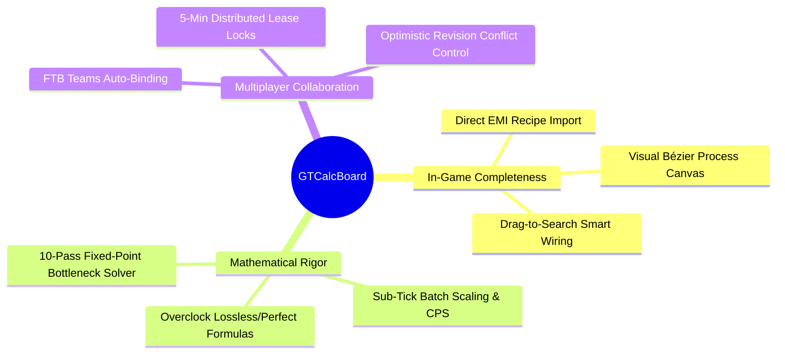
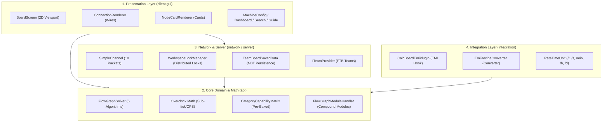

# [00] System Architecture & Design Principles (Overview)

> 📍 **GTCalcBoard Technical Specification Series**
> **[00] System Overview** ➔ [[01] Core Domain](01_CORE_DOMAIN_AND_MODELS.md) ➔ [[02] Math Engine](02_MATH_AND_ALGORITHMS.md) ➔ [[03] UI Pipeline](03_UI_AND_RENDERING_PIPELINE.md) ➔ [[04] Multiplayer](04_MULTIPLAYER_AND_NETWORK_PROTOCOL.md) ➔ [[05] External Integration](05_INTEGRATION_AND_I18N.md)

---

## 1. System Vision & Core Values

**GregTech Calculator Board (GTCalcBoard)** is an in-game factory engineering and process calculation tool mod designed for GregTech CEu Modern (1.20.1+ / 1.7.10+ backport-ready).



---

## 2. 4-Tier Layered Architecture

GTCalcBoard strictly enforces Single Responsibility Principle (SRP) and separation of concerns across 4 distinct layers:



---

## 3. Headless Isolation & Testability

The `com.gtceu.calcboard.api` package contains **zero references** to Minecraft Client GUI or OpenGL classes (`GuiGraphics`, `Screen`, `PoseStack`).
All domain models (`RecipeNode`, `FlowGraph`, `FlowGraphSolver`, `CategoryCapabilityMatrix`) run independently in a pure headless JVM environment, ensuring 100% automated test coverage in JUnit 5.

---

## 4. Package Directory Specification

```
src/main/java/com/gtceu/calcboard/
├── GregTechCalcBoard.java           # Mod entrypoint
├── api/                             # [Core] Math, Graph, Domain Engine (Headless Isolation)
│   ├── model/                       #   - Core Domain Models (RecipeNode, FlowGraph, IngredientStack, etc.)
│   ├── solver/                      #   - Math Solver Algorithms (FlowGraphSolver, ModuleHandler, ETA, etc.)
│   ├── storage/                     #   - Board/Page Document Persistence & Codecs (BoardManager, BlueprintCodec, etc.)
│   ├── catalog/                     #   - Machine Addon Catalog & Matrix (CapabilityMatrix, Addons, etc.)
│   ├── type/                        #   - Voltage Tiers & Physics/Operating Modes (GTVoltageTier, EnergyType, etc.)
│   ├── util/                        #   - Common Utilities (ModCompatHelper)
│   ├── bom/                         #   - Multiblock BOM Engine (MultiblockBOMCalculator, etc.)
│   ├── event/                       #   - Lifecycle Event Bus (FlowGraphEvent, CatalogLifecycleEvent, etc.)
│   ├── history/                     #   - Undo/Redo Command Stack (HistoryManager, IUndoableCommand, etc.)
│   └── property/                    #   - Type-Safe Dynamic Property Registry (NodePropertyStore, etc.)
├── client/                          # [UI] Presentation & Canvas Rendering Pipeline
│   ├── gui/                         #   - Main Screen & Viewport (BoardScreen, CanvasInteractionHandler)
│   │   ├── render/                  #     - Canvas Renderers (NodeCardRenderer, ConnectionRenderer, etc.)
│   │   ├── dialog/                  #     - Modal Dialogs (MachineConfigDialog, BOMDialog, etc.)
│   │   ├── widget/                  #     - HUD, TabBars, Toolbars, Popups (SummaryOverlay, ToolbarWidget, etc.)
│   │   ├── editor/                  #     - Inline Value/Name Editors (NodeCountEditor, NodeParallelEditor, etc.)
│   │   ├── util/                    #     - UI Formatting Utilities (FormatUtil)
│   │   ├── search/                  #     - Async Recipe Search Engine & Filters
│   │   └── tutorial/                #     - Interactive Onboarding Tutorial
│   ├── key/                         #   - Key Bindings
│   └── team/                        #   - Client Workspace Real-Time State Machine
├── compat/                          # [Mod Compat SPI] Domain Mod Integration Adapters
│   ├── gtceu/                       #   - GTCEu Modern Adapter, Addons & Helpers
│   ├── create/                      #   - Create Kinetic Adapter & Handlers
│   ├── createnewage/                #   - Create New Age Adapter & Magnet Addons
│   ├── thermal/                     #   - Thermal Series Adapter & Augment Addons
│   ├── systeams/                    #   - Thermal Systeams Steam Boiler/Dynamo Adapter
│   ├── start/                       #   - Star Technology Plasma Turbine/Helix Adapter
│   └── vanilla/                     #   - Vanilla Passive Unpowered Fallback
├── integration/                     # [Recipe Viewer SPI] Recipe Viewer Adapters
│   ├── spi/                         #   - IRecipeViewerAdapter, RecipeViewerRegistry
│   ├── emi/                         #   - EMI Plugin, Recipe Converter & Synthetic Recipes
│   ├── jei/                         #   - JEI Plugin & Viewer Adapter
│   └── vanilla/                     #   - Pure Vanilla Recipe Manager Fallback
├── network/                         # [Network] SimpleChannel Network Pipeline
│   ├── NetworkHandler.java          #   - Packet Registration & Routing
│   └── packet/                      #   - C2S (6) & S2C (4) Packets (c2s, s2c)
└── server/                          # [Server] Server Persistence & Team Systems
    ├── storage/                     #   - SavedData NBT Persistence & Workspace Lock Manager
    └── team/                        #   - ITeamProvider Abstraction (FTB Teams, Vanilla)
```

---

> ➡️ **Next Chapter**: [[01] Core Domain Models & Capability Matrix](01_CORE_DOMAIN_AND_MODELS.md)

