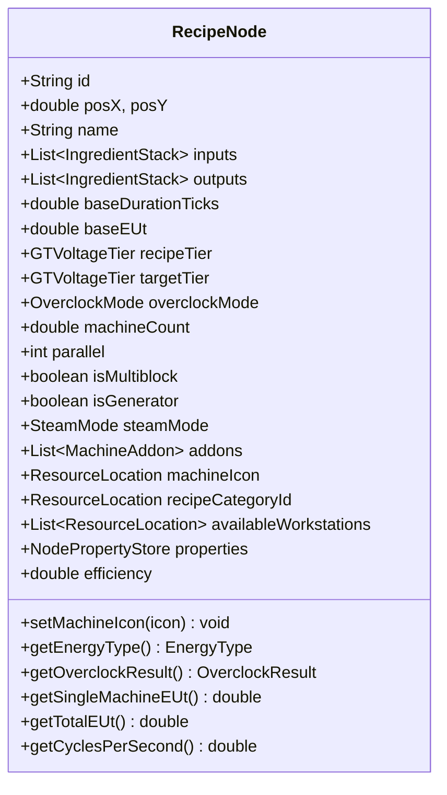
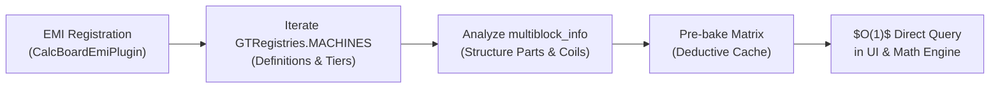

# [01] Core Domain Models & Capability Matrix (Core Domain & Models)

> 📍 **GTCalcBoard Technical Specification Series**
> [[00] System Overview](00_OVERVIEW.md) ➔ **[01] Core Domain & Models** ➔ [[02] Math Engine](02_MATH_AND_ALGORITHMS.md) ➔ [[03] UI Pipeline](03_UI_AND_RENDERING_PIPELINE.md) ➔ [[04] Multiplayer](04_MULTIPLAYER_AND_NETWORK_PROTOCOL.md) ➔ [[05] External Integration](05_INTEGRATION_AND_I18N.md)

---

## 1. Core Domain Models (`com.gtceu.calcboard.api`)

### 1.1 Voltage Tier System (`GTVoltageTier`)

Defines all 15 official GregTech CEu Modern voltage tiers with exact nominal voltages and color formatting:

$$\text{Tier Index} \in [0, 14], \quad V_k = 32 \times 4^{k-1} \text{ EU/t} \quad (k \ge 1)$$

| Tier | Voltage (EU/t) | UI Abbr | Theme Color (Hex ARGB) |
| :--- | :--- | :--- | :--- |
| `ULV` | 8 | ULV | `0xFF8C8C8C` |
| `LV` | 32 | LV | `0xFFDCDCDC` |
| `MV` | 128 | MV | `0xFFFF6464` |
| `HV` | 512 | HV | `0xFFFFFF64` |
| `EV` | 2,048 | EV | `0xFF6464FF` |
| `IV` | 8,192 | IV | `0xFFFF64FF` |
| `LuV` | 32,768 | LuV | `0xFF64FFFF` |
| `ZPM` | 131,072 | ZPM | `0xFFFF6464` |
| `UV` | 524,288 | UV | `0xFF64FF64` |
| `UHV` | 2,097,152 | UHV | `0xFFFF3232` |
| `UEV` | 8,388,608 | UEV | `0xFF64B4FF` |
| `UIV` | 33,554,432 | UIV | `0xFF32FF82` |
| `UXV` | 134,217,728 | UXV | `0xFFFF82FF` |
| `OpV` | 536,870,912 | OpV | `0xFF5050FF` |
| `MAX` | 2,147,483,647 | MAX | `0xFFFF8282` |

---

### 1.2 Material & Fluid Stack (`IngredientStack`)

Encapsulates item and fluid units flowing through input and output sockets:

```java
public class IngredientStack {
    private final ResourceLocation id;        // Registry identifier (e.g. gtceu:benzene)
    private final String displayName;          // Localized name (e.g. "Benzene")
    private double amount;                     // Base recipe consumption/production amount
    private final boolean isFluid;             // Fluid discriminator (true: mB, false: items)
    private double chance;                     // Base drop chance (0.0 to 1.0)
    private double tierChanceBoost;            // Chance boost per tier overclock (default: 0.05 = +5%)
}
```

---

### 1.3 Recipe Node (`RecipeNode`)

The core computation entity representing a machine workstation, power generator, or compound module on the canvas:



* **Clean Architecture & SPI Delegation**:
  - `RecipeNode` is a pure domain entity with zero direct coupling to GTCEu, Create, or Thermal internals.
  - Machine icon change lifecycle (`setMachineIcon`), energy type queries (`getEnergyType`), single machine power (`getSingleMachineEUt`), and node operating validation (`isOperational`) are dynamically dispatched via `ModAdapterRegistry.getAdapterForNode(this)`.
* **`efficiency` ($\eta \in [0.0, 1.0]$)**: Settled operating rate computed by `FlowGraphSolver` under supply constraints.
* **`calculateOutputRates()`**: Solves 1-second item/fluid flow rates including machine count, parallels, overclocking, sub-tick batches, and probabilistic tier chance boosts.

---

### 1.4 Dynamic Property Store (`NodePropertyStore` & `NodeProperties`)

A type-safe dynamic property store that manages mod-specific metadata without polluting the core node class fields:

```java
public class NodePropertyStore {
    private final Map<NodeProperty<?>, Object> properties = new HashMap<>();

    public <T> T get(NodeProperty<T> prop) {
        return (T) properties.getOrDefault(prop, prop.defaultValue());
    }

    public <T> void set(NodeProperty<T> prop, T value) {
        properties.put(prop, value);
    }
}
```

* **Standard Property Keys (`NodeProperties`)**:
  - `REQUIRED_REFLECTOR_TIER` (`Integer`, default `0`): Fusion reactor reflector requirement
  - `TURBINE_ROTOR_EFFICIENCY` (`Integer`, default `100`): Large turbine rotor efficiency (%)
  - `TURBINE_ROTOR_POWER` (`Integer`, default `100`): Large turbine rotor power (%)
  - `TURBINE_ROTOR_NAME` (`String`, default `""`): Installed rotor material name
  - `TURBINE_HOLDER_BONUS` (`Integer`, default `0`): Rotor holder bonus efficiency (%)
  - `CLEANROOM_TIER` (`Integer`, default `0`): Cleanroom requirement level

---

### 1.5 Multi-Energy & Physical Models (`EnergyType` & `SteamMode`)

* **`EnergyType`**:
  - `ELECTRIC_EU`: GregTech electricity (EU/t)
  - `KINETIC_SU`: Create rotational kinetic energy (SU, RPM)
  - `ELECTRIC_FE`: Thermal / Create New Age power (RF/t, FE/t)
  - `HEAT_OR_SELF`: Boilers and dynamos (mB/s Steam generation)
  - `NONE`: Passive / unpowered recipes (0 Power)
* **`SteamMode`**:
  - `NONE`: Electric operation
  - `LOW_PRESSURE`: Low Pressure Steam ($2.0\times$ duration, 1 EU = 2 mB Steam)
  - `HIGH_PRESSURE`: High Pressure Steam ($1.0\times$ duration, 1 EU = 2 mB Steam)

---

### 1.6 Flow Graph & Connections (`FlowGraph`, `ConnectionEdge`)

* **`ConnectionEdge`**: Immutable record representing a directed wire:
  ```java
  public record ConnectionEdge(String fromNodeId, int outputIndex, String toNodeId, int inputIndex)
  ```
* **`FlowGraph`**: Container managing nodes (`List<RecipeNode>`), wires (`List<ConnectionEdge>`), and nested sub-graphs.

---

## 2. Deterministic Capability Matrix (`CategoryCapabilityMatrix`)

Pre-baked at EMI registration time (`CalcBoardEmiPlugin`), eliminating runtime tooltip string parsing heuristics:



---

## 3. Compound Modules (`FlowGraphModuleHandler`)

Allows grouping selected sub-graphs into a single nested compound module card via `Ctrl + G`:

* **Boundary I/O Detection**: Internal intermediate connections are encapsulated; external unresolved inputs and final products are promoted to the module card sockets.
* **Proportional Scaling**: Changing the module scale proportionally adjusts all internal machine counts and flow rates.

---

## 4. Undo / Redo & Serialization

* **Command Pattern (`HistoryManager`)**: Tracks vector state deltas (`MoveNodesCommand`, `AddConnectionCommand`, `ModifyPropertyCommand`, `GroupModuleCommand`).
* **Blueprint Codec (`BlueprintCodec`)**: Serializes graph state to NBT $\to$ GZIP $\to$ URL-safe Base64 (`GTBOARD:...`).

---

> ➡️ **Next Chapter**: [[02] Math Engine & Graph Solving Algorithms](02_MATH_AND_ALGORITHMS.md)

