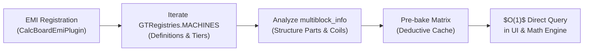

# [01] Core Domain Models & Capability Matrix (Core Domain)

> 📍 **GTCalcBoard Technical Specification Series**
> [[00] System Overview](00_OVERVIEW.md) ➔ **[01] Core Domain** ➔ [[02] Math Engine](02_MATH_AND_ALGORITHMS.md) ➔ [[03] UI Pipeline](03_UI_AND_RENDERING_PIPELINE.md) ➔ [[04] Multiplayer](04_MULTIPLAYER_AND_NETWORK_PROTOCOL.md) ➔ [[05] External Integration](05_INTEGRATION_AND_I18N.md)

---

## 1. Domain Models (`com.gtceu.calcboard.api`)

### 1.1 Voltage Tier System (`GTVoltageTier`)

Supports all 15 official GregTech CEu voltage tiers with precise nominal voltages and color formatting:

$$\text{Tier Index} \in [0, 14], \quad V_k = 32 \times 4^{k-1} \text{ EU/t} \quad (k \ge 1)$$

* `ULV` (8 EU/t), `LV` (32 EU/t), `MV` (128 EU/t), `HV` (512 EU/t), `EV` (2,048 EU/t), `IV` (8,192 EU/t), `LuV` (32,768 EU/t), `ZPM` (131,072 EU/t), `UV` (524,288 EU/t), `UHV` (2,097,152 EU/t), `UEV` (8,388,608 EU/t), `UIV` (33,554,432 EU/t), `UXV` (134,217,728 EU/t), `OpV` (536,870,912 EU/t), `MAX` ($2^{31}-1$ EU/t).

---

### 1.2 Material & Fluid Stack (`IngredientStack`)

Unifies Item and Fluid representations under a single record structure:

* `String id`: Registry ID (`minecraft:iron_ingot`, `gtceu:benzene`)
* `boolean fluid`: Item / Fluid discriminator
* `double amount`: Base recipe amount (items: integer, fluids: mB)
* `double rate`: Solved flow rate per second ($/s$)
* `String tag`: Optional Tag key (`c:iron_ingots`)

---

### 1.3 Recipe Node (`RecipeNode`)

The fundamental computation unit representing a machine process on the canvas:

* **State**: `id`, `name`, `category`, `machineCount`, `parallel`, `overclockTier`, `overclockMode` (`STANDARD`, `PERFECT`, `LOSSLESS`), `activeAddons`.
* **Hardware Deductions**: `canUseCoils`, `isMultiblock`, `availableWorkstations`.

---

## 2. Deterministic Capability Matrix (`CategoryCapabilityMatrix`)

Pre-baked at EMI registration time (`CalcBoardEmiPlugin`), eliminating runtime tooltip string parsing heuristics:

* **Query API**:
  - `matrix.canCategoryUseCoils(categoryId)`
  - `matrix.getAvailableWorkstations(categoryId)`
  - `matrix.isMultiblock(categoryId, machineId)`

---

## 3. Compound Modules (`FlowGraphModuleHandler`)

Allows grouping selected sub-graphs into a single nested compound module card via `Ctrl + G`:

* **Boundary I/O Detection**: Internal connections are encapsulated; external unresolved inputs and final outputs are promoted to the module card sockets.
* **Proportional Scaling**: Changing the module scale proportionally adjusts all internal machine counts.

---

> ➡️ **Next Chapter**: [[02] Math Engine & Graph Solving Algorithms](02_MATH_AND_ALGORITHMS.md)
