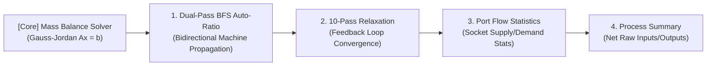

# [02] Mathematical Engine & Graph Analysis Algorithms (Math & Algorithms)

> 📍 **GTCalcBoard Technical Specification Series**
> [[00] System Overview](00_OVERVIEW.md) ➔ [[01] Core Domain & Models](01_CORE_DOMAIN_AND_MODELS.md) ➔ **[02] Math & Algorithms** ➔ [[03] UI & Rendering Pipeline](03_UI_AND_RENDERING_PIPELINE.md) ➔ [[04] Multiplayer & Network](04_MULTIPLAYER_AND_NETWORK_PROTOCOL.md) ➔ [[05] External Integration & i18n](05_INTEGRATION_AND_I18N.md)

---

## 1. Overclocking & Physics Formulas

GTCalcBoard implements exact numerical physics formulas across GregTech and supported technical mods.

### 1.1 Voltage Tier Delta ($\Delta\text{Tier}$)
$$\Delta\text{Tier} = \max(0, \, \text{TargetTier.ordinal} - \text{RecipeTier.ordinal})$$

---

### 1.2 Overclock Mode Formulas

For $\Delta\text{Tier} > 0$, Energy and Speed factors are evaluated as follows:

$$
\text{Energy Factor} = 4.0^{\Delta\text{Tier}}
$$

$$
\text{Speed Factor} = \begin{cases} 
2.0^{\Delta\text{Tier}} & \text{(STANDARD Mode)} \\
4.0^{\Delta\text{Tier}} & \text{(PERFECT Mode)} \\
1.0 & \text{(LOSSLESS Mode)}
\end{cases}
$$

* **STANDARD Mode**: Standard Single/Multiblock Machines ($1\text{ Tier} = 4\times\text{Power}, 2\times\text{Speed}$)
* **PERFECT Mode**: Perfect Overclock Multiblocks ($1\text{ Tier} = 4\times\text{Power}, 4\times\text{Speed}$)
* **LOSSLESS Mode**: Unchanged Speed, Conserved Energy ($1\text{ Tier} = 1\times\text{Power}, 1\times\text{Speed}$)

$$
\text{Calculated Duration (ticks)} = \frac{\text{BaseDurationTicks}}{\text{Speed Factor}}
$$

$$
\text{Calculated EU/t} = \text{BaseEUt} \times \text{Energy Factor}
$$

---

### 1.3 Sub-Tick Batch Processing ($< 1.0\text{ Tick}$)

When recipe duration falls below $1.0\text{ tick}$ ($0.05\text{ s}$), operations are promoted to batching per engine tick:

$$\text{BatchesPerTick} = \frac{1.0}{\text{Calculated Duration (ticks)}}, \quad \text{Effective Duration} = 1.0\text{ tick}$$
$$\text{Effective EU/t} = \text{Calculated EU/t} \times \text{BatchesPerTick}$$
$$\text{Cycles Per Second (CPS)} = 20.0 \times \text{BatchesPerTick} \times \text{Parallel} \times \text{MachineCount}$$

---

### 1.4 Hardware Addon Multiplier Compounding

For all installed addons $a \in \text{InstalledAddons}$, duration and power multipliers are compounded:

$$\text{Total Duration} = \text{Effective Duration} \times \prod_{a \in \text{Addons}} a.\text{getDurationMultiplier}()$$
$$\text{Total EU/t} = \text{Effective EU/t} \times \prod_{a \in \text{Addons}} a.\text{getEutMultiplier}()$$

#### Heating Coil Machine Formulas
- **Electric Blast Furnace (EBF)**:
  For recipe temperature $T_{\text{recipe}}$ and coil temperature $T_{\text{coil}}$:
  $$\Delta T_{\text{excess}} = \max(0, \, T_{\text{coil}} - T_{\text{recipe}})$$
  $$\text{EUt Multiplier} = 0.95^{\lfloor \Delta T_{\text{excess}} / 900 \rfloor}$$
  *(5% compound power discount per 900K excess temperature)*

- **Pyrolyse Oven**:
  $$\text{Duration Multiplier} = \frac{100.0}{\text{PyrolyseSpeedPercent}}$$

- **Cracking Unit**:
  $$\text{EUt Multiplier} = \frac{\text{CrackingEnergyPercent}}{100.0}$$

- **Large Chemical Reactor (LCR / ECR / ICR)**:
  $$\text{Duration Multiplier} = \frac{100.0}{\text{ChemicalSpeedPercent}}, \quad \text{EUt Multiplier} = \frac{\text{ChemicalEnergyPercent}}{100.0}$$

- **Multi Smelter**:
  $$\text{Parallel} = \text{SmelterParallel} \quad (32\text{x}, 64\text{x}, 128\text{x}\dots)$$

---

### 1.5 Byproduct Tier Chance Boost

$$\text{Effective Chance} = \min\Big(1.0, \, \text{BaseChance} + (\Delta\text{Tier} \times \text{TierChanceBoost})\Big)$$
$$\text{Single Machine Expected Output Rate (per sec)} = \text{Amount} \times \text{Effective Chance} \times \text{CPS}$$

---

### 1.6 Steam Boilers & Throttle ($\theta \in [0.25, 1.0]$)

- **Small Boilers**: LP Bronze ($120\text{ L/s} = 6\text{ mB/t}$), HP Steel ($360\text{ L/s} = 18\text{ mB/t}$)
- **Large Boilers**: Bronze ($16\text{k/s}$), Steel ($36\text{k/s}$), Titanium ($64\text{k/s}$), Tungstensteel ($128\text{k/s}$)

$$\text{Effective Speed Multiplier} = \text{TierSpeedMultiplier} \times \theta$$
$$\text{Steam Rate (mB/t)} = \text{BaseSteamRate} \times \text{Effective Speed Multiplier}$$
$$\text{Water Rate (mB/t)} = \frac{\text{Steam Rate (mB/t)}}{160.0} \quad (1\text{mB Water} \rightarrow 160\text{mB Steam})$$

---

## 2. Modular Solver Architecture & Core Algorithms

Following Single Responsibility principles, the solver engine is structured around the `FlowGraphSolver` facade delegating to 4 specialized sub-solvers:
- `MassBalanceSolver`: Closed-loop Gauss-Jordan mass conservation linear system solver.
- `FlowBalanceMatrixSolver`: 10-pass fixed-point bottleneck relaxation, bidirectional AutoRatio BFS propagation, and integer harmonized scaling.
- `FlowGraphTopologyAnalyzer`: Directed graph topological sorting, cycle detection (`CycleDetector`), and upstream/downstream subgraph traversal.
- `FlowSummaryAggregator`: Net process balance summaries (`BalanceSummary`), total energy/power deltas, and socket flow statistics.

---

### [Core Engine] Closed-Loop Mass Conservation Linear Solver (`MassBalanceSolver`)

Calculates exact machine count vectors $\mathbf{x} = [x_1, x_2, \dots, x_N]^T$ satisfying the **Mass Conservation Law** in closed-loop recycling circuits (e.g. hydrogen recycling in ethylbenzene lines or platinum group refining cycles) using rigorous numerical linear algebra.

#### 1. Linear System Formulation
For each intermediate/final material $i$ ($1 \le i \le M$), the net balance between external demand $d_i$ and machine production/consumption matrix $S \in \mathbb{R}^{M \times N}$ is formulated as:

$$\sum_{j=1}^N S_{ij} x_j = d_i \quad \Longleftrightarrow \quad A\mathbf{x} = \mathbf{b}$$

where $S_{ij}$ denotes the net per-second output ($>0$) or input ($<0$) of material $i$ produced by a single machine $j$.

#### 2. Gauss-Jordan Elimination with Partial Pivoting
For numerical stability, the pivot row $p$ with the largest absolute value in column $k$ is selected and swapped at each elimination step $k$:

$$p = \arg\max_{i \ge k} |A_{ik}|$$

If $|A_{pk}| < \epsilon$ ($10^{-9}$), the system is diagnosed as singular or under-determined and seamlessly transitions to least-squares approximation or BFS heuristic fallbacks.

Elimination updates ($O(N^3)$):
$$A_{ij} \leftarrow A_{ij} - \frac{A_{ik}}{A_{kk}} A_{kj}, \quad b_i \leftarrow b_i - \frac{A_{ik}}{A_{kk}} b_k \quad (\forall i \ne k)$$

---

### [Algorithm 1] 10-Pass Fixed-Point Bottleneck Relaxation

Iteratively converges machine steady-state utilization efficiencies ($\eta_v \in [0.0, 1.0]$) under upstream supply limits.

1. **Initialization**: Set $\eta_v^{(0)} = 1.0$ for all $v \in V$.
2. **Relaxation Iteration ($k = 1 \dots 10$)**:
   - Upstream supplier effective output: $\text{Supply}_{P_j} = \text{NominalOutputRate}_{P_j} \times \eta_{P_j}^{(k-1)}$
   - Proportionally distributed incoming supply:
     $$\text{IncomingSupply}_i = \sum_{P_j} \min\left(\text{NominalDemand}_{C, i}, \, \text{Supply}_{P_j} \times \frac{\text{NominalDemand}_{C, i}}{\text{TotalDemand}_{P_j}}\right)$$
   - Consumer machine efficiency update: $\eta_C^{(k)} = \min_{i} \left(\frac{\text{IncomingSupply}_i}{\text{NominalDemand}_{C, i}}, \, 1.0\right)$
3. **Early Termination**: Halts immediately when $\max_{v} |\eta_v^{(k)} - \eta_v^{(k-1)}| < 10^{-4}$.

---

### [Algorithm 2] Port Flow Statistics (`PortFlowStats`)

- **Input Sockets**: Deficit (`isInputDeficit`, Supply < Demand $-0.001$), Balanced (`isBalanced`, $\pm 0.001$), Surplus (`isInputSurplus`, Supply > Demand $+0.001$)
- **Output Sockets**: Surplus (`isOutputSurplus`, Production > Downstream Demand $+0.001$), Deficit (`isOutputDeficit`, Production < Downstream Demand $-0.001$)

---

### [Algorithm 3] Dual-Pass BFS Auto-Ratio

Locks the user-selected anchor node count and propagates machine counts upstream (satisfying feedstock demand) and downstream (handling byproduct production), protected by cycle safety guards ($\max(50, |V| \times 5)$, visits $\le 3$).

---

### [Algorithm 4] Process Summary & Net Balance (`BalanceSummary`)

$$\text{Net EU/t} = \sum_{g \in \text{Generators}} g.\text{getEffectiveEUt}() - \sum_{m \in \text{Consumers}} m.\text{getEffectiveEUt}()$$

$$\Delta_{\text{material}} = \sum \text{Output Rates} - \sum \text{Input Rates}$$

---

### [Algorithm 5] Target Batch ETA & Total Resource Calculator (`ProductionETACalculator`)

For a terminal/reroute node with target quota $A_{\text{target}}$ and incoming rate $\text{Rate}_{\text{in}}$:

$$T_{\text{ET}} = \frac{A_{\text{target}}}{\text{Rate}_{\text{in}}} \quad [\text{seconds}]$$
$$E_{\text{total}} = \sum_{n \in \text{UpstreamNodes}} \left( n.\text{getTotalEUt}() \times 20 \times T_{\text{ET}} \right) \quad [\text{EU}]$$
$$C_{\text{raw}}(M) = \text{UnconnectedInputRate}(M) \times T_{\text{ET}} \quad [\text{Items / mB}]$$

---

> ➡️ **Next Chapter**: [[03] UI & Canvas Rendering Pipeline](03_UI_AND_RENDERING_PIPELINE.md)
