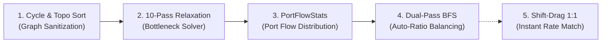

# [02] Math Engine & Graph Solving Algorithms (Math & Algorithms)

> 📍 **GTCalcBoard Technical Specification Series**
> [[00] System Overview](00_OVERVIEW.md) ➔ [[01] Core Domain](01_CORE_DOMAIN_AND_MODELS.md) ➔ **[02] Math Engine** ➔ [[03] UI Pipeline](03_UI_AND_RENDERING_PIPELINE.md) ➔ [[04] Multiplayer](04_MULTIPLAYER_AND_NETWORK_PROTOCOL.md) ➔ [[05] External Integration](05_INTEGRATION_AND_I18N.md)

---

## 1. Overclocking Formulas (`OverclockCalculator`)

### 1.1 Overclock Modes & Multipliers

Given $N = \text{tierDiff} = \text{machineTier} - \text{recipeTier}$:

$$\text{Standard Overclock}: \quad \text{SpeedMultiplier} = 2.0^N, \quad \text{PowerMultiplier} = 4.0^N$$
$$\text{Perfect Overclock}: \quad \text{SpeedMultiplier} = 4.0^N, \quad \text{PowerMultiplier} = 4.0^N$$
$$\text{Lossless Overclock}: \quad \text{SpeedMultiplier} = 4.0^N, \quad \text{PowerMultiplier} = 2.0^N$$

### 1.2 Sub-Tick Batch Promotion & CPS Formula

When process duration drops below $1.0\text{ tick}$ ($D_{\text{calc}} < 1.0\text{ tick}$), it is capped at $1\text{ tick}$ and the excess speed is promoted to parallel batch processing:

$$\text{Effective Duration} = \max(1.0, \, D_{\text{calc}}) \text{ ticks}$$
$$\text{Batch Multiplier} = \begin{cases} 1.0 & (D_{\text{calc}} \ge 1.0) \\ \frac{1.0}{D_{\text{calc}}} & (D_{\text{calc}} < 1.0) \end{cases}$$
$$\text{CPS (Cycles Per Second)} = \frac{20.0}{\text{Effective Duration}} \times \text{Batch Multiplier}$$

### 1.3 Heating Coil Bonuses & Recipe Modifiers

* **Electric Blast Furnace (EBF)**:
  $$\text{Temp Discount} = 0.95^{\lfloor \max(0, \, \text{CoilTemp} - \text{RecipeTemp}) / 900 \rfloor}$$
  $$\text{EU/t}_{\text{final}} = \text{BaseEU/t} \times \text{PowerMultiplier} \times \text{Temp Discount}$$

* **Pyrolyse Oven**:
  $$\text{Duration Multiplier} = \frac{100.0}{\text{PyrolyseSpeedPercent}}$$

* **Cracking Unit**:
  $$\text{Power Multiplier} = \frac{\text{CrackingEnergyPercent}}{100.0}$$

* **Large Chemical Reactor / ECR / ICR**:
  $$\text{Duration Multiplier} = \frac{100.0}{\text{ChemicalSpeedPercent}}, \quad \text{Power Multiplier} = \frac{\text{ChemicalEnergyPercent}}{100.0}$$

* **Multi Smelter**:
  $$\text{Parallel} = \text{SmelterParallel} \quad (\text{Base } 32\text{x}, 64\text{x}, 128\text{x}\dots)$$

* **Custom Coil Multiblocks (KubeJS / Addon Modifiers)**:
  Given coil tier level $L = \max(1, \lfloor (\text{CoilTemp} - 1800) / 900 \rfloor)$:
  $$\text{Duration Multiplier} = \max(0.01, \, 1.0 - (L \times \text{customDurationMultiplier}))$$
  $$\text{Power Multiplier} = \max(0.01, \, 1.0 - (L \times \text{customEnergyMultiplier}))$$
  $$\text{Parallel} = \text{customBaseParallel} + (L \times \text{customParallelMultiplier})$$

### 1.4 Steam Boilers & Throttle ($\theta \in [0.25, 1.0]$)

#### Small Singleblock Boilers
* **LP Bronze Boiler**: Base multiplier $1.0\times$ ($120\text{ L/s} = 6\text{ mB/t}$ Steam)
* **HP Steel Boiler**: $3.0\times$ acceleration ($360\text{ L/s} = 18\text{ mB/t}$ Steam)

#### Large Multiblock Boilers
* **Large Bronze Boiler**: Base multiplier $1.0\times$ ($16,000\text{ mB/s} = 800\text{ mB/t}$ Steam)
* **Large Steel Boiler**: $2.25\times$ ($36,000\text{ mB/s} = 1,800\text{ mB/t}$ Steam)
* **Large Titanium Boiler**: $4.0\times$ ($64,000\text{ mB/s} = 3,200\text{ mB/t}$ Steam)
* **Large Tungstensteel Boiler**: $8.0\times$ ($128,000\text{ mB/s} = 6,400\text{ mB/t}$ Steam)

$$\text{Effective Speed Multiplier} = \text{TierSpeedMultiplier} \times \theta$$
$$\text{Steam Rate (mB/t)} = \text{BaseSteamRate} \times \text{Effective Speed Multiplier}$$
$$\text{Water Rate (mB/t)} = \frac{\text{Steam Rate (mB/t)}}{160.0} \quad (1\text{mB Water} \rightarrow 160\text{mB Steam})$$
$$\text{Effective Duration (ticks)} = \frac{\text{BaseDurationTicks}}{\text{Effective Speed Multiplier}}$$

### 1.5 Create: New Age Kinetic Generator Coils

For Carbon Brushes (`create_new_age:carbon_brushes`) and Generator Coil (`create_new_age:generator_coil`) with $N$ installed magnets:

$$\text{Total Strength} = \sum_{m \in \text{InstalledMagnets}} m.\text{getMagneticForce}()$$
$$\text{Total Kinetic Stress (SU)} = (24.0 + \text{Total Strength}) \times \text{RPM} \times \text{MachineCount}$$
$$\text{Generated FE/t} = \text{Total Strength} \times \text{RPM} \times \text{suToEnergy} \times \text{Efficiency} \times \text{MachineCount}$$

---

## 2. 5 Core Graph Algorithms (`FlowGraphSolver`)

1. **10-Pass Fixed-Point Relaxation**: Iteratively propagates upstream deficit rates through nonlinear cyclic graphs to establish throughput equilibrium.
2. **PortFlowStats**: Computes precise individual flow distributions for each socket.
3. **Dual-Pass Auto-Ratio**: Forward and backward BFS passes adjusting upstream and downstream machine counts to 100% balance.
4. **Process Summary**: Aggregates net raw inputs, net final products, and total EU/t.
5. **Shift-Drag 1:1 Rate Matching**: Calculates required target node machine count to match source output rate on wire drop.

---

> ➡️ **Next Chapter**: [[03] UI & Rendering Pipeline Overview](03_UI_AND_RENDERING_PIPELINE.md)
