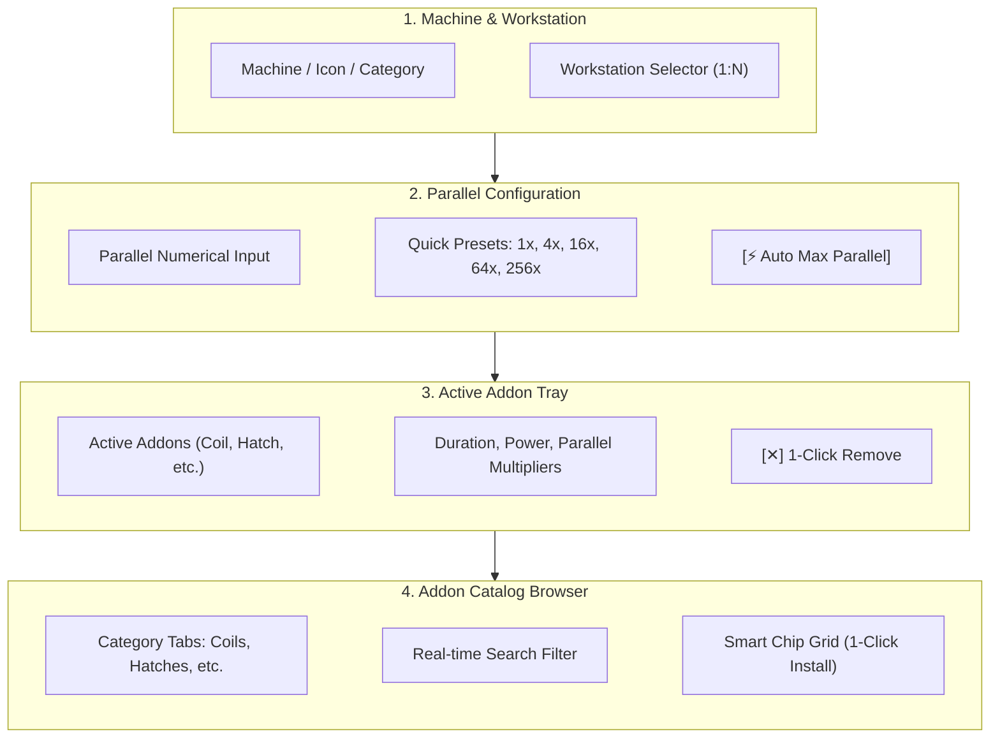

# [03-02] Machine Configuration & Addon Rack UI (Machine Config & Addons)

> 📍 **GTCalcBoard Technical Specification Series**
> [[00] System Overview](00_OVERVIEW.md) ➔ [[01] Core Domain](01_CORE_DOMAIN_AND_MODELS.md) ➔ [[02] Math Engine](02_MATH_AND_ALGORITHMS.md) ➔ [[03-01] Canvas & Node Cards](03_01_CANVAS_AND_NODE_CARDS.md) ➔ **[03-02] Machine Config & Addons** ➔ [[03-03] Page Summary & Dashboard](03_03_PAGE_SUMMARY_AND_DASHBOARD.md) ➔ [[03-04] Search, Tools & Guide](03_04_RECIPE_SEARCH_AND_TOOLS.md) ➔ [[04] Multiplayer](04_MULTIPLAYER_AND_NETWORK_PROTOCOL.md) ➔ [[05] External Integration](05_INTEGRATION_AND_I18N.md)

---

## 1. Component Architecture (`MachineConfigDialog`)

Modal dialog opened by right-clicking a node or clicking the `[ ⚙ ]` button on a node card:

---

## 2. Machine Configuration UI Wireframe

  <!-- Dialog Container -->
  

    <!-- 1. Dialog Header -->
    

      

        ⚙
        Machine Process & Hardware Configuration
        LV
      

      ✕
    

    <!-- Dialog Body -->
    

      <!-- Section A: Parallel Control -->
      

        
Base Machine Parallel Multiplier

        

          <input type="text" value="16" style="background: #14171e; border: 1px solid #0284c7; border-radius: 3px; color: #38bdf8; font-weight: bold; width: 42px; padding: 2px 6px; font-size: 12px; text-align: center;" />
          <button style="background: #252a36; border: 1px solid #3d4455; border-radius: 3px; color: #cbd5e1; padding: 2px 6px; font-size: 10px; cursor: pointer;">1x</button>
          <button style="background: #252a36; border: 1px solid #3d4455; border-radius: 3px; color: #cbd5e1; padding: 2px 6px; font-size: 10px; cursor: pointer;">4x</button>
          <button style="background: #0284c7; border: 1px solid #38bdf8; border-radius: 3px; color: #ffffff; font-weight: bold; padding: 2px 6px; font-size: 10px; cursor: pointer;">16x</button>
          <button style="background: #252a36; border: 1px solid #3d4455; border-radius: 3px; color: #cbd5e1; padding: 2px 6px; font-size: 10px; cursor: pointer;">64x</button>
          <button style="background: #252a36; border: 1px solid #3d4455; border-radius: 3px; color: #cbd5e1; padding: 2px 6px; font-size: 10px; cursor: pointer;">256x</button>
          <button style="background: #7c2d12; border: 1px solid #ea580c; border-radius: 3px; color: #ffedd5; font-weight: bold; padding: 2px 6px; font-size: 10px; margin-left: auto; cursor: pointer;">⚡ Auto Max</button>
        

      

      <!-- Section B: Installed Addons -->
      

        

          Active Hardware Addons (2)
          Click to remove
        

        

          <!-- Item 1: Coil -->
          

            

              🧲
              Cupronickel Coil Block
              1,800 K
            

            

              Power 0.95x
              ✕
            

          

          <!-- Item 2: Parallel Hatch -->
          

            

              ⚡
              EV Parallel Control Hatch
              EV Tier
            

            

              Parallel 16x
              ✕
            

          

        

      

      <!-- Section C: Addon Catalog Browser -->
      

        

          All
          Coils
          Parallel Hatches
          Maintenance
          Turbine Rotors
          Thermal
          + Custom
        

        <!-- Search & Catalog Chips Grid -->
        

          

            Kanthal Coil Block
            2,700 K
          

          

            Nichrome Coil Block
            3,600 K
          

          

            RTM Coil Block
            4,500 K
          

          

            HSS-G Coil Block
            5,400 K
          

        

      

    

  

---

## 3. In-Place Alternative Recipe Switching (`AlternativeRecipeFinder`)

Switch recipes for machines directly on the canvas without deleting nodes, preserving ports and wiring connections:

* **Entry Point**: Click `[🔄 Switch Recipe]` in the header of `MachineConfigDialog` or select from the node context menu.
* **Candidate Ranking**:
  1. **Tier 1**: Same Machine ID / Category + Same primary outputs (1st/2nd outputs).
  2. **Tier 2**: All other valid alternative recipes within the same machine category.
* **Smart Wire Preservation**:
  - Preserves incoming/outgoing wire connections for matching item/fluid IDs (`IngredientStack.getId()`).
  - Gracefully disconnects only wires whose ingredients are absent in the newly selected recipe.
  - Fully integrated with the `Undo/Redo` stack (`Ctrl+Z`).

---

## 4. UI Font Scale & Accessibility (`FontScale`)

Provides 5 preset UI scaling levels for `MachineConfigDialog` across high-DPI displays and compact viewports:

* **5 Preset Scaling Levels**:
  - `MINI (0.75x)`: Ultra-compact mode for GUI Scale 4/Auto.
  - `COMPACT (0.85x)`: Dense overview for large addon racks.
  - `NORMAL (1.0x)`: Standard Minecraft UI scale.
  - `LARGE (1.15x)`: Enhanced readability on 1440p displays.
  - `HUGE (1.30x)`: Maximum scale for 4K / accessibility.
* **Interactive Controls**:
  - `[Aa 1.0x]` Header Button: Left-click (cycle zoom in), Right-click (cycle zoom out), Mouse wheel scroll.
  - Keyboard Hotkeys: `+` / `Numpad +` (zoom in), `-` / `Numpad -` (zoom out).
  - Center-anchored matrix transformation and virtual mouse unprojection guarantee 100% pixel-perfect button hit detection.

---

> ➡️ **Proceed to next section**: [[03-03] Page Summary and Global Balance Dashboard](03_03_PAGE_SUMMARY_AND_DASHBOARD.md)
