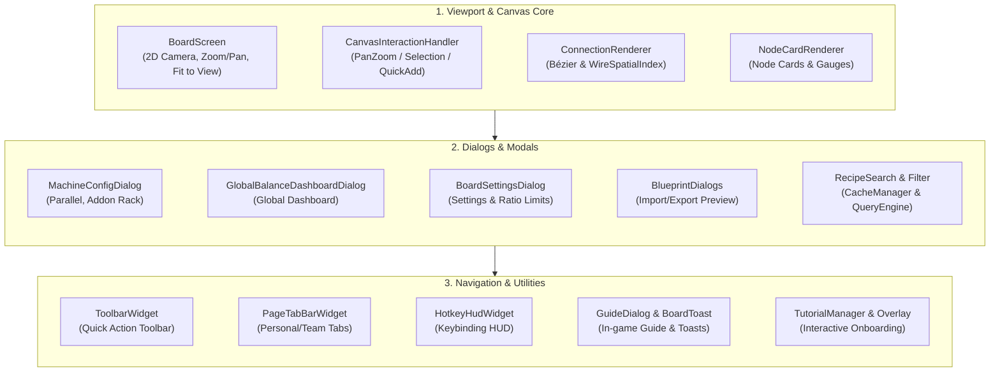

# [03] UI & Canvas Rendering Pipeline Overview (UI & Rendering Pipeline)

> 📍 **GTCalcBoard Technical Specification Series**
> [[00] System Overview](00_OVERVIEW.md) ➔ [[01] Core Domain & Models](01_CORE_DOMAIN_AND_MODELS.md) ➔ [[02] Math & Algorithms](02_MATH_AND_ALGORITHMS.md) ➔ **[03] UI & Rendering Pipeline** ➔ [[04] Multiplayer & Network](04_MULTIPLAYER_AND_NETWORK_PROTOCOL.md) ➔ [[05] External Integration & i18n](05_INTEGRATION_AND_I18N.md)

---

## 1. Presentation & UI Layer Architecture (`com.gtceu.calcboard.client.gui`)

GTCalcBoard integrates seamlessly with Minecraft's rendering pipeline to guarantee smooth 60fps interaction across massive graphs exceeding 1,200 nodes.

---

## 📑 UI Detailed Specification Series

Detailed component behavior, interaction flows, and high-fidelity wireframes are cataloged in the following sub-specifications:

### 1. [[03-01] 2D Canvas Viewport & Node Card Rendering](03_01_CANVAS_AND_NODE_CARDS.md)
* **2D Viewport Math**: Screen $\leftrightarrow$ Canvas coordinate transformation, exponential zoom scaling, dot grid rendering.
* **Single-Pass Batch Rendering & `WireSpatialIndex`**: Single geometry draw pass, $128 \times 128$ AABB uniform grid spatial index ($O(E) \rightarrow O(\log E)$).
* **Cubic Bézier Splines (`ConnectionRenderer`)**: Control point formulation, pulse flow animation, 24-segment segment hit testing.

### 2. [[03-02] Machine Configuration & Addon Rack UI](03_02_MACHINE_CONFIG_AND_ADDONS.md)
* **Parallel Multiplier Input**: Direct input field, quick presets (`1x ~ 256x`), `⚡ Auto-Max Parallel`.
* **Installed Addons Tray**: Inline badges, removal buttons, pagination.
* **Addon Catalog Browser**: Capability matrix integration, coils, hatches, turbine rotors, and thermal augments.

### 3. [[03-03] Page Balance Summary & Global Dashboard UI](03_03_PAGE_SUMMARY_AND_DASHBOARD.md)
* **Real-time Page Overlay (`SummaryOverlay`)**: Net power balance, active machines, external raw inputs, and net products.
* **Global Dashboard (`GlobalBalanceDashboardDialog`)**: Cross-page balance aggregation, `[Deficit/Surplus/Balanced]` tab filters.
* **Material Contribution Popup (`ItemContributionPopup`)**: Item per-page breakdown.

### 4. [[03-04] Recipe Search, Filters, Keybinding HUD, Guidebook & Toasts](03_04_RECIPE_SEARCH_AND_TOOLS.md)
* **Async Recipe Search (`RecipeSearchDialog`)**: Multi-token tag search, category filtering, and blacklisting.
* **Navigation Widgets (`PageTabBarWidget`, `ToolbarWidget`)**: Personal and team workspace tabs, quick tool actions.
* **Interactive Tutorial (`TutorialManager`)**: Step-by-step onboarding walkthroughs with glow highlights.

---

> ➡️ **Next Chapter**: [[04] Multiplayer Concurrency & Network Protocol](04_MULTIPLAYER_AND_NETWORK_PROTOCOL.md)
