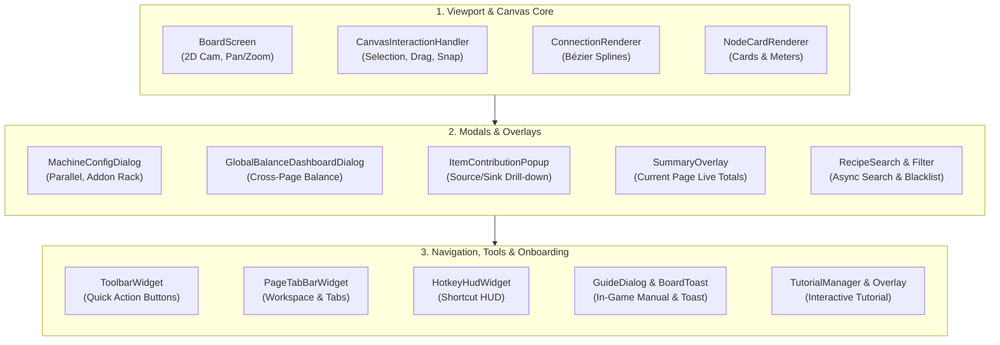

# [03] UI & Rendering Pipeline Overview (UI & Rendering)

> 📍 **GTCalcBoard Technical Specification Series**
> [[00] System Overview](00_OVERVIEW.md) ➔ [[01] Core Domain](01_CORE_DOMAIN_AND_MODELS.md) ➔ [[02] Math Engine](02_MATH_AND_ALGORITHMS.md) ➔ **[03] UI Pipeline** ➔ [[04] Multiplayer](04_MULTIPLAYER_AND_NETWORK_PROTOCOL.md) ➔ [[05] External Integration](05_INTEGRATION_AND_I18N.md)

---

## 1. Presentation Layer Architecture (`com.gtceu.calcboard.client.gui`)

GTCalcBoard integrates cleanly into Minecraft's GUI rendering pipeline, maintaining smooth 60fps interaction even with 1,200+ node graphs.

---

## 📑 UI Detailed Specification Index

Detailed behavioral specs and clean HTML wireframes are divided across 4 specialized chapters:

### 1. [[03-01] 2D Canvas Viewport & Node Card Rendering](03_01_CANVAS_AND_NODE_CARDS.md)
* **2D Viewport Math**: Screen $\leftrightarrow$ Canvas coordinate transformation matrices, exponential zooming, dot grid.
* **Cubic Bézier Wire Renderer (`ConnectionRenderer`)**: Control point math, flow pulse animations, 24-segment hit testing.
* **Node Card Wireframes (`NodeCardRenderer`)**: Standard machine and compound module card layouts.

### 2. [[03-02] Machine Configuration & Addon Rack UI](03_02_MACHINE_CONFIG_AND_ADDONS.md)
* **Parallel Controls**: Numerical input, quick presets (`1x ~ 256x`), `⚡ Auto Max Parallel`.
* **Active Addon Tray**: Inline stat badges, removal buttons, pagination.
* **Addon Catalog Browser**: Capability matrix integration, coils, parallel/maintenance hatches, rotor 3D grid, thermal augments, custom builder.

### 3. [[03-03] Page Summary & Global Balance Dashboard UI](03_03_PAGE_SUMMARY_AND_DASHBOARD.md)
* **Current Page Summary (`SummaryOverlay`)**: Right-side collapsible panel, total EU/t, active machine counts, raw inputs & net products.
* **Global Balance Dashboard (`GlobalBalanceDashboardDialog`)**: Multi-page selector, deficit/surplus/balanced tabs, global energy balance.
* **Item Contribution Drill-down (`ItemContributionPopup`)**: Per-item source and sink analysis across pages.

### 4. [[03-04] Recipe Search, Filters, Hotkey HUD, Guide & Toast UI](03_04_RECIPE_SEARCH_AND_TOOLS.md)
* **Async Recipe Search & Filters (`RecipeSearchDialog` / `RecipeFilterDialog`)**: Parametric multi-token search, category blacklist toggles.
* **Navigation & Hotkey HUD (`ToolbarWidget`, `HotkeyHudWidget`)**: Workspace tabs, bottom toolbar, collapsible shortcut HUD.
* **In-Game Guidebook (`GuideDialog`)**: 8-category manual with keycap highlights.
* **Global Action Toast (`BoardToast`)**: Floating bottom-center fade notifications.
* **Interactive Onboarding (`tutorial/*`)**: Glow highlights and step-by-step guidance.

---

> ➡️ **Next Chapter**: [[04] Multiplayer Concurrency & Network Protocols](04_MULTIPLAYER_AND_NETWORK_PROTOCOL.md)
