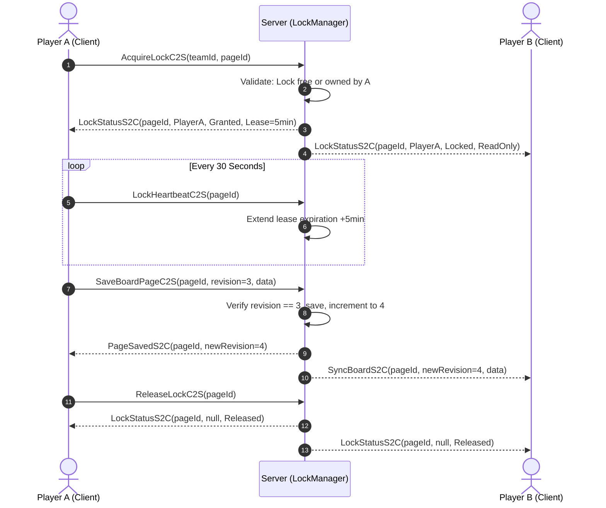

# [04] Multiplayer Concurrency & Network Protocols (Multiplayer & Network)

> 📍 **GTCalcBoard Technical Specification Series**
> [[00] System Overview](00_OVERVIEW.md) ➔ [[01] Core Domain](01_CORE_DOMAIN_AND_MODELS.md) ➔ [[02] Math Engine](02_MATH_AND_ALGORITHMS.md) ➔ [[03] UI Pipeline](03_UI_AND_RENDERING_PIPELINE.md) ➔ **[04] Multiplayer** ➔ [[05] External Integration](05_INTEGRATION_AND_I18N.md)

---

## 1. Network Architecture (`com.gtceu.calcboard.network`)

GTCalcBoard uses Forge `SimpleChannel` with 6 C2S and 4 S2C packets to synchronize team board pages and manage concurrency locks.

### 1.1 Packet Registry

| Packet Class | Direction | Purpose & Payload |
| :--- | :--- | :--- |
| `RequestBoardSyncC2S` | C2S | Client requests initial board data upon opening the UI (`teamId`, `workspaceMode`). |
| `SyncBoardS2C` | S2C | Server delivers full workspace payload (`revision`, `pagesNbt`, `activeLocks`). |
| `AcquireLockC2S` | C2S | Client requests 5-minute lease lock on `pageId`. |
| `LockStatusS2C` | S2C | Broadcasts lock grant/rejection/expiry (`pageId`, `holderUuid`, `holderName`, `leaseRemainingMs`). |
| `ReleaseLockC2S` | C2S | Explicit lock release on page close or tab switch. |
| `LockHeartbeatC2S` | C2S | 30-second keep-alive packet extending lease. |
| `SaveBoardPageC2S` | C2S | Saves modified graph data (`pageId`, `expectedRevision`, `pageNbt`). |
| `PageSavedS2C` | S2C | Confirms save success and broadcasts new `revision` number. |
| `DeletePageC2S` | C2S | Deletes a team board page (`teamId`, `pageId`). |
| `PageDeletedS2C` | S2C | Broadcasts page removal to all team members. |

---

## 2. Distributed Concurrency Control (`WorkspaceLockManager`)



---

## 3. Server Persistence (`TeamBoardSavedData`)

Workspaces are persisted in world storage under `<world>/data/gtcalcboard_workspaces.dat`:

```nbt
TAG_Compound {
  "Workspaces": TAG_List [
    TAG_Compound {
      "TeamId": "ftb_team_uuid_1234",
      "Revision": 42,
      "Pages": TAG_List [
        TAG_Compound {
          "Id": "page_oil_refinery",
          "Name": "Oil Refinery Line",
          "Graph": TAG_Compound { ... }
        }
      ]
    }
  ]
}
```

---

> ➡️ **Next Chapter**: [[05] External Mod Integrations & i18n Units](05_INTEGRATION_AND_I18N.md)
