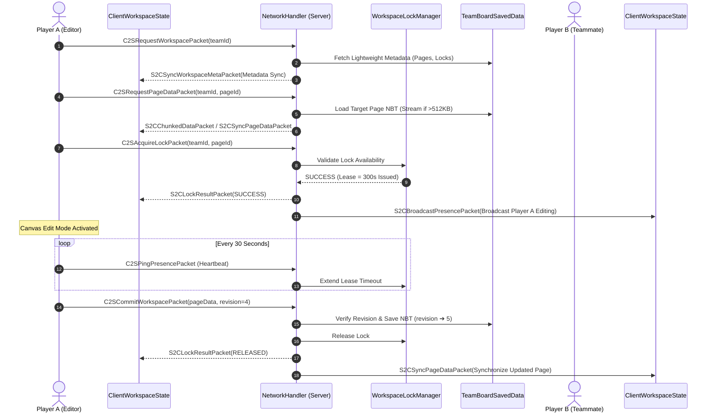
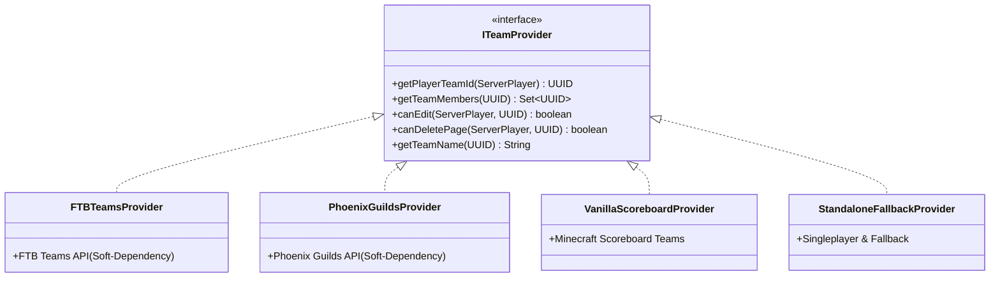

# [04] Multiplayer Concurrency Control & Network Protocol (Multiplayer & Network)

> 📍 **GTCalcBoard Technical Specification Series**
> [[00] System Overview](00_OVERVIEW.md) ➔ [[01] Core Domain & Models](01_CORE_DOMAIN_AND_MODELS.md) ➔ [[02] Math & Algorithms](02_MATH_AND_ALGORITHMS.md) ➔ [[03] UI & Rendering Pipeline](03_UI_AND_RENDERING_PIPELINE.md) ➔ **[04] Multiplayer & Network** ➔ [[05] External Integration & i18n](05_INTEGRATION_AND_I18N.md)

---

## 1. Network Architecture Overview (`com.gtceu.calcboard.network`)

GTCalcBoard implements a robust bidirectional packet pipeline over Forge `SimpleChannel` (Protocol Version `2.0.0`) to synchronize multiplayer team workspaces in real time. To overcome the Netty $2\text{MB}$ payload threshold, it features **2-Tier On-Demand Paging** and **512KB Chunked Streaming**.



---

## 2. 2-Tier On-Demand Paging & 512KB Chunked Streaming

### 2.1 2-Tier On-Demand Paging
- **Tier 1 (Metadata Synchronization)**: On board open, sends only page IDs, titles, authors, and revisions via `S2CSyncWorkspaceMetaPacket` instead of full heavy graph NBTs.
- **Tier 2 (On-Demand Page Load)**: When a player clicks to open a specific tab, `C2SRequestPageDataPacket` fetches that page's detailed `FlowGraph` lazily.

### 2.2 512KB Chunked Streaming (`S2CChunkedDataPacket`)
- For massive board pages exceeding $512\text{KB}$ after NBT compression, data is automatically split and streamed sequentially.
- The client reassembles the byte stream upon receiving all chunks, completely preventing Netty buffer overflow crashes.

---

## 3. C2S (Client to Server) Packet Specifications (8 Packets)

| Packet Class | Payload Structure | Description & Server Action |
| :--- | :--- | :--- |
| `C2SRequestWorkspacePacket` | `UUID teamId` | Requests lightweight workspace metadata and page list |
| `C2SRequestPageDataPacket` | `UUID teamId, String pageId` | Requests on-demand full graph data for a single page |
| `C2SAcquireLockPacket` | `UUID teamId, String pageId` | Requests exclusive edit lock for a page |
| `C2SReleaseLockPacket` | `UUID teamId, String pageId` | Voluntarily releases an active page edit lock |
| `C2SCommitWorkspacePacket` | `UUID teamId, String pageId, CompoundTag pageData, int clientRevision, String commitMessage` | Commits edited page data to server (optimistic lock validation) |
| `C2SDeleteTeamPagePacket` | `UUID teamId, String pageId` | Requests deletion of a team page (requires officer/admin permissions) |
| `C2SPingPresencePacket` | `UUID teamId, String pageId` | Heartbeat ping to extend lock lease ownership |
| `C2SCreatePagePacket` | `UUID teamId, String pageTitle` | Requests creation of a new team page |

---

## 4. S2C (Server to Client) Packet Specifications (9 Packets)

| Packet Class | Payload Structure | Description & Client Action |
| :--- | :--- | :--- |
| `S2CSyncWorkspaceMetaPacket` | `UUID teamId, List<PageMeta> pages, Map<String, LockInfo> activeLocks` | Syncs lightweight metadata and tab list |
| `S2CSyncPageDataPacket` | `UUID teamId, String pageId, CompoundTag pageData` | Syncs complete graph data for a specific page |
| `S2CChunkedDataPacket` | `UUID streamId, int chunkIndex, int totalChunks, byte[] chunkData` | Streams 512KB chunked large payload sequences |
| `S2CLockResultPacket` | `UUID teamId, String pageId, boolean success, UUID lockHolder, String holderName, long expireTime` | Returns lock acquisition/release results |
| `S2CBroadcastPresencePacket` | `UUID teamId, Map<String, LockInfo> activeLocks` | Real-time broadcast of team lock states and presence |
| `S2CWorkspaceErrorPacket` | `String errorCode, String errorMessageKey` | Broadcasts version conflicts, permission errors, or timeouts |
| `S2CSyncWorkspacePacket` | `UUID teamId, TeamWorkspaceData workspaceData` | Legacy bulk workspace sync fallback |
| `S2CPageCreatedPacket` | `UUID teamId, String pageId, String pageTitle` | Notifies new page creation |
| `S2CPageDeletedPacket` | `UUID teamId, String pageId` | Notifies page deletion |

---

## 5. Distributed Concurrency Control & Lease Locking (`WorkspaceLockManager`)

1. **Lease-Based Soft Locking**:
   - Locks are issued with a $300\text{s}$ ($5\text{min}$) validity window.
   - Editors send `C2SPingPresencePacket` every $30\text{s}$ to renew the lease.
   - Client disconnects or crashes trigger automatic unlock after $5\text{min}$.
2. **Optimistic Revision Validation**:
   - Commits succeed only when the server's current page `revision` strictly matches the client's `clientRevision`.
3. **Fork to Personal Workspace**:
   - Locked pages can be instantly cloned into the local personal tab via [Fork to Personal] for independent editing.

---

## 6. Server Persistence & SavedData Schema (`TeamBoardSavedData`)

* **File Location**: `<world>/data/gtcalcboard_workspaces.dat` (via vanilla `DimensionDataStorage`)

```json
{
  "Workspaces": [
    {
      "TeamId": "c1f7b029-7977-4c12-9c3f-85472149b111",
      "TeamName": "GregTech Pioneers",
      "Revision": 42,
      "Pages": [
        {
          "PageId": "page_benzene_cracking",
          "Title": "Benzene Cracking Line",
          "Revision": 12,
          "LastModifiedBy": "PlayerName",
          "LastModifiedTime": 1724123456789,
          "GraphNBT": {
            "Nodes": [ ... ],
            "Connections": [ ... ]
          }
        }
      ],
      "CommitLogs": [
        {
          "Timestamp": 1724123456789,
          "Author": "PlayerName",
          "Message": "Upgraded coils to HSS-E",
          "Revision": 42
        }
      ]
    }
  ]
}
```

---

## 7. Team Provider Abstraction (`ITeamProvider`)



---

> ➡️ **Next Chapter**: [[05] External Integration & Internationalization](05_INTEGRATION_AND_I18N.md)
