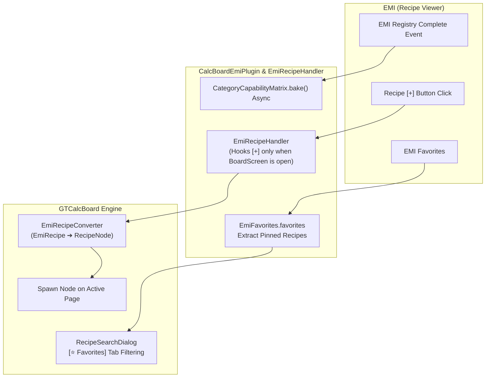

# [05] External Mod Integrations & i18n Units (Integration & i18n)

> 📍 **GTCalcBoard Technical Specification Series**
> [[00] System Overview](00_OVERVIEW.md) ➔ [[01] Core Domain](01_CORE_DOMAIN_AND_MODELS.md) ➔ [[02] Math Engine](02_MATH_AND_ALGORITHMS.md) ➔ [[03] UI Pipeline](03_UI_AND_RENDERING_PIPELINE.md) ➔ [[04] Multiplayer](04_MULTIPLAYER_AND_NETWORK_PROTOCOL.md) ➔ **[05] External Integration**

---

## 1. EMI Recipe Viewer Integration (`com.gtceu.calcboard.integration.emi`)

GTCalcBoard deeply integrates with EMI (Recipe Viewer) using official recipe handlers and favorites synchronization:

### 1.1 Plugin Lifecycle & Recipe Handler (`CalcBoardEmiPlugin`)
* Implements `dev.emi.emi.api.EmiPlugin`.
* Listens for EMI registry completion to trigger asynchronous matrix pre-baking (`CategoryCapabilityMatrix.bake()`).
* **Registers Official `EmiRecipeHandler`**:
  - `supportsRecipe(recipe)`: Supports all `EmiRecipe` instances.
  - `canCraft(recipe, context)`: Active (`true`) only when `Minecraft.getInstance().screen instanceof BoardScreen`.
  - `craft(recipe, context)`: Spawns the node on the active board page without interfering with standard crafting tables or machine GUIs.

### 1.2 Recipe Search Favorites Filtering (`RecipeSearchDialog`)
* Directly reads pinned/bookmarked recipes from `dev.emi.emi.registry.EmiFavorites.favorites`.
* Provides a quick `[⭐ Favorites]` toggle button in the search dialog to load bookmarked recipes with a single click.

### 1.3 Recipe Converter (`EmiRecipeConverter`)
Converts native `EmiRecipe` objects into pure domain `RecipeNode` representations:
* Extracts duration in ticks (`recipe.getDuration()`)
* Extracts base EU/t (`recipe.getEnergy()`)
* Extracts item/fluid inputs and outputs into `IngredientStack` lists.

---

## 2. Rate Time Units & Numerical Formatting

### 2.1 Time Unit Enumeration (`RateTimeUnit`)

Configurable via hotkey `T` or settings dialog:

$$\text{Displayed Rate} = \text{RatePerSecond} \times \text{Multiplier}$$

| Unit | ID | Multiplier | Suffix |
| :--- | :--- | :--- | :--- |
| **Tick** | `TICK` | $\frac{1}{20} = 0.05$ | `/t`, `mB/t` |
| **Second** (Default) | `SECOND` | $1.0$ | `/s`, `mB/s` |
| **Minute** | `MINUTE` | $60.0$ | `/min`, `mB/min` |
| **Hour** | `HOUR` | $3,600.0$ | `/h`, `B/h` |
| **Day** | `DAY` | $86,400.0$ | `/d`, `B/d` |

### 2.2 Energy & Flow Formatting (`FormatUtil`)

* **Energy**: `formatEU(4800)` $\rightarrow$ `"4.80k EU/t"`, `formatEU(125000000)` $\rightarrow$ `"125.0M EU/t"`
* **Flows**: `formatFluid(1200)` $\rightarrow$ `"1.20k mB/s"`, `formatFluid(0.5)` $\rightarrow$ `"0.50 mB/s"`

---

## 3. Localization & i18n Synchronization (`assets/gtcalcboard/lang`)

UI text is strictly managed via language translation files with 100% key synchronization between `en_us.json` and `ko_kr.json`.

---

> 🏁 **End of Technical Specification Series**
> Return to [[Master Index]](CODE_SPECIFICATION.md)
