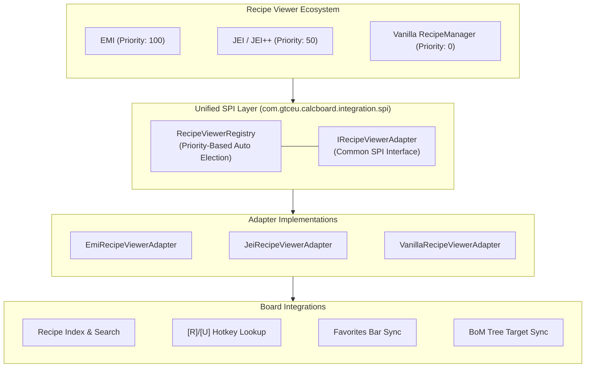
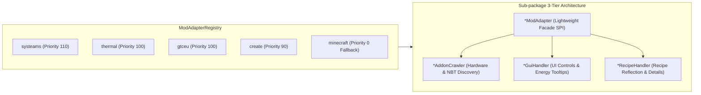

# [05] External Mod Integrations & i18n Units (Integration & i18n)

> 📍 **GTCalcBoard Technical Specification Series**
> [[00] System Overview](00_OVERVIEW.md) ➔ [[01] Core Domain](01_CORE_DOMAIN_AND_MODELS.md) ➔ [[02] Math Engine](02_MATH_AND_ALGORITHMS.md) ➔ [[03] UI Pipeline](03_UI_AND_RENDERING_PIPELINE.md) ➔ [[04] Multiplayer](04_MULTIPLAYER_AND_NETWORK_PROTOCOL.md) ➔ **[05] External Integration**

---

## 1. Unified Recipe Viewer SPI System (`com.gtceu.calcboard.integration.spi`)

Following Clean Architecture principles, GTCalcBoard does not hardcode dependencies on any specific recipe viewer. It provides a pluggable **Recipe Viewer SPI (`IRecipeViewerAdapter`)** that dynamically elects the optimal viewer at runtime:

### 1.1 `IRecipeViewerAdapter` Core Contract
* `getName()` / `getPriority()`: Adapter identifier and priority weighting.
* `isAvailable()`: Mod loading verification and runtime environment check.
* `getAllRecipes()`: Harvests all valid recipes instantiable as canvas nodes.
* `getFavorites()`: Real-time synchronization with player pinned/bookmarked recipes.
* `registerBomToRecipeTree(bomSummary, warnings)`: 1-click registration of BoM shopping lists into the recipe tree / calculation goals.
* `lookupRecipe(stack)` / `lookupUsage(stack)`: Triggers recipe or usage views on `[R]` / `[U]` hover.

### 1.2 Pluggable Adapter Implementations
* **`EmiRecipeViewerAdapter` (`integration.emi`)**:
  - Registers official `EmiRecipeHandler` to place nodes directly from EMI `[+]` buttons when the board is open.
  - Syncs `EmiFavorites.favorites` and integrates with `EmiRecipeTree` BoM targets.
* **`JeiRecipeViewerAdapter` (`integration.jei`)**:
  - Indexes JEI recipe catalogs, handles `[R]`/`[U]` lookups, and synchronizes JEI bookmarks.
  - Integrates with JEI++ (Just Enough Calculation) for BoM recipe tree target registration.
* **`VanillaRecipeViewerAdapter` (`integration.vanilla`)**:
  - Fallback adapter for pure vanilla or headless environments without recipe viewer mods. Indexes base Minecraft `RecipeManager` recipes.

---

## 2. Mod Compatibility Adapter System (`com.gtceu.calcboard.compat`)

GTCalcBoard implements a **Priority-Based SPI (Service Provider Interface)** router to support multi-mod ecosystems with clean Single Responsibility Principle (SRP) decomposition across dedicated sub-packages.

### 2.1 Sub-Package Architecture Breakdown

| Sub-Package | Core Components | Assigned Responsibilities |
| :--- | :--- | :--- |
| `compat.gtceu` | `GTCEuModAdapter` `GTCEuAddonCrawler` `GTCEuGuiHandler` `GTCEuRecipeHandler` | • GT multiblock traits, heating coils, turbine rotors, parallel/maintenance hatches discovery • Voltage tier badges and EU/t tooltip rendering • GTRecipe reflection and generator/consumer conversion • Steam mode (LP/HP) and steam multiblock auto-configuration and validation |
| `compat.create` | `CreateModAdapter` `CreateGuiHandler` `CreateRecipeHandler` | • Virtual kinetic generator recipes (Large Water Wheel, Windmill, Steam Engine, etc.) • RPM control buttons and Stress Unit (SU) tooltip rendering • Create processing recipe duration and stress load adaptation |
| `compat.createnewage` | `CreateNewAgeModAdapter` `CreateNewAgeGuiHandler` `CreateNewAgeRecipeHandler` | • Electric motor (FE ➔ SU) and generator (SU ➔ FE) virtual recipes • Torque/power conversion efficiency and voltage step regulation |
| `compat.thermal` | `ThermalModAdapter` `ThermalAddonCrawler` `ThermalGuiHandler` `ThermalRecipeHandler` | • Thermal augments and KubeJS custom kits (`AugmentData` NBT) crawling • Dynamo generation (RF/t) tooltip rendering • Thermal dynamo and machine recipe detail extraction |
| `compat.systeams` | `SysteamsModAdapter` `SysteamsGuiHandler` `SysteamsRecipeHandler` | • Steam boiler (Steam mB/s) and Steam Dynamo tooltip rendering • SysteamsConfig reflection for boiling heat efficiency and steam production |
| `compat.start` | `StarTModAdapter` `StarTTurbineHelper` `StarTAddonCrawler` | • Star Technology custom plasma turbines (SPT/NPT) and multi-helix multiblock support • SPT/NPT trait addon compatibility and structure constraints validation |
| `compat.vanilla` | `VanillaModAdapter` | • Universal singleblock fallback for standard Minecraft recipes |

### 2.2 `IModAdapter` Lifecycle & Core Responsibilities

* `onMachineIconChanged(node, oldIcon, newIcon)`: Automatically adjusts multiblock flag, steam mode, default parallel (8x etc.), and slot synchronization upon icon change.
* `getEnergyType(node)`: Resolves the node's physical energy model (`ELECTRIC_EU`, `KINETIC_SU`, `ELECTRIC_FE`, `HEAT_OR_SELF`, `NONE`).
* `computeOverclock(node, targetTier, isGenerator)`: Calculates voltage overclocking, sub-tick batches, rotor efficiency, coil temperature discounts, and augment multipliers.
* `validateNode(node, graph, warnings)`: Deterministically validates reflector requirements, turbine flow deficits, and hatch/bus slot constraints.
* `buildMultiblockBOM(node, warnings)`: Solves multiblock structure bill of materials from controller pattern recipes with hybrid hatch overrides.

### 2.3 Addon & Spec Deductive Analysis Policy (Rule 5)

* **Strict Anti-Heuristic Rule**: String matching on tooltips, item display names, or raw item paths (`id.getPath().contains(...)`) to deduce machine specs or addon properties is strictly forbidden.
* **Deterministic Deduction**:
  1. Official mod APIs and runtime Java reflection (`Functional Deduction`).
  2. In-game object / simulation state execution.
  3. Pure NBT numeric tags (e.g. `AugmentData` float/int compound tags) and official Forge `TagKey` registries.

### 2.4 Dynamic Crawler Orchestration & Dead Item Pruning (`DynamicAddonCrawler`)
* **Active Stack Harvesting**: Gathers all live `ItemStack` instances with NBT directly from EMI index (`EmiApi.getIndexStacks()`) and game level recipes (`mc.level.getRecipeManager()`).
* **Adapter Delegation**: Dispatches active stacks to `adapter.discoverAddons(collector, activeStacks)` without hardcoding mod-specific logic in the central crawler.
* **Dead Item Pruning**: Automatically filters out disabled items (items hidden from EMI and with no recipes) to ensure a clean addon configuration catalog.

---

## 3. Rate Time Units & Numerical Formatting

### 2.1 Time Unit Enumeration (`RateTimeUnit`)

Configurable via hotkey `T` or settings dialog:

$$\text{Displayed Rate} = \text{RatePerSecond} \times \text{Multiplier}$$

| Unit | ID | Multiplier | Suffix |
| :--- | :--- | :--- | :--- |
| **Tick** | `TICK` | $\frac{1}{20} = 0.05$ | `/t`, `mB/t` |
| **Second** (Default) | `SECOND` | $1.0$ | `/s`, `mB/s` |
| **Minute** | `MINUTE` | $60.0$ | `/min`, `mB/min` |
| **Hour** | `HOUR` | $3,600.0$ | `/h`, `B/h` |
| **Day** | `DAY` | $86,400.0$ | `/d`, `B/d` |

### 3.2 Energy & Flow Formatting (`FormatUtil`)

* **Energy**: `formatEU(4800)` $\rightarrow$ `"4.80k EU/t"`, `formatEU(125000000)` $\rightarrow$ `"125.0M EU/t"`
* **Flows**: `formatFluid(1200)` $\rightarrow$ `"1.20k mB/s"`, `formatFluid(0.5)` $\rightarrow$ `"0.50 mB/s"`
* **Global Fluid Unit Formatting (`FluidUnitMode`)**:
  - `AUTO` (Default): Smart scaling ($< 1,000\text{ mB}$ in $\text{mB/s}$, $\ge 1,000\text{ mB}$ in $\text{B/s}$).
  - `ALWAYS_MB`: Force all fluids to millibuckets (`500 mB/s`, `2500 mB/s`, `0.10 mB/s`).
  - `ALWAYS_B`: Force all fluids to buckets (`0.50 B/s`, `2.50 B/s`, `0.0001 B/s`).
  - Toggled via the toolbar button (`Shift+T`) and persisted in client configuration.

---

## 4. Localization & i18n Synchronization (`assets/gtcalcboard/lang`)

UI text is strictly managed via language translation files with 100% key synchronization between `en_us.json` and `ko_kr.json`.

---

> 🏁 **End of Technical Specification Series**
> Return to [[Master Index]](CODE_SPECIFICATION.md)
