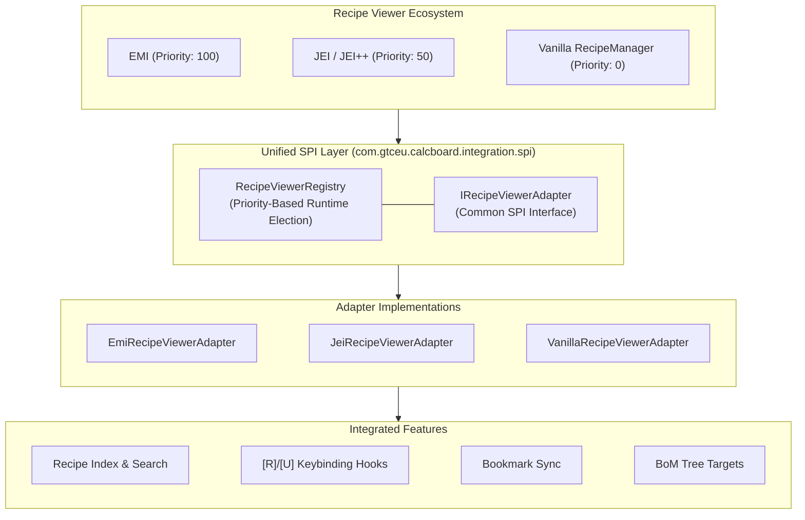
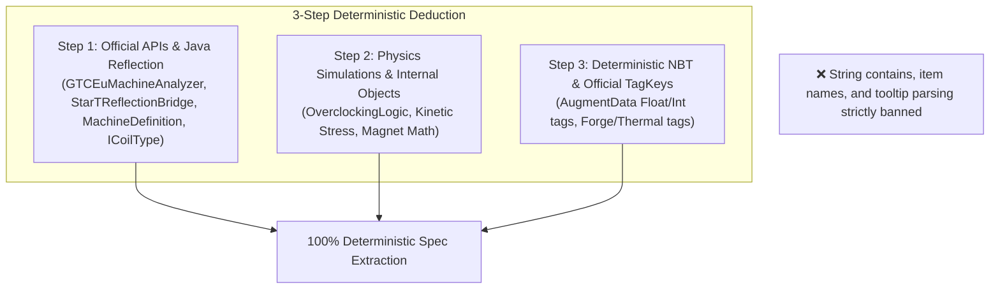

# [05] External Mod Integration & Internationalization (Integration & i18n)

> 📍 **GTCalcBoard Technical Specification Series**
> [[00] System Overview](00_OVERVIEW.md) ➔ [[01] Core Domain & Models](01_CORE_DOMAIN_AND_MODELS.md) ➔ [[02] Math & Algorithms](02_MATH_AND_ALGORITHMS.md) ➔ [[03] UI & Rendering Pipeline](03_UI_AND_RENDERING_PIPELINE.md) ➔ [[04] Multiplayer & Network](04_MULTIPLAYER_AND_NETWORK_PROTOCOL.md) ➔ **[05] External Integration & i18n**

---

## 1. Unified Recipe Viewer SPI System (`com.gtceu.calcboard.integration.spi`)

Adheres to Clean Architecture by decoupling core calculation models from specific recipe viewers, dynamically electing the optimal viewer via the **`IRecipeViewerAdapter` SPI**.



### 1.1 `IRecipeViewerAdapter` Core Contract
* `getName()` / `getPriority()`: Adapter identifier and priority rating.
* `isAvailable()`: Runtime availability check.
* `getAllRecipes()`: Extracts all usable recipes into canvas nodes.
* `getFavorites()`: Syncs bookmarked recipe lists.
* `registerBomToRecipeTree(bomSummary, warnings)`: 1-click BoM shopping list registration.
* `lookupRecipe(stack)` / `lookupUsage(stack)`: Triggers recipe/usage viewers on `[R]` and `[U]` hover.

---

## 2. Mod Compatibility Adapter System (`com.gtceu.calcboard.compat`)

GTCalcBoard implements priority-based SPI routing with strict separation between **Common Headless Adapters (`compat.*`)** and **Client-Only GUI Handlers (`client.gui.compat.*`)**.

```mermaid
graph LR
    subgraph Registry["ModAdapterRegistry (Server & Client Common)"]
        direction TB
        R_SYS["systeams (Priority 110)"]
        R_START["start (Priority 105)"]
        R_NA["createnewage (Priority 105)"]
        R_TH["thermal (Priority 100)"]
        R_GT["gtceu (Priority 100)"]
        R_CR["create (Priority 90)"]
        R_VAN["minecraft (Priority 0 Fallback)"]
    end

    subgraph CoreAdapters["Pure Common Adapters (100% Headless Safe)"]
        GT_AD["GTCEuModAdapter<br/>- physics.GTBoilerPhysics<br/>- physics.GTTurbinePhysics<br/>- physics.GTMultiblockBOMResolver"]
        CR_AD["CreateModAdapter"]
        CNA_AD["CreateNewAgeModAdapter"]
        TH_AD["ThermalModAdapter"]
        SYS_AD["SysteamsModAdapter"]
        STR_AD["StarTModAdapter"]
        VAN_AD["VanillaModAdapter"]
    end

    subgraph ClientGui["Client-Only GUI Layer (@OnlyIn Dist.CLIENT)"]
        GUI_REG["ModGuiHandlerRegistry"]
        GT_GUI["GTCEuModGuiHandler"]
        CR_GUI["CreateModGuiHandler"]
        CNA_GUI["CreateNewAgeModGuiHandler"]
        TH_GUI["ThermalModGuiHandler"]
        SYS_GUI["SysteamsModGuiHandler"]
    end

    Registry --> CoreAdapters
    CoreAdapters -.-> ClientGui
```



### 2.1 7 Mod Adapter Specifications

| Subpackage | Primary Components | Roles & Features |
| :--- | :--- | :--- |
| `compat.gtceu` | `GTCEuModAdapter`<br/>`helper.GTCEuMachineAnalyzer`<br/>`helper.GTCEuReflectionBridge`<br/>`physics.GTBoilerPhysics`<br/>`physics.GTTurbinePhysics`<br/>`physics.GTMultiblockBOMResolver`<br/>`helper.*` | • `GTCEuMachineAnalyzer`: Single Source of Truth (SSOT) deterministic machine & multiblock trait analysis<br/>• GT multiblock physics, coil/rotor/hatch deduction<br/>• Overclocking, headless energy tooltips<br/>• Steam modes & multiblock validation<br/>• Multiblock BOM and hatch overrides |
| `compat.create` | `CreateModAdapter`<br/>`CreateRecipeHandler`<br/>`CreateSequencedRecipeExtractor` | • Kinetic generator virtual recipes (Water Wheel, Windmill)<br/>• `CreateSequencedRecipeExtractor`: Distinct sub-step machine icon extraction (Deployer, Spout, Press, Saw)<br/>• RPM speed control & Stress Unit (SU) math |
| `compat.createnewage` | `CreateNewAgeModAdapter`<br/>`CreateNewAgeRecipeHandler` | • Electric Motor (FE ➔ SU) and Generator (SU ➔ FE) recipes<br/>• Magnet strength compounding & conversion efficiency |
| `compat.thermal` | `ThermalModAdapter`<br/>`ThermalAugmentHelper`<br/>`ThermalRecipeHandler` | • Thermal augments & custom kits (`AugmentData` NBT)<br/>• Dynamo RF/t generation and machine speed multipliers |
| `compat.systeams` | `SysteamsModAdapter`<br/>`SysteamsRecipeHandler` | • Steam boiler (Steam mB/s) and dynamo tooltips<br/>• Composite fuel thermal efficiency scaling |
| `compat.start` | `StarTModAdapter`<br/>`StarTReflectionBridge`<br/>`StarTTurbineHelper` | • `StarTReflectionBridge`: Star Technology Core recipe modifiers and machine capability deduction<br/>• Star Technology plasma turbines (SPT/NPT) and multi-helix structures<br/>• SPT/NPT trait compatibility and multiblock validation |
| `compat.vanilla` | `VanillaModAdapter` | • Standard singleblock and unspecialized mod fallbacks |

---

## 3. Deductive Analysis Policy (Rule 5)



---

## 4. Time Unit System (`RateTimeUnit`)

| Constant | Suffix | Scaling Factor ($F$) | Localization Key | Description |
| :--- | :--- | :--- | :--- | :--- |
| `PER_TICK` | `/t` | $0.05$ | `gui.gtcalcboard.unit.per_tick` | Per-tick flow (20 ticks/sec) |
| `PER_SECOND` | `/s` | $1.0$ | `gui.gtcalcboard.unit.per_second` | Per-second flow (Default base) |
| `PER_MINUTE` | `/min` | $60.0$ | `gui.gtcalcboard.unit.per_minute` | Per-minute flow |
| `PER_HOUR` | `/h` | $3600.0$ | `gui.gtcalcboard.unit.per_hour` | Per-hour flow |
| `PER_DAY` | `/d` | $86400.0$ | `gui.gtcalcboard.unit.per_day` | Per-day flow |

---

## 5. Numerical Formatting & Global Fluid Units (`FormatUtil`, `NumberFormatUtil`)

### 5.1 Power Formatting Prefixes
- $0 \dots 999$: 1 decimal (`120.0 EU/t`)
- $1,000 \dots 999,999$: `k` prefix (`1.25k EU/t`)
- $1,000,000 \dots 999,999,999$: `M` prefix (`4.50M EU/t`)
- $\ge 1,000,000,000$: `G` prefix (`12.00G EU/t`)

### 5.2 Global Fluid Unit Modes (`FluidUnitMode`)
- `AUTO` (Default): Auto-formats ($< 1,000\text{ mB}$ as $\text{mB/s}$, $\ge 1,000\text{ mB}$ as $\text{B/s}$).
- `ALWAYS_MB`: Unifies all fluids to millibuckets (`500 mB/s`, `2500 mB/s`).
- `ALWAYS_B`: Unifies all fluids to buckets (`0.50 B/s`, `2.50 B/s`).

---

## 6. Internationalization (i18n) Synchronization

All user-facing strings are synchronized 1:1 across English (`en_us.json`), Korean (`ko_kr.json`), and Simplified Chinese (`zh_cn.json`).

```json
{
  "gui.gtcalcboard.title": "GT Calculator Board",
  "gui.gtcalcboard.tab.personal": "Personal Board",
  "gui.gtcalcboard.tab.team": "Team Board",
  "gui.gtcalcboard.unit.per_second": "Per Second (/s)",
  "gui.gtcalcboard.dialog.machine_config.title": "Machine Configuration",
  "gui.gtcalcboard.dialog.dashboard.title": "Global Balance Dashboard",
  "gui.gtcalcboard.toast.lock_acquired": "Acquired edit lock.",
  "gui.gtcalcboard.toast.conflict": "Board was modified by another teammate."
}
```

---

> 🏠 **Return to Overview**: [[00] System Overview & Architecture](00_OVERVIEW.md)  
> 📑 **Master Specification Index**: [CODE_SPECIFICATION.md](../CODE_SPECIFICATION.md)
