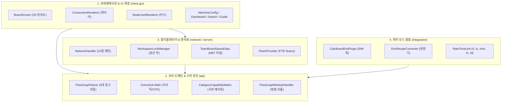

# [00] 시스템 아키텍처 개요 및 설계 원칙 (System Overview & Architecture)

> 📍 **GTCalcBoard 기술 명세서 시리즈**
> **[00] 시스템 개요** ➔ [[01] 코어 도메인 모델](01_CORE_DOMAIN_AND_MODELS.md) ➔ [[02] 수학 엔진 및 알고리즘](02_MATH_AND_ALGORITHMS.md) ➔ [[03] UI 및 렌더링 파이프라인](03_UI_AND_RENDERING_PIPELINE.md) ➔ [[04] 멀티플레이어 및 네트워크](04_MULTIPLAYER_AND_NETWORK_PROTOCOL.md) ➔ [[05] 외부 연동 및 다국어](05_INTEGRATION_AND_I18N.md)

---

## 1. 프로젝트 비전 및 핵심 가치 (Vision & Values)

**GregTech Calculator Board (GTCalcBoard)**는 마인크래프트 테크 모드팩 환경(GregTech CEu Modern, GTNH 등)에서 복잡한 다단계 생산 공정을 게임 내에서 직접 시각적으로 설계하고 밸런스를 맞출 수 있도록 지원하는 **인게임 노드 그래프 계산기 및 협업 플랫폼**입니다.

### 3대 핵심 가치
1. **완전한 인게임 완결성**: 외부 스프레드시트나 웹 계산기를 번갈아 볼 필요 없이, 게임 내에서 EMI 레시피를 직접 끌어와 공정 플로우차트를 즉시 작성.
2. **수학적 무결성**: 그렉테크의 복잡한 전압 티어 차이, 오버클럭 가속, 1틱 미만 서브틱(Sub-tick) 배치 처리, 하드웨어 애드온 승수 합성, 부산물 확률 부스트를 100% 정밀하게 연산.
3. **무마찰 멀티플레이어 협업 (v2.0)**: FTB Teams 및 바닐라 스코어보드 팀과 연동하여 전용 서버에서 팀원들과 공정 보드를 실시간으로 공유하고 안전하게 동시 작업.

---

## 2. 4계층 분리 아키텍처 (Layered Architecture)

GTCalcBoard는 단일 책임 원칙(SRP)과 관심사 분리(SoC)를 철저히 준수하여 4개의 계층으로 설계되었습니다.



### 계층별 세부 역할

| 계층 (Layer) | 주요 패키지 | 핵심 책임 및 역할 |
| :--- | :--- | :--- |
| **프레젠테이션 & UI 계층** | `com.gtceu.calcboard.client.gui` | 2D 캔버스 뷰포트 행렬 변환, 마우스/키보드 입력 이벤트 처리, 3차 베지어 와이어 및 노드 카드 렌더링, 대화상자 UI |
| **코어 도메인 & 수학 엔진** | `com.gtceu.calcboard.api` | 노드 및 그래프 토폴로지 관리, 오버클럭/서브틱 연산, 병목 효율 및 자동 비율 그래프 알고리즘, 직렬화 및 Undo/Redo |
| **멀티플레이어 & 영속화** | `com.gtceu.calcboard.network`<br>`com.gtceu.calcboard.server` | C2S/S2C 네트워크 패킷 전송, 분산 편집 락(Lock) 동시성 제어, 서버 월드 `SavedData` NBT 영속화, 팀 프로바이더 추상화 |
| **외부 모드 통합 계층** | `com.gtceu.calcboard.integration.emi` | EMI 레시피 변환, EMI 라이프사이클에 맞춘 매트릭스 비동기 베이킹 트리거, 인게임 호버 프리뷰 렌더링 |

---

## 3. 헤드리스(Headless) 환경 독립성 및 테스트 가능성

코어 도메인 및 수학 엔진(`com.gtceu.calcboard.api`)은 **마인크래프트 클라이언트 클래스(`net.minecraft.client.*`)에 대한 의존성이 0%**입니다.

### 설계상 이점
1. **독립 단위 테스트 가능**: 마인크래프트 게임 클라이언트를 실행하지 않고도 표준 JVM 환경에서 JUnit 테스트 슈트를 통해 모든 수학 수식, 그래프 알고리즘, NBT 직렬화 동작을 100% 검증 가능 (`./gradlew test`).
2. **서버 사이드 안전성**: 전용 서버(Dedicated Server) 환경에서 클라이언트 전용 클래스 참조로 인한 `ClassNotFoundException` 크래시를 원천 차단.
3. **1.7.10 백포트 용이성**: 클라이언트 렌더링 엔진과 코어 연산 엔진이 분리되어 있어, 향후 1.7.10 (GTNH 등) 레거시 버전으로의 백포팅 시 코어 수학 엔진을 코드 수정 없이 그대로 재사용 가능.

---

## 4. 패키지 디렉토리 구조 명세

```
src/main/java/com/gtceu/calcboard/
├── GregTechCalcBoard.java           # 모드 메인 엔트리포인트
├── api/                             # [Core] 수학, 그래프, 도메인 엔진 (헤드리스 독립)
│   ├── BoardManager.java            # 멀티 페이지/문서 관리자
│   ├── BoardPage.java               # 개별 보드 페이지 모델
│   ├── FlowGraph.java               # 유향 노드-엣지 그래프 컨테이너
│   ├── RecipeNode.java              # 공정 기계/발전기/모듈 노드 모델
│   ├── IngredientStack.java         # 아이템/유체 입출력 스택
│   ├── GTVoltageTier.java           # 15단계 전압 티어 정의
│   ├── RateTimeUnit.java            # 시간 단위 환산 열거형 (/t, /s, /min, /h, /d)
│   ├── CategoryCapabilityMatrix.java# 결정론적 수용능력 사전 베이킹 매트릭스
│   ├── CategoryCapability.java      # 레시피 카테고리별 수용능력 불변 레코드
│   ├── FlowGraphSolver.java         # 5대 그래프 해석 알고리즘 엔진
│   ├── FlowGraphModuleHandler.java  # 복합 모듈 패키징/전개 엔진
│   ├── GlobalBalanceAggregator.java # 전역 밸런스 대시보드 집계 엔진
│   ├── BlueprintCodec.java          # NBT/GZIP/Base64 직렬화 코덱
│   ├── CoilHelper.java              # 결정론적 코일 스펙 추출기
│   ├── TurbineRotorHelper.java      # 대형 터빈 로터 스펙 추출기
│   ├── ThermalAugmentHelper.java    # 써멀 증강 스펙 추출기
│   ├── ParallelHelper.java          # 병렬 제어 해치 스펙 추출기
│   └── history/                     # Command 패턴 Undo/Redo 스택
├── client/                          # [UI] 캔버스 및 렌더링 파이프라인
│   ├── gui/                         # 화면, 렌더러, 대화상자, 위젯
│   │   ├── BoardScreen.java         # 2D 캔버스 메인 화면
│   │   ├── CanvasInteractionHandler.java # 마우스 드래그/선택 인터랙션
│   │   ├── ConnectionRenderer.java  # 3차 베지어 와이어 렌더러
│   │   ├── NodeCardRenderer.java    # 노드 카드 렌더러
│   │   ├── MachineConfigDialog.java # 기계 상세 설정창
│   │   ├── GlobalBalanceDashboardDialog.java # 전역 수지 대시보드 창
│   │   ├── search/                  # 비동기 레시피 검색 엔진 및 필터
│   │   └── tutorial/                # 인터랙티브 온보딩 튜토리얼
│   ├── key/                         # 단축키 바인딩
│   └── team/                        # 클라이언트 워크스페이스 실시간 상태 머신
├── network/                         # [Network] SimpleChannel 네트워크 파이프라인
│   ├── NetworkHandler.java          # 패킷 등록 및 라우팅
│   └── packet/                      # C2S 6종, S2C 4종 패킷
├── server/                          # [Server] 서버 사이드 영속화 및 팀 시스템
│   ├── storage/                     # SavedData 기반 NBT 영속화 및 락 관리
│   └── team/                        # ITeamProvider 추상화 (FTB Teams, Vanilla)
└── integration/                     # [Integration] 외부 모드 연동
    └── emi/                         # EMI 플러그인 및 레시피 변환기
```

---

> ➡️ **다음 장으로 이동**: [[01] 코어 도메인 모델 및 결정론적 수용능력 매트릭스](01_CORE_DOMAIN_AND_MODELS.md)
