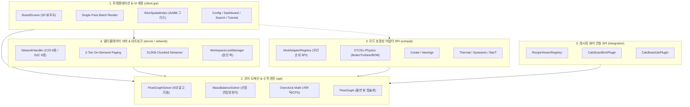

# [00] 시스템 아키텍처 개요 및 설계 원칙 (System Overview & Architecture)

> 📍 **GTCalcBoard 기술 명세서 시리즈**
> **[00] 시스템 개요** ➔ [[01] 코어 도메인 모델](01_CORE_DOMAIN_AND_MODELS.md) ➔ [[02] 수학 엔진 및 알고리즘](02_MATH_AND_ALGORITHMS.md) ➔ [[03] UI 및 렌더링 파이프라인](03_UI_AND_RENDERING_PIPELINE.md) ➔ [[04] 멀티플레이어 및 네트워크](04_MULTIPLAYER_AND_NETWORK_PROTOCOL.md) ➔ [[05] 외부 연동 및 다국어](05_INTEGRATION_AND_I18N.md)

---

## 1. 프로젝트 비전 및 핵심 가치 (Vision & Values)

**GregTech Calculator Board (GTCalcBoard)**는 마인크래프트 테크 모드팩 환경(GregTech CEu Modern, Create, Thermal Series, Star Technology 등)에서 복잡한 다단계 생산 공정을 게임 내에서 직접 시각적으로 설계하고 밸런스를 맞출 수 있도록 지원하는 **인게임 노드 그래프 계산기 및 멀티플레이어 협업 플랫폼**입니다.

### 3대 핵심 가치
1. **완전한 인게임 완결성**: 외부 스프레드시트나 웹 계산기를 번갈아 볼 필요 없이, 게임 내에서 EMI/JEI 레시피를 직접 끌어와 공정 플로우차트를 즉시 작성.
2. **수학적 무결성**: 전압 티어 차이, 오버클럭 가속, 1틱 미만 서브틱(Sub-tick) 배치 처리, 하드웨어 애드온 승수 합성, 폐루프 질량 보존 가우스-요르단 선형 연립방정식 해 도출.
3. **무마찰 멀티플레이어 협업 & 고성능 스트리밍**: Netty 2MB 오버플로우를 원천 차단하는 512KB 청킹 스트리밍 및 2계층 온디맨드 페이징, 분산 임차권 락(Lock)을 통한 실시간 동시 작업.

---

## 2. 5계층 시스템 아키텍처 (5-Tier Clean Architecture)

GTCalcBoard는 단일 책임 원칙(SRP)과 관심사 분리(SoC)를 철저히 준수하여 5개의 계층으로 설계되었습니다.



### 계층별 세부 역할

| 계층 (Layer) | 주요 패키지 | 핵심 책임 및 역할 |
| :--- | :--- | :--- |
| **1. 프레젠테이션 & UI 계층** | `com.gtceu.calcboard.client.gui` | 2D 캔버스 뷰포트 행렬 변환, 마우스/키보드 입력 이벤트 처리, Single-Pass Batch 렌더링, `WireSpatialIndex` $O(\log E)$ 호버 감지, 모달 다이얼로그 |
| **2. 코어 도메인 & 수학 엔진** | `com.gtceu.calcboard.api` | `RecipeNode` 순수 도메인 모델, `FlowGraph` 불변 뷰 캡슐화, Gauss-Jordan 폐루프 질량 보존 솔버($A\mathbf{x}=\mathbf{b}$), 10-Pass BFS 수렴 연산, Undo/Redo |
| **3. 모드 호환성 어댑터 계층** | `com.gtceu.calcboard.compat` | Rule 5 3단계 결정론적 연역 체계(공식 API/리플렉션, 물리 시뮬레이션, NBT/TagKey) 기반 7대 모드 어댑터, `compat.gtceu.physics` 모듈 분리 |
| **4. 서버 & 네트워크 계층** | `com.gtceu.calcboard.network`<br>`com.gtceu.calcboard.server` | C2S 8종 / S2C 9종 패킷 라우팅, 2계층 온디맨드 페이징(`S2CSyncWorkspaceMetaPacket`), 512KB 청킹 스트리밍, `WorkspaceLockManager` 분산 락, `TeamBoardSavedData` |
| **5. 외부 모드 통합 계층** | `com.gtceu.calcboard.integration` | `RecipeViewerRegistry` SPI 기반 EMI / JEI / Vanilla 런타임 우선순위 선출, 비동기 레시피 변환 및 인게임 호버 프리뷰 |

---

## 3. 헤드리스(Headless) 환경 독립성 및 테스트 가능성

코어 도메인 및 수학 엔진(`com.gtceu.calcboard.api`)과 공용 어댑터 계층(`com.gtceu.calcboard.compat`)은 **마인크래프트 클라이언트 클래스(`net.minecraft.client.*`)에 대한 의존성이 0%**입니다.

### 설계상 이점
1. **독립 단위 테스트 가능**: 마인크래프트 게임 클라이언트를 실행하지 않고도 표준 JVM 환경에서 JUnit 테스트 슈트를 통해 모든 수학 수식, 선형 연립방정식 솔버, 그래프 알고리즘, NBT 직렬화 동작을 100% 검증 가능 (`./gradlew test`).
2. **서버 사이드 안전성**: 전용 서버(Dedicated Server) 환경에서 클라이언트 전용 클래스 참조로 인한 `NoClassDefFoundError` 크래시를 원천 차단.
3. **1.7.10 백포트 용이성**: 클라이언트 렌더링 엔진과 코어 연산 엔진이 완벽히 분리되어 있어, 레거시 모드팩 버전으로의 백포팅 시 코어 수학 엔진을 수정 없이 그대로 재사용 가능.

---

## 4. 패키지 디렉토리 구조 명세

```
src/main/java/com/gtceu/calcboard/
├── GregTechCalcBoard.java           # 모드 메인 엔트리포인트
├── api/                             # [Core] 수학, 그래프, 도메인 엔진 (헤드리스 독립 100%)
│   ├── model/                       #   - 핵심 도메인 모델 (RecipeNode, FlowGraph, IngredientStack 등)
│   ├── solver/                      #   - 수학 솔버 알고리즘 (FlowGraphSolver, MassBalanceSolver, ETA 등)
│   ├── storage/                     #   - 보드/페이지 문서 관리 및 코덱 (BoardManager, BlueprintCodec 등)
│   ├── catalog/                     #   - 기계 애드온 카탈로그 & 매트릭스 (CapabilityMatrix, MachineAddon 등)
│   ├── type/                        #   - 전압 티어 및 물리/동작 모드 열거형 (GTVoltageTier, EnergyType 등)
│   ├── util/                        #   - 순수 헤드리스 유틸리티 (NumberFormatUtil, ModCompatHelper)
│   ├── bom/                         #   - 멀티블록 BOM 엔진 (MultiblockBOMCalculator 등)
│   ├── event/                       #   - 라이프사이클 이벤트 (FlowGraphEvent, CatalogLifecycleEvent 등)
│   ├── history/                     #   - Undo/Redo 커맨드 스택 (HistoryManager, IUndoableCommand 등)
│   └── property/                    #   - 타입 세이프 프로퍼티 레지스트리 (NodePropertyStore 등)
├── client/                          # [UI] 캔버스 및 렌더링 파이프라인
│   ├── gui/                         #   - 메인 화면 및 뷰포트 (BoardScreen, CanvasInteractionHandler)
│   │   ├── render/                  #     - 단일 패스 배치 렌더러 & WireSpatialIndex 공간 분할 색인
│   │   ├── dialog/                  #     - 모달 다이얼로그 (MachineConfigDialog, BOMDialog, SearchDialog 등)
│   │   ├── widget/                  #     - HUD, 탭바, 툴바, 팝업 (SummaryOverlay, ToolbarWidget, HotkeyHud 등)
│   │   ├── editor/                  #     - 인라인 수치/이름 에디터 (NodeCountEditor, NodeParallelEditor 등)
│   │   ├── compat/                  #     - 클라이언트 전용 모드 GUI 핸들러 (@OnlyIn Dist.CLIENT)
│   │   ├── util/                    #     - UI 포맷팅 유틸리티 (FormatUtil)
│   │   ├── search/                  #     - 비동기 레시피 검색 엔진 및 필터
│   │   └── tutorial/                #     - 인터랙티브 온보딩 튜토리얼 (TutorialManager)
│   ├── key/                         #   - 단축키 바인딩
│   └── team/                        #   - 클라이언트 워크스페이스 실시간 상태 머신
├── compat/                          # [Mod Compat SPI] 외부 모드 연동 공용 어댑터 (서버-클라이언트 중립)
│   ├── gtceu/                       #   - GregTech CEu Modern 어댑터
│   │   ├── physics/                 #     - GTBoilerPhysics, GTTurbinePhysics, GTMultiblockBOMResolver
│   │   └── helper/                  #     - CoilHelper, ParallelHelper, ReflectorHelper, HatchHelper
│   ├── create/                      #   - Create 어댑터 및 키네틱 핸들러
│   ├── createnewage/                #   - Create New Age 어댑터 및 자석 애드온
│   ├── thermal/                     #   - Thermal Series 어댑터 및 증강 애드온 (ThermalAugmentHelper)
│   ├── systeams/                    #   - Thermal Systeams 증기 보일러/다이나모 어댑터
│   ├── start/                       #   - Star Technology 플라즈마 터빈/헬릭스 어댑터
│   └── vanilla/                     #   - 바닐라 무전력 패시브 폴백
├── integration/                     # [Recipe Viewer SPI] 외부 레시피 뷰어 연동
│   ├── spi/                         #   - IRecipeViewerAdapter, RecipeViewerRegistry
│   ├── emi/                         #   - EMI 플러그인, 레시피 변환기 및 가상 레시피
│   ├── jei/                         #   - JEI 플러그인 및 뷰어 어댑터
│   └── vanilla/                     #   - 순수 레시피 매니저 폴백
├── network/                         # [Network] SimpleChannel 네트워크 파이프라인
│   ├── NetworkHandler.java          #   - 패킷 등록 및 512KB 청킹 스트리밍 라우팅
│   └── packet/                      #   - C2S 8종, S2C 9종 패킷 (c2s, s2c)
└── server/                          # [Server] 서버 사이드 영속화 및 팀 시스템
    ├── storage/                     #   - SavedData 기반 NBT 영속화 및 WorkspaceLockManager 분산 락
    └── team/                        #   - ITeamProvider 추상화 (FTB Teams, Phoenix Guilds, Vanilla)
```

---

> ➡️ **다음 장으로 이동**: [[01] 코어 도메인 모델 및 결정론적 수용능력 매트릭스](01_CORE_DOMAIN_AND_MODELS.md)
