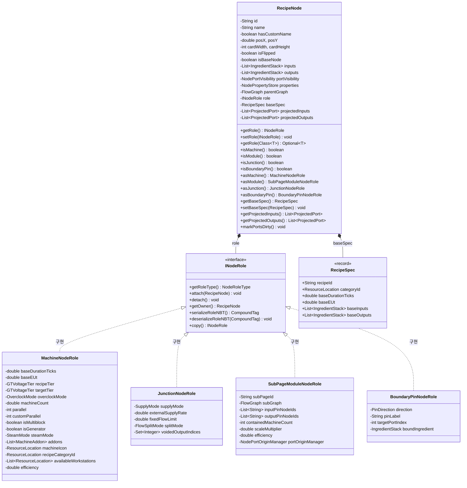
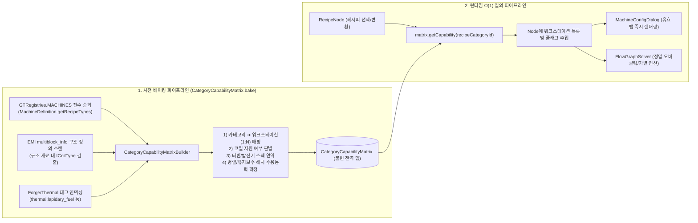
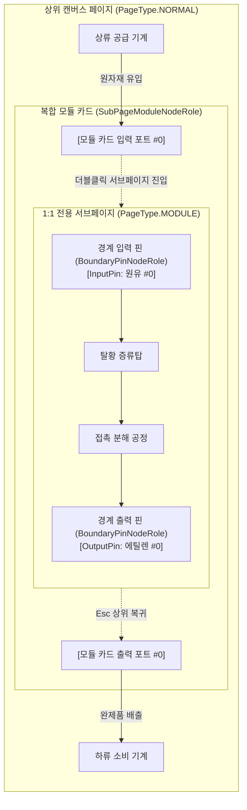

# [01] 코어 도메인 모델 및 결정론적 수용능력 매트릭스 (Core Domain & Models)

> 📍 **GTCalcBoard 기술 명세서 시리즈**
> [[00] 시스템 개요](00_OVERVIEW.md) ➔ **[01] 코어 도메인 모델** ➔ [[02] 수학 엔진 및 알고리즘](02_MATH_AND_ALGORITHMS.md) ➔ [[03] UI 및 렌더링 파이프라인](03_UI_AND_RENDERING_PIPELINE.md) ➔ [[04] 멀티플레이어 및 네트워크](04_MULTIPLAYER_AND_NETWORK_PROTOCOL.md) ➔ [[05] 외부 연동 및 다국어](05_INTEGRATION_AND_I18N.md)

---

## 1. 핵심 데이터 모델 명세 (`com.gtceu.calcboard.api`)

### 1.1 `GTVoltageTier` (전압 티어 열거형)
그렉테크(GTCEu Modern)의 15개 전압 티어를 완벽히 정의합니다.

| 티어 (Tier) | 전압 (EU/t) | UI 축약명 | 테마 색상 (Hex ARGB) |
| :--- | :--- | :--- | :--- |
| `ULV` | 8 | ULV | `0xFF8C8C8C` |
| `LV` | 32 | LV | `0xFFDCDCDC` |
| `MV` | 128 | MV | `0xFFFF6464` |
| `HV` | 512 | HV | `0xFFFFFF64` |
| `EV` | 2,048 | EV | `0xFF6464FF` |
| `IV` | 8,192 | IV | `0xFFFF64FF` |
| `LuV` | 32,768 | LuV | `0xFF64FFFF` |
| `ZPM` | 131,072 | ZPM | `0xFFFF6464` |
| `UV` | 524,288 | UV | `0xFF64FF64` |
| `UHV` | 2,097,152 | UHV | `0xFFFF3232` |
| `UEV` | 8,388,608 | UEV | `0xFF64B4FF` |
| `UIV` | 33,554,432 | UIV | `0xFF32FF82` |
| `UXV` | 134,217,728 | UXV | `0xFFFF82FF` |
| `OpV` | 536,870,912 | OpV | `0xFF5050FF` |
| `MAX` | 2,147,483,647 | MAX | `0xFFFF8282` |

---

### 1.2 `IngredientStack` (재료 스택 모델)
입출력 포트를 통해 흐르는 아이템 및 유체 단위를 캡슐화합니다.

```java
public class IngredientStack {
    private final ResourceLocation id;        // 아이템/유체 고유 ID (예: gtceu:benzene)
    private final String displayName;          // 지역화된 표시 명칭 (예: "Benzene")
    private double amount;                     // 가동 1주기당 소모/생산량
    private final boolean isFluid;             // 유체 여부 (true: mB / false: 개수)
    private double chance;                     // 기본 획득 확률 (0.0 ~ 1.0)
    private double tierChanceBoost;            // 티어 상승당 추가 확률 (기본: 0.05 = +5%)
}
```

---

### 1.3 `RecipeNode` 및 `INodeRole` 역할 컴포지션 객체 모델 (ADR-045, ADR-050)

`RecipeNode`는 캔버스에 배치되는 순수 그래프 도메인 엔티티(좌표, 카드 크기, 공통 속성, 불변 레시피 명세)로 경량화되었으며, 기계 가동, 분기 정션, 복합 모듈, 경계 핀 등 노드별 고유 동작은 `INodeRole` 컴포지션을 통해 전담합니다. 또한 불변 `RecipeSpec`과 `IPortProjectionProvider`를 통해 하드웨어 애드온에 따른 보조 포트를 지연 투영(Lazy Dynamic Projection)합니다.



* **역할 컴포지션 아키텍처 (`INodeRole`, ADR-045)**:
  - `RecipeNode`는 좌표, 크기, 반전 여부, 속성 저장소, 입출력 포트 등의 순수 그래프 메타데이터만을 보유합니다.
  - 4대 고유 역할 컴포넌트:
    1. **`MachineNodeRole`**: 일반 가공 기계, 멀티블록, 발전기, 보일러의 오버클록, 병렬 수, 애드온, 전력(EU/t) 및 가동률($\eta$) 관리.
    2. **`JunctionNodeRole`**: 분기점, 무한/고정 외부 공급원, 보이드 싱크(`VOID_SINK`), 우선순위 선로 분배 관리.
    3. **`SubPageModuleNodeRole`**: 1:1 전용 서브페이지(`PageType.MODULE`)를 캡슐화한 복합 공정 모듈. 내부 서브그래프의 기계 수량 집계 및 복합 전력 적분.
    4. **`BoundaryPinNodeRole`**: 전용 서브페이지 내부와 상위 모듈 카드 포트 간의 물리적 I/O 인터페이스를 계약하는 경계 핀.
  - **듀얼 라이트 NBT 역호환성**: 신규 역할별 태그(`RoleTag`)와 기존 레거시 필드 태그를 동시 기록(Dual-Write)하여 구버전 세이브 및 청사진(Blueprint)과의 100% 무손실 상호 호환성을 유지합니다.
* **불변 레시피 명세 및 동적 포트 투영 (`RecipeSpec`, `IPortProjectionProvider`, ADR-050)**:
  - **불변 원본 명세 (`RecipeSpec`)**: 레시피의 고유 ID, 카테고리, 기본 가동 시간, 기본 EU/t, 기본 원자재 입출력 목록을 `record`로 불변 캡슐화하여, 기계 변경이나 애드온 장착 시 원본 데이터 손실을 방지합니다.
  - **지연 동적 포트 투영 (`ProjectedPort`)**: 기본 레시피 포트(Core Ports, 0..N-1) 뒤에 하드웨어 애드온(증기 보일러 부스터, 산화제, 냉각수 등)에 의해 생성되는 보조 포트(Auxiliary Ports)를 `IPortProjectionProvider`를 통해 순수 함수 형태로 지연 투영합니다.
  - 기존 연결선(`ConnectionEdge`)의 코어 포트 인덱스가 보조 포트 추가/제거에 영향을 받지 않도록 격리하여 토폴로지 무결성을 보장합니다.
* **불변 계산 스냅샷 (`NodeCalculationSnapshot`, ADR-045)**:
  - 백그라운드 솔버 연산 결과(가동률, CPS, 실효 EU/t, 유량)를 락-프리 불변 스냅샷 레코드로 캡처하여 클라이언트 UI 렌더링 스레드로 전달함으로써 화면 깜빡임과 동시성 데이터 레이스를 방지합니다.
* **클린 아키텍처 및 SPI 위임 (Pure Domain Model)**:
  - 머신 아이콘 변경 이벤트(`setMachineIcon`), 물리적 에너지 형태 결정(`getEnergyType`), 단일 기계 소비/발전량 연산(`computeSingleMachinePower`), 노드 가동 유효성 검증(`validateNode`), 멀티블록 BOM 산출(`buildMultiblockBOM`) 등 모드 특화 동작은 `ModAdapterRegistry.getAdapterForNode(this)`를 통해 동적으로 위임됩니다.
* **포트 가시성 및 결산 제어**:
  - `NodePortVisibility`: 비활성화/숨김 처리된 입출력 포트 인덱스를 관리하며 가시 포트만 배선 및 렌더링.
  - `voidedOutputIndices` & `isVoidSink()`: 순 생산품 결산에서 제외할 출력 포트 인덱스 및 정션 노드의 보이드 싱크(`SupplyMode.VOID_SINK`) 판별. 다운스트림 정상 기계의 실수요 충족 후 남은 순 잉여 부산물을 결산에서 폐기 처리.
* **`isFlipped`**: 노드의 입력(좌)/출력(우) 포트 렌더링 방향을 좌우 수평 반전하여 복잡한 플로우차트의 배선 교차 최소화.

---

### 1.4 `NodePropertyStore` 및 `NodeProperties` (타입 세이프 확장 속성)
기존 클래스 필드를 비대화하지 않고, 모드별/기능별 특화 속성을 동적이고 타입 안전하게 관리하는 속성 저장소입니다.

```java
public class NodePropertyStore {
    private final Map<NodeProperty<?>, Object> properties = new HashMap<>();

    public <T> T get(NodeProperty<T> prop) {
        return (T) properties.getOrDefault(prop, prop.defaultValue());
    }

    public <T> void set(NodeProperty<T> prop, T value) {
        properties.put(prop, value);
    }
}
```

* **표준 속성 레지스트리 (`NodeProperties`)**:
  - `REQUIRED_REFLECTOR_TIER` (`Integer`, 기본값 `0`): 핵융합 반응기 반사판 요구 티어
  - `TURBINE_ROTOR_EFFICIENCY` (`Integer`, 기본값 `100`): 대형 터빈 로터 효율 (%)
  - `TURBINE_ROTOR_POWER` (`Integer`, 기본값 `100`): 대형 터빈 로터 파워 (%)
  - `TURBINE_ROTOR_NAME` (`String`, 기본값 `""`): 장착된 터빈 로터 이름
  - `TURBINE_HOLDER_BONUS` (`Integer`, 기본값 `0`): 로터 홀더 추가 효율 보너스 (%)
  - `CLEANROOM_TIER` (`Integer`, 기본값 `0`): 클린룸 요구 레벨
  - `EBF_TEMPERATURE` (`Integer`, 기본값 `0`): 전기로 작동 요구 온도 ($K$)
  - `BOILER_THROTTLE` (`Integer`, 기본값 `100`): 대형 보일러 가동 쓰로틀 비율 (25% ~ 100%)
  - `TARGET_BATCH_AMOUNT` (`Double`, 기본값 `0.0`): 단말/리라우트 노드 목표 배치 생산 수량
  - `TARGET_BATCH_TIME_SEC` (`Double`, 기본값 `0.0`): 희망 완료 제한 시간 (초 단위 역산 기준)

---

### 1.5 전담 계산 및 워크스테이션 해석 컴포넌트 (SRP 분해)

`RecipeNode`의 비대화를 방지하고 순수 POJO 엔티티 책임을 유지하기 위해, 유량 계산 및 워크스테이션 결정 로직을 독립 컴포넌트로 분해하였습니다:

* **`NodeRateCalculator`**:
  - 기계 대수, 병렬치, 오버클럭, 가동 주기, 서브틱 CPS, 애드온 승수 및 티어별 부산물 확률 부스트를 결합하여 초당 투입/산출 유량(`IngredientStack` Flow Rates)을 적분 연산합니다.
  - 단일 기계 수율(`getSingleMachineYieldPerSecond`) 및 실제 소비/생산량 계산 전담.
* **`NodeWorkstationResolver`**:
  - 전압 티어 변경 시 해당 티어에 대응하는 머신 워크스테이션(`ResourceLocation`)을 공식 레지스트리 및 캐시 매트릭스로부터 연역적 매칭.
  - 멀티블록 컨트롤러 유효성 및 티어별 기계 목록 필터링 전담.

---

### 1.6 `FlowGraph` 및 불변 컬렉션 캡슐화

`FlowGraph`는 캔버스 상의 전체 노드망 토폴로지를 캡슐화하며, 외부 수정에 의한 상태 불일치를 원천 차단합니다.

* **불변 뷰 캡슐화 (`Collections.unmodifiableList`)**:
  - `getNodes()` 및 `getEdges()`는 불변 뷰를 반환하여 외부에서의 임의 조작(`graph.getNodes().add(...)`)을 금지하고, 반드시 전용 메서드(`addNode`, `removeNode`, `connect`, `disconnect`)를 통해서만 변경되도록 강제합니다.
* **$O(1)$ 빠른 노드 색인 동기화 (`nodeMap`)**:
  - 노드 추가/삭제/클리어 시 내부 `Map<String, RecipeNode> nodeMap`이 완벽히 동기화되어 `getNode(id)` 질의를 $O(1)$ 시간에 보장합니다.
* **`ConnectionEdge` 불변 레코드 (ADR-041)**:
  ```java
  public record ConnectionEdge(
      String fromNodeId,
      int outputIndex,
      String toNodeId,
      int inputIndex,
      double fixedFlowLimit,
      int priority
  )
  ```
  - `fixedFlowLimit`: 해당 연결선을 통과할 수 있는 최대 고정 유량 한도 (음수 시 무제한).
  - `priority`: 선로 우선순위 계층 (기본값 `0`). 상위 우선순위 선로부터 먼저 유량을 공급합니다.

---

### 1.7 `EnergyType` 및 `SteamMode` (다중 에너지 & 물리 모델)
다양한 기술 모드의 동력 및 에너지 시스템을 통합 관리합니다.

* **`EnergyType`**:
  - `ELECTRIC_EU`: GregTech 전력 (EU/t)
  - `KINETIC_SU`: Create 회전 운동 에너지 (SU, RPM)
  - `ELECTRIC_FE`: Thermal / Create New Age 전력 (RF/t, FE/t)
  - `HEAT_OR_SELF`: 스팀 보일러 및 연소기 (mB/s Steam 생성)
  - `NONE`: 무동력 / 패시브 레시피 (0 Power)
* **`SteamMode`**:
  - `NONE`: 일반 전기 모드
  - `LOW_PRESSURE`: 저압 스팀 가공 ($2.0\times$ 소요 시간, 1 EU = 2 mB Steam)
  - `HIGH_PRESSURE`: 고압 스팀 가공 ($1.0\times$ 소요 시간, 1 EU = 2 mB Steam)

---

### 1.8 `SupplyMode` 및 `FlowSplitMode` (유량 공급 & 분기 모델, ADR-012, ADR-019, ADR-041)
정션(Junction) 노드 및 원자재 공급점에 대해 공급 및 배출 방식을 정의합니다.

```java
public enum SupplyMode {
    NONE,         // 외부 공급 없음 (상류 연결 노드의 생산 유량에만 의존)
    INFINITE,     // 무한 자원 공급 (상류 요구량 전파를 차단하고 하류 수요를 100% 충족)
    FIXED_RATE,   // 초당 고정 수량 공급 (지정된 externalSupplyRate 만큼 공급 충당)
    VOID_SINK,    // 무한 폐기 싱크 (유입되는 모든 잉여 자원을 소각/삭제)
    FIXED_DRAIN   // 고정 유량 배출 (지정된 수량만큼 하류로 강제 배출)
}
```

```java
public enum FlowSplitMode {
    PROPORTIONAL, // 하류 연결선들의 요구량에 비례하여 유량 배분
    EQUAL         // 하류 연결선 수(1/N)에 따라 균등하게 유량 분할
}
```

* **`RecipeNode` 외부 공급 및 분기 속성**:
  - `supplyMode` (`SupplyMode`, 기본값 `NONE`): 노드의 외부 공급 모드.
  - `externalSupplyRate` (`double`, 기본값 `0.0`): `FIXED_RATE` 또는 `FIXED_DRAIN` 모드 시 초당 고정 수량.
  - `customParallel` (`int`, 기본값 `0`): 사용자가 수동 지정한 커스텀 병렬 수치.
  - `NodeProperties.JUNCTION_SPLIT_MODE` (`FlowSplitMode`, 기본값 `PROPORTIONAL`): 정션 노드의 하류 분기 방식.

---

### 1.9 `BoardPage` 계층형 디렉터리 및 AE2 바인딩 모델 (ADR-008, ADR-012)
워크스페이스 내 다중 캔버스 페이지를 계층형 폴더 경로(`folderPath`)로 분류하고, AE2 패턴 ID(`ae2PatternId`)와 1:1 바인딩을 지원합니다.

```java
public class BoardPage {
    private final String id;
    private String name;
    private String folderPath;           // 계층형 폴더 경로 (예: "Chemical/Polymers")
    private ResourceLocation ae2PatternId; // 1:1 바인딩된 AE2 가공 패턴 ID
    private final FlowGraph graph;
    private final List<CanvasGroupFrame> frames;
    private final List<CanvasStickyNote> stickyNotes;
}
```

* **계층형 폴더 경로 (`folderPath`)**: Windows 탐색기 방식의 슬래시(`/`) 구분자 기반 가상 디렉터리 트리. `PageBrowserDrawer`와 연동하여 수백 개의 페이지를 트리 계층으로 탐색 및 일괄 정리.
* **AE2 패턴 ID 바인딩 (`ae2PatternId`)**: 해당 페이지의 공정 전체를 AE2 가공 패턴과 1:1 매핑하여, ME 오토크래프팅 실행 시 정밀 파이프라인 ETA 연산 및 모니터링 연동.

---

## 2. 결정론적 수용 능력 매트릭스 (`CategoryCapabilityMatrix`)

불안정한 텍스트 툴팁 파싱 휴리스틱을 전면 배제하고, 게임 로딩 시 연역적 분석을 통해 빌드된 $O(1)$ 글로벌 불변 캐시 시스템입니다.



### 2.1 하드웨어 애드온 카테고리 및 멀티블록 고유 특성 (`AddonCategory`, `MachineAddon`)
기계의 물리적 능력을 확장하는 애드온 칩을 표준 카테고리로 분류하여 관리합니다:

* **`AddonCategory`**:
  - `COIL`: 가열 코일 블록 (EBF 등 온도/에너지 할인)
  - `PARALLEL`: 병렬 제어 해치 (4x ~ 256x 병렬)
  - `MAINTENANCE`: 유지보수 해치 (가동 시간 10% 단축 등)
  - `ROTOR`: 대형 터빈 로터 (발전 효율 및 유량 배율)
  - `REFLECTOR`: 핵융합 반사판 (티어별 감속 배율)
  - `ENERGY_HATCH` / `HATCH_BUS`: 멀티블록 에너지 및 입출력 버스
  - `THREADING`: 스레딩 헬릭스 (다중 파이프라인 수용)
  - `THERMAL_AUGMENT`: 써멀 시리즈 증강 및 업그레이드 킷
  - `MULTIBLOCK_TRAIT`: GTCEu 멀티블록 고유 특성 애드온
  - `CUSTOM`: 사용자 정의 수동 애드온 (임의 배율 지정)
* **GTCEu 멀티블록 고유 특성 애드온 (`MULTIBLOCK_TRAIT`)**:
  - `THROUGHPUT_BOOSTING` (처리량 증폭): 4배 병렬, 가동 시간 1.6배, 전력 0.95배 (파이롤라이즈 오븐, 슈퍼 크래커 등)
  - `BULK_PROCESSING` (벌크 처리): 16배 병렬, 가동 시간 13배 (23% 실효 가속)
  - `BATCH_MODE` (배치 모드): 패널티 없이 다회차 레시피 일괄 가동 지원
  - `OVERPRESSURE` (과압 가압): 8배 병렬, 가동 시간 1.5배, 전력 1.25배 (오토클레이브 등)

---

## 3. 전용 서브페이지 기반 복합 공정 모듈 및 경계 I/O 핀 규격 (`SubPageModuleNodeRole`, `BoundaryPinNodeRole`, ADR-043)

복합 공정을 1:1 독립 서브페이지(`PageType.MODULE`)로 격리 캡슐화하고 경계 I/O 인터페이스를 엄격히 규격화합니다.



### 3.1 서브페이지 격리 및 탐색 라이프사이클
1. **1:1 전용 서브페이지 (`PageType.MODULE`)**:
   - 상위 페이지에서 복수의 노드를 그룹화(`Ctrl+G`)하면 독립된 서브페이지가 생성되고, 상위 페이지에는 슬림한 복합 모듈 카드(`SubPageModuleNodeRole`) 1장이 배치됩니다.
   - 서브페이지는 탭 바에 노출되지 않고 모듈 카드와 1:1로 결합되어 관리됩니다.
2. **비파괴 내비게이션**:
   - 모듈 카드 더블클릭 시 해당 서브페이지 캔버스로 매끄럽게 진입하며, 화면 좌측 상단에 빵부스러기(Breadcrumb) 내비게이션 바가 표시됩니다.
   - `Esc` 키 또는 상단 브레드크럼의 상위 페이지 링크 클릭 시 상위 캔버스의 원래 좌표 및 줌 배율로 즉시 복귀합니다.

### 3.2 경계 I/O 핀 인터페이스 계약 (`BoundaryPinNodeRole`)
- **명시적 경계 핀 (`BoundaryPinNode`)**:
  - 서브페이지 내부에는 외부와의 원자재 인터페이스를 담당하는 전용 경계 핀 노드가 배치됩니다.
  - `direction = INPUT`: 상위 모듈 카드의 입력 포트로부터 유입되는 자원을 내부 서브그래프로 분배.
  - `direction = OUTPUT`: 내부 서브그래프에서 생산된 최종 산출물을 상위 모듈 카드의 출력 포트로 집계 배출.
- **포트 인덱스 1:1 바인딩 (`targetPortIndex`)**:
  - 각 경계 핀의 `targetPortIndex`와 `boundIngredient`는 상위 모듈 카드의 입출력 슬롯 인덱스와 정확히 1:1로 대응됩니다.
  - 모듈 외부에서 와이어를 연결하면 상위 모듈 카드의 해당 슬롯을 거쳐 내부 서브그래프의 경계 핀으로 유량이 보존되어 전달됩니다.

### 3.3 복합 모듈 수학적 특성 및 집계
- **기계 대수 및 복합 전력 적분**:
  - 서브페이지 내부에 포함된 전체 기계 대수($N_{\text{total}}$)와 총 소비/발전 전력(Net EU/t)을 자동으로 합산하여 모듈 카드 헤더에 표시합니다.
- **비례 스케일링 (`scaleMultiplier`)**:
  - 상위 모듈 카드의 기계 대수를 $k$배로 조정하면, 서브페이지 내부의 모든 하위 기계 대수 및 경계 핀 유량이 동일하게 $k$배로 비례 스케일링됩니다.
- **순차 조립 레이어 카드 (`CompoundRecipeBuilder.LayerSpec`)**:
  - Create 순차 조립(Sequenced Assembly) 공정의 단계별(Deployer, Spout, Press, Saw) 독립 머신 아이콘 및 가동 사양을 계층 카드에 추출하여 렌더링합니다.

---

## 4. 직렬화, 클립보드 및 디스크 관리 (`BlueprintCodec`, `BlueprintFileManager`, `NodeClipboard`)

### 4.1 `BlueprintCodec` (블루프린트 직렬화 코덱)
그래프의 토폴로지, 노드 좌표, 장착 애드온, 전압 티어, 뷰포트 및 메타데이터를 NBT로 변환한 후 GZIP 압축 및 Base64 인코딩을 수행합니다. 공유 및 채팅 식별성을 위해 제목 프리픽스가 포함된 포맷을 지원하며, 레거시 코드와 완벽히 상호 호환됩니다.

$$\text{Blueprint String} = \text{"GTBOARD:"} + [\text{Title} + \text{":"}] + \text{Base64}\Big(\text{GZIP}\big(\text{BlueprintPackage.serializeNBT()}\big)\Big)$$

### 4.2 `BlueprintFileManager` (디스크 블루프린트 파일 관리자)
* **저장 위치**: `<gameDir>/gtcalcboard/blueprints/`
* **파일 형식**: `.gtcb` (원자적 쓰기 `Atomic Move`를 통한 손상 방지 압축 NBT)
* **주요 기능**: 개별 블루프린트 저장, 로컬 블루프린트 목록 스캔 및 메타데이터 추출, 파일 삭제 및 운영체제 폴더 탐색기 연동.

### 4.3 `NodeClipboard` (클립보드 관리자)
* 선택된 노드군 및 노드 간의 내부 연결선을 클립보드에 복사(`Ctrl+C`) / 잘라내기(`Ctrl+X`).
* 붙여넣기(`Ctrl+V`) 시 새로운 고유 ID(UUID)를 발급하고, 마우스 커서 또는 캔버스 중심 기준 $+20\text{px}$ 오프셋을 적용하여 배치.

---

## 5. 실행 취소 / 다시 실행 (`HistoryManager`, `BoardCommand`)

커맨드 패턴(Command Pattern) 기반으로 모든 캔버스 조작을 단위 델타(Delta)로 기록합니다.

* **지원 커맨드 목록**: `MoveNodesCommand`, `AddConnectionCommand` / `RemoveConnectionCommand`, `AddNodesCommand` / `RemoveNodesCommand`, `ModifyPropertyCommand`, `GroupModuleCommand` / `ExpandModuleCommand`, `ResizeFrameCommand`.
* **성능 최적화**: 1,000단계 이상의 Undo/Redo 스택을 유지하면서도 2MB 미만의 메모리 사용.

---

## 6. 캔버스 그룹 프레임 및 공유 기계 풀 (`CanvasGroupFrame`)

시각적 그룹화 영역 및 복수 레시피 시간 분할 공유(Time-Sharing Machine Pool)를 관리합니다.

* **`isSharedMachineFrame`**: 프레임 내부의 모든 기계 레시피가 단일 물리 기계를 시간 분할하여 가동하는 모드.
* **가동 분담률 계산**: $\text{Total Duty} = \sum \text{machineCount}_i$, 필요 기계 대수 = $\lceil \text{Total Duty} \rceil$.
* **하드웨어 일괄 동기화 (`syncHardwareConfig`)**: 프레임 헤더 설정창을 통해 내부 모든 기계의 전압 티어, 오버클럭 모드, 병렬 수, 장착 애드온을 일괄 전파.
* **프레임 크기 자동 맞춤 (`autoFit`)**: 프레임 내에 속하거나 걸쳐 있는 모든 노드를 감싸도록 패딩 24px 기준으로 바운딩 박스 자동 계산.

---

## 7. 포트 식별 불변 레코드 (`PortRef`)

캔버스 상의 개별 입출력 슬롯/포트 위치를 특정하는 경량 불변 레코드입니다.

```java
public record PortRef(String nodeId, boolean isInput, int portIndex) {}
```

* **다중 포트 선택 및 범위 선택**: Windows 탐색기 방식의 `Ctrl + 클릭` 개별 토글, `Shift + 클릭` 연속 포트 범위 선택 지원.
* **번들 와이어 일괄 배선**: 다중 선택된 포트들로부터 단일 드래그로 다중 베지어 번들 곡선 생성 및 정션/머신 풀 일괄 배선 연동.

---

## 8. 카테고리별 기본 기계 프리셋 시스템 (`CategoryMachinePreset`, `CategoryMachinePresetManager`)

레시피 유형 및 카테고리(`categoryId`)별로 선호하는 기계 모델, 전압 티어, 병렬 수, 오버클럭 모드 및 장착 애드온 설정을 기억하고, 해당 카테고리의 신규 노드 배치 시 자동으로 설정을 적용합니다.

* **도메인 엔티티 (`CategoryMachinePreset`)**:
  - 특정 레시피 카테고리에 바인딩된 머신 아이콘, 멀티블록 여부, 목표 전압 티어, 병렬 수, 오버클럭 모드, 증기 모드, 하드웨어 애드온 목록, 노드 프로퍼티, 쓰레딩 설정을 캡슐화.
  - `applyTo(RecipeNode node)`: 신규 노드 생성 시 레시피의 최소 요구 전압 티어를 안전하게 보존하며 프리셋 설정을 주입.
* **프리셋 매니저 (`CategoryMachinePresetManager`)**:
  - 싱글톤 패턴 기반의 인메모리 레지스트리 및 NBT 영속화 관리 (`serializeNBT` / `deserializeNBT`).
  - 보드 설정 다이얼로그(`BoardSettingsDialog`) 및 머신 설정 다이얼로그(`MachineConfigDialog`)를 통한 CRUD 인터페이스 제공.

## 9. 검색 도메인 모델 및 헤드리스 레시피 제공자 SPI (`SearchableRecipe`, `ILevelRecipeProvider`) (ADR-009)

클라이언트 GUI 계층에 종속되지 않고 순수 코어 도메인 및 헤드리스/전용 서버 환경에서 레시피를 검색·색인·인스턴스화할 수 있도록 분리된 표준 모델 및 SPI입니다.

* **`SearchableRecipe` (경량 검색 불변 레코드)**:
  ```java
  public record SearchableRecipe(
      ResourceLocation id,
      ResourceLocation categoryId,
      String displayName,
      List<IngredientStack> inputs,
      List<IngredientStack> outputs,
      double durationTicks,
      double eut,
      GTVoltageTier tier,
      Object rawRecipe
  )
  ```
* **`ILevelRecipeProvider` (헤드리스 레시피 제공자 SPI)**:
  - EMI, JEI 등 클라이언트 전용 모드가 비활성화되었거나 전용 서버 환경일 때 바닐라 `Level.getRecipeManager()` 기반으로 `SearchableRecipe` 목록을 제공하는 추상화 인터페이스.
  - GUI 의존성 없는 $O(1)$ 레시피 인스턴스화 및 도메인 노드 생성 지원.

---

## 10. 기계 하드웨어 템플릿 모델 (`MachineHardwareTemplate`) (ADR-012)

기계의 하드웨어 구성(티어, 병렬, 오버클럭 모드, 장착 애드온, 쓰레딩 및 특수 노드 프로퍼티)을 독립된 프리셋 템플릿으로 캡슐화하여, 다른 노드나 다중 선택 노드에 원클릭으로 주입·복제할 수 있도록 지원합니다.

```java
public class MachineHardwareTemplate {
    private String id;
    private String name;
    private GTVoltageTier targetTier;
    private int parallel;
    private OverclockMode overclockMode;
    private SteamMode steamMode;
    private List<MachineAddon> addons;
    private NodePropertyStore properties;
    private NodeThreadingConfig threadingConfig;

    public void applyTo(RecipeNode targetNode) { ... }
    public static MachineHardwareTemplate fromNode(String name, RecipeNode sourceNode) { ... }
}
```

* **하드웨어 구성 추출 (`fromNode`)**: 소스 노드로부터 티어, 병렬, 애드온 및 확장 속성을 복사하여 불변 템플릿 생성.
* **하드웨어 일괄 주입 (`applyTo`)**: 타겟 노드의 고유 레시피 입출력 및 최소 요구 전압 티어($\text{recipeTier}$)를 안전하게 보존하면서 하드웨어 사양을 주입.

---

## 11. 유량 제어 및 시각화 열거형 모델 (SupplyMode, WireAnimationMode) (ADR-018, ADR-019)

### 11.1 `SupplyMode` (정션 노드 공급 모드 열거형)
캔버스 상의 중계 정션(Reroute Node)의 유량 공급 및 소각 모드를 정의합니다:

| 모드 (SupplyMode) | 직렬화 키 | 번역 키 | 설명 |
| :--- | :--- | :--- | :--- |
| `NONE` | `NONE` | `gui.gtcalcboard.junction.supply_mode.none` | 기본 중계/패스스루 모드 (상류/하류 유량 직접 중계) |
| `INFINITE` | `INFINITE` | `gui.gtcalcboard.junction.supply_mode.infinite` | 무한 공급 모드 (외부 무한 원자재 공급 가정, 역방향 수요 차단) |
| `FIXED_RATE` | `FIXED_RATE` | `gui.gtcalcboard.junction.supply_mode.fixed_rate` | 고정 외부 공급량 지정 모드 (사용자 정의 수치만큼 공급) |
| `VOID_SINK` | `VOID_SINK` | `gui.gtcalcboard.junction.supply_mode.void_sink` | **보이드 싱크 모드** (잉여 유량 무한 흡수 및 소각, 역방향 수요 전파 차단, 1:N 분기 시 정상 기계 실수요 충족 후 잔여분만 흡수) |

### 11.2 `WireAnimationMode` (와이어 흐름 애니메이션 모드 열거형)
계산기 보드의 연결선(Wire) 펄스 도트 렌더링 동작을 제어합니다:

| 모드 (WireAnimationMode) | 설정 인덱스 | 번역 키 | 동작 및 시각화 특성 |
| :--- | :--- | :--- | :--- |
| `RATE_MODULATED` | `0` | `gui.gtcalcboard.wire_anim.rate_modulated` | **포화도 연동 (기본값)**: 공급 포화율($R = \text{Supply}/\text{Demand}$) 기반 듀티 사이클 간헐적 정지 및 3단계 RGB 보간(Cyan $\to$ Amber $\to$ Crimson). 결핍 노드 경고 외곽선 연동 |
| `UNIFORM` | `1` | `gui.gtcalcboard.wire_anim.uniform` | **단순 펄스**: 유량과 무관하게 균일한 속도와 단일 색상으로 도트 주행 |
| `DISABLED` | `2` | `gui.gtcalcboard.wire_anim.disabled` | **비활성화**: 연결선 내부 펄스 도트 렌더링 생략 |

---

## 12. 공정 제어 및 목표 수량 앵커 도메인 모델 (`TargetAnchor`, `SharedMachinePool`) (ADR-034, ADR-042)

### 12.1 정션 및 노드 유량 앵커 (`TargetAnchor`)
복잡한 순환 공정 및 단말 배치 계산에서 유량 스케일링의 기준이 되는 고정점(Anchor) 모델입니다:

* **앵커 판정 및 속성**:
  - `isTargetAnchor()`: 해당 노드가 사용자에 의해 고정 유량 또는 목표 배치 수량이 고정된 기준 노드인지 판별.
  - `targetBatchAmount`, `targetBatchTimeSec`: 단말 노드의 목표 생산 수량과 소요 시간 제약 조건.
  - 2단계 선형 솔버(`TwoStageLinearFlowSolver`)는 이 앵커들을 경계 조건(Boundary Conditions)으로 삼아 상호 모순 없는 유일한 유량 해를 역산합니다.
* **충돌 탐지 (`AnchorConflict`)**:
  - 동일한 연결 컴포넌트 내에 상호 양립할 수 없는 복수의 유량 앵커가 지정된 경우 충돌 플래그를 설정하고 `[⚠ Conflict]` 배지를 활성화합니다.

### 12.2 공유 기계 풀 프레임 도메인 명세 (`SharedMachinePool`)
복수의 서로 다른 레시피 노드를 하나의 물리적 기계 풀로 묶어 시간 분할(Time-Sharing) 가동하는 프레임 도메인 모델입니다:

#### 분담률 및 기계 대수 연산
$$\text{Total Duty} = \sum_{i=1}^N \text{machineCount}_i$$
$$\text{Required Physical Machines} = \lceil \text{Total Duty} \rceil$$
* **BOM(자재 청구서) 및 전력 집계 연동**:
  - 자재 청구서(`GTCEuBOMHelper`) 생성 시 각 레시피의 소수점 기계 대수를 개별 올림하지 않고, 풀 단위로 합산된 $\lceil \text{Total Duty} \rceil$ 대의 본체 및 멀티블록 구조물 재료만 정확히 청구합니다.
  - 유휴 상태에서는 전력 소모가 발생하지 않으며, 실효 가동률($\text{Total Duty} / \text{Required Physical Machines}$)에 비례한 유효 전력 부하를 산출합니다.

---

> ➡ **다음 장으로 이동**: [[02] 수학적 연산 엔진 및 그래프 해석 알고리즘](02_MATH_AND_ALGORITHMS.md)
