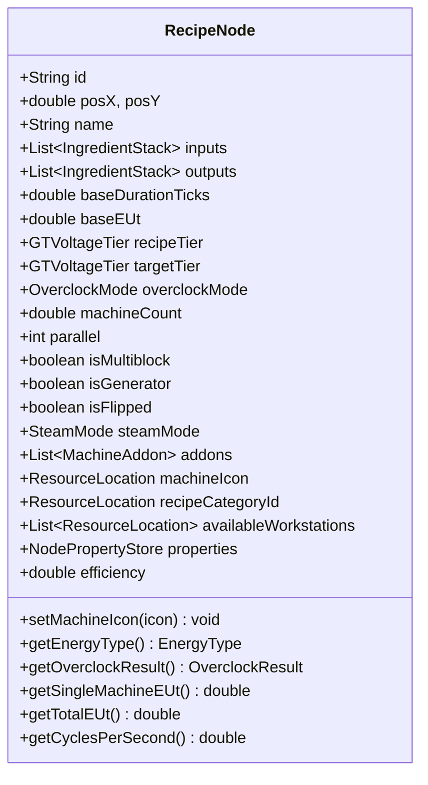
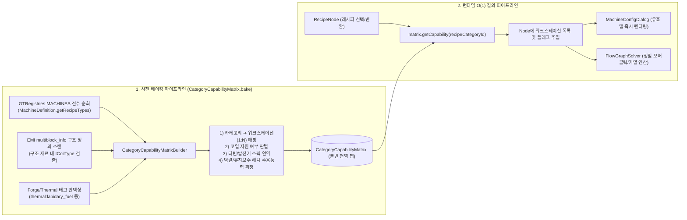
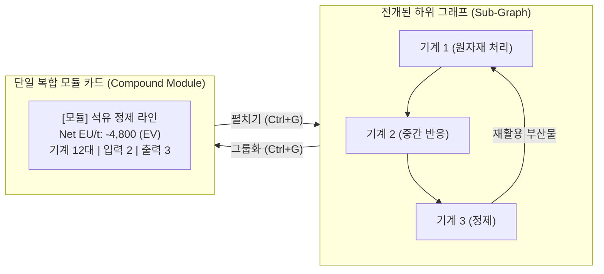

# [01] 코어 도메인 모델 및 결정론적 수용능력 매트릭스 (Core Domain & Models)

> 📍 **GTCalcBoard 기술 명세서 시리즈**
> [[00] 시스템 개요](00_OVERVIEW.md) ➔ **[01] 코어 도메인 모델** ➔ [[02] 수학 엔진 및 알고리즘](02_MATH_AND_ALGORITHMS.md) ➔ [[03] UI 및 렌더링 파이프라인](03_UI_AND_RENDERING_PIPELINE.md) ➔ [[04] 멀티플레이어 및 네트워크](04_MULTIPLAYER_AND_NETWORK_PROTOCOL.md) ➔ [[05] 외부 연동 및 다국어](05_INTEGRATION_AND_I18N.md)

---

## 1. 핵심 데이터 모델 명세 (`com.gtceu.calcboard.api`)

### 1.1 `GTVoltageTier` (전압 티어 열거형)
그렉테크(GTCEu Modern)의 15개 전압 티어를 완벽히 정의합니다.

| 티어 (Tier) | 전압 (EU/t) | UI 축약명 | 테마 색상 (Hex ARGB) |
| :--- | :--- | :--- | :--- |
| `ULV` | 8 | ULV | `0xFF8C8C8C` |
| `LV` | 32 | LV | `0xFFDCDCDC` |
| `MV` | 128 | MV | `0xFFFF6464` |
| `HV` | 512 | HV | `0xFFFFFF64` |
| `EV` | 2,048 | EV | `0xFF6464FF` |
| `IV` | 8,192 | IV | `0xFFFF64FF` |
| `LuV` | 32,768 | LuV | `0xFF64FFFF` |
| `ZPM` | 131,072 | ZPM | `0xFFFF6464` |
| `UV` | 524,288 | UV | `0xFF64FF64` |
| `UHV` | 2,097,152 | UHV | `0xFFFF3232` |
| `UEV` | 8,388,608 | UEV | `0xFF64B4FF` |
| `UIV` | 33,554,432 | UIV | `0xFF32FF82` |
| `UXV` | 134,217,728 | UXV | `0xFFFF82FF` |
| `OpV` | 536,870,912 | OpV | `0xFF5050FF` |
| `MAX` | 2,147,483,647 | MAX | `0xFFFF8282` |

---

### 1.2 `IngredientStack` (재료 스택 모델)
입출력 포트를 통해 흐르는 아이템 및 유체 단위를 캡슐화합니다.

```java
public class IngredientStack {
    private final ResourceLocation id;        // 아이템/유체 고유 ID (예: gtceu:benzene)
    private final String displayName;          // 지역화된 표시 명칭 (예: "Benzene")
    private double amount;                     // 가동 1주기당 소모/생산량
    private final boolean isFluid;             // 유체 여부 (true: mB / false: 개수)
    private double chance;                     // 기본 획득 확률 (0.0 ~ 1.0)
    private double tierChanceBoost;            // 티어 상승당 추가 확률 (기본: 0.05 = +5%)
}
```

---

### 1.3 `RecipeNode` (노드 도메인 모델)
캔버스에 배치되는 기계 카드, 발전기, 또는 복합 모듈의 전체 상태를 보유하며, 모드 특화 규칙은 `IModAdapter`로 위임합니다.



* **클린 아키텍처 및 SPI 위임**:
  - `RecipeNode`는 순수 계산 도메인 엔티티로서, 특정 모드(GTCEu, Create, Thermal 등)의 내부 코드를 직접 참조하지 않습니다.
  - 머신 아이콘 변경 이벤트(`setMachineIcon`), 에너지 타입 해소(`getEnergyType`), 단일 기계 전력량 계산(`getSingleMachineEUt`), 노드 운영 유효성 검증(`isOperational`)은 모두 `ModAdapterRegistry.getAdapterForNode(this)`를 통해 동적으로 위임됩니다.
* **`isFlipped`**: 노드의 입력(좌)/출력(우) 포트 렌더링 방향을 좌우 수평 반전하여 복잡한 플로우차트의 배선 교차 최소화.
* **`efficiency` ($\eta \in [0.0, 1.0]$)**: 솔버(`FlowGraphSolver`)에 의해 상류 원자재 공급 제약 하에서 계산된 기계의 실제 가동률.
* **`calculateOutputRates()`**: 기계 대수, 병렬치, 오버클럭, 서브틱, 애드온 승수 및 티어 부산물 확률 부스트가 합성된 1초당 아이템/유체 생산 유량을 계산.

---

### 1.4 `NodePropertyStore` 및 `NodeProperties` (타입 세이프 확장 속성)
기존 클래스 필드를 비대화하지 않고, 모드별/기능별 특화 속성을 동적이고 안전하게 관리하는 속성 저장소입니다.

```java
public class NodePropertyStore {
    private final Map<NodeProperty<?>, Object> properties = new HashMap<>();

    public <T> T get(NodeProperty<T> prop) {
        return (T) properties.getOrDefault(prop, prop.defaultValue());
    }

    public <T> void set(NodeProperty<T> prop, T value) {
        properties.put(prop, value);
    }
}
```

* **표준 속성 레지스트리 (`NodeProperties`)**:
  - `REQUIRED_REFLECTOR_TIER` (`Integer`, 기본값 `0`): 핵융합 반응기 반사판 요구 티어
  - `TURBINE_ROTOR_EFFICIENCY` (`Integer`, 기본값 `100`): 대형 터빈 로터 효율 (%)
  - `TURBINE_ROTOR_POWER` (`Integer`, 기본값 `100`): 대형 터빈 로터 파워 (%)
  - `TURBINE_ROTOR_NAME` (`String`, 기본값 `""`): 장착된 터빈 로터 이름
  - `TURBINE_HOLDER_BONUS` (`Integer`, 기본값 `0`): 로터 홀더 추가 효율 보너스 (%)
  - `CLEANROOM_TIER` (`Integer`, 기본값 `0`): 클린룸 요구 레벨
  - `THROTTLE_PERCENT` (`Integer`, 기본값 `100`): 대형 보일러 가동 쓰로틀 비율 (25% ~ 100%)

---

### 1.5 `EnergyType` 및 `SteamMode` (다중 에너지 & 물리 모델)
다양한 기술 모드의 동력 및 에너지 시스템을 통합 관리합니다.

* **`EnergyType`**:
  - `ELECTRIC_EU`: GregTech 전력 (EU/t)
  - `KINETIC_SU`: Create 회전 운동 에너지 (SU, RPM)
  - `ELECTRIC_FE`: Thermal / Create New Age 전력 (RF/t, FE/t)
  - `HEAT_OR_SELF`: 스팀 보일러 및 연소기 (mB/s Steam 생성)
  - `NONE`: 무동력 / 패시브 레시피 (0 Power)
* **`SteamMode`**:
  - `NONE`: 일반 전기 모드
  - `LOW_PRESSURE`: 저압 스팀 가공 ($2.0\times$ 소요 시간, 1 EU = 2 mB Steam)
  - `HIGH_PRESSURE`: 고압 스팀 가공 ($1.0\times$ 소요 시간, 1 EU = 2 mB Steam)

---

### 1.6 `FlowGraph` 및 `ConnectionEdge`
* **`ConnectionEdge`**: 노드 간의 유향 연결선 불변 레코드
  ```java
  public record ConnectionEdge(String fromNodeId, int outputIndex, String toNodeId, int inputIndex)
  ```
* **`FlowGraph`**: 노드 목록(`List<RecipeNode>`)과 엣지 목록(`List<ConnectionEdge>`)을 관리하며, 하위 그래프(Subgraph)를 중첩 보관할 수 있습니다.

---

## 2. 결정론적 수용 능력 매트릭스 (`CategoryCapabilityMatrix`)

RFC-V2-005에 따라 불안정한 텍스트 툴팁 파싱 휴리스틱을 전면 배제하고, 게임 로딩 시 연역적 분석을 통해 빌드된 $O(1)$ 글로벌 캐시 시스템입니다.



### 2.1 `CategoryCapability` 레코드 명세
```java
public record CategoryCapability(
    ResourceLocation categoryId,                    // 레시피 카테고리 식별자
    List<ResourceLocation> availableWorkstations,   // 선택 가능한 워크스테이션 블록 목록
    ResourceLocation defaultWorkstation,            // 기본 추천 워크스테이션
    boolean hasSingleblockOption,                   // 단일블록 기계 존재 여부
    boolean hasMultiblockOption,                    // 멀티블록 구조체 존재 여부
    boolean canUseCoils,                            // 발열 코일 블록 장착 가능 여부
    boolean isTurbine,                              // 대형 터빈 발전기 여부
    boolean isThermal,                              // 써멀 시리즈 기계/다이나모 여부
    GTVoltageTier turbineBaseTier,                  // 터빈 기준 전압 티어
    double turbineBaseProduction,                   // 터빈 기준 발전량 (EU/t)
    Set<MachineAddon.Category> supportedAddonCategories // 장착 가능한 애드온 탭 카테고리 목록
)
```

---

## 3. 도메인 헬퍼 시스템 (Domain Helpers)

* **`CoilHelper`**: `ICoilType` 리플렉션 및 레지스트리 조회를 통해 코일 티어, 최고 작동 온도($K$), EBF 전력 할인율, LCR/Pyrolyse 가열 속도 보너스를 결정론적으로 추출.
* **`TurbineRotorHelper`**: 대형 터빈의 로터 재질별 효율 승수, 최적 유량 배수, 내구도를 추출.
* **`ThermalAugmentHelper`**: 써멀 시리즈 기계의 증강(Augment) 슬롯 수와 에너지/속도 계수를 NBT 태그 기반으로 분석.
* **`ParallelHelper`**: 병렬 제어 해치(Parallel Control Hatch)의 최대 병렬 배수를 티어별로 매핑.
* **`MachineAddonCatalog`**: 게임 내 등록된 모든 코일, 로터, 써멀 증강, 병렬 해치 블록을 인덱싱하여 다이얼로그의 랙(Rack)에 칩 형태로 제공.

---

## 4. 복합 모듈 시스템 (`FlowGraphModuleHandler`)

다수의 복잡한 노드 그래프를 단일 복합 모듈 카드(`RecipeNode`)로 패키징(`Ctrl+G`)하거나 원래 서브그래프로 복원(`펼치기`)합니다.



1. **경계 I/O 자동 승격 (Boundary I/O Promotion)**:
   - 모듈 내부 노드 간의 중간 연결선(Intermediate Wires)은 완전히 캡슐화되어 은닉됩니다.
   - 외부 소스로부터 공급받는 원자재와 외부로 배출되는 최종 제품만 집계되어 모듈 카드의 외곽 포트 소켓으로 승격됩니다.
2. **와이어 리매핑 (Wire Remapping)**:
   - 외부에서 모듈 내부 노드로 연결되어 있던 와이어들의 `ConnectionEdge`가 새로 생성된 모듈 카드의 포트로 안전하게 재배선됩니다.
3. **비례 스케일링 (Proportional Scaling)**:
   - 모듈 카드의 기계 대수를 변경하면 내부 하위 그래프의 모든 기계 대수와 유량 속도가 동일 비율로 연동 스케일링됩니다.

---

## 5. 직렬화 및 클립보드 시스템 (`BlueprintCodec`, `NodeClipboard`)

### 5.1 `BlueprintCodec` (블루프린트 직렬화 코덱)
그래프의 토폴로지, 노드 좌표, 장착 애드온, 전압 티어, 연결선을 NBT로 변환한 후 GZIP 압축 및 Base64 인코딩을 수행합니다.

$$\text{Blueprint String} = \text{"GTBOARD:"} + \text{Base64}\Big(\text{GZIP}\big(\text{FlowGraph.toNBT()}\big)\Big)$$

### 5.2 `NodeClipboard` (클립보드 관리자)
* 선택된 노드군 및 노드 간의 내부 연결선을 클립보드에 복사(`Ctrl+C`) / 잘라내기(`Ctrl+X`).
* 붙여넣기(`Ctrl+V`) 시 새로운 고유 ID(UUID)를 발급하고, 마우스 커서 또는 캔버스 중심 기준 $+20\text{px}$ 오프셋을 적용하여 배치.

---

## 6. 실행 취소 / 다시 실행 (`HistoryManager`, `BoardCommand`)

커맨드 패턴(Command Pattern) 기반으로 모든 캔버스 조작을 단위 델타(Delta)로 기록합니다.

* **지원 커맨드 목록**:
  - `MoveNodesCommand`: 노드 드래그 이동 좌표 델타
  - `AddConnectionCommand` / `RemoveConnectionCommand`: 와이어 연결/해제 델타
  - `AddNodesCommand` / `RemoveNodesCommand`: 노드 추가/삭제 델타
  - `ModifyPropertyCommand`: 티어, 오버클럭 모드, 기계 대수, 애드온 변경
  - `GroupModuleCommand` / `ExpandModuleCommand`: 모듈 그룹화 및 전개 델타
* **성능 최적화**: 1,000단계 이상의 Undo/Redo 스택을 유지하면서도 2MB 미만의 메모리 사용.

---

> ➡️ **다음 장으로 이동**: [[02] 수학적 연산 엔진 및 그래프 해석 알고리즘](02_MATH_AND_ALGORITHMS.md)
