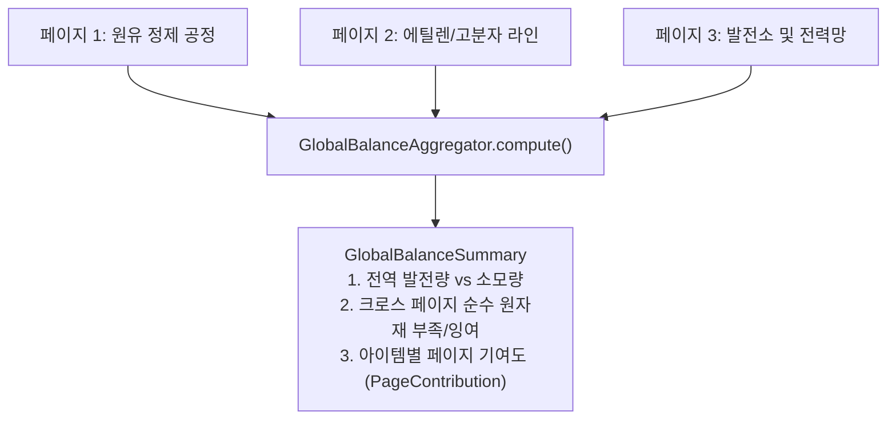

# [02] 수학적 연산 엔진 및 그래프 해석 알고리즘 (Math & Algorithms)

> 📍 **GTCalcBoard 기술 명세서 시리즈**
> [[00] 시스템 개요](00_OVERVIEW.md) ➔ [[01] 코어 도메인 모델](01_CORE_DOMAIN_AND_MODELS.md) ➔ **[02] 수학 엔진 및 알고리즘** ➔ [[03] UI 및 렌더링 파이프라인](03_UI_AND_RENDERING_PIPELINE.md) ➔ [[04] 멀티플레이어 및 네트워크](04_MULTIPLAYER_AND_NETWORK_PROTOCOL.md) ➔ [[05] 외부 연동 및 다국어](05_INTEGRATION_AND_I18N.md)

---

## 1. 오버클럭 및 특수 기계 수학 공식

GTCalcBoard는 그렉테크의 물리 및 에너지 수식을 완벽히 재현합니다.

### 1.1 전압 티어 차이 ($\Delta\text{Tier}$)
$$\Delta\text{Tier} = \max(0, \, \text{TargetTier.ordinal} - \text{RecipeTier.ordinal})$$

---

### 1.2 오버클럭 모드별 소요 시간 및 전력 공식

$\Delta\text{Tier} > 0$일 때 에너지 배수(Energy Multiplier)와 속도 배수(Speed Multiplier)는 다음과 같이 결정됩니다:

$$\text{Energy Factor} = 4.0^{\Delta\text{Tier}}$$

$$\text{Speed Factor} = \begin{cases} 
2.0^{\Delta\text{Tier}} & (\text{STANDARD 모드: 일반 기계}) \\
4.0^{\Delta\text{Tier}} & (\text{PERFECT 모드: 완벽 오버클럭 지원 멀티블록}) \\
1.0 & (\text{LOSSLESS 모드: 속도 불변, 에너지 보존})
\end{cases}$$

$$\text{Calculated Duration (ticks)} = \frac{\text{BaseDurationTicks}}{\text{Speed Factor}}$$
$$\text{Calculated EU/t} = \text{BaseEUt} \times \text{Energy Factor}$$

---

### 1.3 1틱 미만 서브틱(Sub-tick) 배치 연산 ($< 1.0\text{ Tick}$)

고전압 오버클럭으로 인해 레시피 소요 시간이 $1.0\text{ tick}$ ($0.05\text{ s}$) 미만으로 떨어질 때, 마인크래프트 게임 틱 주기에 맞추어 틱당 배치 횟수로 승격(Batching) 처리합니다:

$$\text{BatchesPerTick} = \frac{1.0}{\text{Calculated Duration (ticks)}}, \quad \text{Effective Duration} = 1.0\text{ tick}$$
$$\text{Effective EU/t} = \text{Calculated EU/t} \times \text{BatchesPerTick}$$
$$\text{Cycles Per Second (CPS)} = 20.0 \times \text{BatchesPerTick} \times \text{Parallel} \times \text{MachineCount}$$

---

### 1.4 하드웨어 애드온 승수 합성 (Addon Compounding)

장착된 모든 애드온 $a \in \text{InstalledAddons}$에 대해 기간 및 전력 승수를 복합 합성합니다:

$$\text{Total Duration} = \text{Effective Duration} \times \prod_{a \in \text{Addons}} a.\text{getDurationMultiplier}()$$
$$\text{Total EU/t} = \text{Effective EU/t} \times \prod_{a \in \text{Addons}} a.\text{getEutMultiplier}()$$

#### EBF (전기 고로) 코일 온도 할인 수식
레시피 요구 온도 $T_{\text{recipe}}$, 코일 온도 $T_{\text{coil}}$일 때:
$$\Delta T_{\text{excess}} = \max(0, \, T_{\text{coil}} - T_{\text{recipe}})$$
$$\text{EUt Discount Multiplier} = 0.95^{\lfloor \Delta T_{\text{excess}} / 900 \rfloor}$$
*(900K 초과 온도마다 전력 소모 $5\%$ 복합 할인)*

---

### 1.5 확률 부산물 전압 티어 부스트 (Tier Chance Boost)

원심분리기, 분쇄기 등 확률적 부산물을 생성하는 레시피에서 전압 티어가 상승할 때마다 획득 확률을 보정합니다:

$$\text{Effective Chance} = \min\Big(1.0, \, \text{BaseChance} + (\Delta\text{Tier} \times \text{TierChanceBoost})\Big)$$
$$\text{Single Machine Expected Output Rate (per sec)} = \text{Amount} \times \text{Effective Chance} \times \text{CPS}$$

---

### 1.6 증기 보일러 (Steam Boilers) 및 쓰로틀(Throttle) 공식

#### 소형 단일 보일러 (Small Boilers)
* **저압 청동 보일러 (LP Bronze)**: 기본 배율 $1.0\times$ ($120\text{ L/s} = 6\text{ mB/t}$ 증기 배출)
* **고압 강철 보일러 (HP Steel)**: $3.0\times$ 가속 ($360\text{ L/s} = 18\text{ mB/t}$ 증기 배출)

#### 대형 멀티블록 보일러 (Large Boilers) 및 쓰로틀 ($\theta \in [0.25, 1.0]$)
* **대형 청동 보일러 (Large Bronze)**: 기본 배율 $1.0\times$ ($16,000\text{ mB/s} = 800\text{ mB/t}$ 증기)
* **대형 강철 보일러 (Large Steel)**: $2.25\times$ ($36,000\text{ mB/s} = 1,800\text{ mB/t}$ 증기)
* **대형 티타늄 보일러 (Large Titanium)**: $4.0\times$ ($64,000\text{ mB/s} = 3,200\text{ mB/t}$ 증기)
* **대형 텅스텐스틸 보일러 (Large Tungstensteel)**: $8.0\times$ ($128,000\text{ mB/s} = 6,400\text{ mB/t}$ 증기)

$$\text{Effective Speed Multiplier} = \text{TierSpeedMultiplier} \times \theta$$
$$\text{Steam Rate (mB/t)} = \text{BaseSteamRate} \times \text{Effective Speed Multiplier}$$
$$\text{Water Rate (mB/t)} = \frac{\text{Steam Rate (mB/t)}}{160.0} \quad (1\text{mB 물} \rightarrow 160\text{mB 증기})$$
$$\text{Effective Duration (ticks)} = \frac{\text{BaseDurationTicks}}{\text{Effective Speed Multiplier}}$$

---

### 1.7 Create: New Age 키네틱 발전기 코일 공식 (Kinetic Generator)

카본 브러시(`create_new_age:carbon_brushes`)와 발전기 코일(`create_new_age:generator_coil`)에 장착된 $N$개의 자석($M$)에 대해:

$$\text{Total Strength} = \sum_{m \in \text{InstalledMagnets}} m.\text{getMagneticForce}()$$
$$\text{Total Kinetic Stress (SU)} = (24.0 + \text{Total Strength}) \times \text{RPM} \times \text{MachineCount}$$
$$\text{Generated FE/t} = \text{Total Strength} \times \text{RPM} \times \text{suToEnergy} \times \text{Efficiency} \times \text{MachineCount}$$

---

## 2. 그래프 해석기 5대 핵심 알고리즘 (`FlowGraphSolver`)

---

### [알고리즘 1] 10-Pass Fixed-Point Bottleneck Relaxation (병목 효율 해석기)

피드백 루프(부산물 재활용 공정)나 상류 공급 부족이 존재하는 유향 그래프에서 모든 기계의 정상 상태 가동률($\eta_v \in [0.0, 1.0]$)을 수치적으로 수렴 계산합니다.

#### 알고리즘 단계:
1. **초기화**: 모든 노드 $v \in V$의 효율을 $\eta_v^{(0)} = 1.0$으로 설정.
2. **반복 수렴 ($k = 1 \dots 10$)**:
   각 소비자 기계 $C$의 $i$번째 입력 포트에 연결된 생산자 기계 집합 $P_j$에 대해:
   - 생산자의 현재 유효 공급량:
     $$\text{Supply}_{P_j} = \text{NominalOutputRate}_{P_j} \times \eta_{P_j}^{(k-1)}$$
   - 해당 생산자 출력 포트에 연결된 모든 소비자들의 명목 총수요:
     $$\text{TotalDemand}_{P_j} = \sum_{c \in \text{Consumers}(P_j)} \text{NominalDemand}_c$$
   - 비례 분배된 입력 공급량:
     $$\text{IncomingSupply}_i = \sum_{P_j} \min\left(\text{NominalDemand}_{C, i}, \, \text{Supply}_{P_j} \times \frac{\text{NominalDemand}_{C, i}}{\text{TotalDemand}_{P_j}}\right)$$
   - 입력 포트 충족률:
     $$\rho_i = \frac{\text{IncomingSupply}_i}{\text{NominalDemand}_{C, i}}$$
   - 소비자 기계 $C$의 새로운 효율:
     $$\eta_C^{(k)} = \min_{i} (\rho_i, \, 1.0)$$
3. **수렴 조기 종료 조건**: $\max_{v} |\eta_v^{(k)} - \eta_v^{(k-1)}| < 10^{-4}$ 만족 시 반복 즉시 종료.

---

### [알고리즘 2] 포트 흐름 통계 (`PortFlowStats`)

각 노드의 입력 및 출력 포트 소켓의 유량을 검사하여 시각적 경고 상태를 판정합니다.

* **입력 포트 (`getInputPortStats`)**:
  - `isInputDeficit()`: 공급량 < 요구량 $- 0.001$ (원자재 부족, 경고 점멸)
  - `isBalanced()`: $\pm 0.001$ 이내 완전 일치 (녹색)
  - `isInputSurplus()`: 공급량 > 요구량 $+ 0.001$ (공급 여유, 안전)
* **출력 포트 (`getOutputPortStats`)**:
  - `isOutputSurplus()`: 생산량 > 하류 소비량 $+ 0.001$ (잉여 제품 잔여, 안전)
  - `isOutputDeficit()`: 생산량 < 하류 소비량 $- 0.001$ (하류 공정 공급 부족 유발, 경고)

---

### [알고리즘 3] Dual-Pass BFS Auto-Ratio (자동 비율 전파)

사용자가 지정한 기준(Anchor) 노드의 대수를 고정하고 상류와 하류로 자동 비율을 전파합니다:

1. **Upstream Pass (역방향)**:
   소비자의 원자재 수요량을 만족할 수 있도록 생산자 기계 대수를 상향 설정 ($\text{Supply} \ge \text{Demand}$).
2. **Downstream Pass (정방향)**:
   생산자의 부산물 발생량을 모두 처리할 수 있도록 하류 처리 기계 대수를 설정.
3. **Cycle Guard**:
   최대 순회 횟수를 $\max(50, |V| \times 5)$로 제한하고 노드당 방문 횟수를 $\le 3$회로 제한하여 무한 루프를 방지.

---

### [알고리즘 4] 공정 요약 및 Net Balance (`BalanceSummary`)

* **총 전력 수지 (Net EU/t)**:
  $$\text{Net EU/t} = \sum_{g \in \text{Generators}} g.\text{getEffectiveEUt}() - \sum_{m \in \text{Consumers}} m.\text{getEffectiveEUt}()$$
* **최고 전압 티어**: 그래프 내 동작 중인 기계 중 가장 높은 전압 티어
* **순수 입출력 집계 (Raw Inputs & Net Products)**:
  그래프 외부에서 공급되어야 하는 원자재와 외부로 나가는 최종 잉여 생산물 산출 ($\Delta = \text{총 생산량} - \text{총 소비량}$).

---

### [알고리즘 5] Shift-Drag 1:1 Rate Matching

와이어를 드래그하여 포트에 연결할 때 `Shift` 키를 누르고 있으면, 해당 포트의 유량을 1:1로 맞추기 위한 대상 기계의 대수를 즉시 산출합니다:

$$\text{Target Machine Count} = \frac{\text{Source Port Flow Rate}}{\text{Target Single Machine Port Rate}}$$

---

## 3. 전역 밸런스 집계 알고리즘 (`GlobalBalanceAggregator`)

멀티 탭 작업공간(다수의 `BoardPage`) 전체를 아우르는 전역 팩토리 대시보드 데이터를 계산합니다.

1. **크로스 페이지 원자재/생산물 매칭**:
   페이지 A에서 생산된 부산물이 페이지 B에서 소모되는 경우, 전역 수지에서 자동 상쇄하여 전체 팩토리 기준의 최종 과부족량을 도출.
2. **항목별 기여도 추적 (`PageContribution`)**:
   각 재료별로 어떤 페이지에서 초당 얼마만큼 생산/소비되고 있는지 $O(N)$으로 집계하여 팝업 뷰에 제공.

---

> ➡️ **다음 장으로 이동**: [[03] UI 및 캔버스 렌더링 파이프라인](03_UI_AND_RENDERING_PIPELINE.md)
