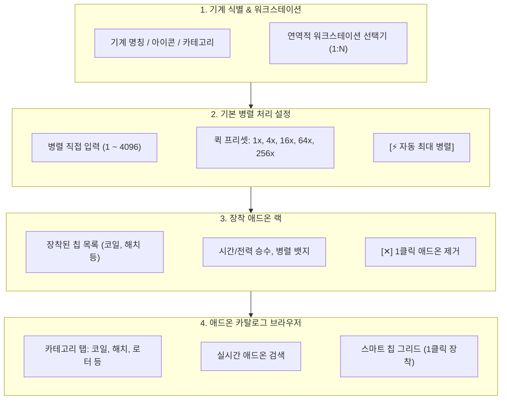

# [03-02] 기계 상세 설정 및 애드온 랙 UI (Machine Config & Addons)

> 📍 **GTCalcBoard 기술 명세서 시리즈**
> [[00] 시스템 개요](00_OVERVIEW.md) ➔ [[01] 코어 도메인](01_CORE_DOMAIN_AND_MODELS.md) ➔ [[02] 수학 엔진](02_MATH_AND_ALGORITHMS.md) ➔ [[03-01] 캔버스 & 노드 카드](03_01_CANVAS_AND_NODE_CARDS.md) ➔ **[03-02] 기계 설정 & 애드온** ➔ [[03-03] 페이지 결산 & 대시보드](03_03_PAGE_SUMMARY_AND_DASHBOARD.md) ➔ [[03-04] 검색 & 툴바](03_04_RECIPE_SEARCH_AND_TOOLS.md) ➔ [[04] 멀티플레이어](04_MULTIPLAYER_AND_NETWORK_PROTOCOL.md) ➔ [[05] 외부 연동](05_INTEGRATION_AND_I18N.md)

---

## 1. 컴포넌트 아키텍처 개요 (`MachineConfigDialog`)

`MachineConfigDialog`는 캔버스에서 노드를 우클릭하거나 노드 카드의 `[ ⚙ ]` 버튼을 클릭했을 때 호출되는 모달 대화상자입니다.

---

## 2. 기계 설정 및 애드온 랙 UI 와이어프레임

  <!-- Dialog Container -->
  

    <!-- 1. Dialog Header -->
    

      

        ⚙
        기계 공정 및 하드웨어 설정
        LV
      

      ✕
    

    <!-- Dialog Body -->
    

      <!-- Section A: Parallel Control -->
      

        
기본 병렬 처리 수량 (Parallel Multiplier)

        

          <input type="text" value="16" style="background: #14171e; border: 1px solid #0284c7; border-radius: 3px; color: #38bdf8; font-weight: bold; width: 42px; padding: 2px 6px; font-size: 12px; text-align: center;" />
          <button style="background: #252a36; border: 1px solid #3d4455; border-radius: 3px; color: #cbd5e1; padding: 2px 6px; font-size: 10px; cursor: pointer;">1x</button>
          <button style="background: #252a36; border: 1px solid #3d4455; border-radius: 3px; color: #cbd5e1; padding: 2px 6px; font-size: 10px; cursor: pointer;">4x</button>
          <button style="background: #0284c7; border: 1px solid #38bdf8; border-radius: 3px; color: #ffffff; font-weight: bold; padding: 2px 6px; font-size: 10px; cursor: pointer;">16x</button>
          <button style="background: #252a36; border: 1px solid #3d4455; border-radius: 3px; color: #cbd5e1; padding: 2px 6px; font-size: 10px; cursor: pointer;">64x</button>
          <button style="background: #252a36; border: 1px solid #3d4455; border-radius: 3px; color: #cbd5e1; padding: 2px 6px; font-size: 10px; cursor: pointer;">256x</button>
          <button style="background: #7c2d12; border: 1px solid #ea580c; border-radius: 3px; color: #ffedd5; font-weight: bold; padding: 2px 6px; font-size: 10px; margin-left: auto; cursor: pointer;">⚡ 자동 최대</button>
        

      

      <!-- Section B: Installed Addons -->
      

        

          장착된 하드웨어 애드온 (2개)
          클릭하여 제거
        

        

          <!-- Item 1: Coil -->
          

            

              🧲
              쿠프로니켈 코일 블록
              1,800 K
            

            

              전력 0.95x
              ✕
            

          

          <!-- Item 2: Parallel Hatch -->
          

            

              ⚡
              EV 병렬 제어 해치
              EV 티어
            

            

              병렬 16x
              ✕
            

          

        

      

      <!-- Section C: Addon Catalog Browser -->
      

        

          전체
          코일 (Coils)
          병렬 해치
          유지보수
          터빈 로터
          써멀 증강
          + 커스텀
        

        <!-- Search & Catalog Chips Grid -->
        

          

            칸탈 코일 블록
            2,700 K
          

          

            니크롬 코일 블록
            3,600 K
          

          

            RTM 코일 블록
            4,500 K
          

          

            HSS-G 코일 블록
            5,400 K
          

        

      

    

  

---

## 3. 대체 레시피 인플레이스 전환 (`AlternativeRecipeFinder`)

캔버스에 이미 배치된 머신 노드의 레시피를 삭제하지 않고 동일 머신/동일 주요 산출물을 가진 대체 레시피로 즉시 교체합니다.

* **진입점**: 다이얼로그 상단 헤더의 `[🔄 레시피]` 버튼 (`74px` 컴팩트 버튼) 또는 노드 우클릭 컨텍스트 메뉴.
* **헤더 레이아웃 최적화**:
  - 다국어 번역 길이 차이에 따른 겹침 방지를 위해 상단 버튼 폭 최적화 (`[🔄 레시피]` 74px, `[싱글/멀티블록 모드]` 84px, `[Aa 1.0x]` 44px).
  - 다이얼로그 제목(`title`) 텍스트가 가용 폭을 초과할 경우 자동 말줄임표(`...`) 적용.
* **대체 레시피 우선순위 탐색**:
  1. **1순위**: 동일 머신 ID / 카테고리 + 동일 주 산출물(1차/2차 Output) 레시피.
  2. **2순위**: 동일 머신 카테고리의 모든 대체 레시피.
* **스마트 와이어 보존 (Smart Wire Preservation)**:
  - 교체 전/후 동일한 아이템/유체 식별자(`IngredientStack.getId()`)를 가진 포트의 와이어 연결을 자동 유지.
  - 새 레시피에서 제거된 재료 포트의 와이어만 안전하게 단선 처리.
  - `Undo/Redo` 히스토리 스택에 기록되어 단축키(`Ctrl+Z`)로 완전 롤백 지원.

---

## 4. UI 가독성 배율 옵션 (`FontScale`)

다양한 모니터 해상도와 시각 선호도에 대응하기 위해 5단계 UI 배율 기능을 제공합니다.

* **5단계 배율 모드**:
  - `MINI (0.75x)`: GUI Scale 4/Auto 등 고배율 환경용 초소형 모드.
  - `COMPACT (0.85x)`: 많은 정보와 애드온을 한눈에 조밀하게 표시.
  - `NORMAL (1.0x)`: 마인크래프트 기본 표준 크기.
  - `LARGE (1.15x)`: 고해상도 모니터용 확대 표시.
  - `HUGE (1.30x)`: 4K 환경 및 가독성 우선 환경용 최대 확대.
* **제어 인터랙션**:
  - 다이얼로그 우측 상단 `[Aa 1.0x]` 버튼: 좌클릭 순환 확대, 우클릭 순환 축소, 마우스 휠 스크롤 조절.
  - 키보드 단축키: `+` (확대), `-` (축소).
  - 중심점 Matrix Scaling & Virtual Mouse 역변환을 통해 레이아웃 왜곡 없이 100% 정밀한 클릭 판정 보장.

---

> ➡️ **다음 장으로 이동**: [[03-03] 페이지 결산 및 전역 밸런스 대시보드 UI](03_03_PAGE_SUMMARY_AND_DASHBOARD.md)
