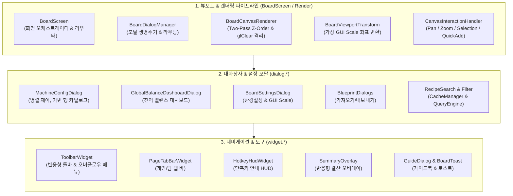
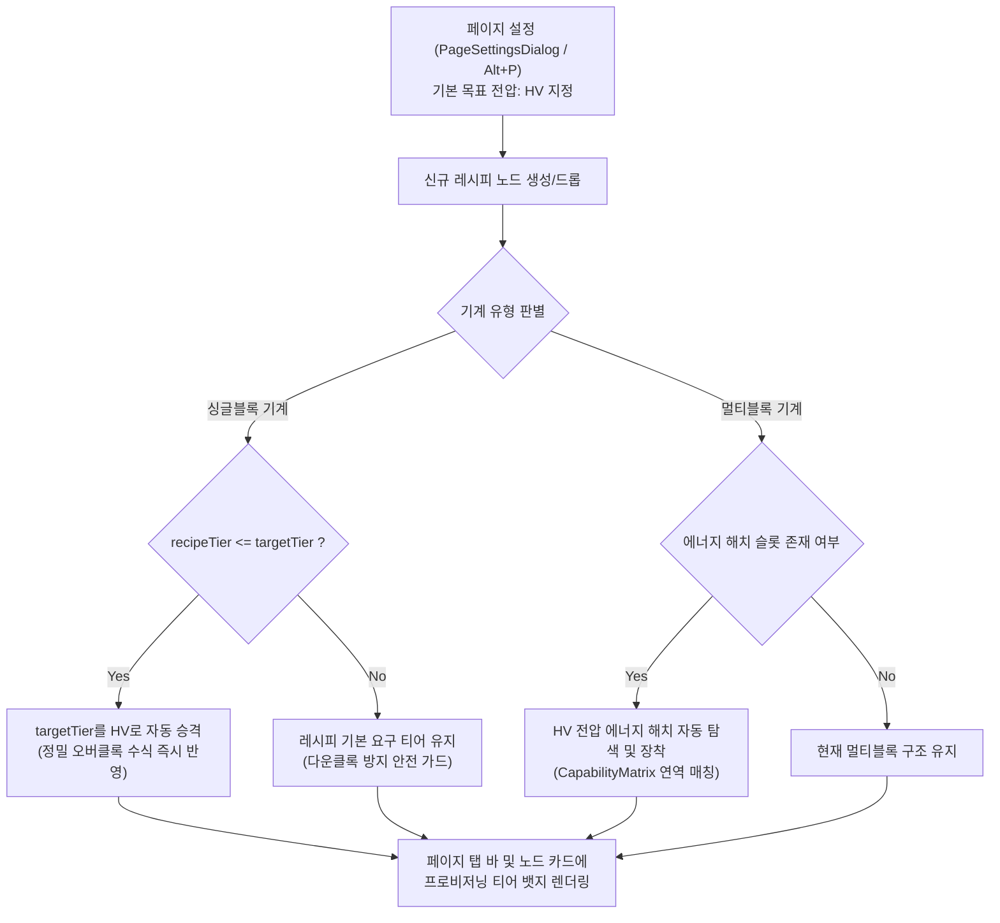
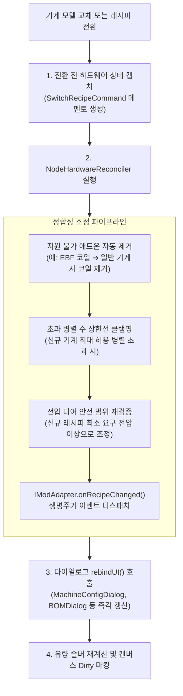

# [03] UI 및 캔버스 렌더링 파이프라인 개요 (UI & Rendering Pipeline)

> 📍 **GTCalcBoard 기술 명세서 시리즈**
> [[00] 시스템 개요](00_OVERVIEW.md) ➔ [[01] 코어 도메인](01_CORE_DOMAIN_AND_MODELS.md) ➔ [[02] 수학 엔진](02_MATH_AND_ALGORITHMS.md) ➔ **[03] UI & 렌더링 파이프라인** ➔ [[04] 멀티플레이어](04_MULTIPLAYER_AND_NETWORK_PROTOCOL.md) ➔ [[05] 외부 연동](05_INTEGRATION_AND_I18N.md)

---

## 1. 프레젠테이션 & UI 계층 아키텍처 (`com.gtceu.calcboard.client.gui`)

GTCalcBoard의 UI 계층은 마인크래프트의 렌더링 파이프라인과 완벽히 통합되어, 1,200개 이상의 대규모 노드 그래프에서도 부드러운 60fps 인터랙션을 보장합니다.

---

## 2. 페이지별 목표 전압 및 하드웨어 자동 프로비저닝 (`PageSettings`, ADR-048)

캔버스 페이지 단위로 기본 목표 전압 티어(`defaultVoltageTier`)를 지정하여, 신규 레시피 노드 추가 시 반복적인 수동 오버클록 및 에너지 해치 장착 작업을 자동화합니다.

### 2.1 핵심 동작 규격
1. **페이지 단위 기본 전압 저장 (`defaultVoltageTier`)**:
   - `BoardPage` 모델 내에 `defaultVoltageTier` 필드를 영속화하며, 페이지 설정 다이얼로그(`PageSettingsDialog`, 단축키 `Alt + P`)에서 지정합니다.
   - 탭 바 상단에 현재 페이지의 기본 전압 티어 미니 뱃지가 시각적으로 표시됩니다.
2. **단일 기계 자동 오버클록 (Singleblock Auto-Overclock)**:
   - 검색창이나 드래그 배선을 통해 신규 노드를 스폰할 때, 레시피 요구 전압($V_{\text{recipe}}$)이 페이지 기본 전압($V_{\text{target}}$) 이하이면 즉시 $V_{\text{target}}$으로 자동 승격합니다.
   - 레시피 요구 전압이 기본 전압보다 높은 경우(예: 기본 전압 LV 상태에서 EV 레시피 추가), 장비 폭발이나 동작 불능을 방지하기 위해 레시피 최소 요구 전압을 유지합니다.
3. **멀티블록 에너지 해치 자동 프로비저닝 (Multiblock Energy Hatch Provisioning)**:
   - 멀티블록 노드가 생성되면 `CategoryCapabilityMatrix`를 질의하여 지원 가능한 에너지 해치 중 페이지 기본 전압 티어에 부합하는 해치를 자동으로 탐색하여 애드온 슬롯에 장착합니다.
4. **일괄 적용 트랜잭션 (`BatchChangeTierCommand`)**:
   - 페이지 설정 창에서 [현재 페이지 전체 노드에 일괄 적용] 클릭 시, 캔버스 내 모든 기존 기계 노드의 전압과 에너지 해치를 원자적 트랜잭션으로 일괄 변경합니다.
   - `BatchChangeTierCommand`는 `HistoryManager`에 단일 Undo/Redo 엔트리로 등록되어 원클릭 롤백을 보장합니다.

---

## 3. 기계 및 레시피 전환 하드웨어 정합성 조정자 및 UI 동기화 (`NodeHardwareReconciler`, ADR-049)

캔버스 카드 또는 다이얼로그에서 기계 모델을 교체하거나 레시피를 전환할 때, 장착된 하드웨어 애드온의 유효성을 멱등하게 보정하고 열려 있는 모든 UI를 실시간 동기화합니다.

### 3.1 멱등적 정합성 조정자 (`NodeHardwareReconciler`)
- **비호환 애드온 퍼지**: 전기로(EBF)에서 분쇄기로 기계를 변경할 경우, 분쇄기가 지원하지 않는 가열 코일 애드온은 자동으로 안전하게 제거됩니다.
- **수치 클램핑**: 이전 기계에서 수동 설정한 병렬 수치(`customParallel`)가 신규 기계의 허용 한도를 초과하면 신규 기계의 최대 가용 병렬 수치로 자동 보정됩니다.
- **모드 어댑터 생명주기 통지**: `ModAdapterRegistry`를 통해 대상 모드의 `IModAdapter.onRecipeChanged(node)`를 호출하여 모드별 추가 상태를 동기화합니다.

### 3.2 완전한 하드웨어 메멘토 (`SwitchRecipeCommand`)
- 레시피/기계 전환 시 기계 아이콘, 멀티블록 여부, 병렬 수, 장착 애드온 목록, 프로퍼티 스토어 전체 상태를 전/후 메멘토로 보관합니다.
- 사용자가 `Ctrl+Z`를 누를 경우, 레시피뿐만 아니라 전환 전 장착되어 있던 모든 하드웨어 애드온과 티어 구성이 100% 무손실 복구됩니다.

### 3.3 반응형 UI 동기화 (`rebindUI`)
- 기계 설정 다이얼로그(`MachineConfigDialog`)나 자재 명세서(`MultiblockBOMDialog`)가 열려 있는 상태에서 핫키나 컨텍스트 메뉴를 통해 레시피가 전환되더라도, 열린 창을 닫을 필요 없이 `rebindUI()`를 통해 위젯 계층이 즉시 최신 하드웨어 상태로 재바인딩됩니다.

---

## 4. UI 세부 기술 명세서 목차 (UI Spec Series)

UI 계층의 각 화면과 컴포넌트별 상세 동작 명세 및 고품질 HTML 와이어프레임은 아래 4개의 세부 문서에 수록되어 있습니다:

### 1. [[03-01] 2D 캔버스 뷰포트 및 노드 카드 렌더링](03_01_CANVAS_AND_NODE_CARDS.md)
* **2D 뷰포트 좌표 변환 수학**: Screen $\leftrightarrow$ Canvas 좌표 변환 행렬, 지수 줌 스케일링, 배경 도트 그리드.
* **3차 베지어 와이어 렌더러 (`ConnectionRenderer`)**: Cubic Bézier 곡선 제어점 산출, 유량 흐름 펄스 애니메이션, 24분할 마우스 히트 테스팅.
* **노드 카드 와이어프레임 (`NodeCardRenderer`)**: 표준 기계 노드 카드 및 복합 모듈 카드 레이아웃.

### 2. [[03-02] 기계 상세 설정 및 애드온 랙 UI](03_02_MACHINE_CONFIG_AND_ADDONS.md)
* **기계 병렬 수량 입력기**: 병렬 직접 입력 박스, 퀵 프리셋(`1x ~ 256x`), `⚡ 자동 최대 병렬`.
* **활성 장착 애드온 트레이**: 인라인 스펙 뱃지, 제거 버튼, 페이지네이션.
* **통합 애드온 카탈로그 브라우저**: 결정론적 수용능력 매트릭스 연동, 코일, 병렬/유지보수 해치, 터빈 로터 3D 그리드, 써멀 증강, 커스텀 빌더.

### 3. [[03-03] 페이지 결산 및 전역 밸런스 대시보드 UI](03_03_PAGE_SUMMARY_AND_DASHBOARD.md)
* **현재 페이지 결산 오버레이 (`SummaryOverlay`)**: 우측 패널, 총 소비/발전 전력 수지, 가동 기계 수, 외부 순수 원자재 소모량 및 최종 잉여 제품 목록.
* **다중 페이지 종합 수지 대시보드 (`GlobalBalanceDashboardDialog`)**: 대상 페이지 선택 체크박스, `[부족/잉여/균형]` 탭 필터링, 전역 전력 밸런스.
* **세부 원자재/부산물 기여도 팝업 (`ItemContributionPopup`)**: 아이템별 페이지별 생산/소비량 분해 내역.

### 4. [[03-04] 레시피 검색, 필터링, 단축키 HUD, 가이드북 및 토스트 UI](03_04_RECIPE_SEARCH_AND_TOOLS.md)
* **비동기 레시피 검색 & 필터링 (`RecipeSearchDialog` / `RecipeFilterDialog`)**: 불리언/태그 다중 토큰 검색, 카테고리 체크박스 필터링 및 블랙리스트.
* **상단 탭 바 & 하단 툴바 (`PageTabBarWidget`, `ToolbarWidget`)**: 개인/팀 워크스페이스 분리, 빠른 액션 실행 버튼.
* **단축키 안내 HUD (`HotkeyHudWidget`)**: 좌측 하단 상주 단축키 안내 및 `[?]` 접기 토글.
* **인게임 가이드북 & 매뉴얼 (`GuideDialog`)**: 8대 카테고리 탭 및 키캡 하이라이트.
* **전역 액션 토스트 알림 (`BoardToast`)**: 화면 하단 페이드 애니메이션 피드백.
* **3-트랙 모듈형 아카데미 (`tutorial/*`)**: 45초 스타터, 4대 챕터 및 맥락형 넛지.

---

> ➡ **다음 장으로 이동**: [[04] 멀티플레이어 동시성 제어 및 네트워크 프로토콜](04_MULTIPLAYER_AND_NETWORK_PROTOCOL.md)

