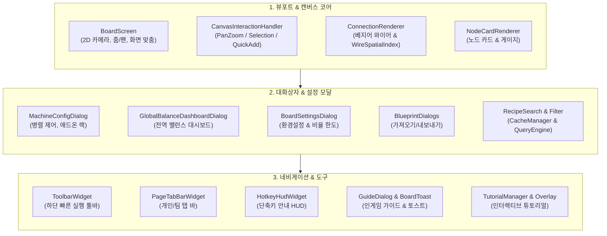

# [03] UI 및 캔버스 렌더링 파이프라인 개요 (UI & Rendering Pipeline)

> 📍 **GTCalcBoard 기술 명세서 시리즈**
> [[00] 시스템 개요](00_OVERVIEW.md) ➔ [[01] 코어 도메인](01_CORE_DOMAIN_AND_MODELS.md) ➔ [[02] 수학 엔진](02_MATH_AND_ALGORITHMS.md) ➔ **[03] UI & 렌더링 파이프라인** ➔ [[04] 멀티플레이어](04_MULTIPLAYER_AND_NETWORK_PROTOCOL.md) ➔ [[05] 외부 연동](05_INTEGRATION_AND_I18N.md)

---

## 1. 프레젠테이션 & UI 계층 아키텍처 (`com.gtceu.calcboard.client.gui`)

GTCalcBoard의 UI 계층은 마인크래프트의 렌더링 파이프라인과 완벽히 통합되어, 1,200개 이상의 대규모 노드 그래프에서도 부드러운 60fps 인터랙션을 보장합니다.

---

## 📑 UI 세부 기술 명세서 목차 (UI Spec Series)

UI 계층의 각 화면과 컴포넌트별 상세 동작 명세 및 고품질 HTML 와이어프레임은 아래 4개의 세부 문서에 수록되어 있습니다:

### 1. [[03-01] 2D 캔버스 뷰포트 및 노드 카드 렌더링](03_01_CANVAS_AND_NODE_CARDS.md)
* **2D 뷰포트 좌표 변환 수학**: Screen $\leftrightarrow$ Canvas 좌표 변환 행렬, 지수 줌 스케일링, 배경 도트 그리드.
* **3차 베지어 와이어 렌더러 (`ConnectionRenderer`)**: Cubic Bézier 곡선 제어점 산출, 유량 흐름 펄스 애니메이션, 24분할 마우스 히트 테스팅.
* **노드 카드 와이어프레임 (`NodeCardRenderer`)**: 표준 기계 노드 카드 및 복합 모듈 카드 레이아웃.

### 2. [[03-02] 기계 상세 설정 및 애드온 랙 UI](03_02_MACHINE_CONFIG_AND_ADDONS.md)
* **기계 병렬 수량 입력기**: 병렬 직접 입력 박스, 퀵 프리셋(`1x ~ 256x`), `⚡ 자동 최대 병렬`.
* **활성 장착 애드온 트레이**: 인라인 스펙 뱃지, 제거 버튼, 페이지네이션.
* **통합 애드온 카탈로그 브라우저**: 결정론적 수용능력 매트릭스 연동, 코일, 병렬/유지보수 해치, 터빈 로터 3D 그리드, 써멀 증강, 커스텀 빌더.

### 3. [[03-03] 페이지 결산 및 전역 밸런스 대시보드 UI](03_03_PAGE_SUMMARY_AND_DASHBOARD.md)
* **현재 페이지 결산 오버레이 (`SummaryOverlay`)**: 우측 패널, 총 소비/발전 전력 수지, 가동 기계 수, 외부 순수 원자재 소모량 및 최종 잉여 제품 목록.
* **다중 페이지 종합 수지 대시보드 (`GlobalBalanceDashboardDialog`)**: 대상 페이지 선택 체크박스, `[부족/잉여/균형]` 탭 필터링, 전역 전력 밸런스.
* **세부 원자재/부산물 기여도 팝업 (`ItemContributionPopup`)**: 아이템별 페이지별 생산/소비량 분해 내역.

### 4. [[03-04] 레시피 검색, 필터링, 단축키 HUD, 가이드북 및 토스트 UI](03_04_RECIPE_SEARCH_AND_TOOLS.md)
* **비동기 레시피 검색 & 필터링 (`RecipeSearchDialog` / `RecipeFilterDialog`)**: 불리언/태그 다중 토큰 검색, 카테고리 체크박스 필터링 및 블랙리스트.
* **상단 탭 바 & 하단 툴바 (`PageTabBarWidget`, `ToolbarWidget`)**: 개인/팀 워크스페이스 분리, 빠른 액션 실행 버튼.
* **단축키 안내 HUD (`HotkeyHudWidget`)**: 좌측 하단 상주 단축키 안내 및 `[?]` 접기 토글.
* **인게임 가이드북 & 매뉴얼 (`GuideDialog`)**: 8대 카테고리 탭 및 키캡 하이라이트.
* **전역 액션 토스트 알림 (`BoardToast`)**: 화면 하단 페이드 애니메이션 피드백.
* **인터랙티브 온보딩 튜토리얼 (`tutorial/*`)**: 글로우 하이라이트 및 단계별 가이드.

---

> ➡️ **다음 장으로 이동**: [[04] 멀티플레이어 동시성 제어 및 네트워크 프로토콜](04_MULTIPLAYER_AND_NETWORK_PROTOCOL.md)
