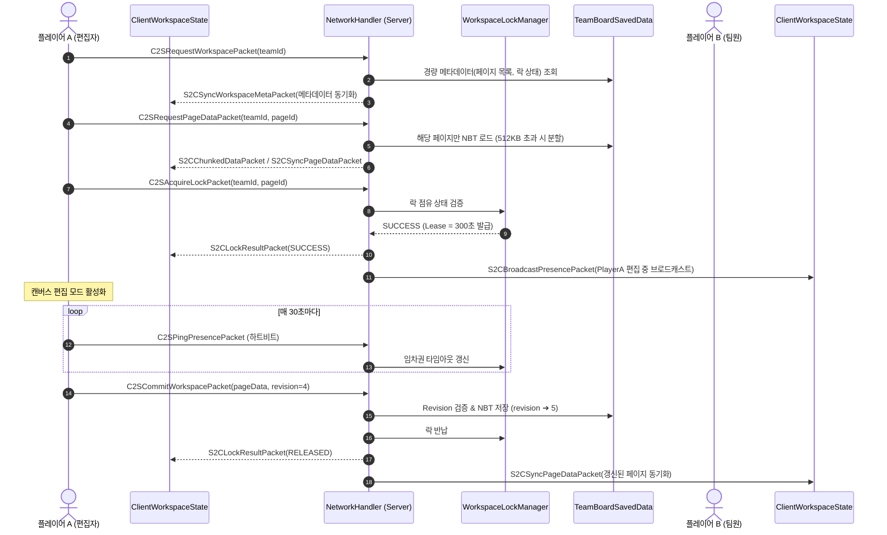
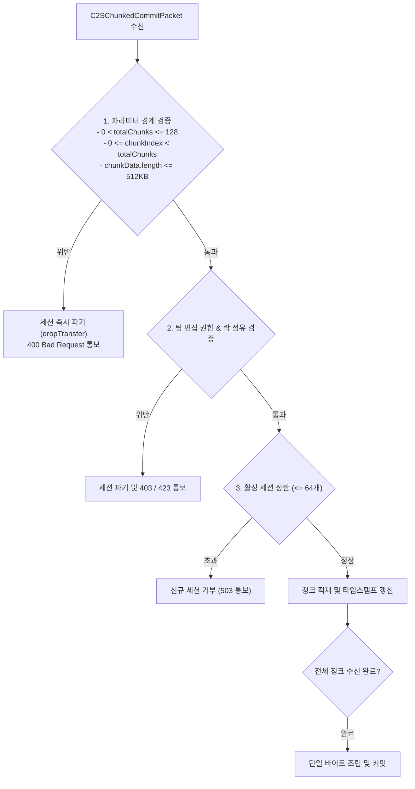

# [04] 멀티플레이어 동시성 제어 및 네트워크 프로토콜 (Multiplayer & Network)

> 📍 **GTCalcBoard 기술 명세서 시리즈**
> [[00] 시스템 개요](00_OVERVIEW.md) ➔ [[01] 코어 도메인 모델](01_CORE_DOMAIN_AND_MODELS.md) ➔ [[02] 수학 엔진 및 알고리즘](02_MATH_AND_ALGORITHMS.md) ➔ [[03] UI 및 렌더링 파이프라인](03_UI_AND_RENDERING_PIPELINE.md) ➔ **[04] 멀티플레이어 및 네트워크** ➔ [[05] 외부 연동 및 다국어](05_INTEGRATION_AND_I18N.md)

---

## 1. 네트워크 아키텍처 개요 (`com.gtceu.calcboard.network`)

GTCalcBoard는 Forge `SimpleChannel`을 기반으로 양방향 패킷 파이프라인을 구축하여 멀티플레이어 팀 단위 작업 공간을 실시간 동기화합니다. 특히 Netty의 $2\text{MB}$ 패킷 한계를 극복하기 위해 **2계층 온디맨드 페이징(2-Tier On-Demand Paging)**과 **512KB 청킹 스트리밍(Chunked Streaming)**을 구현하였습니다.



### 1.1 팀 워크스페이스 공통 도메인 모델 (`com.gtceu.calcboard.api.team`, ADR-051)

클라이언트 GUI 계층이 서버 전용 저장소 패키지(`server.storage.*`)를 직접 역참조하던 아키텍처 계층 역전(Layer Inversion) 결함을 해소하기 위해, 팀 워크스페이스 핵심 DTO를 순수 공통 API 도메인 계층으로 분리 승격하였습니다:

* **`TeamWorkspacePage` (`com.gtceu.calcboard.api.team`)**:
  - 팀 워크스페이스 내 개별 페이지 메타데이터(페이지 ID, 제목, 수정자, Revision, 생성/수정 타임스탬프)를 캡슐화한 공통 도메인 엔티티.
  - 클라이언트(`ClientWorkspaceState`, `BoardTeamSyncCoordinator`, `PageTabBarWidget`)와 서버(`TeamWorkspaceData`, `TeamBoardSavedData`)가 동일한 DTO 계약을 공유.
* **`CommitLogEntry` (`com.gtceu.calcboard.api.team`)**:
  - 팀 페이지의 커밋 이력(작성자 UUID, 작성자명, 커밋 메시지, 타임스탬프, 리비전 번호)을 보관하는 불변 레코드.
  - 최근 세이브 다이얼로그(`RecentSavesDialog`) 및 서버 저장소 간 양방향 NBT 직렬화/역직렬화 표준화.

---

## 2. 2계층 온디맨드 페이징 및 512KB 청킹 스트리밍

### 2.1 2계층 온디맨드 페이징 (2-Tier On-Demand Paging)
- **계층 1 (메타데이터 동기화)**: 보드를 열 때 전체 페이지의 무거운 NBT 그래프를 한 번에 전송하지 않고, 페이지 ID, 제목, 수정자, Revision 정보만을 담은 `S2CSyncWorkspaceMetaPacket`을 전송합니다.
- **계층 2 (온디맨드 페이지 로드)**: 사용자가 특정 탭을 클릭하여 열람할 때만 `C2SRequestPageDataPacket`을 전송하여 해당 페이지의 세부 `FlowGraph` 데이터를 지연 로드(Lazy Load)합니다.

### 2.2 512KB 청킹 스트리밍 (`S2CChunkedDataPacket`, `C2SChunkedCommitPacket`)
- 수천 개의 노드로 구성된 초대형 보드 페이지 데이터가 NBT 압축 후에도 $512\text{KB}$를 초과하는 경우, 네트워크 계층에서 자동으로 데이터를 균일 분할하여 청크 단위로 스트리밍합니다.
- 클라이언트와 서버는 모든 청크 시퀀스가 도착하면 원본 바이트 배열을 재조립하여 디코딩함으로써 Netty 2MB 버퍼 오버플로우 크래시를 방지합니다.

### 2.3 청크 페이로드 상한 가드 및 서버 메모리 DoS 방어 (`ServerChunkedPayloadAssembler`, ADR-052)
서버 힙 메모리 고갈 및 스트림 조립기 자원 고갈 공격(DoS)을 방어하기 위해 4대 방어 가드가 상시 적용됩니다:



* **엄격한 상한선 규격**:
  - `MAX_ALLOWED_CHUNKS = 128`: 청크당 512KB 기준 최대 **64MB** 페이로드 지원 (대규모 공정 캔버스 수용).
  - `MAX_CHUNK_PAYLOAD_SIZE = 524,288` ($512\text{KB}$): 단일 청크 바이트 상한선 엄격 제한.
  - `MAX_ACTIVE_TRANSFERS = 64`: 서버 전체 동시 조립 대기 세션 상한선.
  - `CHUNK_BUFFER_TTL_MS = 60,000L` (60초 무활동 타임아웃) 및 `MAX_SESSION_LIFETIME_MS = 120,000L` (최대 2분 절대 수명 상한)을 통해 좀비 세션의 메모리 점유를 방지.

---

## 3. C2S (Client to Server) 패킷 명세 (9종)

| 패킷 클래스 | 페이로드 구조 | 설명 및 서버 처리 동작 |
| :--- | :--- | :--- |
| `C2SRequestWorkspacePacket` | `UUID teamId` | 클라이언트가 특정 팀의 워크스페이스 경량 메타데이터 조회를 요청 |
| `C2SRequestPageDataPacket` | `UUID teamId, String pageId` | 특정 페이지의 상세 그래프 데이터 온디맨드 로드 요청 |
| `C2SAcquireLockPacket` | `UUID teamId, String pageId` | 특정 페이지의 편집 잠금(Lock) 획득 요청 |
| `C2SReleaseLockPacket` | `UUID teamId, String pageId` | 편집 중이던 페이지의 락을 자발적으로 반납 |
| `C2SCommitWorkspacePacket` | `UUID teamId, String pageId, String pageTitle, int revision, String commitMessage, CompoundTag pageData, int addedNodes, int modifiedNodes, int deletedNodes` | 수정한 보드 페이지 데이터(512KB 이하)를 서버에 단일 패킷으로 커밋 (낙관적 락 검증) |
| `C2SChunkedCommitPacket` | `UUID transferId, UUID teamId, String pageId, String pageTitle, int revision, String commitMessage, int chunkIndex, int totalChunks, byte[] chunkData, int addedNodes, int modifiedNodes, int deletedNodes` | 512KB 초과 대용량 페이지 NBT를 청크 분할 스트리밍으로 서버에 커밋 (ADR-052 DoS 방어 가드 적용) |
| `C2SDeleteTeamPagePacket` | `UUID teamId, String pageId` | 팀 워크스페이스에서 특정 페이지 삭제 요청 (오피서/관리자 권한 필요) |
| `C2SPingPresencePacket` | `UUID teamId, String pageId` | 락 소유권 유지를 위한 주기적 하트비트 핑 (Lease 연장) |
| `C2SRequestCommitHistoryPacket` | `int offset, int limit` | 최근 세이브 다이얼로그에서 페이징된 커밋 이력 온디맨드 조회 요청 (ADR-051) |

---

## 4. S2C (Server to Client) 패킷 명세 (10종)

| 패킷 클래스 | 페이로드 구조 | 설명 및 클라이언트 처리 동작 |
| :--- | :--- | :--- |
| `S2CSyncWorkspaceMetaPacket` | `UUID teamId, List<PageMeta> pages, Map<String, LockInfo> activeLocks` | 워크스페이스 경량 메타데이터 및 탭 목록 동기화 |
| `S2CSyncPageDataPacket` | `UUID teamId, String pageId, CompoundTag pageData` | 특정 페이지의 전체 그래프 데이터 동기화 |
| `S2CChunkedDataPacket` | `UUID streamId, int chunkIndex, int totalChunks, byte[] chunkData` | 512KB 초과 대용량 데이터 청킹 분할 스트리밍 |
| `S2CLockResultPacket` | `UUID teamId, String pageId, boolean success, UUID lockHolder, String holderName, long expireTime` | 락 획득/반납 결과 및 현재 락 소유자 정보를 응답 |
| `S2CBroadcastPresencePacket` | `UUID teamId, List<MemberPresence> presences` | 팀원들의 현재 편집 위치 및 락 상태를 실시간 브로드캐스트 |
| `S2CWorkspaceErrorPacket` | `String errorCode, String errorMessageKey` | 버전 충돌(Conflict), 권한 없음 등의 에러 통지 및 토스트 표시 |
| `S2CSyncWorkspacePacket` | `UUID teamId, TeamWorkspaceData workspaceData` | 전체 워크스페이스 일괄 동기화 폴백 패킷 |
| `S2CSyncCommitHistoryPacket` | `int totalCount, List<CommitLogEntry> commits` | 페이징된 팀 커밋 이력 응답 데이터 전송 (ADR-051) |
| `S2COpenBoardPacket` | `UUID targetTeamId` | 서버 커맨드 또는 트리거를 통한 보드 화면 원격 호출 |
| `S2CAe2CraftingEtaPacket` | `ResourceLocation patternId, double etaSeconds, boolean crafting` | AE2 오토크래프팅 실시간 정밀 ETA 및 가동 상태 전송 (ADR-008) |

---

## 5. 분산 동시성 제어 및 락 메커니즘 (`WorkspaceLockManager`)

1. **임차권 기반 소프트 락 (Lease Lock)**:
   - 한 번 락을 획득하면 $300\text{초}$ ($5\text{분}$) 동안 유효합니다.
   - 클라이언트가 정상 편집 중일 때는 매 $30\text{초}$마다 `C2SPingPresencePacket`을 전송하여 임차권을 자동 연장합니다.
   - 클라이언트 크래시나 네트워크 단절 발생 시 $5\text{분}$ 후 락이 자동 해제되어 다른 팀원이 편집할 수 있습니다.
2. **낙관적 버전 번호 검증 (Revision Conflict Prevention)**:
   - 서버의 현재 페이지 `revision` 번호와 클라이언트가 제출한 `clientRevision` 번호가 정확히 일치할 때만 커밋을 승인합니다.
   - 불일치 시 `S2CWorkspaceErrorPacket`을 통해 충돌을 알리고 최신 데이터로 동기화하도록 유도합니다.
3. **개인 보드로 포크 (Fork to Personal)**:
   - 다른 팀원이 페이지를 편집 중(`🔒 잠김`)이더라도, 읽기 전용 상태에서 [개인 보드로 복사] 버튼을 눌러 내 로컬 탭으로 즉시 복제하여 독립적으로 수정할 수 있습니다.

---

## 6. 서버 영속화 및 SavedData 스키마 (`TeamBoardSavedData`)

* **저장 경로**: `<world>/data/gtcalcboard_workspaces.dat` (바닐라 `DimensionDataStorage` 메커니즘)
* **NBT 구조 명세**:

```json
{
  "Workspaces": [
    {
      "TeamId": "c1f7b029-7977-4c12-9c3f-85472149b111",
      "TeamName": "GregTech Pioneers",
      "Revision": 42,
      "Pages": [
        {
          "PageId": "page_benzene_cracking",
          "Title": "벤젠 크래킹 라인",
          "Revision": 12,
          "LastModifiedBy": "PlayerName",
          "LastModifiedTime": 1724123456789,
          "GraphNBT": {
            "Nodes": [ ... ],
            "Connections": [ ... ]
          }
        }
      ],
      "CommitLogs": [
        {
          "Timestamp": 1724123456789,
          "Author": "PlayerName",
          "Message": "HSS-E 코일 업그레이드 반영",
          "Revision": 42
        }
      ]
    }
  ]
}
```

---

## 7. 팀 프로바이더 추상화 (`ITeamProvider`)


* **`FTBTeamsProvider`**: `dev.ftb.mods.ftbteams.api.FTBTeamsAPI`를 소프트 디펜던시로 호출.
* **`PhoenixGuildsProvider`**: `net.phoenixvine.guilds.GuildAPI`를 소프트 디펜던시로 호출.
* **`VanillaScoreboardProvider`**: 바닐라 스코어보드 팀을 기반으로 팀 격리 제공.
* **`StandaloneFallbackProvider`**: 싱글플레이 환경에서 플레이어 고유 UUID 기반으로 단독 워크스페이스 제공.

---

> ➡ **다음 장으로 이동**: [[05] 외부 모드 연동 및 다국어 단위 시스템](05_INTEGRATION_AND_I18N.md)
